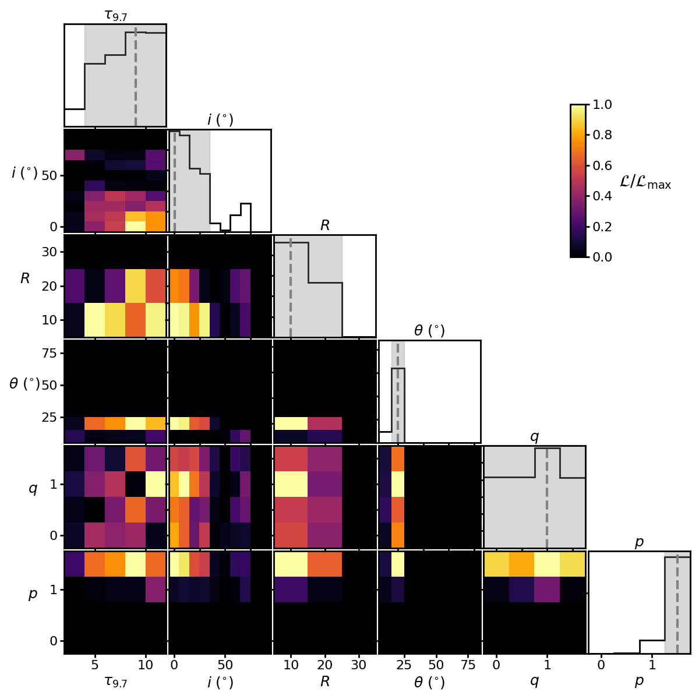
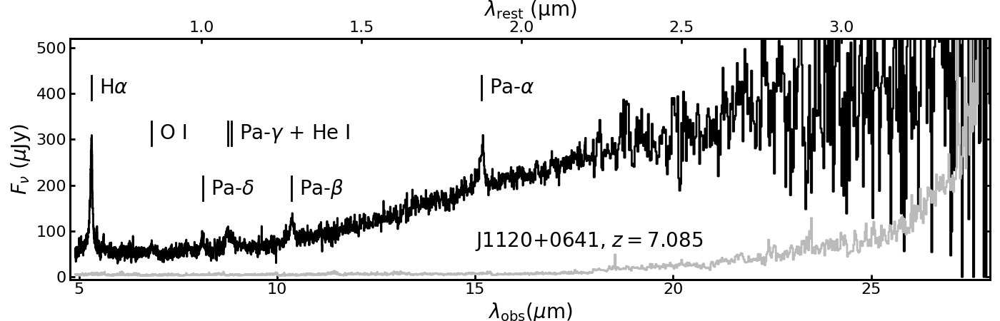
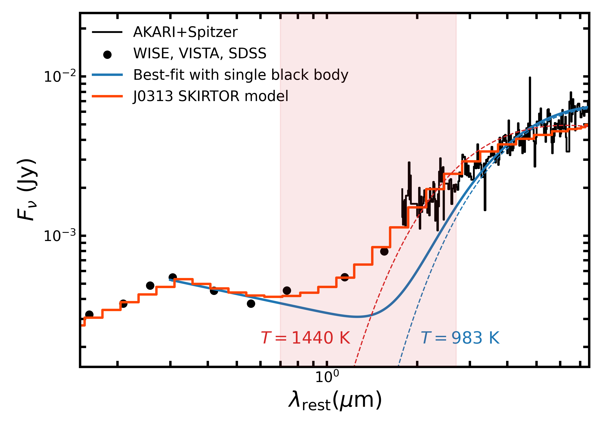

$\newcommand{\ensuremath}{}$
$\newcommand{\xspace}{}$
$\newcommand{\object}[1]{\texttt{#1}}$
$\newcommand{\farcs}{{.}''}$
$\newcommand{\farcm}{{.}'}$
$\newcommand{\arcsec}{''}$
$\newcommand{\arcmin}{'}$
$\newcommand{\ion}[2]{#1#2}$
$\newcommand{\textsc}[1]{\textrm{#1}}$
$\newcommand{\hl}[1]{\textrm{#1}}$
$\newcommand{\footnote}[1]{}$

# A close look at the black hole masses and hot dusty toruses of the first quasars with MIRI-MRS

<mark>Appeared on: 2025-11-06</mark> -  _Submitted to ApJ; 26 pages, 12 figures_

S. E.~I.~Bosman, et al. -- incl., <mark>F. Walter</mark>, <mark>S. Belladitta</mark>

**Abstract:** The presence of supermassive black holes (SMBHs, $M_\text{BH} \sim 10^9 M_\odot$ ) at $z>7$ remains a puzzle.While their existence appears to require exotic formation or growth processes, it is possible that BH mass estimates are incorrect due to differences with respect to the low- $z$ quasars on which BH mass scaling relations are calibrated.In this work, we employ JWST MIRI-MRS spectroscopy to measure the rest-frame optical/IR properties of the four highest-redshift known luminous type-1 quasars at $7.08\leq z<7.64$ .We use three new broad lines to measure updated BH masses, H $\alpha$ , Pa $\alpha$ and Pa $\beta$ , finding them to be in the range $(4-15) \cdot 10^8 M_\odot$ . Our black hole mass estimates from all tracers agree with each other and with previous, less accurate, ground-based measurements based on Mg ${II}$ . The flux ratios of the H lines deviate from expectations for case A and B recombination in the same way as in $z<3$ quasars, indicating similar physical conditions in the Broad Line Region.Rest-frame near-IR continuum emission from a hot dusty torus surrounding the accretion disc is unambiguously detected in all four objects. We model the emission with SKIRTOR and constrain the inclination (face-on) and the opening angle ( $\theta=40-60^\circ$ ) of the tori. These constraints are consistent for the four objects and with expectations from luminous quasars. We estimate a total dust mass $(1-4) \cdot 10^6 M_\odot$ in the tori, corresponding to $(0.2-7)\%$ of the total dust in the quasar host galaxies. Given observed accretion rates, these SMBHs will deplete their tori in only $\sim5$ Myr.Overall, we confirm the fact that $z>7$ SMBHs in quasars could not have grown from stellar-remnant BHs if the radiative efficiency of accretion is $10\%$ . We also find no evidence that inferred BH masses and accretion processes in $z>7$ quasars differ significantly from their near-identical counterparts at $z<3$ .

**Figure 9. -** Posterior likelihood of torus parameters for quasar J0313$-$1806. The marginalised likelihoods show good constraining power on several parameters (opening angle $\theta$, inclination $i$, radial dust distribution index $p$) but not on others (polar dust distribution index $q$, optical depth $\tau_{9.7}$, radial extent $R$). The grey dashed lines and shaded regions show the parameter values with the highest marginalised likelihoods and $1\sigma$ confidence intervals. (*fig:posterior*)

**Figure 5. -** MRS spectra of the four $z>7$ quasars in our sample; flux is in black and uncertainties are in grey. Channel 4 is not shown for J1342+0928 because the observations were badly affected by cosmic ray showers, prohibiting the extraction of a spectrum. Vertical lines denote the location of detected emission lines. (*fig:all*)

**Figure 2. -** Photometry and spectroscopy of quasar SBS 1040+567 at $z=1.96$, compared with multiple models. Using the data in black, the best-fit power-law plus accretion disc fit return a very cold hot torus temperature of $T=983$ K  ([Hernán-Caballero, et. al 2016]()) . However, a direct rescaling of our SKIRTOR model for the $z=7.5$ quasar J0313$-$1806 (red) provides an equivalent or better fit, despite the fact the hot dust temperature we would measure for this fit in the corresponding wavelength range is $T=1440$ K. This temperature bias likely comes from the fact that the torus contains dust at multiple temperatures which dominate at different rest-frame wavelengths. The $\lambda_\text{rest}$ range covered by our MRS spectra is shaded in red. (*fig:lowz*)

