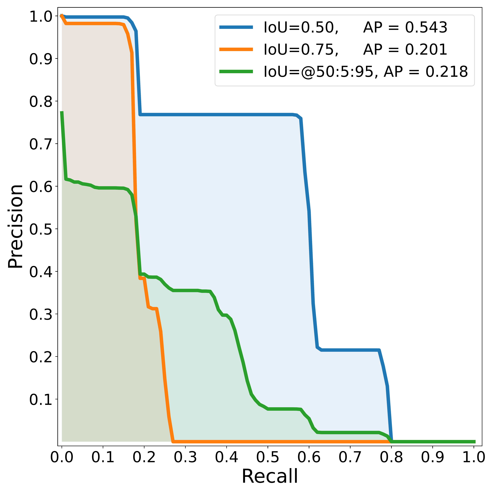
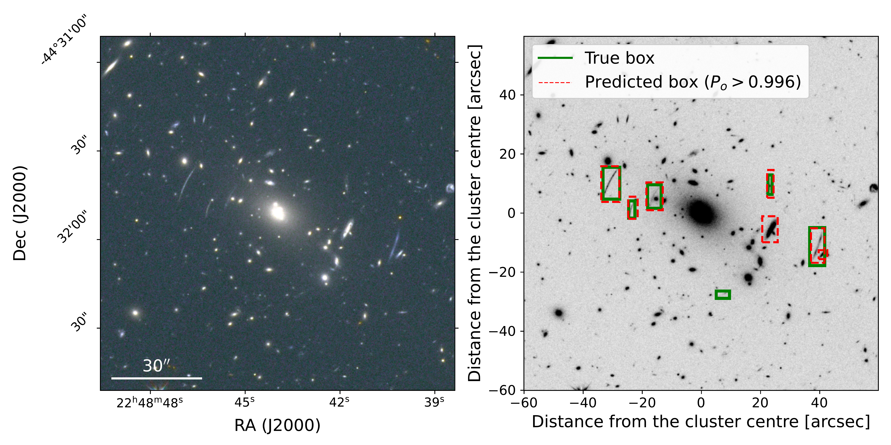

$\newcommand{\ensuremath}{}$
$\newcommand{\xspace}{}$
$\newcommand{\object}[1]{\texttt{#1}}$
$\newcommand{\farcs}{{.}''}$
$\newcommand{\farcm}{{.}'}$
$\newcommand{\arcsec}{''}$
$\newcommand{\arcmin}{'}$
$\newcommand{\ion}[2]{#1#2}$
$\newcommand{\textsc}[1]{\textrm{#1}}$
$\newcommand{\hl}[1]{\textrm{#1}}$
$\newcommand{\footnote}[1]{}$
$\newcommand{\sersic}{Sérsic }$
$\newcommand{\lb}[1]{\textcolor{red}{LB: #1}}$
$\newcommand{\linenumbers}[0]$
$\newcommand{\orcid}[1]$
$\newcommand{\arraystretch}{1.3}$
$\newcommand{\arraystretch}{1.2}$
$\newcommand{\arraystretch}{1.2}$

# Euclid Quick Data Release (Q1): Searching for giant gravitational arcs in galaxy clusters with mask region-based convolutional neural networks

<mark>Appeared on: 2025-11-06</mark> -  _12 pages, 6 figures_

E. Collaboration, et al. -- incl., <mark>K. Jahnke</mark>

**Abstract:** Strong gravitational lensing (SL) by galaxy clusters is a powerful probe of their inner mass distribution and a key test bed for cosmological models. However, the detection of SL events in wide-field surveys such as $\Euclid$ requires robust, automated methods capable of handling the immense data volume generated. In this work, we present an advanced deep learning (DL) framework based on mask region-based convolutional neural networks (Mask R-CNNs), designed to autonomously detect and segment bright, strongly-lensed arcs in $\Euclid$ 's multi-band imaging of galaxy clusters. The model is trained on a realistic simulated data set of cluster-scale SL events, constructed by injecting mock background sources into Euclidised $*Hubble*$ Space Telescope images of $10$ massive lensing clusters, exploiting their high-precision mass models constructed with extensive spectroscopic data. The network is trained and validated on over $4500$ simulated images, and tested on an independent set of $500$ simulations, as well as real $\Euclid$ Quick Data Release (Q1) observations. The trained network achieves high performance in identifying gravitational arcs in the test set, with a precision and recall of $76\%$ and $58\%$ , respectively, processing $2' \times 2'$ images in a fraction of a second. When applied to a sample of visually confirmed $\Euclid$ Q1 cluster-scale lenses, our model recovers $\approx 66\%$ of gravitational arcs above the area threshold used during training.  While the model shows promising results, limitations include the production of some false positives and challenges in detecting smaller, fainter arcs. Our results demonstrate the potential of advanced DL computer vision techniques for efficient and scalable arc detection, enabling the automated analysis of SL systems in current and future wide-field surveys. The code, \texttt{ARTEMIDE} , is open source and will be available at $\url{github.com/LBasz/ARTEMIDE}$ .

**Figure 4. -** Steps of a \Euclid GCSL simulation. *Left*: \texttt{HST2EUCLID}$2'\times2'$ RGB image of the galaxy cluster Abell S1063 ($z_\mathrm{cl}=0.348$), with the main critical line (in red) for a source at $z_{\mathrm{s}}=2.92$, based on the lens model by \citet{bergamini2019}. The critical line has a circularised Einstein radius of $\theta_\mathrm{E} \simeq 33"$. The green cross marks the position of the injected source to be lensed. *Middle*: Source plane at $z_{\mathrm{s}}=2.92$, displaying the caustic (in red) related to the main critical line. The injected source (green cross) features a $\sersic$ profile (index $n=1.22$, $r_{\mathrm{eff}}=\ang{;;0.11}$), with $\YE=24.8$ and the SED of a star-forming galaxy; these parameters are sampled according to the procedure described in Sect. \ref{subsec:simulations}. *Right*: Colour-composite image of the simulated GCSL system, including the critical line (red dotted line). Green boxes enclose the gravitational arcs resulting from the lensing simulation, which are also shown in the bottom inset. (*fig:HST2EUCLID_A1063_sersic_0_000009*)

**Figure 6. -** In panel (a) we show two sets of three $P$--$R$ curves for $\mathrm{IoU}_{\mathrm{thr}} = 0.5, 0.75$, @$50$:$5$:$95$, each obtained by varying the object score threshold $p_{\mathrm{thr}}$. In panel (b) we show the $P$--$R$ curve for $\mathrm{IoU}_{\mathrm{thr}} = 0.5$, where the dots are colour-coded by the score threshold $p_{\mathrm{thr}}$ used to evaluate them. In particular, we emphasise the $P$--$R$ pair associated to our choice of score threshold $p_{\mathrm{thr}}=0.996$. Note that the recall remains relatively high even at moderate precision, reflecting the network's ability to recover most bright arcs while keeping the number of false positives manageable. Increasing the threshold shifts the operating point toward higher precision at the expense of recall. In panel (c) we show two precision and the recall curves as a function of the score threshold for $\mathrm{IoU}_{\mathrm{thr}} = 0.5$. (*fig:pr-curves*)

**Figure 5. -** *Left*: Euclidised $2' \times 2'$ RGB image ($R=JH_\sfont{E}$, $G=\YE$, $B=\IE$) of the galaxy cluster Abell 1063, belonging to the test set; the right-most arc is the one injected via SL simulation, while the others are real. *Right*: single channel $2' \times 2'$ Euclidised $\IE$ image of the same cluster. The green boxes enclose the gravitational arcs (both real and simulated) present in the field, i.e. the ground truth, while the red dashed boxes are the `gravitational arcs' found by the NN, having an object confidence score greater than $0.996$. (*fig:plot_3_0.0.29*)

