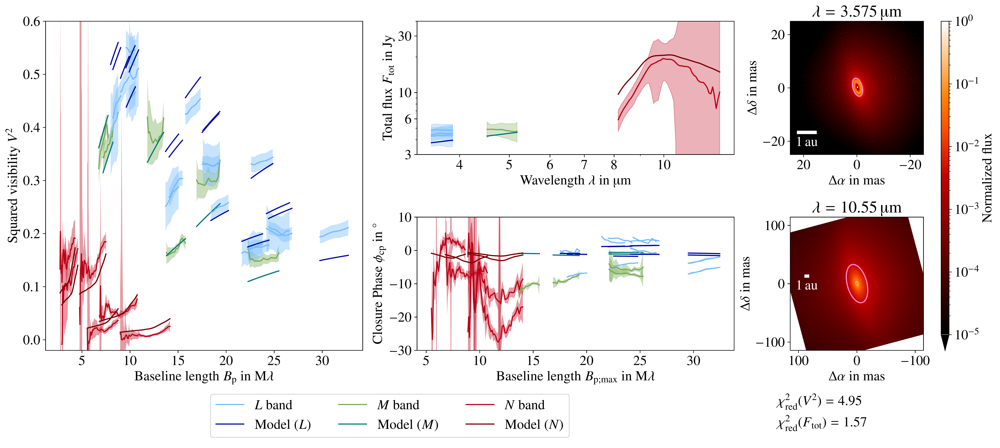
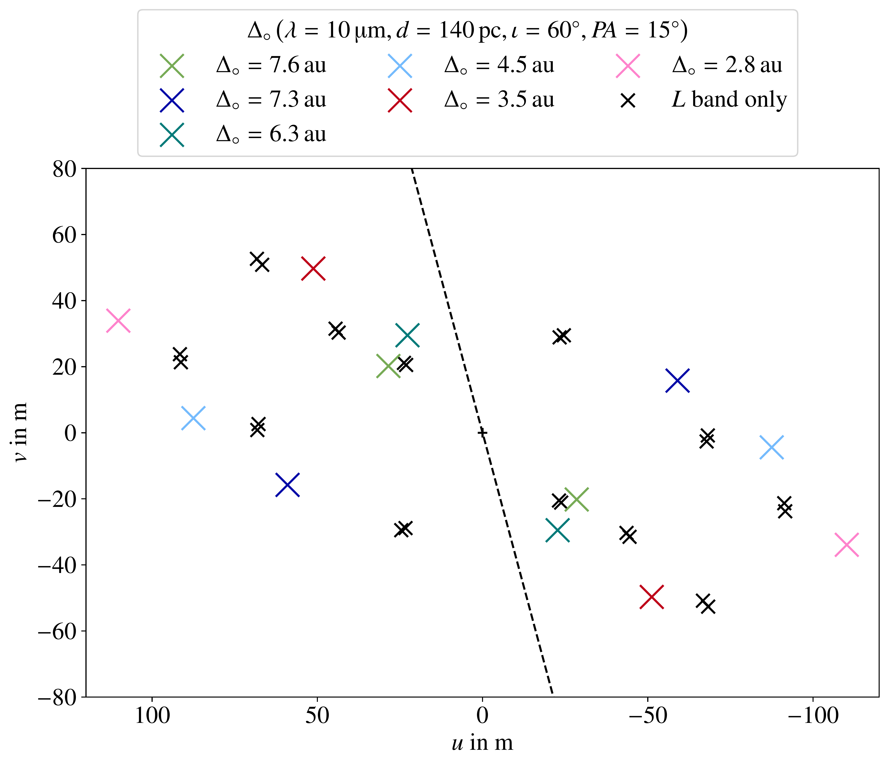

$\newcommand{\ensuremath}{}$
$\newcommand{\xspace}{}$
$\newcommand{\object}[1]{\texttt{#1}}$
$\newcommand{\farcs}{{.}''}$
$\newcommand{\farcm}{{.}'}$
$\newcommand{\arcsec}{''}$
$\newcommand{\arcmin}{'}$
$\newcommand{\ion}[2]{#1#2}$
$\newcommand{\textsc}[1]{\textrm{#1}}$
$\newcommand{\hl}[1]{\textrm{#1}}$
$\newcommand{\footnote}[1]{}$
$\newcommand{\PA}{\mathit{P\!A}}$
$\newcommand{\AIC}{\mathit{A\mkern -1 mu I\!C}}$
$\newcommand{\hexcolor}[2]{\textcolor[HTML]{#1}{#2}}$
$\newcommand{\bulletnewline}{\vspace{.5em}\newline}$
$\newcommand{\arraystretch}{1.5}$
$\newcommand{\arraystretch}{1.5}$
$\newcommand{\arraystretch}{1.5}$
$\newcommand{\arraystretch}{1.2}$
$\newcommand{\arraystretch}{1.5}$
$\newcommand{\arraystretch}{1.5}$

# The MATISSE view of the inner region of the RY Tau protoplanetary disk$\thanks{Based on observations collected at the European Organisation for Astronomical Research in the Southern Hemisphere with the VLTI-MATISSE instrument under ESO programmes 106.21Q8.006 and 106.21Q8.002.}$

<mark>Appeared on: 2025-11-12</mark> -  _28 pages, 23 figures, to be published in A&A_

J. S. Martin, et al. -- incl., <mark>R. v. Boekel</mark>, <mark>T. Henning</mark>, <mark>M. Lehmitz</mark>, <mark>M. Scheuck</mark>

**Abstract:** The physical conditions and processes in the innermost regions of protoplanetary disks are essential for planet formation and general disk evolution. In this context we study the T-Tauri type young stellar object RY Tau, which exhibits a dust-depleted inner cavity characteristic of a transition disk. The goal of this study is to analyze spectrally resolved interferometric observations in the $L$ , $M$ , and $N$ bands of the RY Tau protoplanetary disk obtained with MATISSE. We aim at providing constraints on the spatial distribution and mineralogy of dust in the inner few astronomical units by producing synthetic observations fitting the interferometric observables. A 2D temperature gradient disk model is employed to estimate the orientation of the inner disk. Successively, the chemical composition of silicates depending on spatial region in the disk is analyzed. Finally, the parameter space of a viscous accretion disk model is sampled via Monte Carlo radiative transfer simulations to investigate the actual 3D dust density distribution of RY Tau. We constrain the orientation of the inner disk of RY Tau finding no evidence of significant misalignment with respect to its outer disk. We identify several silicate species commonly found in protoplanetary disks and observe a depletion of amorphous dust grains toward the central protostar. By simultaneously considering the observed visibilities and the spectral energy distribution, we find that an accretion disk and an optically thin envelope enshrouding the protostar fits the observations best. Radiative transfer simulations show that hot dust close to the protostar and in the line of sight to the observer, either in the uppermost disk layers of a strongly flared disk or in a dusty envelope, is necessary to model the observations. The shadow cast by a dense innermost disk midplane on the dust further out explains the observed closure phases in the $L$ band and to some extent in the $M$ band. However, the closure phases in the $N$ band are underestimated by our model, hinting at an additional asymmetry in the flux density distribution not visible at shorter wavelengths.

**Figure 10. -** Best-fit model of the accretion disk model with an optically thin envelope. The model parameters are listed in Table \ref{tab:mcrt_best_fit_models}. The pink ellipses in the intensity maps indicate the half-light radii of the emitting region measured in the disk midplane as defined by [Varga, et. al (2018)](https://ui.adsabs.harvard.edu/abs/2018A&A...617A..83V). (*fig:mcrt_best_fit_envI*)

**Figure 2. -** Baselines of the MATISSE observations described in Sect. \ref{sec:observations}. The dashed line indicates the position angle of the disk major axis in the image plane. (*fig:u-v-coverage*)

**Figure 11. -** Best-fit model of an accretion disk with a dense midplane and an additional optically thin envelope. The model parameters are listed in Table \ref{tab:mcrt_best_fit_models}. (*fig:mcrt_best_fit_envII*)

