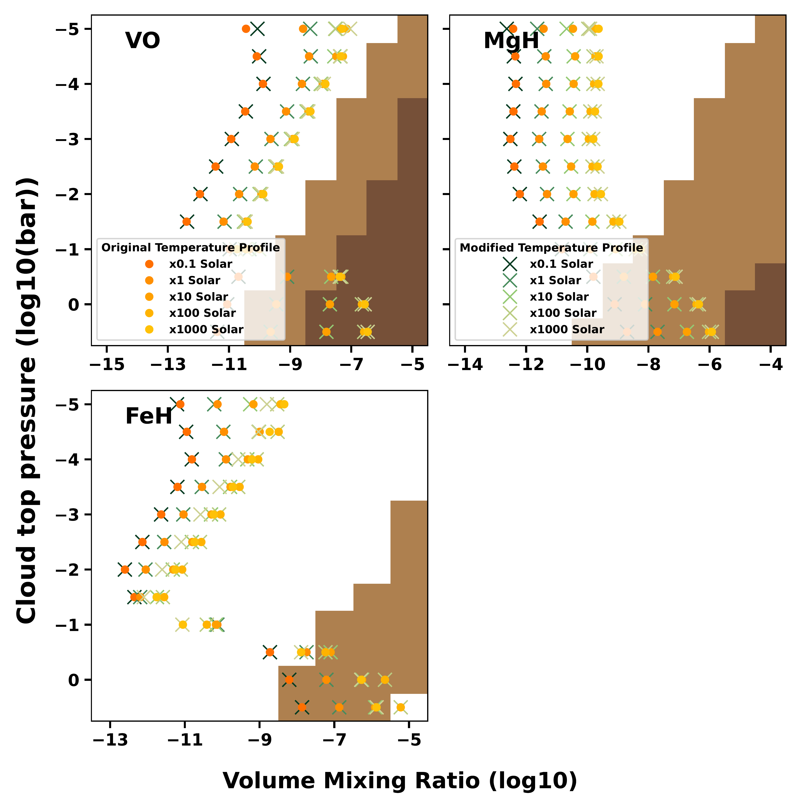

$\newcommand{\ensuremath}{}$
$\newcommand{\xspace}{}$
$\newcommand{\object}[1]{\texttt{#1}}$
$\newcommand{\farcs}{{.}''}$
$\newcommand{\farcm}{{.}'}$
$\newcommand{\arcsec}{''}$
$\newcommand{\arcmin}{'}$
$\newcommand{\ion}[2]{#1#2}$
$\newcommand{\textsc}[1]{\textrm{#1}}$
$\newcommand{\hl}[1]{\textrm{#1}}$
$\newcommand{\footnote}[1]{}$
$\newcommand$
$\newcommand{\ltt}{LTT-9779}$
$\newcommand{\lttb}{LTT-9779 b}$
$\newcommand{\arraystretch}{1.25}$

# No TiO detected in the hot Neptune-desert planet LTT-9779 b in reflected light at high spectral resolution

<mark>Appeared on: 2025-11-13</mark> -  _20 pages, 15 figures, 7 tables. Accepted to Astronomy and Astrophysics_

S. R. Vaughan, et al. -- incl., <mark>L. Kreidberg</mark>

**Abstract:** LTT-9779 b is an inhabitant of the hot Neptune desert and one of only a few planets with a measured high albedo. Characterising the atmosphere of this world is the key to understanding what processes dominate in reducing the number of short-period intermediate mass planets, creating the hot Neptune desert. We aim to characterise the reflected light of LTT-9779 b at high spectral resolution to break the degeneracy between clouds and atmospheric metallicity. This is key to interpreting its mass loss history which may illuminate how it kept its place in the desert. We use the high resolution cross-correlation spectroscopy technique on four half-nights of ESPRESSO observations in 4-UT mode (16.4-m effective mirror) to constrain the reflected light spectrum of $\lttb$ . We do not detect the reflected light spectrum of $\lttb$ despite these data having the expected sensitivity at the level 100 ppm. Injection tests on the post-eclipse data indicate that TiO should have been detected for a range of different equilibrium chemistry models. Therefore this non-detection suggests TiO depletion in the western hemisphere however, this conclusion is sensitive to temperature which impacts the chemistry in the upper atmosphere and the reliability of the line list. Additionally, we are able to constrain the top of the western cloud deck to $P_{\text{top, western}}<10^{-2.0}$ bar and the top of the eastern cloud deck $P_{\text{top, eastern}}<10^{-0.5}$ bar, which is consistent with the predicted altitude of $MgSiO_3$ and  $Mg_2$ $SiO_4$ clouds from JWST NIRISS/SOSS. While we do not detect the reflected light spectrum of $\lttb$ , we have verified that this technique can be used in practice to characterise the high spectral resolution reflected light of exoplanets so long as their spectra contain a sufficient number of deep spectral lines. Therefore this technique may become an important cornerstone of exoplanet characterisation with the ELT and beyond.

**Figure 12. -** Restrictions placed on the VMR as a function of cloud deck altitude for the post-eclipse observations. The injection recovery tests presented here rule out the models coloured in light brown. Additionally, we highlight the models in dark brown which, due to the saturation of a large number of the spectral lines present, have an average contrast ratio more than three sigma below the contrast of $\ltt$b at these wavelengths measured by JWST NIRISS/SOSS data. To compare these restrictions to more complex models, we also plot the EU$_{\text{VMRs}}$ for metallicities ranging from $0.1\times$ solar to $1000\times$ solar as a function of the altitude of the cloud deck for both the original (T.1, circles) and modified (T.2, crosses) temperature-profiles for the western-dayside. (*fig:recoverygridpost_companion*)

**Figure 15. -** The inputs used to create the `self-consistent' spectra with PICASO for each atmospheric segment (top row). The second row shows the temperature-pressure profiles of each segment with the solid line indicating the original profile and the shaded regions the one and two sigma errors. The dash line indicates the modification to the profile for the isothermal models. The dotted lines are the condensation curves for different cloud species. Previous works have favoured the presence of $Mg_2$$SiO_4$ and $MgSiO_3$ clouds over those of other types \citep{Hoyer2023, Radica2024a, Coulombe2025, Radica2025} thus we only consider $Mg_2$$SiO_4$ and $MgSiO_3$ clouds in our models. The third row shows the optical depth per atmospheric layer of the modelled $Mg_2$$SiO_4$ and $MgSiO_3$ clouds as a function of wavelength. In the eastern-dayside model, the top of the cloud deck forms at $10^{-1.5}$ bar and for the other two segments it is at $10^{-4}$ bar. The last row shows the VMRs of all the species used in these models for $10\times$ solar metallicity. These assume equilibrium chemistry with the original temperature-profile (solid lines) and modified profile (dashed lines). (*fig:spectra_inputs*)

**Figure 13. -** As Figure \ref{fig:recoverygridpost_companion} but for the pre-eclipse observations and eastern-dayside EU$_{\text{VMRs}}$. (*fig:recoverygridpre_companion*)

