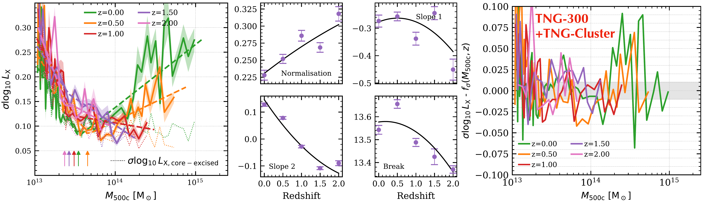

$\newcommand{\ensuremath}{}$
$\newcommand{\xspace}{}$
$\newcommand{\object}[1]{\texttt{#1}}$
$\newcommand{\farcs}{{.}''}$
$\newcommand{\farcm}{{.}'}$
$\newcommand{\arcsec}{''}$
$\newcommand{\arcmin}{'}$
$\newcommand{\ion}[2]{#1#2}$
$\newcommand{\textsc}[1]{\textrm{#1}}$
$\newcommand{\hl}[1]{\textrm{#1}}$
$\newcommand{\footnote}[1]{}$
$\newcommand{\thebibliography}{\DeclareRobustCommand{\VAN}[3]{##3}\VANthebibliography}$

# The origin of scatter in the X-ray luminosity -- halo mass relation of galaxy clusters

<mark>Appeared on: 2025-11-14</mark> -  _19 pages, 11 figures (including appendix). Submitted to MNRAS_

<mark>J. Braspenning</mark>, J. Schaye, <mark>A. Pillepich</mark>, D. Nelson

**Abstract:** Galaxy groups and clusters are excellent probes of large-scale structure and are shaped by some of the most energetic physical processes in the Universe. They follow a tight scaling relation of X-ray luminosity with halo mass. However, predicting the dependence of the scatter in this relation on mass and redshift is challenging, due to the statistical requirement of large simulation volumes. Using the large volume cosmological hydrodynamical simulations for galaxy cluster physics FLAMINGO and TNG300+TNG-Cluster, we fit this relation and its scatter, focusing on $M_{\rm 500c}>10^{13} \mathrm{M_\odot}$ and $z \leq 2$ . We find qualitatively similar, but quantitatively different results for the two models. For the first time, we study ways to reduce the scatter using properties beyond X-ray luminosity, namely six ICM, six galaxy, and eleven dark matter halo properties. For both FLAMINGO and TNG300+TNG-Cluster, the gas fraction and thermal Sunyaev-Zel \' dovich (SZ) signal correlate strongest with X-ray scatter, reducing it by over 50 \% when accounting for their partial correlations. Galaxy and halo properties correlate weakly with X-ray scatter, typically reducing it by 10-20 \% . Our results are qualitatively robust across different FLAMINGO feedback variations, though the correlations weaken for stronger feedback and with increasing redshift.Differences between FLAMINGO and TNG300+TNG-Cluster are only apparent at the high-mass end -- where e.g. the galaxy stellar age correlates strongly for FLAMINGO, but not for TNG300+TNG-Cluster -- confirming robustness across physics implementations. We provide fitting formulas for the scatter and its corrections, for direct application to cosmological analyses and observational data.

**Figure 7. -** Redshift evolution of the scatter in the $L_{\rm X}$ -- $M_{\rm 500c}$ relation for FLAMINGO $\mathrm{L2p8}$(top) and TNG300+TNG-Cluster (bottom). The left panels show the scatter as a function of mass from $z=0$ to $z=2$(solid curves), with shaded areas depicting the $1\sigma$ bootstrap error in each bin. The dotted curves show the scatter for the core-excised luminosity $L_{\rm X, ce}$, which only differs significantly from the scatter in the total luminosity either below $10^{14} \mathrm{M_{\odot}}$(FLAMINGO) or above that mass (TNG300+TNG-Cluster). A best-fit broken power law for each redshift is shown as dashed lines of the same colour, with arrows indicating the break point. The middle four-tile panels show the redshift evolution of the four parameters of the broken power law (Eq. \ref{eq:broken_powerlaw_scatter}), and the best fit quadratic function (Eq. \ref{eq:redshift_evolution_broken_powerlaw}) to that evolution. The right most panels show the difference between the true scatter in each bin, and the prediction from the broken power law using the parameters at each redshift from the best quadratic fit shown in the middle panels. The quadratic fit to the redshift evolution, combined with the broken power law, allows an accurate prediction, within $0.01 \mathrm{dex}$(FLAMINGO) and $0.05 \mathrm{dex}$(TNG300+TNG-Cluster), across a wide range of redshift and mass. (*fig:scatter_redshift_FLAMINGO_TNG*)

**Figure 8. -** The logarithmic deviation from the $L_{\rm X}$ -- $M_{\rm 500c}$ scaling relation (in dex; Eq. \ref{eq:log_deviation}) against the logarithmic deviation in a second cluster property (selected from Table \ref{tab:all_properties}) for FLAMINGO L2p8 at $z=0$ at $M_{\rm 500c} = 10^{13.5}   \mathrm{M_\odot}$(30,000 haloes). Lighter colours indicate a larger number of haloes. The red error bars (barely visible) are 16th-84th percentile bootstrap resamplings of the median in ten logarithmic bins of the second property. The dashed red line is the best linear fit for those error bars. The spearman rank correlation is indicated in the top left of each panel. Some of the properties show a clear correlation with the deviation from the X-ray luminosity scaling relation, but the level of correlation and the scatter differ strongly between properties. (*fig:second_property_137*)

**Figure 9. -** As Fig. \ref{fig:second_property_137}, for FLAMINGO L2p8 at $z=0$, but for the higher-mass clusters with $M_{\rm 500c} = 10^{14.5}   \mathrm{M_\odot}$(3771 haloes). (*fig:second_property_147*)

