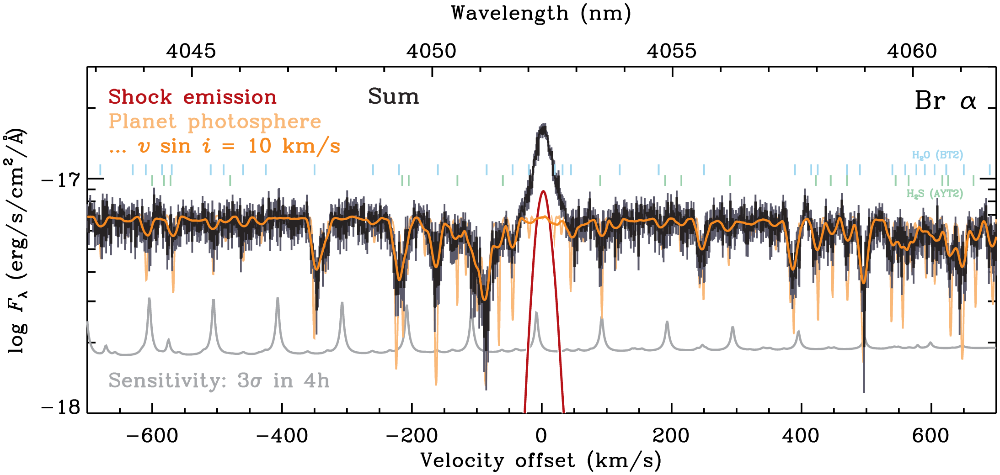
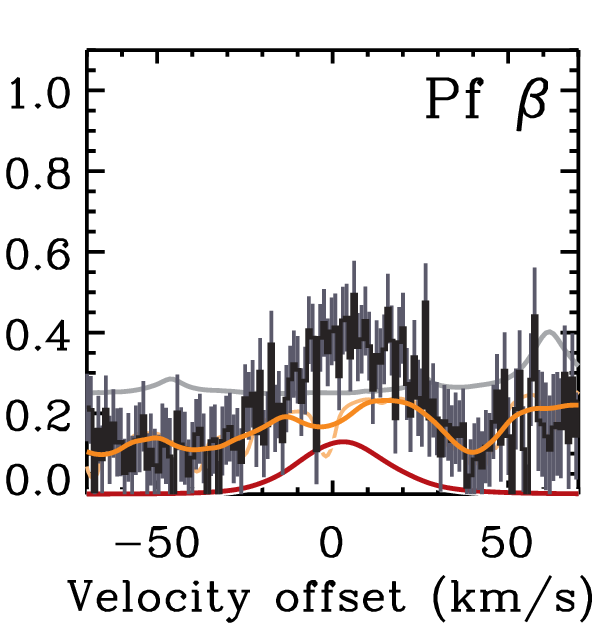
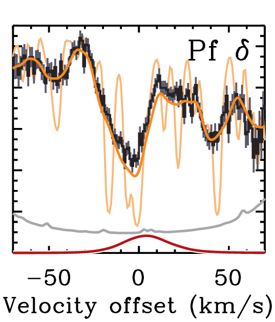

$\newcommand{\ensuremath}{}$
$\newcommand{\xspace}{}$
$\newcommand{\object}[1]{\texttt{#1}}$
$\newcommand{\farcs}{{.}''}$
$\newcommand{\farcm}{{.}'}$
$\newcommand{\arcsec}{''}$
$\newcommand{\arcmin}{'}$
$\newcommand{\ion}[2]{#1#2}$
$\newcommand{\textsc}[1]{\textrm{#1}}$
$\newcommand{\hl}[1]{\textrm{#1}}$
$\newcommand{\footnote}[1]{}$
$\newcommand{\Bildbreite}[1]{#1}$
$\newcommand{\auskommentiert}[1]$
$\newcommand{\MSonne}{{M_{\odot}}}$
$\newcommand{\RSonne}{{R_{\odot}}}$
$\newcommand{\LSonne}{{L_{\odot}}}$
$\newcommand{\FOb}{\ensuremath{\mathcal{F}}\xspace}$
$\newcommand{\FlOb}{\ensuremath{\mathcal{F}_\lambda}\xspace}$
$\newcommand{\LAkk}{\ensuremath{{L_{\textnormal{acc}}}}\xspace}$
$\newcommand{\FAkk}{\ensuremath{{F_{\textnormal{acc}}}}\xspace}$
$\newcommand{\Rphot}{{R_{\textnormal{phot}}}}$
$\newcommand{\RAkk}{{R_{\textnormal{acc}}}}$
$\newcommand{\RHill}{{R_{\textnormal{Hill}}}}$
$\newcommand{\RBondi}{{R_{\textnormal{Bondi}}}}$
$\newcommand{\kLiss}{{k_{\textnormal{Liss}}}}$
$\newcommand{\Tint}{{T_{\textnormal{int}}}}$
$\newcommand{\Teff}{\ensuremath{T_{\textnormal{eff}}}\xspace}$
$\newcommand{\Teffmin}{\ensuremath{T_{\textnormal{eff, min}}}\xspace}$
$\newcommand{\Teffmax}{\ensuremath{T_{\textnormal{eff, max}}}\xspace}$
$\newcommand{\TSchb}{\ensuremath{T_{\textnormal{disc}}}\xspace}$
$\newcommand{\RSchb}{\ensuremath{R_{\textnormal{disc}}}\xspace}$
$\newcommand{\FSchb}{\ensuremath{F^{\textnormal{disc}}}\xspace}$
$\newcommand{\fAoXX}{\ensuremath{f_{\textrm{\citetalias{Aoyama+2020}}}}\xspace}$
$\newcommand{\muzpSch}{\ensuremath{\mu_{\textrm{CPD}}}\xspace}$
$\newcommand{\Rzent}{\ensuremath{{R_{\textrm{cent}}}}\xspace}$
$\newcommand{\fzent}{\ensuremath{{f_{\textrm{cent}}}}\xspace}$
$\newcommand{\vFfinfty}{\ensuremath{{\varv_{\textrm{ff}, \infty}}}\xspace}$
$\newcommand{\thzpSch}{\ensuremath{\theta_{\textrm{CPD}}}\xspace}$
$\newcommand{\hzpSch}{\ensuremath{h_{\textrm{CPD}}}\xspace}$
$\newcommand{\PLUTO}{{\texttt{PLUTO}}}$
$\newcommand{\mkmk}{{\texttt{Makemake}}}$
$\newcommand{\belt}{{\texttt{Belt}}}$
$\newcommand{\btsettl}[1][]{{\texttt{BT-Settl#1}}}$
$\newcommand{\heracles}{{\texttt{heracles}}}$
$\newcommand{\rapax}{{\texttt{Rapax 21}}}$
$\newcommand{\mesa}{{\texttt{mesa}}}$
$\newcommand{\compl}{{\texttt{Completo 21}}}$
$\newcommand{\ja}{\lstinline|YES|}$
$\newcommand{\nein}{\lstinline|NO|}$
$\newcommand{\mum}{\ensuremath{\upmu\mathrm{m}}\xspace}$
$\newcommand{\Vekt}[1]{\mathbf{#1}}$
$\newcommand{\eqsep}{\;\;\;}$
$\newcommand{\K}[1]$
$\newcommand{\MPktEinhJ}{\MJ \mbox{yr}^{-1}}$
$\newcommand{\MPktEinhS}{\MSonne \mbox{yr}^{-1}}$
$\newcommand{\Lbol}{{L_{\textnormal{bol}}}}$
$\newcommand{\sigSB}{{\sigma}}$
$\newcommand{\MStern}{\ensuremath{M_{\star}}\xspace}$
$\newcommand{\MSternen}{{M_{\star, 1}}}$
$\newcommand{\RStern}{\ensuremath{R_{\star}}\xspace}$
$\newcommand{\TZerst}{{T_{\textnormal{dest}}}}$
$\newcommand{\RZerst}{{R_{\textnormal{dest}}}}$
$\newcommand{\vFf}{{v_{\textnormal{ff}}}}$
$\newcommand{\fred}{{f_{\textnormal{red}}}}$
$\newcommand{\fredlmbd}{{f_{\textnormal{red}, \lambda}}}$
$\newcommand{\fFuell}{\ensuremath{f_{\textnormal{fill}}}\xspace}$
$\newcommand{\Erad}{{E_{\textnormal{rad}}}}$
$\newcommand{\Trad}{{T_{\textnormal{rad}}}}$
$\newcommand{\Eradlmbd}{{E_{\textnormal{rad}, \lambda}}}$
$\newcommand{\Tradlmbd}{{T_{\textnormal{rad}, \lambda}}}$
$\newcommand{\TPop}{{T_{\textnormal{pop}}}}$
$\newcommand{\TGas}{{T_{\textnormal{gas}}}}$
$\newcommand{\rmin}{\ensuremath{r_{\mathrm{min}}}\xspace}$
$\newcommand{\rmax}{\ensuremath{r_{\mathrm{max}}}\xspace}$
$\newcommand{\thSch}{\ensuremath{{\theta_{\mathrm{shock}}}}\xspace}$
$\newcommand$
$\newcommand{\lmbnewcommandf}{\ensuremath{\lambda_{\textnormal{eff}}}\xspace}$
$\newcommand{\Weff}{\ensuremath{W_{\textnormal{eff}}}\xspace}$
$\newcommand{\neuThH}[1]{\textcolor{blue!50!green}{#1}\xspace}$
$\newcommand{\neuMB}[1]{\textcolor{green!50!black}{#1}\xspace}$
$\newcommand{\neuRvB}[1]{\textcolor{red!30!yellow!20!black!30!red}{#1}\xspace}$
$\newcommand{\neuYA}[1]{\textcolor{blue!60!black}{#1}\xspace}$
$\newcommand{\neuGDM}[1]{\textcolor{red!50!blue}{#1}\xspace}$
$\newcommand{\neuGDMII}[1]{\textcolor{red!70!blue}{#1}\xspace}$
$\newcommand{\neuThH}[1]{#1}$
$\newcommand{\neuMB}[1]{#1}$
$\newcommand{\neuRvB}[1]{#1}$
$\newcommand{\neuYA}[1]{#1}$
$\newcommand{\neuGDM}[1]{#1}$
$\newcommand{\neuGDMII}[1]{#1}$
$\newcommand{\arraystretch}{1.4}$
$\newcommand{\e}{\mathrm{e}}$
$\newcommand{\entspr}{ \widehat{=} }$
$\newcommand{\mH}{m_\mathrm{H}}$
$\newcommand{\me}{m_\mathrm{e}}$
$\newcommand{\kB}{k_\mathrm{B}}$
$\newcommand{\MJ}{M_{\mathrm{J}}}$
$\newcommand{\RJ}{R_{\mathrm{J}}}$
$\newcommand{\ME}{M_{\mathrm{E}}}$
$\newcommand{\Lkin}{L_\mathrm{kin}}$
$\newcommand{\Lya}{Ly \alpha\xspace}$
$\newcommand{\Ha}{H \alpha\xspace}$
$\newcommand{\Hb}{H \beta\xspace}$
$\newcommand{\Baa}{\Ha\xspace}$
$\newcommand{\nl}{\ensuremath{n_\ell}\xspace}$
$\newcommand{\Paa}{Pa \alpha\xspace}$
$\newcommand{\Pab}{Pa \beta\xspace}$
$\newcommand{\Pag}{Pa \gamma\xspace}$
$\newcommand{\Bra}{Br \alpha\xspace}$
$\newcommand{\BraM}{\mathrm{Br} \alpha}$
$\newcommand{\Brg}{Br \gamma\xspace}$
$\newcommand{\Pfa}{Pf \alpha\xspace}$
$\newcommand{\Pfb}{Pf \beta\xspace}$
$\newcommand{\PfbM}{\mathrm{Pf} \beta}$
$\newcommand{\Pfg}{Pf \gamma\xspace}$
$\newcommand{\PfgM}{\mathrm{Pf} \gamma}$
$\newcommand{\Pfd}{Pf \delta\xspace}$
$\newcommand{\Pfe}{Pf \varepsilon\xspace}$
$\newcommand{\Hua}{Hu \alpha\xspace}$
$\newcommand{\Ks}{K_{\mathrm{s}}\xspace}$
$\newcommand{\LkCa}{LkCa 15\xspace}$
$\newcommand{\LkCab}{LkCa 15 b\xspace}$
$\newcommand{\PDS}{PDS 70\xspace}$
$\newcommand{\PDSA}{PDS 70 A\xspace}$
$\newcommand{\PDSb}{PDS 70 b\xspace}$
$\newcommand{\PDSc}{PDS 70 c\xspace}$
$\newcommand{\PDSbc}{PDS 70 b and~c\xspace}$
$\newcommand{\PDSd}{PDS 70 d\xspace}$
$\newcommand{\Dlrmb}{Delorme 1 (AB)b\xspace}$
$\newcommand{\WISPb}{WISPIT 2 b\xspace}$
$\newcommand{\kms}{\ensuremath{\mathrm{km} \mathrm{s^{-1}}}\xspace}$
$\newcommand{\MdotU}{\ME \mathrm{yr}^{-1}}$
$\newcommand{\MdotUJ}{\MJ \mathrm{yr}^{-1}}$
$\newcommand{\MdotUS}{\MSun \mathrm{yr}^{-1}}$
$\newcommand{\MPkt}{\ensuremath{\dot{M}}\xspace}$
$\newcommand{\MPktzpSch}{\dot{M}_{\mathrm{CPD}}}$
$\newcommand{\dMdtXCVII}{\ensuremath{\dot{M}_{97\%}}\xspace}$
$\newcommand{\lgMd}{{\mathrm{lg}\Mdot_2}}$
$\newcommand{\MP}{\ensuremath{M_{\mathrm{p}}}\xspace}$
$\newcommand{\RP}{\ensuremath{R_{\mathrm{p}}}\xspace}$
$\newcommand{\ffill}{f_{\mathrm{fill}}}$
$\newcommand{\ff}{\ffill}$
$\newcommand{\Lcont}{L_{\mathrm{cont}}}$
$\newcommand{\LHa}{\ensuremath{{L_{\textnormal{H} \alpha}}}\xspace}$
$\newcommand{\LHamax}{{L_{\textnormal{H} \alpha, \textnormal{max}}}}$
$\newcommand{\FHa}{{F_{\textnormal{H} \alpha}}}$
$\newcommand{\FHamod}{{F_{\textnormal{H} \alpha}^{\textnormal{mod}}}}$
$\newcommand{\FHb}{{F_{\textnormal{H} \beta}}}$
$\newcommand{\FBra}{{F_{\textnormal{Br} \alpha}}}$
$\newcommand{\LBra}{\ensuremath{L_{\textnormal{Br} \alpha}}\xspace}$
$\newcommand{\LBrakumul}{\ensuremath{L_{\textnormal{Br} \alpha}^{\textnormal{cml}}}\xspace}$
$\newcommand{\LBratotPl}{\ensuremath{L_{\textnormal{Br} \alpha}^{\textnormal{tot, plan.}}}\xspace}$
$\newcommand{\ABra}{{A_{\textnormal{Br} \alpha}}}$
$\newcommand{\FPab}{{F_{\textnormal{Pa} \beta}}}$
$\newcommand{\fluxratobs}{\varphi_{\textnormal{obs}}}$
$\newcommand{\fluxratth}{\varphi_{\textnormal{theo, surf}}}$
$\newcommand{\fluxratthred}{\varphi_{\textnormal{theo, rednd}}}$
$\newcommand{\pUV}{p_{\textnormal{UV}}}$
$\newcommand{\pNIR}{p_{\textnormal{NIR}}}$
$\newcommand{\LLinie}{\ensuremath{L_{\mathrm{line}}}\xspace}$
$\newcommand{\FLinie}{F_{\mathrm{line}}}$
$\newcommand{\tauHa}{{\langle\tau_{\textnormal{H} \alpha}\rangle}}$
$\newcommand{\cs}{c_{\mathrm{s}}}$
$\newcommand{\Mach}{\mathcal{M}}$
$\newcommand{\Pram}{P_{\textnormal{ram}}}$
$\newcommand{\yt}{y_\mathrm{t}}$
$\newcommand{\nH}{n_\mathrm{H}}$
$\newcommand{\XHH}{{X_{\mathrm{H}_2}}}$
$\newcommand{\XHI}{{X_{\mathrm{H}}}}$
$\newcommand{\XHII}{{X_{\mathrm{H}^+}}}$
$\newcommand{\AR}{A_R}$
$\newcommand{\AU}{A_U}$
$\newcommand{\AHa}{\ensuremath{A_{\mathrm{H} \alpha}}\xspace}$
$\newcommand{\AV}{A_V}$
$\newcommand{\RV}{R_V}$
$\newcommand{\AH}{A_H}$
$\newcommand{\AK}{A_K}$
$\newcommand{\He}{\mathcal{H}_\mathrm{e}}$
$\newcommand{\HeNull}{\mathcal{H}_\mathrm{e, 0}}$
$\newcommand{\vth}{v_{\textnormal{th}}}$
$\newcommand{\nmax}{n_{\mathrm{max}}}$
$\newcommand{\DF}{\Delta F}$
$\newcommand{\lmbdHa}{\lambda_{\mathrm{H} \alpha}}$
$\newcommand{\lmbdHb}{\lambda_{\mathrm{H} \beta}}$
$\newcommand{\lmbdBra}{\lambda_{\mathrm{Br} \alpha}}$
$\newcommand{\taudHa}{\tau_{\mathrm{dust, H} \alpha}}$
$\newcommand{\kappaStbint}{\kappa_{\bullet, \mathrm{H} \alpha}}$
$\newcommand{\kapStbfpg}{\kappa_{\mathrm{dust, H} \alpha}}$
$\newcommand{\kapmax}{\kappa_{\mathrm{max}}}$
$\newcommand{\Sigmad}{\Sigma_{\mathrm{dust}}}$
$\newcommand{\Sigwhered}{\tilde{\Sigma}_{\textrm{gas}}}$
$\newcommand{\vK}{v_{\mathrm{K}}}$
$\newcommand{\taumax}{{\tau_{\mathrm{max}}}}$
$\newcommand{\fC}{f_\mathrm{C}}$
$\newcommand{\fSi}{f_\mathrm{sil}}$
$\newcommand{\fmax}{f_\mathrm{max}}$
$\newcommand{\finf}{f_{\mathrm{inf}}}$
$\newcommand{\thmin}{\ensuremath{\theta_\mathrm{min}}\xspace}$
$\newcommand{\thmax}{\ensuremath{\theta_\mathrm{max}}\xspace}$
$\newcommand{\varthmaxP}{\ensuremath{\vartheta_\mathrm{max, p}}\xspace}$
$\newcommand{\varthmaxSch}{\ensuremath{\vartheta_\mathrm{max, CPD}}\xspace}$
$\newcommand{\varmu}{\ensuremath{\tilde{\mu}}}$
$\newcommand{\varmumin}{\ensuremath{\varmu_\mathrm{min}}\xspace}$
$\newcommand{\thetaPolebene}{\ensuremath{\theta_{\varphi=\phi}}\xspace}$
$\newcommand{\Dlmbdbin}{(\Delta\lambda)_\textrm{bin}}$
$\newcommand{\tBeob}{\ensuremath{t_\textrm{obs}}\xspace}$
$\newcommand{\FlmbdEmpf}{\ensuremath{F_\lambda^{\mathrm{sens}}}\xspace}$
$\newcommand{\relDvBreite}{\ensuremath{\mathfrak{v}}\xspace}$
$\newcommand{\fkrit}{\ensuremath{f_{\mathrm{crit}}}\xspace}$
$\newcommand{\vZerf}{\ensuremath{v_{\mathrm{brkp}}}\xspace}$
$\newcommand{\FWHM}{\ensuremath{\mathrm{FWHM}}\xspace}$
$\newcommand{\SNR}{\ensuremath{\mathrm{SNR}}\xspace}$
$\newcommand{\nuabschn}{\ensuremath{\tilde{\nu}_{\mathrm{cut}}}\xspace}$
$\newcommand{\vSyst}{\ensuremath{v_{\mathrm{syst}}}\xspace}$
$\newcommand{\tauZeitskala}{t}$
$\newcommand{\la}{\lesssim}$
$\newcommand{\ga}{\gtrsim}$
$\newcommand{\upi}{\pi}$
$\newcommand{\umu}{\upmu}$
$\newcommand{\arcsec}{^\prime ^\prime}$
$\newcommand{◦}{{\mbox{\textdegree}}}$
$\newcommand\ref{@jnl#1}$
$\newcommand{\aj}{\ref@jnl{AJ}}$
$\newcommand{\actaa}{\ref@jnl{Acta Astron.}}$
$\newcommand{\araa}{\ref@jnl{ARA\&A}}$
$\newcommand{\apj}{\ref@jnl{ApJ}}$
$\newcommand{\apjl}{\ref@jnl{ApJ}}$
$\newcommand{\apjs}{\ref@jnl{ApJS}}$
$\newcommand{\ao}{\ref@jnl{Appl.~Opt.}}$
$\newcommand{\apss}{\ref@jnl{Ap\&SS}}$
$\newcommand{\aap}{\ref@jnl{A\&A}}$
$\newcommand{\aapr}{\ref@jnl{A\&A~Rev.}}$
$\newcommand{\aaps}{\ref@jnl{A\&AS}}$
$\newcommand{\azh}{\ref@jnl{AZh}}$
$\newcommand{\baas}{\ref@jnl{BAAS}}$
$\newcommand{\bac}{\ref@jnl{Bull. astr. Inst. Czechosl.}}$
$\newcommand{\caa}{\ref@jnl{Chinese Astron. Astrophys.}}$
$\newcommand{\cjaa}{\ref@jnl{Chinese J. Astron. Astrophys.}}$
$\newcommand{\icarus}{\ref@jnl{Icarus}}$
$\newcommand{\jcap}{\ref@jnl{J. Cosmology Astropart. Phys.}}$
$\newcommand{\jrasc}{\ref@jnl{JRASC}}$
$\newcommand{\memras}{\ref@jnl{MmRAS}}$
$\newcommand{\mnras}{\ref@jnl{MNRAS}}$
$\newcommand{\na}{\ref@jnl{New A}}$
$\newcommand{\nar}{\ref@jnl{New A Rev.}}$
$\newcommand{\pra}{\ref@jnl{Phys.~Rev.~A}}$
$\newcommand{\prb}{\ref@jnl{Phys.~Rev.~B}}$
$\newcommand{\prc}{\ref@jnl{Phys.~Rev.~C}}$
$\newcommand{\prd}{\ref@jnl{Phys.~Rev.~D}}$
$\newcommand{\pre}{\ref@jnl{Phys.~Rev.~E}}$
$\newcommand{\prl}{\ref@jnl{Phys.~Rev.~Lett.}}$
$\newcommand{\pasa}{\ref@jnl{PASA}}$
$\newcommand{\pasp}{\ref@jnl{PASP}}$
$\newcommand{\pasj}{\ref@jnl{PASJ}}$
$\newcommand{\qjras}{\ref@jnl{QJRAS}}$
$\newcommand{\rmxaa}{\ref@jnl{Rev. Mexicana Astron. Astrofis.}}$
$\newcommand{\rnaas}{\ref@jnl{RNAAS}}$
$\newcommand{\skytel}{\ref@jnl{S\&T}}$
$\newcommand{\solphys}{\ref@jnl{Sol.~Phys.}}$
$\newcommand{\sovast}{\ref@jnl{Soviet~Ast.}}$
$\newcommand{\ssr}{\ref@jnl{Space~Sci.~Rev.}}$
$\newcommand{\zap}{\ref@jnl{ZAp}}$
$\newcommand{\nat}{\ref@jnl{Nature}}$
$\newcommand{\natas}{\ref@jnl{Nat.~Ast.}}$
$\newcommand{\iaucirc}{\ref@jnl{IAU~Circ.}}$
$\newcommand{\aplett}{\ref@jnl{Astrophys.~Lett.}}$
$\newcommand{\apspr}{\ref@jnl{Astrophys.~Space~Phys.~Res.}}$
$\newcommand{\bain}{\ref@jnl{Bull.~Astron.~Inst.~Netherlands}}$
$\newcommand{\fcp}{\ref@jnl{Fund.~Cosmic~Phys.}}$
$\newcommand{\gca}{\ref@jnl{Geochim.~Cosmochim.~Acta}}$
$\newcommand{\grl}{\ref@jnl{Geophys.~Res.~Lett.}}$
$\newcommand{\jcp}{\ref@jnl{J.~Chem.~Phys.}}$
$\newcommand{\jgr}{\ref@jnl{J.~Geophys.~Res.}}$
$\newcommand{\jqsrt}{\ref@jnl{J.~Quant.~Spec.~Radiat.~Transf.}}$
$\newcommand{\memsai}{\ref@jnl{Mem.~Soc.~Astron.~Italiana}}$
$\newcommand{\nphysa}{\ref@jnl{Nucl.~Phys.~A}}$
$\newcommand{\physrep}{\ref@jnl{Phys.~Rep.}}$
$\newcommand{\physscr}{\ref@jnl{Phys.~Scr}}$
$\newcommand{\planss}{\ref@jnl{Planet.~Space~Sci.}}$
$\newcommand{\procspie}{\ref@jnl{Proc.~SPIE}}$
$\newcommand{\ptp}{\ref@jnl{Prog.~Th.~Phys.}}$
$\newcommand{\natas}{\ref@jnl{NatAs}}$
$\newcommand{\amjm}{\ref@jnl{AmJM}}$
$\newcommand{\fpg}{f_{\textrm{d/g}}}$
$\newcommand{\amax}{a_{\rm max}}$
$\newcommand{\amin}{a_{\rm min}}$
$\newcommand{\Lint}{\ensuremath{L_{\mathrm{int}}}\xspace}$
$\newcommand{\Lphot}{\ensuremath{L_{\mathrm{phot}}}\xspace}$
$\newcommand{\Lshock}{\ensuremath{L_{\mathrm{shock}}}\xspace}$
$\newcommand{\Hi}{\textnormal{H \textsc{i}}\xspace}$
$\newcommand{\Tmax}{T_{\rm max}}$
$\newcommand{\dAproj}{\ensuremath{{\rm d}A_{\mathrm{proj}}}\xspace}$
$\newcommand{\Aproj}{\ensuremath{A_{\mathrm{proj}}}\xspace}$
$\newcommand{\FlmbdPhot}{\ensuremath{F_{\mathrm{\lambda, phot}}}\xspace}$
$\newcommand{\FlmbdSchock}{\ensuremath{F_{\mathrm{\lambda, shock}}}\xspace}$
$\newcommand{\HFh}{0.187}$

# Hydrogen-line profiles from accreting gas giants and their CPDs

<mark>Appeared on: 2025-11-17</mark> -  _16 pages, 10 figures, appendixes. Submitted to A&A_

G.-D. Marleau, et al. -- incl., <mark>T. Henning</mark>, <mark>R. v. Boekel</mark>, <mark>M. Benisty</mark>

**Abstract:** Many mature gas giants are known but only a few have been $\neuThH{observed in their accretion phase}$ . However, Extremely Large Telescope (ELT) instruments will have a vastly higher sensitivity and a smaller inner working angle than instruments up to now, making searches more productive and allowing for detailed characterisation. We study the observability of accreting gas giants with METIS, the first-generation ELT spectrograph featuring a resolution $R\sim10^5$ . We focus on the accretion-tracing hydrogen $\neuThH{recombination lines}$ accessible to METIS, mainly $\Bra$ and Pfund-series lines. $\neuThH{Our approach is general but we}$ take $\PDSb$ as a fiducial case. To calculate high-resolution line profiles, we combine a semianalytical multidimensional description of the flow onto an accreting planet and its circumplanetary disc (CPD) with local non-equilibrium shock-emissioncalculations.We assume the limiting scenario of no extinction, $\neuThH{appropriate for gas giants in gaps}$ , and negligible contribution from magnetospheric accretion columns.We use resolved atmospheric models to estimate the photospheric signal, and use simulated detector sensitivities to compute required observing times. Both the planet surface and the CPD surface shocks contribute to the total line profile, which is non-Gaussian and much narrower, $\neuThH{in Doppler velocity space,}$ than the free-fall velocity.When the accretion onto $\PDSb$ is at its maximum observed strength, the $\Bra$ line peak is equal to the photospheric continuum $\neuMB{, which is modulated mostly by water features, with a quantitative dependence on the choice of line list.}$ However, the rotation of the planet significantly $\neuMB{broadens}$ the features, helping the shock excess stand out. $\neuRvB{At \Bra, already only the continuum of \PDSb should yield $\SNR=12$ in 4 h, and with the baseline adopted accretion rate, the line peak will have a per-bin $\SNR\approx28$ in 4 h, or $\SNR\approx3$ in 3 min. The peak excess should require only about 10 min to reach $\SNR\approx3$.}$ $\Bra$ is a potent planet formation tracer and is accessible to ELT/METIS in little integration time. Resolved line profiles will place independent constraints especially on the mass and radius of an accreting planet, and help identify the accretion mechanism(s) at work.

**Figure 15. -** 
Predicted spectrum of $\PDS$b at $\Bra$
and noise for a 4-h integration (_black line_ with 1-$\$sigma_grey_ errorbars) on the detector wavelength grid.
We sum for this the photosphere (CIFIST with $\Teff=1400$ K, $\log g=3.5$ broadened to $v\sin i=10$ $\kms$; _pale and dark orange_, respectively)
and the shock emission (as in Figure \ref{Abb:Prof}; _dark red_).
The _grey line_ shows the 4-h, 3-$\sigma$ METIS sensitivity curve.
_Top panel_: a portion, centred on $\Bra$, of the range available at once.
Small ticks indicate resonances of $H_2$O (_pale blue_; \citealp{barber06}: "BT2") and $H_2$S (_pale green_; \citealp{azzam16}: "AYT2").
_Bottom panels_: Vignettes around accretion lines (see labels).
The $y$ range of the $\Pfb$($\lambda 4654$) panel applies
also to $\Pfg$ and $\Pfd$($\lambda$\la$mbda 3741, 3297$).
 (*Abb:Komboalles*)

**Figure 5. -** 
Resolved continuum at $\Bra$ for $\Teff=1200$, 1400, 1600 K (_blue to red_) from the CIFIST models for $\log g=3.5$ and solar metallicity,
scaled to match, integrated over the filter, the \citet{stolker2020_I} NB4.05 photometry (see text),
and without rotational broadening (_pale lines_) or broadened to $v\sin i\approx10 $\kms$$(_darker lines_).
The _black dashed line_ is total shock emission for the fiducial case as in Figure \ref{Abb:Prof}.
 (*Abb:Atmbeitragnorm*)

**Figure 8. -** 
Geometry for the calculation of the emission, with some important angles indicated (see text too). The point $\Vekt{P}$ on the planet is in general not in the plane of the paper, and $\alpha$ is the (true, non-projected) angle. The azimuthal angle around the planet--observer axis is denoted by $\phi$ and the azimuthal angle around the pole of the planet is denoted by $\varphi$("varphi").
Figure only partially to scale.
 (*Abb:Winkelabb*)

