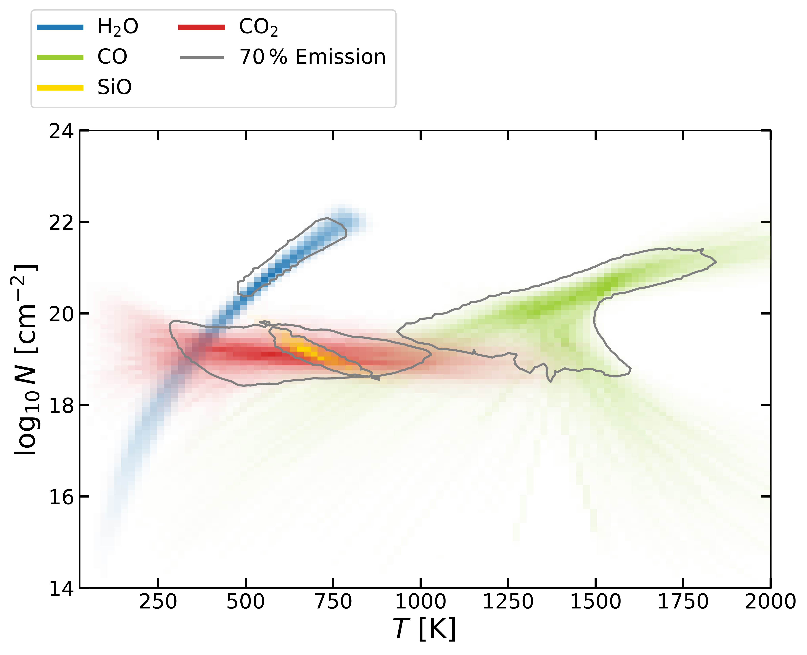

$\newcommand{\ensuremath}{}$
$\newcommand{\xspace}{}$
$\newcommand{\object}[1]{\texttt{#1}}$
$\newcommand{\farcs}{{.}''}$
$\newcommand{\farcm}{{.}'}$
$\newcommand{\arcsec}{''}$
$\newcommand{\arcmin}{'}$
$\newcommand{\ion}[2]{#1#2}$
$\newcommand{\textsc}[1]{\textrm{#1}}$
$\newcommand{\hl}[1]{\textrm{#1}}$
$\newcommand{\footnote}[1]{}$
$\newcommand{\thebibliography}{\DeclareRobustCommand{\VAN}[3]{##3}\VANthebibliography}$

# MINDS: The molecule-rich disc of the Herbig star HD 35929 revealed with JWST/MIRI

<mark>Appeared on: 2025-11-19</mark> -  _14 pages, 13 figures; accepted for publication in MNRAS_

T. Kaeufer, et al. -- incl., <mark>D. Gasman</mark>, <mark>T. Henning</mark>, <mark>G. Perotti</mark>, <mark>K. Schwarz</mark>

**Abstract:** Our knowledge of the chemical composition of the gas in the inner disc of intermediate-mass young stars is limited, due to the lack of suitable instrumentation. The launch of JWST has provided a significant improvement in our ability to probe gas in these inner discs.We analyse the gas composition and emitting conditions of the disc around HD 35929, a young intermediate-mass Herbig star, using MIRI/MRS data. Our goal is to constrain the chemistry and kinematics of the gas phase molecules detected in the inner disc.We use iSLAT to examine the observed molecular lines and DuCKLiNG to detect, fit, and analyse the molecular emission.We find gas phase $H_2$ O, CO, $CO_2$ , and OH in the disc, as well as HI recombination lines. Surprisingly, we also detect gas phase SiO in the fundamental $v$ =1-0 vibrational band. We derive column densities and temperature ranges of the detected species, arising from the inner $\sim0.2 \rm au$ , hinting towards a compact and very warm disc. The molecular column densities are much higher than found in lower mass T Tauri discs.In general, the molecular composition is consistent with an O-rich gas from which silicate-rich solids condense and the strong gas phase molecular line emission suggests a low dust opacity. The unexpected detection of gas phase SiO at the source velocity points to an incomplete condensation of rock forming elements in the disc, suggesting chemical disequilibrium and/or an underestimate of the gas kinetic temperature.

**Figure 3. -** Continuum subtracted MIRI spectrum, using the 4.9 - 25 $\mu$m wavelength range, but excluding the 10 $\mu$m silicate band region between 9.0 and 13.5 $\mu$m (excluded region marked in grey). Overplotted are the cumulative fluxes from $H_2$O, CO, SiO, $CO_2$, and \ce{OH} from the median probability model. A few unfitted atomic lines and the non-detection of \ce{^{13}CO2} are labelled. The apparent feature around $18.55 \rm \mu m$ can be traced back to a bad pixel artifact. (*fig:mol-fit*)

**Figure 5. -** Residual in the wavelength range dominated by SiO of the full fit compared to a water-only fit. (*fig:mol-sio-zoom*)

**Figure 6. -** Probability distribution of the molecular column densities and temperatures derived from the continuum subtracted MIRI spectrum. The colours show the emissions for the molecules listed in the legend, while the contours denote the region with the highest contribution to the respective molecular fluxes. (*fig:mol-con*)

