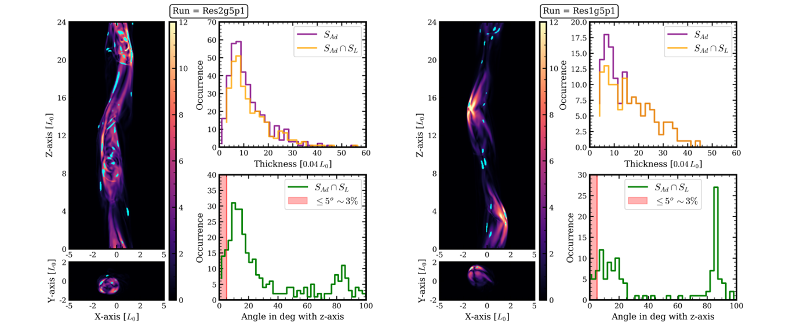
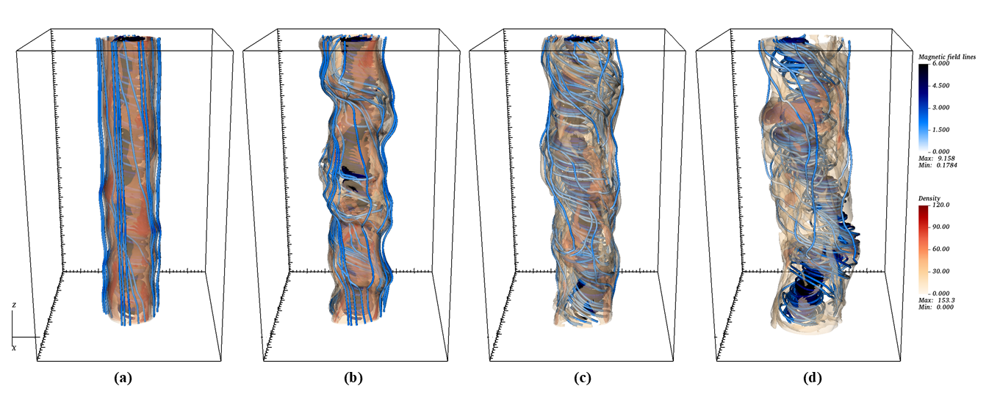

$\newcommand{\ensuremath}{}$
$\newcommand{\xspace}{}$
$\newcommand{\object}[1]{\texttt{#1}}$
$\newcommand{\farcs}{{.}''}$
$\newcommand{\farcm}{{.}'}$
$\newcommand{\arcsec}{''}$
$\newcommand{\arcmin}{'}$
$\newcommand{\ion}[2]{#1#2}$
$\newcommand{\textsc}[1]{\textrm{#1}}$
$\newcommand{\hl}[1]{\textrm{#1}}$
$\newcommand{\footnote}[1]{}$
$\newcommand{\ckd}[1]{\color{magenta}#1}$
$\newcommand{\vdag}{(v)^\dagger}$
$\newcommand$
$\newcommand$
$\newcommand{\arraystretch}{1.2}$
$\newcommand{\arraystretch}{1.2}$

# Role of magnetic reconnection in blazar variability using numerical simulation

<mark>Appeared on: 2025-11-26</mark> -  _Accepted for publication in ApJ_

C. K. Das, et al. -- incl., <mark>G. Mattia</mark>

**Abstract:** Fast $\gamma$ -ray variability in blazars remains a central puzzle in high-energy astrophysics, challenging standard shock acceleration models. Blazars, a subclass of active galactic nuclei (AGN) with jets pointed close to our line of sight, offer a unique view into jet dynamics. Blazar $\gamma$ -ray light curves exhibit rapid, high-amplitude flares that point to promising alternative dissipation mechanisms such as magnetic reconnection. This study uses three-dimensional relativistic magnetohydrodynamic (RMHD) and resistive relativistic magnetohydrodynamic (ResRMHD) simulations with the PLUTO code to explore magnetic reconnection in turbulent, magnetized plasma columns. Focusing on current-driven kink instabilities, we identify the formation of current sheets due to magnetic reconnection, leading to plasmoid formation. We develop a novel technique combining hierarchical structure analysis and reconnection diagnostics to identify reconnecting current sheets. A statistical analysis of their geometry and orientation reveals a smaller subset that aligns closely with the jet axis, consistent with the jet-in-jet model. These structures can generate relativistically moving plasmoids with significant Doppler boosting, offering a plausible mechanism for the fast flares superimposed on slowly varying blazar light curves. These findings provide new insights into the plasma dynamics of relativistic jets and strengthen the case for magnetic reconnection as a key mechanism in blazar $\gamma$ -ray variability.

**Figure 9. -** Spatial, thickness and angular distribution of identified current sheets for two different simulation runs; _left:_**Res2g5p1** at $t = 234   t_0$ and _right:_**Res1g5p1** at $t = 246   t_0$. For both the case the column 1 represents XZ- and XY- slice plot of current density profile overplotted with identified current sheets ($S_{Ad}   \cap   S_{L}$) from _Astrodendro+LoRD_ method (represented in cyan colour). Top right: Thickness distribution of identified current sheets form both _Astrodendro_ and _Astrodendro+LoRD_ method. Bottom left: Angular distribution of identified current sheets moving at different angle with Z-axis. (*fig:ResCombDistg5*)

**Figure 10. -** Spatial, thickness and angular distribution of identified current sheets for two different time steps for the simulation run; **Res0g10p1**_left:_ is at $t = 240   t_0$ and _right:_ is at $t = 258   t_0$. For both the case the column 1 represents XZ- and XY- slice plot of current density profile overplotted with identified current sheets ($S_{Ad}   \cap   S_{L}$) from _Astrodendro+LoRD_ method (represented in cyan colour). Top right: Thickness distribution of identified current sheets form both _Astrodendro_ and _Astrodendro+LoRD_ method. Bottom left: Angular distribution of identified current sheets moving at different angle with Z-axis. (*fig:NonResCombDistng10*)

**Figure 5. -** Three-dimensional visualization of magnetic field lines (colored using a blue-hot color scale in the unit of $B_0$) overlaid with isosurfaces of fluid density (orange-red color scale in the unit of $\rho_0$) at four different time steps for the simulation run **Res0g5p1**. The snapshots correspond to: (a) $t = 123   t_0$, (b) $t = 153   t_0$, (c) $t = 183   t_0$, and (d) $t = 213   t_0$. These time steps capture the evolution of the magnetic field and the development of kink instability within the jet. (*fig:Res0g5p1_MF_evolution*)

