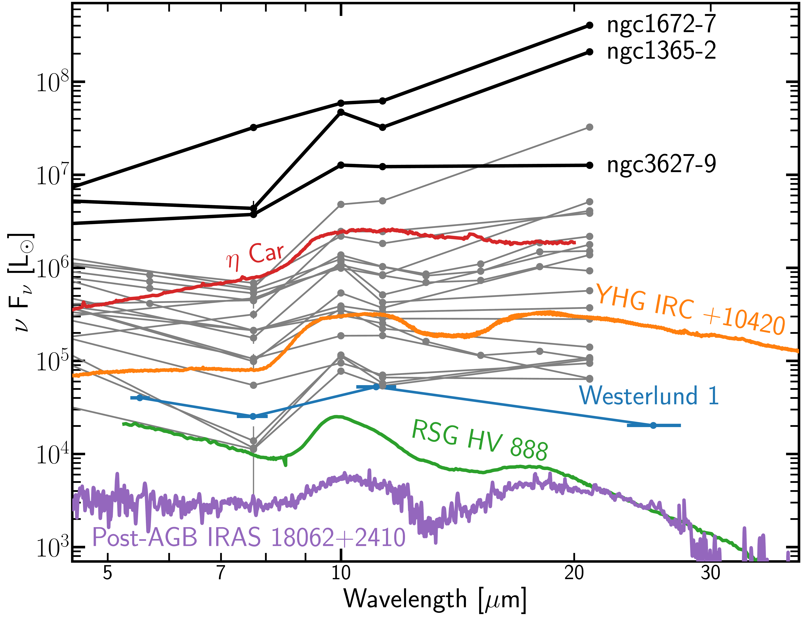

$\newcommand{\ensuremath}{}$
$\newcommand{\xspace}{}$
$\newcommand{\object}[1]{\texttt{#1}}$
$\newcommand{\farcs}{{.}''}$
$\newcommand{\farcm}{{.}'}$
$\newcommand{\arcsec}{''}$
$\newcommand{\arcmin}{'}$
$\newcommand{\ion}[2]{#1#2}$
$\newcommand{\textsc}[1]{\textrm{#1}}$
$\newcommand{\hl}[1]{\textrm{#1}}$
$\newcommand{\footnote}[1]{}$
$\newcommand{\vdag}{(v)^\dagger}$
$\newcommand$
$\newcommand$
$\newcommand{\Arizona}{\affil{Steward Observatory, University of Arizona, Tucson, AZ 85721, USA$
$}}$
$\newcommand{\GEMINI}{\affil{Gemini Observatory/NSF NOIRLab, 950 N. Cherry Avenue, Tucson, AZ, 85719, USA$
$}}$
$\newcommand{\ASCL}{\affil{Astrophysics Source Code Librar$
$y, Michigan Technological University, 1400 Townsend Drive, Houghton, MI 49931}}$
$\newcommand{\OSU}{\affil{Department of Astronomy, The Ohio State University, 140 West 18th Avenue, Columbus, Ohio 43210, USA}}$
$\newcommand{\Alberta}{\affil{Department of Physics, University of Alberta, Edmonton, AB T6G 2E1, Canada}}$
$\newcommand{\ANU}{\affil{Research School of Astronomy and Astrophysics, Australian National University, Canberra, ACT 2611, Australia}}$
$\newcommand{\IPARCOS}{\affil{Instituto de Física de Partículas y del Cosmos, Universidad Complutense de Madrid, E-28040 Madrid, Spain}}$
$\newcommand{\IPAC}{\affil{Caltech-IPAC, 1200 E. California Blvd. Pasadena, CA 91125, USA}}$
$\newcommand{\Caltech}{\affil{Caltech, 1200 E. California Blvd. Pasadena, CA 91125, USA}}$
$\newcommand{\Carnegie}{\affil{Observatories of the Carnegie Institution for Science, 813 Santa Barbara Street, Pasadena, CA 91101, USA}}$
$\newcommand{ÇAPP}{\affil{Center for Cosmology and Astroparticle Physics, 191 West Woodruff Avenue, Columbus, OH 43210, USA}}$
$\newcommand{\CfA}{\affil{Harvard-Smithsonian Center for Astrophysics, 60 Garden Street, Cambridge, MA 02138, USA}}$
$\newcommand{\CITEVA}{\affil{Centro de Astronomía (CITEVA), Universidad de Antofagasta, Avenida Angamos 601, Antofagasta, Chile}}$
$\newcommand{\CNRS}{\affil{CNRS, IRAP, 9 Av. du Colonel Roche, BP 44346, F-31028 Toulouse cedex 4, France}}$
$\newcommand{\ESO}{\affil{European Southern Observatory, Karl-Schwarzschild Stra{\ss}e 2, D-85748 Garching bei München, Germany}}$
$\newcommand{\Heidelberg}{\affil{Astronomisches Rechen-Institut, Zentrum für Astronomie der Universität Heidelberg, Mönchhofstra\ss e 12-14, D-69120 Heidelberg, Germany}}$
$\newcommand{\Cologne}{\affil{I. Physikalisches Institut, Universität zu Köln, Zülpicher Str. 77, D-50937 Köln, Germany}}$
$\newcommand{\ITA}{\affil{Universität Heidelberg, Zentrum für Astronomie, Institut für Theoretische Astrophysik, Albert-Ueberle-Str 2, D-69120 Heidelberg, Germany}}$
$\newcommand{\IWR}{\affil{Universität Heidelberg, Interdisziplinäres Zentrum für Wissenschaftliches Rechnen, Im Neuenheimer Feld 205, D-69120 Heidelberg, Germany}}$
$\newcommand{\ICRAR}{\affil{International Centre for Radio Astronomy Research, University of Western Australia, 35 Stirling Highway, Crawley, WA 6009, Australia}}$
$\newcommand{\IRAM}{\affil{Institut de Radioastronomie Millimétrique (IRAM), 300 Rue de la Piscine, F-38406 Saint Martin d'Hères, France}}$
$\newcommand{\IRAP}{\affil{CNRS, IRAP, 9 Av. du Colonel Roche, BP 44346, F-31028 Toulouse cedex 4, France}}$
$\newcommand{\UPS}{\affil{Université de Toulouse, UPS-OMP, IRAP, F-31028 Toulouse cedex 4, France}}$
$\newcommand{\JHU}{\affil{Department of Physics and Astronomy, The Johns Hopkins University, Baltimore, MD 21218, USA}}$
$\newcommand{\Leiden}{\affil{Leiden Observatory, Leiden University, P.O. Box 9513, 2300 RA Leiden, The Netherlands}}$
$\newcommand{\Maryland}{\affil{Department of Astronomy, University of Maryland, College Park, MD 20742, USA}}$
$\newcommand{\MPE}{\affil{Max-Planck-Institut für extraterrestrische Physik, Giessenbachstra{\ss}e 1, D-85748 Garching, Germany}}$
$\newcommand{\MPIA}{\affil{Max-Planck-Institut für Astronomie, Königstuhl 17, D-69117, Heidelberg, Germany}}$
$\newcommand{\Nagoya}{\affil{Department of Physics, Nagoya University, Furo-cho, Chikusa-ku, Nagoya, Aichi 464-8602, Japan}}$
$\newcommand{\NRAO}{\affil{National Radio Astronomy Observatory, 520 Edgemont Road, Charlottesville, VA 22903-2475, USA}}$
$\newcommand{\OAN}{\affil{Observatorio Astronómico Nacional (IGN), C/Alfonso XII, 3, E-28014 Madrid, Spain}}$
$\newcommand{\ObsParis}{\affil{Sorbonne Université, Observatoire de Paris, Université PSL, CNRS, LERMA, F-75014, Paris, France}}$
$\newcommand{\Princeton}{\affil{Department of Astrophysical Sciences, Princeton University, Princeton, NJ 08544 USA}}$
$\newcommand{\UToledo}{\affil{University of Toledo, 2801 W. Bancroft St., Mail Stop 111, Toledo, OH, 43606}}$
$\newcommand{\RitterToledo}{\affil{Ritter Astrophysical Research Center, University of Toledo, 2801 W. Bancroft St., MS 113, Toledo, OH, 43606}}$
$\newcommand{\Toulouse}{\affil{Université de Toulouse, UPS-OMP, IRAP, F-31028 Toulouse cedex 4, France}}$
$\newcommand{\UBonn}{\affil{Argelander-Institut für Astronomie, Universität Bonn, Auf dem Hügel 71, 53121 Bonn, Germany}}$
$\newcommand{\UChile}{\affil{Departamento de Astronomía, Universidad de Chile, Camino del Observatorio 1515, Las Condes, Santiago, Chile}}$
$\newcommand{\UCM}{\affil{Departamento de Física de la Tierra y Astrofísica, Universidad Complutense de Madrid, E-28040 Madrid, Spain}}$
$\newcommand{\UCSD}{\affil{Department of Astronomy and Astrophysics,  University of California,\ San Diego, 9500 Gilman Drive, La Jolla, CA 92093, USA}}$
$\newcommand{\ULyon}{\affil{Univ Lyon, Univ Lyon 1, ENS de Lyon, CNRS, Centre de Recherche Astrophysique de Lyon UMR5574,\ F-69230 Saint-Genis-Laval, France}}$
$\newcommand{\UMass}{\affil{University of Massachusetts—Amherst, 710 N. Pleasant Street, Amherst, MA 01003, USA}}$
$\newcommand{\UWyoming}{\affil{Department of Physics and Astronomy, University of Wyoming, Laramie, WY 82071, USA}}$
$\newcommand{\LAM}{\affil{$
$Aix Marseille Univ, CNRS, CNES, LAM (Laboratoire d’Astrophysique de Marseille),  F-13388 Marseille,$
$France}}$
$\newcommand{\UHawaii}{\affil{Institute for Astronomy, University of Hawaii, 2680 Woodlawn Drive, Honolulu, HI 96822, USA}}$
$\newcommand{\UGent}{\affil{Sterrenkundig Observatorium, Universiteit Gent, Krijgslaan 281 S9, B-9000 Gent, Belgium}}$
$\newcommand{\IPARC}{\affil{Instituto de Física de Partículas y del Cosmos IPARCOS, Facultad de Ciencias Físicas, Universidad Complutense de Madrid, E-28040, Spain}}$
$\newcommand{\STScI}{\affil{Space Telescope Science Institute, 3700 San Martin Drive, Baltimore, MD 21218, USA}}$
$\newcommand{\STScIESA}{\affiliation{AURA for the European Space Agency (ESA), Space Telescope Science Institute, 3700 San Martin Drive, Baltimore, MD 21218, USA}}$
$\newcommand{\ESA}{\affiliation{European Space Agency, c/o STScI, 3700 San Martin Drive, Baltimore, MD 21218, USA}}$
$\newcommand{\McMaster}{\affil{Department of Physics and Astronomy, McMaster University, Hamilton, ON L8S 4M1, Canada}}$
$\newcommand{\INAF}{\affil{INAF -- Osservatorio Astrofisico di Arcetri, Largo E. Fermi 5, I-50157, Firenze, Italy}}$
$\newcommand{\Sydney}{\affil{Sydney Institute for Astronomy, School of Physics A28, The University of Sydney, NSW 2006, Australia}}$
$\newcommand{\UA}{\affil{Centro de Astronomía (CITEVA), Universidad de Antofagasta, Avenida Angamos 601, Antofagasta, Chile}}$
$\newcommand{\LERMA}{\affil{Observatoire de Paris, PSL Research University, CNRS, Sorbonne Universités, 75014 Paris}}$
$\newcommand{\SAIMSU}{\affil{Sternberg Astronomical Institute, Lomonosov Moscow State University, Universitetsky pr. 13, 119234 Moscow, Russia}}$
$\newcommand{\UTA}{\affil{Instituto de Alta Investigación, Universidad de Tarapacá, Casilla 7D, Arica, Chile}}$
$\newcommand{\IAC}{\affil{Instituto de Astrofísica de Canarias, C/ Vía Láctea s/n, E-38205, La Laguna, Spain}}$
$\newcommand{\UNAM}{\affil{Instituto de Astronomía, Universidad Nacional Autónoma de México, Unidad Académica en Ensenada, Km 103 Carr. Tijuana−Ensenada, Ensenada, B.C.,$
$C.P. 22860, México}}$
$\newcommand{\ULL}{\affil{Departamento de Astrofísica, Universidad de La Laguna, Av. del Astrofísico Francisco Sánchez s/n, E-38206, La Laguna, Spain}}$
$\newcommand{ÅPF}{\altaffiliation{NSF Astronomy and Astrophysics Postdoctoral Fellow}}$
$\newcommand{\DECRA}{\altaffiliation{ARC DECRA Fellow}}$
$\newcommand{\Oxford}{\affil{Sub-department of Astrophysics, Department of Physics, University of Oxford, Keble Road, Oxford OX1 3RH, UK}}$
$\newcommand{\wesleyan}{\affil{Astronomy Department and Van Vleck Observatory, Wesleyan University, 96 Foss Hill Drive, Middletown, CT 06459, USA}}$
$\newcommand{\PLATA}{\affil{Instituto de Astrofísica de La Plata, CONICET--UNLP, Paseo del Bosque S/N, B1900FWA La Plata, Argentina }}$
$\newcommand{\ARC}{\affil{ARC Centre of Excellence for All Sky Astrophysics in 3 Dimensions (ASTRO 3D), Australia}}$
$\newcommand{\UVirginia}{\affil{University of Virginia Astronomy Department, 530 McCormick Road, Charlottesville, VA 22904, USA}}$
$\newcommand{\UniCA}{\affil{Université Côte d'Azur, Observatoire de la Côte d'Azur, CNRS, Laboratoire Lagrange, 06000, Nice, France}}$
$\newcommand{\CamIoA}{\affil{Institute of Astronomy, University of Cambridge, Madingley Road, Cambridge CB3 0HA, UK}}$
$\newcommand{\KICC}{\affil{Kavli Institute for Cosmology Cambridge, Madingley Road, Cambridge CB3 0HA, UK}}$
$\newcommand{\UOA}{\affil{Department of Physics, University of Arkansas, Fayetteville, AR 72701, USA}}$
$\newcommand{\ACSPS}{\affil{Arkansas Center for Space and Planetary Sciences, University of Arkansas, Fayetteville, AR 72701, USA}}$
$\newcommand{\JBCA}{\affil{UK ALMA Regional Centre Node, Jodrell Bank Centre for Astrophysics, Department of Physics and Astronomy, The University of Manchester, Oxford Road, Manchester M13 9PL, UK}}$
$\newcommand{\manchaster}{\affil{Jodrell Bank Centre for Astrophysics, Department of Physics and Astronomy, The University of Manchester, Oxford Road, Manchester M13 9PL, UK}}$
$\newcommand{\TAMU}{\affil{George P. and Cynthia W. Michell Institute for Fundamental Physics \& Astronomy, Texas A\&M University, College Station, TX, 77843, USA}}$
$\newcommand{\PMO}{\affil{Purple Mountain Observatory, Chinese Academy of Sciences, 10 Yuanhua Road, Nanjing 210023, China}}$
$\newcommand{\UNC}{\affil{Department of Physics and Astronomy, University of North Carolina, Chapel Hill, NC 27599-3255, US}}$

# Ashes of Creation: JWST Uncovers Silicate Dust in Massive Star Clusters

<mark>Appeared on: 2025-11-28</mark> -  _38 Pages, 13Figures, submitted to APJ_

D. Maschmann, et al. -- incl., <mark>E. Schinnerer</mark>

**Abstract:** Dust production is a fundamental aspect of the baryonic cycle of star formation. It is known that dust is injected into the interstellar medium during early star formation by supernovae and later on by evolved stars. From individual objects, these mechanisms are well understood, but the overall dust production in star clusters at different evolutionary stages is still challenging to quantify. We present 22 massive ( $>10^5 M_{\odot}$ ) extra galactic star clusters with ages between 3 and 100 Myr exhibiting a compact dust morphology seen with JWST-MIRI. We only find PAH features associated with one star cluster and nineteen have already cleared themselves from their natal dust. Their main characteristic is a significant enhancement at $10\mu m$ , which is likely due to silicate emission and cannot be explained by ionized gas. We discuss several possible explanations including dust production from evolved stars such as red super giants, more exotic star types like yellow hypergiants and luminous blue variable stars. Stochastic dust injection from supernovae or a single supernova in dense gas can also create significant silicate emission. However, for this scenario secondary tracers such as a X-ray signal are expected which we only observe in three star clusters. We find the most luminous $10\mu m$ emitter to be the three most massive star clusters ( $>10^6 M_{\odot}$ ) which is at least a magnitude stronger than any known stellar sources indicating a rare mechanism that only appears at extreme masses and a short lifetime.

**Figure 9. -** $10\mu$m excess, E$_{\rm 10\mu m}$, as a function of the absolute AB magnitude in the F1000W band, M$_{\rm F1000W}$. We show all detected sources in gray that have S/N$\geq 3$ in the F770W, F1000W and F1130W MIRI bands. In crowded regions we show grayscale contours to better visualize the density.
 All cross-matched star clusters from maschmann_phangs-hst_2024 are marked with black diamonds and sources that do not show any optical counterpart are marked with black circles.
 The black dashed line indicates the maximal value of E$_{\rm 10\mu m}$ that can be predicted by simple dust models as described in detail in Section \ref{sec:model_predict}.
 The $10\mu$m-emitters selected for this work are highlighted by red diamonds.
 For reference, we indicate with purple contours PAH-emitters that have been selected in rodriguez_tracing_2025, and with red, green and blue stars the stars categorized by \citet[][in prep.]{hassani25}. Orange stars indicate SNRs from the catalogs of winkler_optical_2021 and li_discovery_2024, and yellow markers show known stars exhibiting strong silicate features.
 In order to visualize the SED shape of PAH emitters and $10\mu$m emitters we show each of these objects in the top left and right, respectively: We show a $5$\arcsec$\times5\$arcsec_rgb_-cutout of the MIRI bands F770W (blue), F1000W (green), F1130W (red) and their corresponding SED.
  (*fig:excess*)

**Figure 4. -** Schematic presentation of how we compute the aperture correction grid for the MIRI F1000W band. On the top left we show the simulated PSF which was super-sampled by a factor of 4. In the top middle panel we show the PSF convolved with a Moffat function of a ${\rm FWHM}=9.29 {\rm pix}$. With a black circle we indicate the aperture in which we measure the flux fraction. With colored rectangles we show the position of 12 slits in which we measure the source profiles presented in the top right panel and fit a Gaussian function to the part inside the aperture marked by black dashed lines. In the bottom panel we show the grid of aperture radii and the mean Gaussian standard deviations $\overline{\sigma}$ measured from the slit profiles. Each circle represents one measurement and in the background we present the interpolated values. With a black star we show the position of the estimated value presented with the top panels. (*fig:phot_explain*)

**Figure 1. -** MIR SED in units of luminosity for all $10 \mu m$ emitting star clusters and selected stellar sources (See Sect. \ref{ssec:stars_milky}). We show the ISO spectra of the star systems $\eta$ Carinae, the YHG IRC+10420, the RSG HV 888 and the post-AGB star IRAS 18062+2410. We also show the SED points of the young star cluster Westerlund 1 observed with SOFIA.
 We display the SEDs of the star cluster sample with gray and highlight the three brightest star clusters with black thicker lines. (*fig:sed_lum*)

