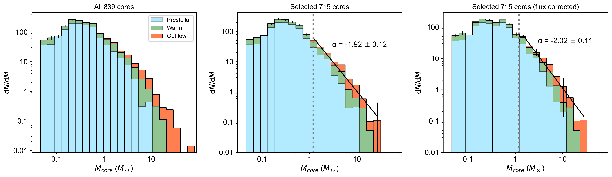

$\newcommand{\ensuremath}{}$
$\newcommand{\xspace}{}$
$\newcommand{\object}[1]{\texttt{#1}}$
$\newcommand{\farcs}{{.}''}$
$\newcommand{\farcm}{{.}'}$
$\newcommand{\arcsec}{''}$
$\newcommand{\arcmin}{'}$
$\newcommand{\ion}[2]{#1#2}$
$\newcommand{\textsc}[1]{\textrm{#1}}$
$\newcommand{\hl}[1]{\textrm{#1}}$
$\newcommand{\footnote}[1]{}$
$\newcommand{\red}[1]{\textcolor{red}{#1}}$
$\newcommand{\kms}{\mbox{km s^{-1}}}$
$\newcommand{\x}{\mbox{\times}}$
$\newcommand{\Msun}{\mbox{M_{\odot}}}$
$\newcommand{\Lsun}{\mbox{L_{\odot}}}$

# The ALMA Survey of 70 \textmu m Dark High-mass Clumps in Early Stages (ASHES).\ XIII. Core Mass Function, Lifetime, and Growth of Prestellar Cores

<mark>Appeared on: 2025-12-02</mark> -  _Accepted for Publication in ApJ., 18 pages, 10 figures_

K. Morii, et al. -- incl., <mark>H. Beuther</mark>

**Abstract:** The core mass function (CMF) of prestellar cores is essential for understanding the initial conditions of star and cluster formation. However, the universality of the CMF and its relationship to the initial mass function (IMF) remain unclear.We study the CMF in the earliest stage of high-mass star formation using 461 prestellar core candidates and 254 protostellar cores as a part of the ALMA Survey of 70 \textmu m Dark High-mass Clumps in Early Stages (ASHES).We find that prestellar core candidates tend to have lower masses than protostellar cores.We also find that the lifetime of prestellar cores is several times longer than the freefall time, although it approaches the freefall time as the core mass increases.The CMF, including both protostellar and prestellar cores, has a power-law slope of -2.05 $\pm$ 0.04, shallower than Salpeter's IMF slope of -2.35.Conversely, the CMF of gravitationally bound, prestellar cores has a steeper slope (-2.32 $\pm$ 0.30), indistinguishable from Salpeter's slope.This finding is consistent with observations in both low-mass star-forming regions and high-mass protoclusters, implying a universal core formation mechanism.The protostellar CMF with a larger maximum core mass can be reproduced by the prestellar CMF when an external gas infall is considered.The inferred mass infall rate is higher than the Bondi-Hoyle-Lyttleton accretion rate and follows a shallower mass dependence (smaller power-law index), more consistent with the tidal-lobe accretion.This may contribute to the evolution of CMFs seen in later stages.

**Figure 9. -** CMF of (left) the full sample, (middle) the selected sample, and (right) the selected sample corrected by the recoverable flux. The three different colors represent the evolutionary stages of cores: prestellar core candidates (light blue), warm core (green), and outflow core (orange).
    Each bin in the histogram represents the combined frequency from several stages, stacked to show the relative contribution of each dataset to the total count per bin. The worst 90\% completeness (1.2 $M_\odot$) is plotted in the middle and right panels. The results of power-law fit above 1.2 $M_\odot$ are also overplotted.  (*fig:cmf-all*)

**Figure 10. -** Core mass distributions of (a-c) prestellar core candidates and (d-f) gravitationally bound prestellar cores. Three columns show different plots in the form of (a, d)  differential CMFs, (b,e) cumulative CMFs, and (c, f) cumulative percentage of cores with $M_{\rm core}>M$, respectively. The best-fitting power-law index is plotted in each panel. The number of cores above 1.2 $M_\odot$ in each sample is shown.  (*fig:cmf_prebound*)

**Figure 1. -** Completeness analysis of synthetic cores embedded in the continuum image. Regions with completeness levels below 90\% at 1.2 $M_\odot$ are highlighted as colors in (a). In (b), the clumps with completeness levels below 90\% at 1.2 $M_\odot$ are excluded. The lines are colored in for the mass range with the completeness level higher than 50\%, which are used for flux correction.  (*fig:CMF_completeness*)

