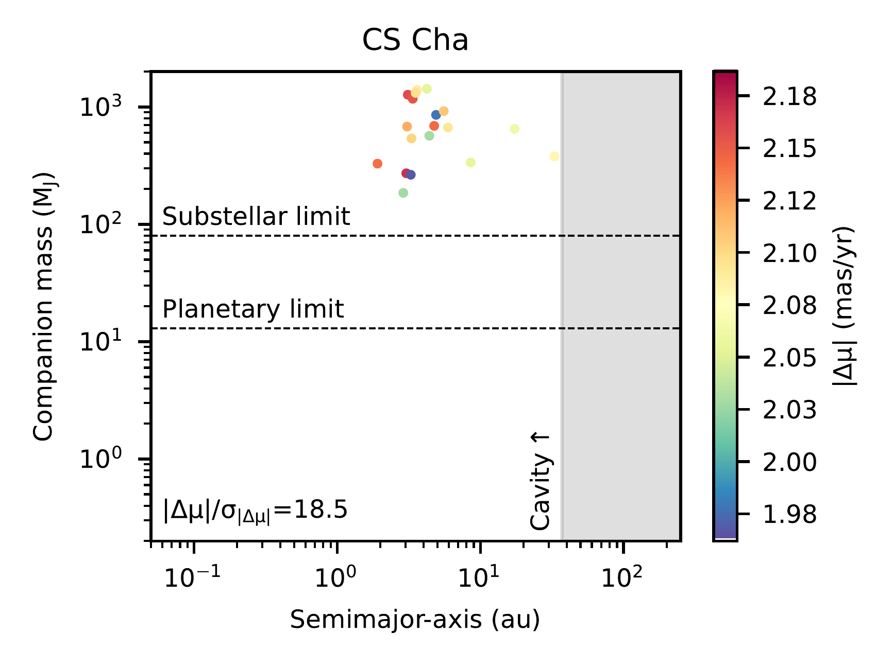
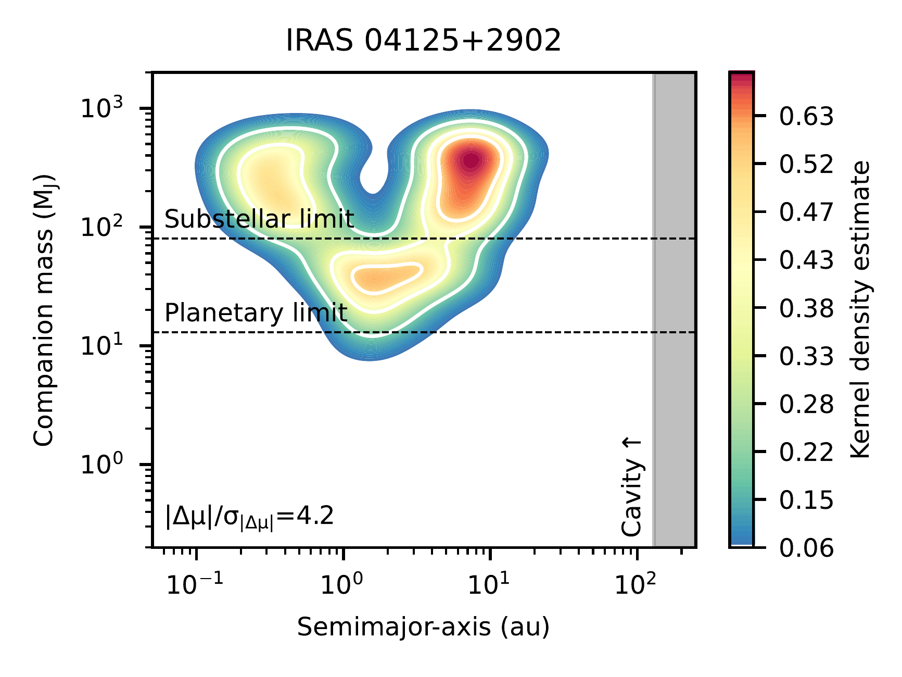
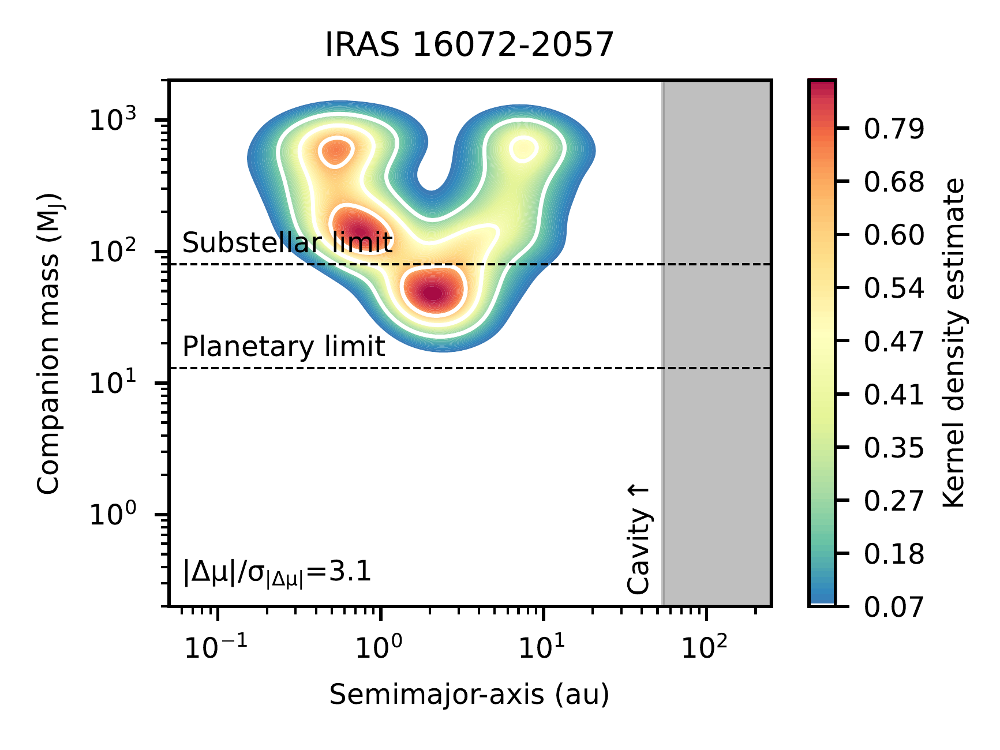
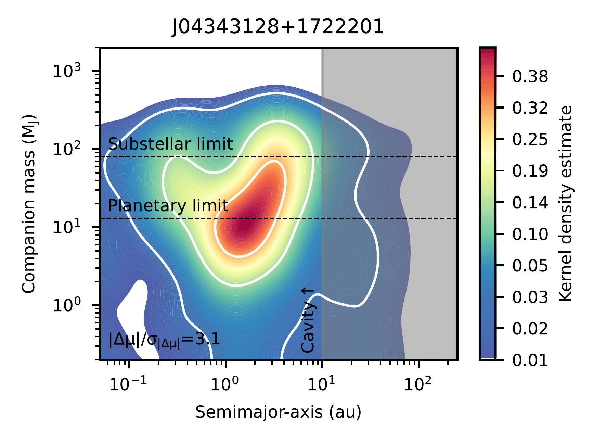
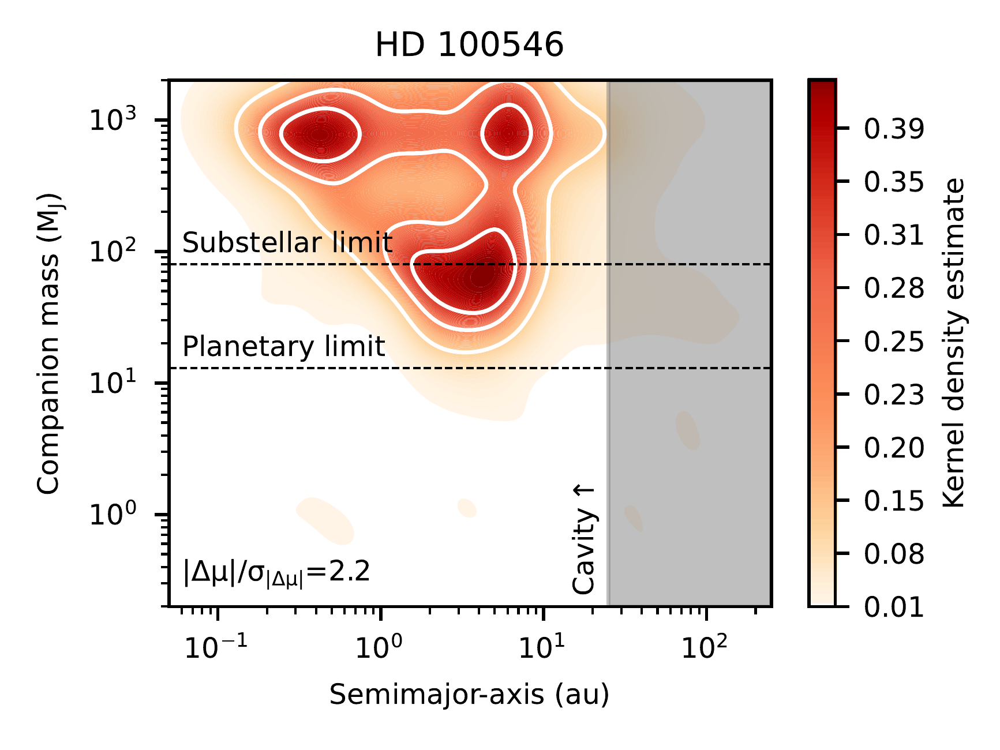
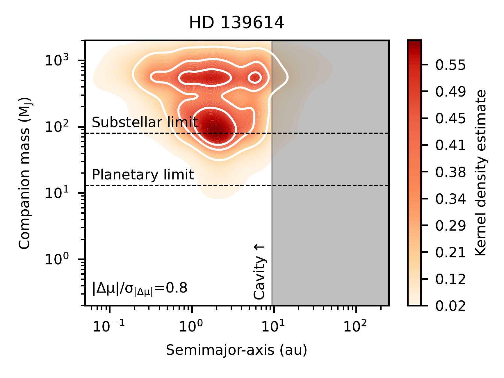
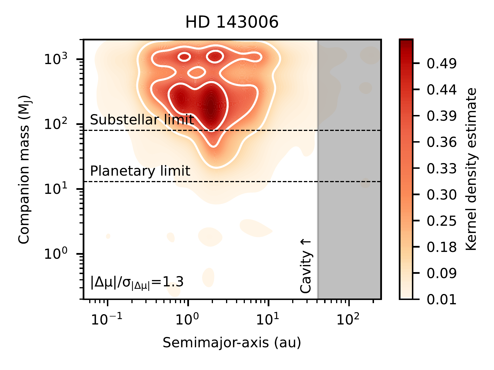
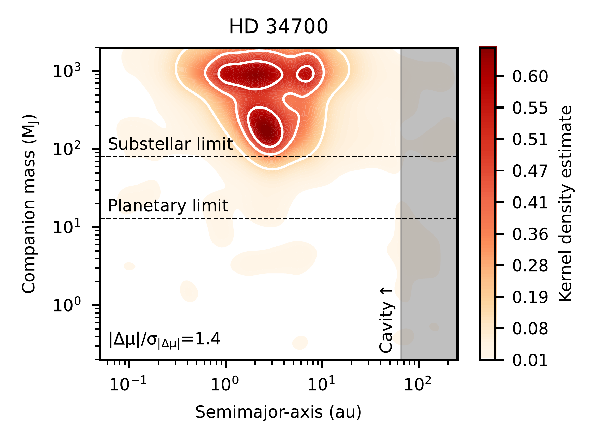
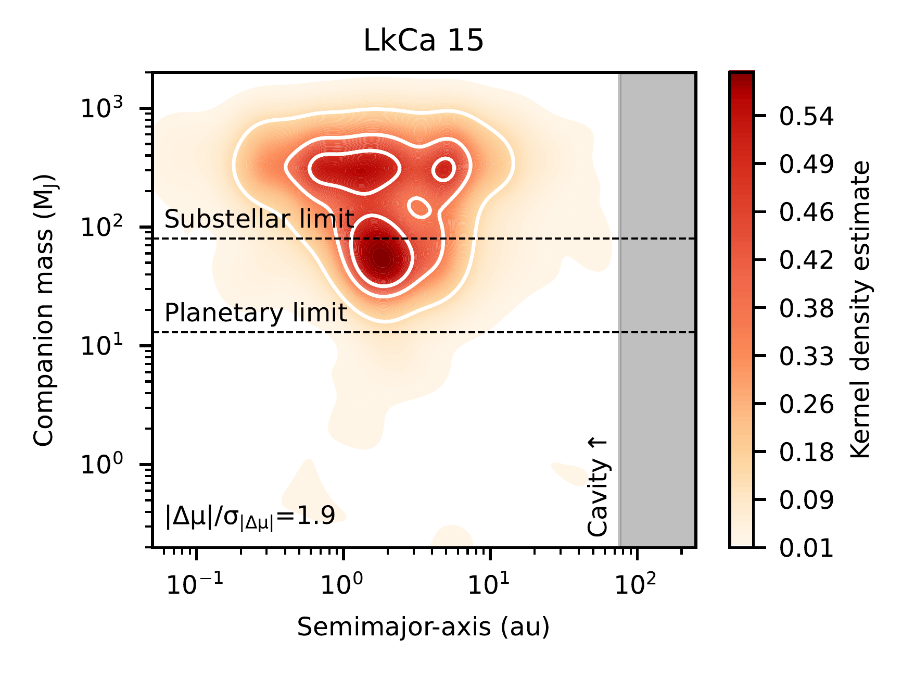

$\newcommand{\ensuremath}{}$
$\newcommand{\xspace}{}$
$\newcommand{\object}[1]{\texttt{#1}}$
$\newcommand{\farcs}{{.}''}$
$\newcommand{\farcm}{{.}'}$
$\newcommand{\arcsec}{''}$
$\newcommand{\arcmin}{'}$
$\newcommand{\ion}[2]{#1#2}$
$\newcommand{\textsc}[1]{\textrm{#1}}$
$\newcommand{\hl}[1]{\textrm{#1}}$
$\newcommand{\footnote}[1]{}$
$\newcommand{\textbf{}}[1]{#1}}$
$\newcommand{\arraystretch}{1.3}$
$\newcommand{\arraystretch}{1.3}$
$\newcommand{\arraystretch}{1.3}$

# Astrometric view of companions in the inner dust cavities of protoplanetary disks

<mark>Appeared on: 2025-12-02</mark> -  _Accepted for publication in A&A. Table A.1 is available in electronic form (Sect. 7)_

M. Vioque, et al. -- incl., <mark>M. Benisty</mark>

**Abstract:** Protoplanetary disks with inner dust cavities (often referred to as "transition disks") are potential signposts of planet formation. However, few companions have been identified within these cavities, and the role of companions in shaping them remains unclear. We use _Gaia_ astrometry to search for planetary and stellar companions in a sample of **98** transition disks, assessing the occurrence rate of such companions and their potential influence on cavity formation. For the **98** Young Stellar Objects (YSOs) with inner dust cavities, we compute _Gaia_ proper motion anomalies **which, together with the RUWE,** identify companions with mass ratios $q \gtrsim 0.01$ at $\sim$ 0.1--30 au. We assess the impact of disk gravity, accretion, disk-scattered light, dippers, **starspots** , jets, and outflows on the measured proper motion anomalies, concluding that these effects are unlikely to affect our analyses and that astrometric techniques such as the one of this work can be robustly applied to YSOs. Significant **proper motion** anomalies are found in 31 transition disks (32 \% of the sample), indicative of companions. We recover 85 \% of known companions within our sensitivity range. Assuming **that the astrometry of each system** is dominated by a single companion, we model the semi-major axis and mass required to reproduce the observed astrometric signals. Most inferred companions have $M > 30$ M $\rm{_{J}}$ , placing many within or near the stellar mass regime. Seven sources host companions compatible with a planetary mass ( $M < 13$ M $\rm{_{J}}$ , HD 100453, J04343128+1722201, J16102955-3922144, MHO6, MP Mus, PDS 70, and Sz 76). For the non-detections, we provide the companion masses and semi-major axes that can be excluded in future searches. About half (53 \% ) of detected companions cannot be reconciled with having carved the observed dust cavities. We have gathered evidence for the presence of companions in a large sample of transition disks. However, we find that the population of transition disks cannot be fully described as a circumbinary population. Transition disks host as many companions within our sensitivity range as do randomly sampled groups of YSOs and main-sequence stars. If dust cavities are shaped by companions, such companions must reside at larger orbital separations than those of the companions detected here, and we predict them to be of planetary mass.

**Figure 15. -** Orbital separation and companion mass that would produce the observed _Gaia_ astrometry for the 31 sources with a significant proper motion anomaly ($|\Delta \mu|/\sigma_{|\Delta \mu|} \geq 3$). GG Tau is not shown here because its companion could not be modelled. (*fig:all_detect*)

**Figure 18. -** Parameter space of orbital separations and companion masses that would produce either a significant _Gaia_ proper motion anomaly or a high RUWE value, for sources without a significant proper motion anomaly ($|\Delta \mu|/\sigma_{|\Delta \mu|} < 3$). These figures indicate the companion separation–mass parameter space in which a companion dominating the astrometric signal can be excluded. (*fig:all_non_detect*)

**Figure 7. -** Parameter space of orbital separations and companion masses that would produce either a significant _Gaia_ proper motion anomaly or a **higher-than-observed** RUWE value in LkCa 15 **and WISPIT 2**, smoothed with a kernel density estimate (contours indicate the 20, 50, and 80\% levels of the normalised area). These regions can be discarded as hosting a companion **dominating the astrometry**(Sect. \ref{s_nondetections}, Eqs. \ref{eq_6}, \ref{eq_7}).** For WISPIT 2, the confirmed (at $\sim$57 au, \citealp{2025ApJ...990L...8V**) and proposed (at $\sim$15 au, \citealp{2025ApJ...990L...9C}) planetary mass companions are indicated}. Similar plots for all other **65****systems with** non-detections are shown in Fig. \ref{fig:all_non_detect}. (*fig_LkCa15*)

