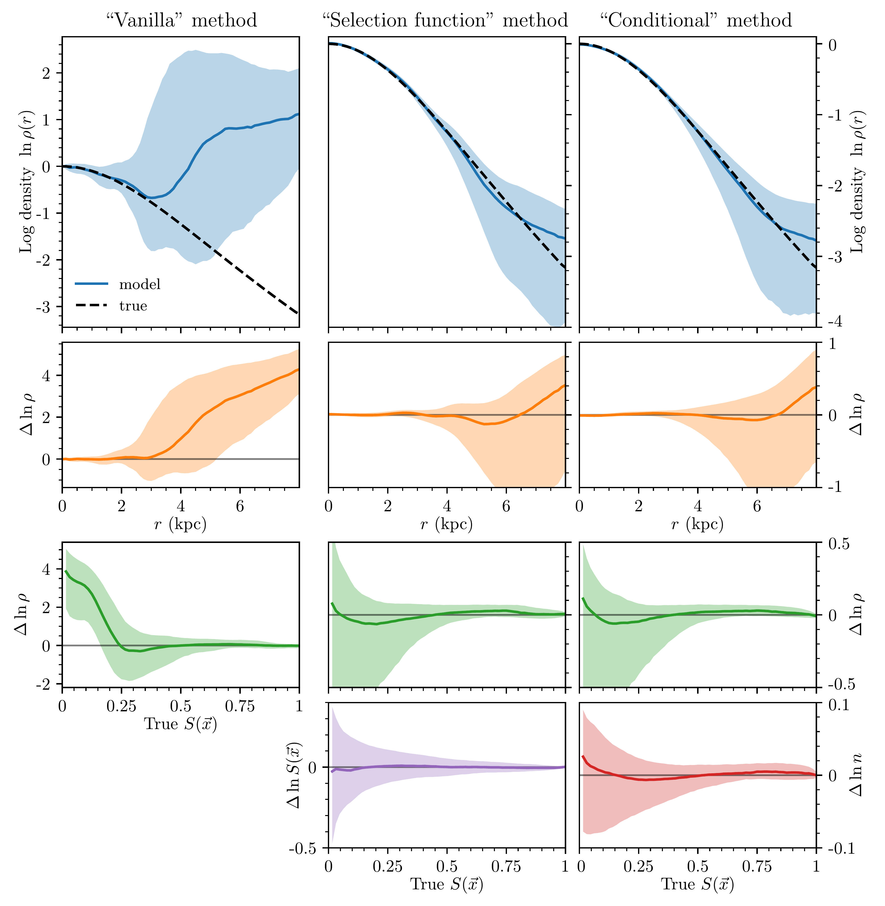

$\newcommand{\ensuremath}{}$
$\newcommand{\xspace}{}$
$\newcommand{\object}[1]{\texttt{#1}}$
$\newcommand{\farcs}{{.}''}$
$\newcommand{\farcm}{{.}'}$
$\newcommand{\arcsec}{''}$
$\newcommand{\arcmin}{'}$
$\newcommand{\ion}[2]{#1#2}$
$\newcommand{\textsc}[1]{\textrm{#1}}$
$\newcommand{\hl}[1]{\textrm{#1}}$
$\newcommand{\footnote}[1]{}$
$\newcommand{\twocolswitch}[2]{#1}$
$\newcommand{\twocolswitch}[2]{#2}$

# Determining the Milky Way gravitational potential without selection functions

<mark>Appeared on: 2025-12-03</mark> -  _13 pages, 5 figures_

<mark>T. Kalda</mark>, G. M. Green

**Abstract:** Selection effects, such as interstellar extinction and varying survey depth, complicate efforts to determine the gravitational potential -- and thus the distribution of baryonic and dark matter -- throughout the Milky Way galaxy using stellar kinematics. We present a new variant of the "Deep Potential" method of determining the gravitational potential from a snapshot of stellar positions and velocities that does not require any modeling of spatial selection functions. Instead of modeling the full six-dimensional phase-space distribution function $f\left(\vec{x},\vec{v}\right)$ of observed kinematic tracers, we model the conditional velocity distribution $p\left(\vec{v}\mid\vec{x}\right)$ , which is unaffected by a purely spatial selection function. We simultaneously learn the gravitational potential $\Phi\left(\vec{x}\right)$ and the underlying spatial density of the entire tracer population $n\left(\vec{x}\right)$ -- including unobserved stars -- using the collisionless Boltzmann equation under the stationarity assumption. The advantage of this method is that unlike the spatial selection function, all of the quantities we model, $p\left(\vec{v}\mid\vec{x}\right)$ , $\Phi\left(\vec{x}\right)$ , and $n\left(\vec{x}\right)$ , typically vary smoothly in both position and velocity. We demonstrate that this "conditional" Deep Potential method is able to accurately recover the gravitational potential in a mock dataset with a complex three-dimensional dust distribution that imprints fine angular structure on the selection function. Because we do not need to model the spatial selection function, our new method can effectively scale to large, complex datasets while using relatively few parameters, and is thus well-suited to _Gaia_ data.

**Figure 2. -** Two-dimensional slices (the $z = 0$ plane) through the three-dimensional dust extinction density (left) and integrated extinction (as viewed from the origin; middle left), the resulting selection function (middle right), and the observed spatial distribution of stars (right). The observer is assumed to be at the origin. Dust extinction imprints fine angular structure on the selection function and the observed spatial distribution of stars, which can be difficult to capture with neural networks. (*fig:mock_data*)

**Figure 3. -** The gravitational densities ($\rho = \nabla^2 \Phi / 4 \pi G$) and their residuals (vs. the true densities), as recovered by the three variants of Deep Potential. **Top row:**$\ln \rho$ as a function of radius $r$, with the solid curves showing the median (in spherical shells) and the shaded envelopes enclosing the 16th to 84th percentiles. The dotted curves show the true density. **Second row:** Residuals $\Delta \ln \rho = \ln \rho_{\mathrm{model}} - \ln \rho_{\mathrm{true}}$ as a function of $r$. **Third row:** Residuals as a function of the true selection function $S\left(\vec{x}\right)$, illustrating the deterioration in the recovered density as the fraction of stars observed decreases. **Bottom row:** Residuals in the selection function $S\left(\vec{x}\right)$(as recovered by the "selection function" method) and true spatial density of tracers $n\left(\vec{x}\right)$(as recovered by the "conditional" method), each as a function of the true $S\left(\vec{x}\right)$. In the top three rows, the vertical axes are the same for the "selection function" and "conditional" methods. (*fig:model_marginals*)

**Figure 5. -** Sky plots of the "selection function" method's prediction of the selection function $S(\vec x)$, the true selection function, and their fractional residuals on the surface of a sphere of radius \SI{4}{kpc}, centered on the mock observer. Areas with $S_\mathrm{true} < 0.01$ are masked. The differences can be attributed to shot noise in areas of low completeness, and to the difficulty of capturing fine angular structure with a neural network. Nevertheless, with a mock selection function with structure down to $\sim$0.25 kpc scales, our selection-function implementation performs well, albeit at the cost of large model sizes (here, $\sim$1.4 million parameters). (*fig:selfn_mw_comparison*)

