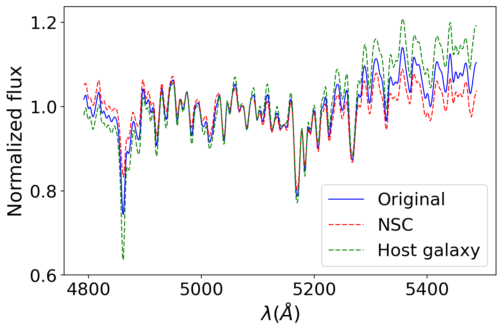
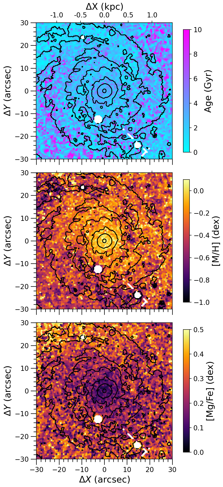

$\newcommand{\ensuremath}{}$
$\newcommand{\xspace}{}$
$\newcommand{\object}[1]{\texttt{#1}}$
$\newcommand{\farcs}{{.}''}$
$\newcommand{\farcm}{{.}'}$
$\newcommand{\arcsec}{''}$
$\newcommand{\arcmin}{'}$
$\newcommand{\ion}[2]{#1#2}$
$\newcommand{\textsc}[1]{\textrm{#1}}$
$\newcommand{\hl}[1]{\textrm{#1}}$
$\newcommand{\footnote}[1]{}$
$\newcommand{\pymusepipe}{\textsc{pymusepipe}}$
$\newcommand{\pyneb}{\textsc{pyneb}}$
$\newcommand{\ppxf}{\textsc{pPXF}}$
$\newcommand{\powerlaw}{\textsc{powerlaw}}$
$\newcommand{\DrSFMS}{\Delta rSFMS}$
$\newcommand{\DrKS}{\Delta rKS}$
$\newcommand{\DrMGMS}{\Delta rMGMS}$
$\newcommand{\rSFMS}{rSFMS}$
$\newcommand{\rKS}{rKS}$
$\newcommand{\rMGMS}{rMGMS}$
$\newcommand{\Htwo}{\ensuremath{\mathrm{H_{2}}}}$
$\newcommand{\OIII}{\textup{[O \textsc{iii}]}}$
$\newcommand{\OII}{\textup{[O \textsc{ii}]}}$
$\newcommand{\OI}{\textup{[O \textsc{i}]}}$
$\newcommand{\NII}{\textup{[N \textsc{ii}]}}$
$\newcommand{\SII}{\textup{[S \textsc{ii}]}}$
$\newcommand{\SIII}{\textup{[S \textsc{iii}]}}$
$\newcommand{\HII}{\textup{H \textsc{ii}}}$
$\newcommand{\Ha}{\textup{H}\ensuremath{\alpha}}$
$\newcommand{\Hb}{\textup{H}\ensuremath{\beta}}$
$\newcommand{\re}{R_\mathrm{e}}$
$\newcommand{\Te}{T_\mathrm{e}}$
$\newcommand{\Rtwentyfive}{R_{25}}$
$\newcommand{\SHa}{\Sigma_{\mathrm{H\alpha}}}$
$\newcommand{\SHtwo}{\Sigma_{\mathrm{H_{2}}}}$
$\newcommand{\SMstar}{\Sigma_{\mathrm{M_{*}}}}$
$\newcommand{\Ssfr}{\ensuremath{\Sigma_{\mathrm{SFR}}}}$
$\newcommand{\HIIphot}{\textsc{\HIIphot}}$
$\newcommand{\Lmin}{L_\mathrm{min}}$
$\newcommand{\msun}{ M_{\sun}}$
$\newcommand{\MPIA}{\label{MPIA}Max-Planck-Institut für Astronomie, Königstuhl 17, D-69117, Heidelberg, Germany}$
$\newcommand{\IAC}{\label{IAC}Instituto de Astrofísica de Canarias, calle Vía Láctea s/n, E-38205 La Laguna, Tenerife, Spain}$
$\newcommand{\ULL}{\label{ULL}Departamento de Astrofísica, Universidad de La Laguna, Avenida Astrofísico Francisco Sánchez s/n, E-38206 La Laguna, Spain}$
$\newcommand{\UCA}{\label{UCA}Université C\^ote d'Azur, Observatoire de la C\^ote d'Azur, CNRS, Laboratoire Lagrange, 06000, Nice, France}$
$\newcommand{\UWyoming}{\label{UWyoming}Department of Physics and Astronomy, University of Wyoming, Laramie, WY 82071, USA}$
$\newcommand{\stromlo}{\label{stromlo}Research School of Astronomy and Astrophysics, Australian National University, Mt Stromlo Observatory, Weston Creek, ACT 2611, Australia}$
$\newcommand{\ITA}{\label{ITA}Universität Heidelberg, Zentrum für Astronomie, Institut für Theoretische Astrophysik, Albert-Ueberle-Str 2, D-69120 Heidelberg, Germany}$
$\newcommand{\IWR}{\label{IWR}Universität Heidelberg, Interdisziplinäres Zentrum für Wissenschaftliches Rechnen, Im Neuenheimer Feld 205, D-69120 Heidelberg, Germany}$
$\newcommand{\OAN}{\label{OAN}Observatorio Astronómico Nacional (IGN), C/Alfonso XII, 3, E-28014 Madrid, Spain}$
$\newcommand{\JBCfA}{\label{JBCfA}UK ALMA Regional Centre Node, Jodrell Bank Centre for Astrophysics, Department of Physics and Astronomy, The University of Manchester, Oxford Road, Manchester M13 9PL, UK}$
$\newcommand{\ADOhio}{\label{ADOhio}Astronomy Department, The Ohio State University, Columbus, Ohio, USA$
$}$
$\newcommand{ÇOhio}{\label{CCOhio}Center for Cosmology and Astro-Particle Physics, The Ohio State University, Columbus, Ohio, USA$
$}$
$\newcommand{\deg}{\mbox{^{\circ}}}$
$\newcommand\fp{#1}$
$\newcommand\fpcut{#1}$

# The Nuclear Star Cluster of M 74: a fossil record of the very early stages of a star-forming galaxy

<mark>Appeared on: 2025-12-04</mark> -  _13 pages, 8 figures. Currently under the revision process in A&A after positive referee report_

F. Pinna, et al. -- incl., <mark>N. Hoyer</mark>, <mark>N. Neumayer</mark>, <mark>E. Schinnerer</mark>

**Abstract:** Nuclear star clusters (NSC) are dense and compact stellar systems, of sizes of few parsecs, located at galactic centers.Their properties and formation mechanisms seem to be tightly linked to the evolution of the host galaxy, with potentially different formation channels for late- and early-type galaxies (respectively, LTGs and ETGs). While most observations target ETGs, here we focus on the NSC in M 74 (NGC 628), a relatively massive, gas-rich and star-forming spiral galaxy, part of the PHANGS survey. We analyzed the central arcmin of the PHANGS-MUSE mosaic, in which the NSC is not spatially resolved.We performed a two-dimensional spectro-photometric decomposition of the MUSE cube, employing a modified version of the C2D code, to disentangle the NSC from the host galaxy.Here we used three components: a bulge, a disk and a NSC approximated to the point spread function (PSF), obtaining three data cubes, one for each component. This allowed us to extract separately the age, metallicity and [ Mg/Fe ] abundance for the NSC and the host galaxy.Our results show a very old and metal-poor NSC, in contrast to the surrounding regions. While similar properties were found in NSCs hosted by galaxies of different masses and/or morphological types from M 74, they are somewhat unexpected for a relatively massive star-forming spiral galaxy. The spatially resolved stellar populations of the host galaxy display much younger (light-weighted) ages and higher metallicities, especially in the central region ( ${\sim}500$ pc) surrounding the NSC. This suggests that this NSC formed a long time ago, and evolved passively until today, without any further growth. Our results show that the NSC was not involved in the active recent star-formation history of its host galaxy.

**Figure 2. -** Spectra obtained by integrating, within an aperture of $1\sigma$ of the PSF, the prepared (_ original_) data cube before the spectrophotometric decomposition (_ blue solid_), the _ NSC_ data cube (_ red dashed_), and the _ host-galaxy_ data cube (_ green dashed_).
 (*fig:spectra*)

**Figure 3. -** Stellar population maps of the host-galaxy component of M 74, after subtracting the NSC. From top to bottom: light-weighted mean age, total metallicity [M/H] and [Mg/Fe] abundance. Masked regions are depicted in white and isophotal contours in black. The physical scale is given as a reference in the top $X$ axis.
 (*fig:host_pop_maps*)

**Figure 6. -** Stellar population maps of the central arcmin of M 74, extracted from the integrated data cube. From top to bottom: mean age, total metallicity [M/H] and [Mg/Fe] abundance. Masked regions are depicted in white and isophotal contours in black. The physical scale is given as a reference in the top $X$ axes.
 (*fig:orig_pop_maps*)

