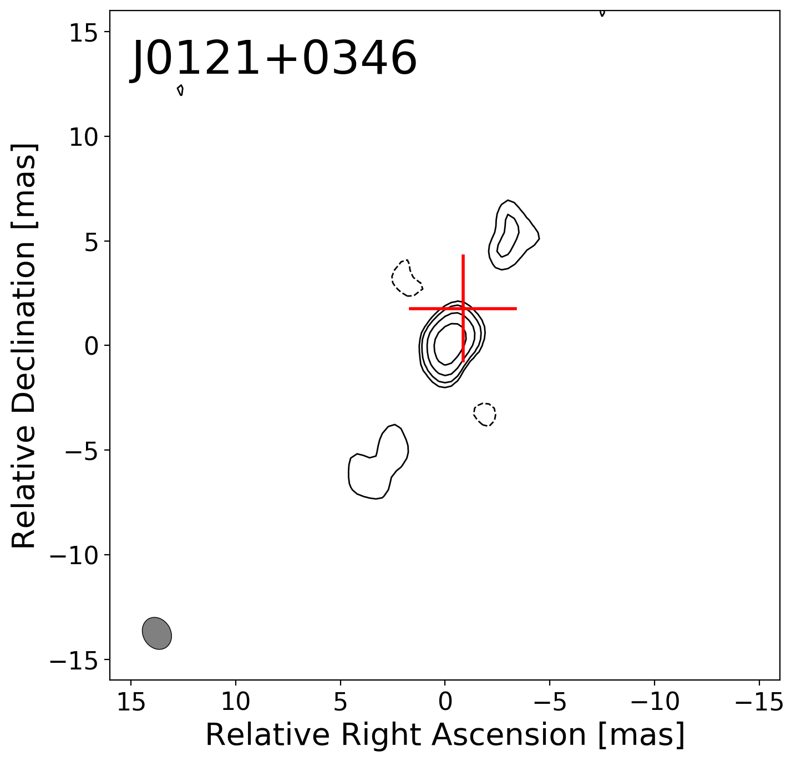

$\newcommand{\ensuremath}{}$
$\newcommand{\xspace}{}$
$\newcommand{\object}[1]{\texttt{#1}}$
$\newcommand{\farcs}{{.}''}$
$\newcommand{\farcm}{{.}'}$
$\newcommand{\arcsec}{''}$
$\newcommand{\arcmin}{'}$
$\newcommand{\ion}[2]{#1#2}$
$\newcommand{\textsc}[1]{\textrm{#1}}$
$\newcommand{\hl}[1]{\textrm{#1}}$
$\newcommand{\footnote}[1]{}$
$\newcommand{\vdag}{(v)^\dagger}$
$\newcommand$
$\newcommand$
$\newcommand$
$\newcommand$

# Milliarcsecond-resolution Radio Imaging Survey of Blazar Candidates at 4 < z < 5.4

<mark>Appeared on: 2026-01-12</mark> -  _Published in The Astrophysical Journal Supplement Series_

M. Krezinger, et al. -- incl., <mark>S. Belladitta</mark>

**Abstract:** We present a milliarcsecond-resolution radio survey of 17 high-redshift ( $4 \leq z \leq 5.4$ ) blazar candidates observed with the European Very Long Baseline Interferometry (VLBI) Network at 5 GHz. The primary objective of this study was to investigate the nature of these distant active galactic nuclei (AGN) and to confirm their blazar nature. Utilizing the technique of VLBI, we obtained high-resolution radio images of compact core and core--jet structures. To confirm the classification of these sources, we collected multi-band archival data, including total radio flux densities from single-dish and low-resolution interferometric surveys, optical astrometric positions from _Gaia_ , and X-ray data. These diagnostics collectively help distinguish between blazars and misaligned jetted AGN. We were able to measure the core brightness temperatures and found that 11 objects show the Doppler-boosted emission expected from blazars. For five additional sources, we do not see evidence of Doppler boosting even if X-ray data suggest that the source is a blazar. These could be either borderline objects or variability may have affected the classifications, considering that VLBI and X-ray data are not simultaneous. Finally, for the two remaining objects the data suggest a non-blazar classification. Our findings confirm that a significant fraction of these high-redshift radio-loud quasars are blazars and mainly characterized by compact core structures. Overall, the VLBI classifcations are consistent with the X-ray classes. This study further increases the sample of VLBI-imaged radio quasars at $z \geq 4$ by $\sim 10\%$ , offering valuable on the population of AGN in the early Universe.

**Figure 2. -** Naturally weighted $5$-GHz EVN images of $17$ high-redshift quasars. The lowest contours are drawn at $\pm3$ times the image noise, the positive contours increase by a factor of 2. The restoring beam is shown in the bottom-left corner. Table \ref{tab:imgparams} contains the image parameters and the coordinates corresponding to the image centers. Red crosses mark the _Gaia_ DR3 optical position in the cases where it is available. The size of the crosses indicates the $3\sigma_{\mathrm{pos}}$ uncertainty. (*fig:imgs*)

**Figure 1. -** The $\tilde{\alpha}_{\rm ox}-T_{\rm b,5 GHz}$ diagnostic plot (*fig:aox-tb*)

**Figure 5. -** Radio contiuum spectra of the target sources. Black points indicate total flux density data from single-dish and low-resolution interferometric measurements. The black dashed lines show the best-fit spectrum (power-law or log-parabolic). The shaded area indicates the $1\sigma$ error of the fits. The blue filled diamonds are the VLBI flux densities, while the empty diamonds are the $5$-GHz EVN measurements reported in this paper. The parameters of the spectral fits are given in the insets as well as in Table \ref{tab:phyparams}, and the individual spectral points with references are listed in Table \ref{tab:sed}. (*fig:spec*)

