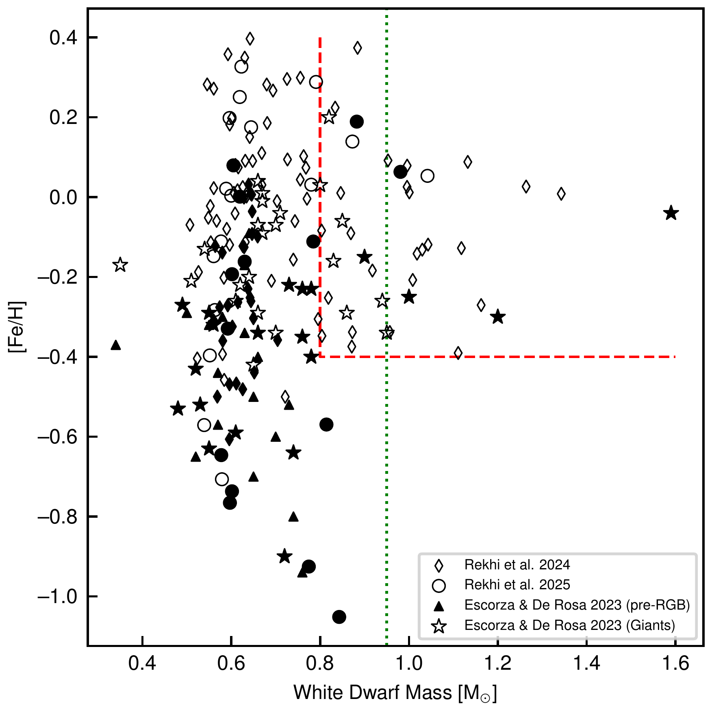
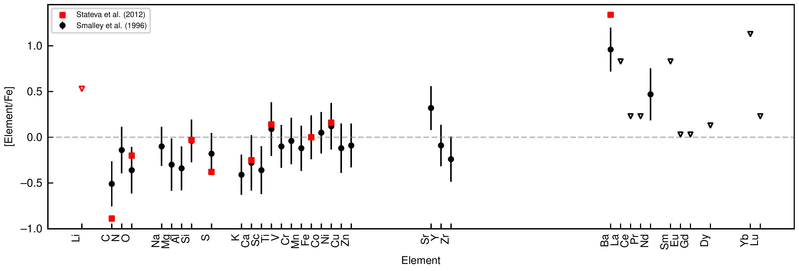

$\newcommand{\ensuremath}{}$
$\newcommand{\xspace}{}$
$\newcommand{\object}[1]{\texttt{#1}}$
$\newcommand{\farcs}{{.}''}$
$\newcommand{\farcm}{{.}'}$
$\newcommand{\arcsec}{''}$
$\newcommand{\arcmin}{'}$
$\newcommand{\ion}[2]{#1#2}$
$\newcommand{\textsc}[1]{\textrm{#1}}$
$\newcommand{\hl}[1]{\textrm{#1}}$
$\newcommand{\footnote}[1]{}$
$\newcommand{\vdag}{(v)^\dagger}$
$\newcommand$
$\newcommand$
$\newcommand{\msun}{M_\odot}$
$\newcommand{\rsun}{R_\odot}$
$\newcommand{\kms}{km s^{-1}}$
$\newcommand{\thebibliography}{\DeclareRobustCommand{\VAN}[3]{##3}\VANthebibliography}$

# IK Pegasi and the Double Merger Path to Type Ia Supernovae

<mark>Appeared on: 2026-01-15</mark> -  _ApJL, in press_

N. Hallakoun, et al. -- incl., <mark>S. Shahaf</mark>, <mark>H.-W. Rix</mark>

**Abstract:** Recent Gaia astrometry has revealed thousands of main-sequence $+$ white-dwarf binaries (MS $+$ WD) at separations of ${\sim} 0.1$ -- $10$ au, including a subset hosting unusually massive ( $\gtrsim 0.8$ $\msun$ ) WDs. We argue that _s_ -process enrichment in the non-degenerate companion provides a powerful diagnostic for identifying WDs that formed via mergers in hierarchical triple systems. For a massive WD, standard single-star evolution requires a massive ( $\gtrsim 4$ $\msun$ ) progenitor, yet such progenitors produce negligible _s_ -process yields. We define $*IK Peg--type*$ systems as those exhibiting this mass--yield tension: barium-enhanced companions orbiting WDs too massive to have descended from efficient _s_ -process producers. The well-known system IK Peg exemplifies this class. Applying this framework to published spectroscopic data reveals several additional candidates, and we estimate that a few dozen such systems should exist in the current Gaia sample. If these systems trace inner-binary mergers in primordial triples, they represent observable intermediate stages towards eventual Type Ia supernovae via the double-merger pathway, as predicted by recent population-synthesis models.

**Figure 1. -** The relationship between WD mass, companion metallicity, and Ba abundance. Gaia MS+WD systems with measured Ba abundances are plotted as diamonds \citep{Rekhi_2024} and circles \citep{Rekhi_2026}. Known Ba dwarfs (pre-red giant branch; pre-RGB) hosting WD companions from \citet{Escorza_2023} are shown as triangles, while star symbols denote Ba giants. Filled symbols indicate Ba-enriched systems, defined as $\text{[Ba/Fe]} > +0.25$ for the \citet{Rekhi_2024, Rekhi_2026} samples, or classified as Ba dwarfs/strong Ba giants in the \citet{Escorza_2023} sample. The red dashed line delineates the tentative empirical limit beyond which barium enrichment is inconsistent with a single-progenitor scenario. The green dotted line marks the most conservative limit, based on single-progenitor evolution models (see Figure \ref{fig:BaFeVsMwd}). (*fig:Mwd_FeH_BaFe*)

**Figure 2. -** Maximal [Ba/Fe] abundance attained during the AGB phase for metallicities $\text{[Fe/H]} \approx -0.7$\citep{Karakas_2018}, $-0.3$, $0$, and $+0.3$\citep{Karakas_2016}, plotted against the final WD mass of a single progenitor using the \citet{Cunningham_2024} IFMR. For comparison, the positions of IK Peg (star) and the IK Peg--type candidate Gaia DR3 5550946678313327744 (diamond; \citealt{Rekhi_2026}) are indicated. Both systems have near-Solar metallicity. (*fig:BaFeVsMwd*)

**Figure 8. -** IK Peg A element abundance relative to iron, from \citet[][black circles; $\text{[Fe/H]}=+0.17\pm0.17$]{Smalley_1996}, and from \citet[][red squares; $\text{[Fe/H]}=+0.07$]{Stateva_2012}. Open triangles mark upper limits. (*fig:IKPegAbundances*)

