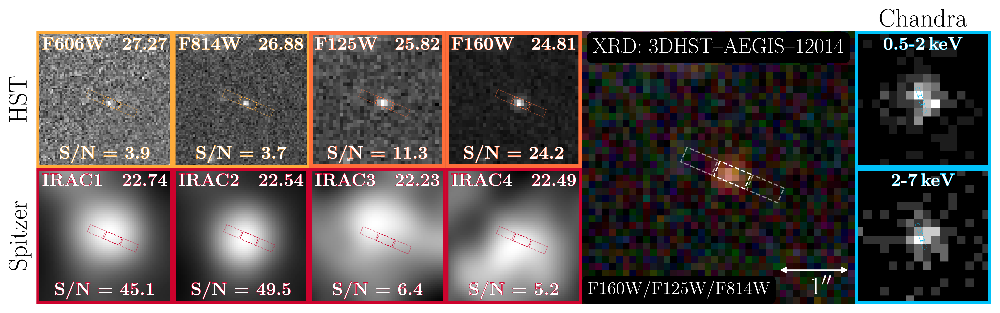

$\newcommand{\ensuremath}{}$
$\newcommand{\xspace}{}$
$\newcommand{\object}[1]{\texttt{#1}}$
$\newcommand{\farcs}{{.}''}$
$\newcommand{\farcm}{{.}'}$
$\newcommand{\arcsec}{''}$
$\newcommand{\arcmin}{'}$
$\newcommand{\ion}[2]{#1#2}$
$\newcommand{\textsc}[1]{\textrm{#1}}$
$\newcommand{\hl}[1]{\textrm{#1}}$
$\newcommand{\footnote}[1]{}$
$\newcommand{\vdag}{(v)^\dagger}$
$\newcommand$
$\newcommand$
$\newcommand{\todo}[1]{{\color{red}{#1}}}$

# The X-Ray Dot: Exotic Dust or a Late-Stage Little Red Dot?

<mark>Appeared on: 2026-01-16</mark> -  _21 pages, 7+2 Figures, 1+3 Tables, submitted to AJL. Comments welcome!_

R. E. Hviding, et al. -- incl., <mark>A. d. Graaff</mark>

**Abstract:** JWST's "Little Red Dots" (LRDs) are increasingly interpreted as active galactic nuclei (AGN) obscured by dense thermalized gas rather than dust as evidenced by their X-ray weakness, blackbody-like continua, and Balmer line profiles.A key question is how LRDs connect to standard UV-luminous AGN and whether transitional phases exist and if they are observable.We present the "X-Ray Dot" (XRD), a compact source at $z=3.28$ observed by the NIRSpec WIDE GTO survey.The XRD exhibits LRD hallmarks: a blackbody-like ( $T_{\rm eff} \simeq 6400$ K) red continuum, a faint but blue rest-UV excess, falling mid-IR emission, and broad Balmer lines ( $\rm FWHM \sim 2700-3200 km s^{-1}$ ).Unlike LRDs, however, it is remarkably X-ray luminous ( $L_\textrm{2$-$10 keV} = 10^{44.18}$ erg s $^{-1}$ ) and has a continuum inflection that is bluewards of the Balmer limit.We find that the red rest-optical and blue mid-IR continuum cannot be reproduced by standard dust-attenuated AGN models without invoking extremely steep extinction curves, nor can the weak mid-IR emission be reconciled with well-established X-ray--torus scaling relations.We therefore consider an alternative scenario: the XRD may be an LRD in transition, where the gas envelope dominates the optical continuum but optically thin sightlines allow X-rays to escape.The XRD may thus provide a physical link between LRDs and standard AGN, offering direct evidence that LRDs are powered by supermassive black holes and providing insight into their accretion properties.

**Figure 6. -** 
    Comparison of the XRD to the population of LRDs (dark gray) and non-LRD broad-line objects (light gray) from degraaff_LittleRedDots_2025 based on emission line and modified black-body fitting.
    Panels show: Blackbody temperature vs. luminosity (top left); Balmer decrement vs. H$\alpha$ luminosity (top middle); H$\alpha$ luminosity vs. UV magnitude (top right); H$\alpha$ luminosity vs. Blackbody luminosity (bottom left); O {\sc i}$\lambda$8446Å luminosity vs. H$\alpha$ luminosity (bottom middle); H$\alpha$ EW vs. UV power-law slope (bottom right).
    The XRD generally lies in regions occupied by LRDs and not non-LRD broad line galaxies and on the relations derived in degraaff_LittleRedDots_2025.
     (*fig:scatter*)

**Figure 2. -** 
    Overview of observations for the X-Ray Dot (XRD).
    Top panels present the space-based imaging compiled from the 3DHST survey from HST and Spitzer, the RGB composite from HST, and the hard and soft X-ray cutouts from Chandra.
    HST/Spitzer panels show the $4"\times4"$ cutout in the band, magnitude, and S/N whereas the Chandra panels show $8"\times8"$ cutouts.
    The bottom panel compares the XRD photometry and scaled spectrum (black) to an LRD with a similar rest-optical continuum (RUBIES$-$UDS$-$144195, red) and to the STScI composite quasar spectrum derived from vandenberk_CompositeQuasarSpectra_2001 and glikman_NearInfraredSpectralTemplate_2006 shown unattenuated (blue) and extincted (purple; $\rm A_{V}=1.37$) by an SMC-like dust law  (gordon_QuantitativeComparisonSmall_2003) .
    Comparison spectra are normalized to the XRD scaled spectrum at rest 5500Å.
     (*fig:xrd*)

**Figure 3. -** 
        Top: The rest-frame SED of the XRD (black) compared to RUBIES-BLAGN-1 \citep[green;][]{wang_RUBIESJWSTNIRSpec_2025} and Forge I and II \citep[red and blue respectively;][]{fu_DiscoveryTwoLittle_2025}.
        Bottom Left:
        $L_{\rm 2,keV}$ versus $L_{2500\rm\mathring{A}}$ for the XRD, the Forges, and the X-ray upper limits for LRDs nondetections from yue_StackingXRayObservations_2024(grey triangles).
        The XRD and Forge sources lie well above the standard $z\simeq0-3$ AGN relation  (chira_RevisitingXraytoUVRelation_2026) , indicating they are X-ray luminous for their UV emission.
        Applying a dust correction (\S\ref{ssec:continuum}) to the XRD, along with the corrections for the Forges in fu_DiscoveryTwoLittle_2025, brings all three sources closer to the relation.
        Bottom Right: Comparison of X-ray and H$\alpha$ luminosity.
        The measured XRD properties follow the relation for $z<0.4$ unobscured AGN  (jin_CombinedOpticalXray_2012) , but correcting the H$\alpha$ luminosity for dust in the same manner as $L_{2500\rm\mathring{A}}$ produces an H$\alpha$ luminosity that is overluminous for its X-ray emission.
     (*fig:compare*)

