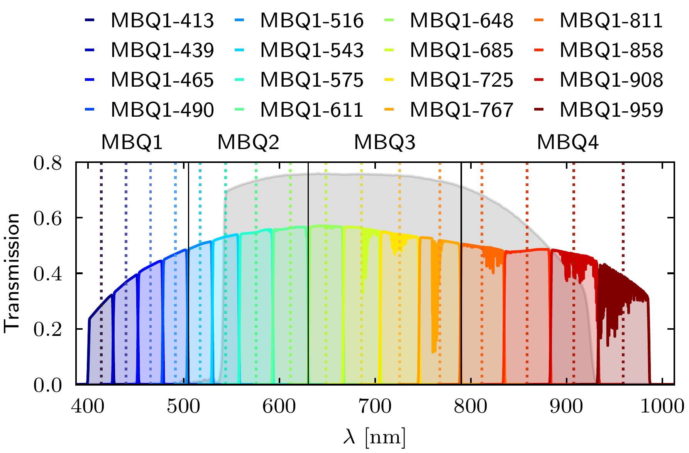
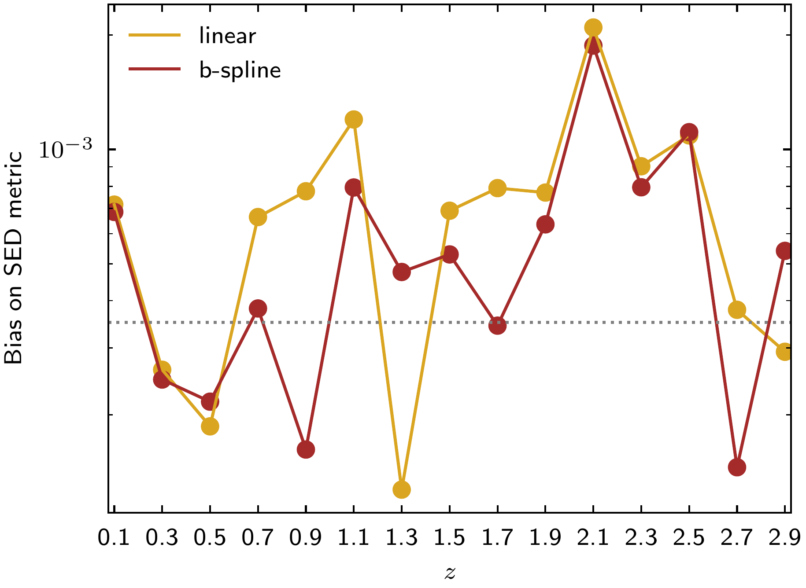

$\newcommand{\ensuremath}{}$
$\newcommand{\xspace}{}$
$\newcommand{\object}[1]{\texttt{#1}}$
$\newcommand{\farcs}{{.}''}$
$\newcommand{\farcm}{{.}'}$
$\newcommand{\arcsec}{''}$
$\newcommand{\arcmin}{'}$
$\newcommand{\ion}[2]{#1#2}$
$\newcommand{\textsc}[1]{\textrm{#1}}$
$\newcommand{\hl}[1]{\textrm{#1}}$
$\newcommand{\footnote}[1]{}$
$\newcommand{\jheap}{JHEAp}$
$\newcommand{\joss}{JOSS}$
$\newcommand{\IJMPD}{IJMPD}$
$\newcommand{\phil}{Phil. Trans. R. Soc. A}$
$\newcommand{\nuclearreview}{Nucl. Phys. Rev.}$
$\newcommand{\diff}{\mathop \!\mathrm{d}}$
$\newcommand{\orcid}[1]$
$\newcommand{\refer}[1]{,\ #1; [{\tt #1}]}$
$\newcommand{\itemm}{$
$\medskip\noindent}$
$\newcommand{\arraystretch}{1.2}$
$\newcommand\aa{@extracttenauthor#1}$
$\newcommand\aa{@splitninth#1}$
$\newcommand\aa{@ninthauthor}$
$\newcommand$

# $\Euclid$: Galaxy SED reconstruction in the PHZ processing function: impact on the PSF and the role of medium-band filters

<mark>Appeared on: 2026-01-19</mark> -  _17 pages, 10 figures, 2 tables, including appendices_

E. Collaboration, et al. -- incl., <mark>K. Jahnke</mark>

**Abstract:** $\iffalse{\colour{blue} \bf NEW VERSION: We have a modified style file,     aaEC.cls, used here; with that, the bug reported in Sect. 8 no     longer occurs. In order to demonstrate this, the long author list     of [Cuillandre, et. al (2025)](https://doi.org/10.1051/0004-6361/202450803) was copied here.}$ \ $\fi$ Weak lensing surveys require accurate correction for the point spread function (PSF) when measuring galaxy shapes. For a diffraction-limited PSF, as arises in space-based missions, this correction depends on each galaxy’s spectral energy distribution (SED), hence a sufficiently accurate knowledge of the SED is needed for every galaxy. In the $\Euclid$ mission, galaxy SED reconstruction, which is one of the tasks of the photometric-redshift processing function (PHZ PF), relies on broad- and medium-band ancillary photometry. The limited wavelength sampling of the $\IE$ passband and signal-to-noise ratio may affect the reconstruction accuracy and translate into biases in the weak lensing measurements.In this study, we present the methodology, which is employed in the $\Euclid$ PHZ PF, for reconstructing galaxy SEDs at 55 wavelengths, sampling the $\IE$ passband every 10 nm, and we assess whether it fulfils the accuracy requirements imposed on the $\Euclid$ PSF model.We employ both physics- and data-driven methods, focusing on a new approach of template-based flux correction and Gaussian processes. For validation, we introduce an SED metric whose bias translates into inaccuracies in the PSF quadrupole moments.Our findings demonstrate that Gaussian processes and template fitting meet the requirements only in specific, but complementary, redshift intervals. We therefore propose a hybrid approach, which leverages both methods. This solution proves to be effective in meeting the $\Euclid$ accuracy requirements for most of the redshift range of the survey. Finally, we investigate the impact on the SED reconstruction of a new set of 16 evenly-spaced medium-band filters for the Subaru telescope, providing quasi-spectroscopic coverage of the $\IE$ passband. This study shows promising results, ensuring accurate SED reconstruction and meeting the mission PSF requirements. This work thus provides not only the methodological foundation of galaxy SED reconstruction in the $\Euclid$ PHZ PF, but also a roadmap for future improvements using a new medium-band survey. $\iffalse$ Weak lensing surveys require accurate correction for the point spread function (PSF) when measuring galaxy shapes. For a diffraction-limited PSF, as arises in space-based missions, this correction depends on each galaxy’s spectral energy distribution (SED), hence a sufficiently accurate knowledge of the SED is needed for every galaxy. In the $\Euclid$ mission, galaxy SED reconstruction, which is one of the tasks of the photometric-redshift processing function (PHZ PF), relies on broad- and medium-band ancillary photometry. The limited wavelength sampling of the $\IE$ passband and signal-to-noise ratio may affect the reconstruction accuracy and translate into biases in the weak lensing measurements.In this study, we present the methodology, which is employed in the $\Euclid$ PHZ PF, for reconstructing galaxy SEDs in 55 points, sampling the $\IE$ passband every 10 nm, and we assess whether it fulfils the accuracy requirements imposed on the $\Euclid$ PSF model.We employ both physics- and data-driven methods, focusing on a new approach of template-based flux correction and Gaussian processes. For validation, we introduce an SED metric whose bias translates into inaccuracies in the PSF quadrupole moments.Our findings demonstrate that Gaussian processes and template fitting meet the requirements only in specific, but complementary, redshift intervals. We therefore propose a hybrid approach, which leverages both methods. This solution proves to be effective in meeting the $\Euclid$ accuracy requirements across the redshift range of the survey. Finally, we investigate the impact on the SED reconstruction of a new set of 16 evenly-spaced medium-band filters for the Subaru telescope, providing quasi-spectroscopic coverage of the $\IE$ passband. This study shows promising results, ensuring accurate SED reconstruction and meeting the mission PSF requirements. This work thus provides not only the methodological foundation of galaxy SED reconstruction in the $\Euclid$ PHZ PF, but also a roadmap for future improvements using a new medium-band survey. $\fi$

**Figure 6. -** 
   The new HSC medium-band filter design, with 16 filters organised in four quadrants (MBQ1--4). Each filter is named after its weighted central wavelength, indicated by a dashed vertical line. The \IE filter is shown in the background. (*fig:07*)

**Figure 1. -** Median fractional bias in the SED metric arising from the interpolation of galaxy SEDs from coarse sampling down to 1 nm sampling using linear (pink line) and cubic spline (dark green) interpolation. The dotted line represents the \Euclid requirement set on the PSF model. (*fig:01*)

**Figure 5. -** Bias in the SED metric averaged over single redshift bins, calculated from the SED reconstruction using linear (sand-coloured) and b-spline (in brown) interpolation, respectively. (*fig:06*)

