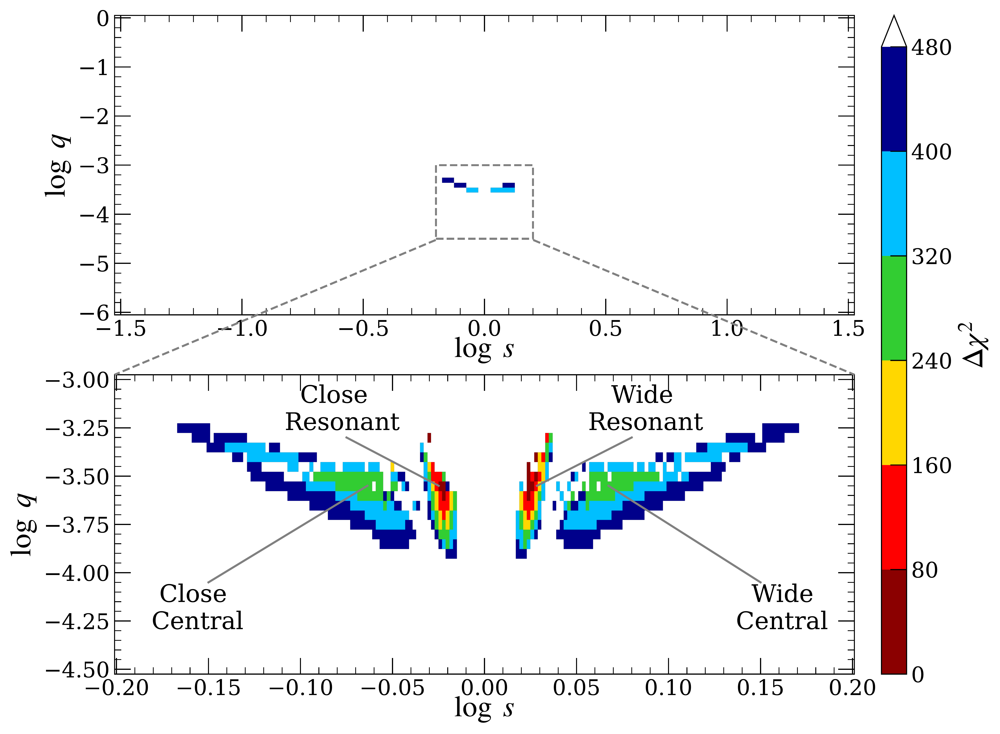

$\newcommand{\ensuremath}{}$
$\newcommand{\xspace}{}$
$\newcommand{\object}[1]{\texttt{#1}}$
$\newcommand{\farcs}{{.}''}$
$\newcommand{\farcm}{{.}'}$
$\newcommand{\arcsec}{''}$
$\newcommand{\arcmin}{'}$
$\newcommand{\ion}[2]{#1#2}$
$\newcommand{\textsc}[1]{\textrm{#1}}$
$\newcommand{\hl}[1]{\textrm{#1}}$
$\newcommand{\footnote}[1]{}$
$\newcommand{\thetae}{\theta_{\rm E}}$
$\newcommand{\teff}{t_{\rm eff}}$
$\newcommand{\Icat}{I_{\rm cat}}$
$\newcommand{\pie}{\pi_{\rm E}}$
$\newcommand{\pirel}{\pi_{\rm rel}}$
$\newcommand{\te}{t_{\rm E}}$
$\newcommand{\event}{KMT-2025-BLG-1616}$
$\newcommand{\an}{\theta_{*}}$
$\newcommand{\Sp}{{\it Spitzer}}$
$\newcommand{\hjd}{{\rm HJD}^{\prime}}$
$\newcommand$
$\newcommand$
$\newcommand$
$\newcommand$

# ${\large KMT-2025-BLG-1616Lb: First Microlensing Bound  Planet From DREAMS}$

<mark>Appeared on: 2026-01-19</mark> -  _Accepted for publication in AJ_

H. Yang (杨弘靖), et al.

**Abstract:** We present observations and analysis of the bound planetary microlensing event KMT-2025-BLG-1616. The planetary signal was captured by the Korea Microlensing Telescope Network (KMTNet) and the DECam Rogue Earths and Mars Survey (DREAMS). DREAMS's minute-cadence observations break the central/resonant degeneracy in the binary-lens models. The color of the faint source star ( $I=22$ ) is measured from the DREAMS's $r - z$ color. The planetary system has a planet-host mass ratio of $q \sim 5 \times 10^{-4}$ . A Bayesian analysis yields a host-star mass of $\sim 0.3 M_\odot$ , a planetary mass of $\sim 40 M_{\oplus}$ , a projected planet-host separation of $\sim 1.6 \mathrm{au}$ , and a lens distance of $\sim 7.5 \mathrm{kpc}$ . Based on the photometric precision achieved by DREAMS for this event, we simulate free-floating planet (FFP) detections and find that DREAMS is sensitive to Mars-mass FFPs in the Galactic bulge and Moon-mass FFPs in the Galactic disk.

**Figure 4. -** Light curve of the microlensing event, $\event$, with the 2L1S models (solid black and orange lines) and the underlying 1L1S model (dashed grey line). Different data sets are plotted in different colors. The upper panels shows the 8-day data around the peak. The lower panels present a close-up of the planetary anomaly and the residuals relative to the 2L1S models. (*fig:lc*)

**Figure 1. -** The $\chi^2$ surface in the $(\log s, \log q)$ plane obtained from the 2L1S grid search. The upper panel shows the coarse grid, while the lower panel zooms in on the dense grid around the global minimum. Dark red, red, yellow, green, blue, and dark blue denote grid points within $\Delta\chi^2<1n$, $<2n$, $<3n$, $<4n$, $<5n$, and $<6n$, respectively, where $n = 80$. Grid points with $\Delta\chi^2 > 480$ are left blank. The labels "Close Central", "Wide Central", "Close Resonant", and "Wide Resonant" in the lower panel mark the four local minima. (*fig:grid*)

**Figure 3. -** Color-magnitude diagram for $\event$. Black dots show OGLE-III field stars  ([Szyma\'nski, et. al 2011](http://adsabs.harvard.edu/abs/2011AcA....61...83S))  within a $1.5'$ from the event position. The red asterisk and blue dot mark the centroid of the red clump and the source star, respectively. Green points show the _HST_ CMD from [Holtzman, et. al (1998)](http://adsabs.harvard.edu/abs/1998AJ....115.1946H), and the HST red clump centroid, $(V-I,I)_{\rm cl,HST}=(1.62,15.15)$ ([Bennett, et. al 2008](http://adsabs.harvard.edu/abs/2008ApJ...684..663B)) , has been shifted to match the OGLE-III red clump. (*fig:cmd*)

