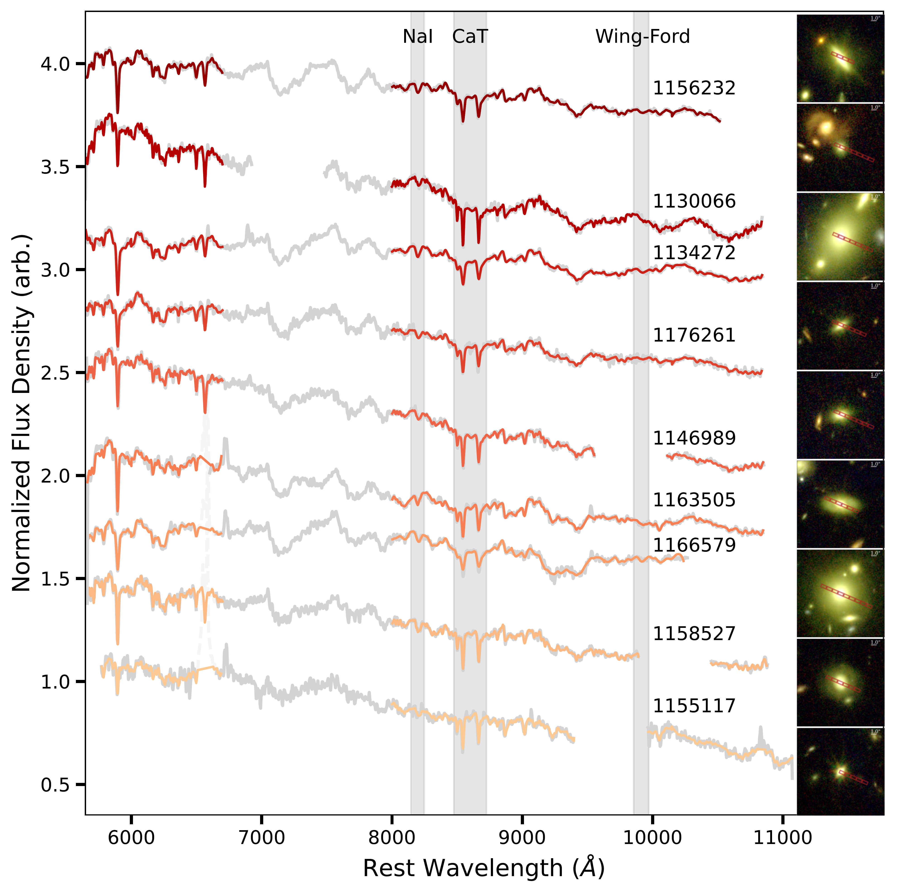

$\newcommand{\ensuremath}{}$
$\newcommand{\xspace}{}$
$\newcommand{\object}[1]{\texttt{#1}}$
$\newcommand{\farcs}{{.}''}$
$\newcommand{\farcm}{{.}'}$
$\newcommand{\arcsec}{''}$
$\newcommand{\arcmin}{'}$
$\newcommand{\ion}[2]{#1#2}$
$\newcommand{\textsc}[1]{\textrm{#1}}$
$\newcommand{\hl}[1]{\textrm{#1}}$
$\newcommand{\footnote}[1]{}$

# Bottom-heavy initial mass functions reveal hidden mass in early galaxies

<mark>Appeared on: 2026-01-29</mark> -  _29 pages, 7 figures, under peer review at Nature Astronomy_

C. M. Cheng, et al. -- incl., <mark>A. d. Graaff</mark>

**Abstract:** _JWST_ observations have revealed that massive galaxies formed and evolved far faster than predicted by galaxy formation models, with many having already assembled a large mass in stars $\sim12$ billion years ago \citep{Steinhardt_2016, Carnall_2023a, Carnall_2023b, Carnall_2024, Valentino_2023, de_graaff_2025, Ito_2025} .  However, masses of distant galaxies are highly uncertain, as they assume a distribution of stellar birth masses (the initial mass function [ IMF ] ) similar to that in the Milky Way (MW).  Specifically, the contribution from low-mass stars, which make up the bulk of stellar mass, is not directly observed, but inferred based on an extrapolation of the MW IMF.  Here, we provide the first robust measurements of the IMF beyond the local Universe.  Using ultra-deep spectra of nine massive, quiescent galaxies at $z\sim0.7$ from the ambitious _JWST_ -IMFERNO program, extended to bluer wavelengths with deep spectra from LEGA-C \citep{van_der_Wel_2021} , we find that these distant galaxies have excess low-mass stars.  In other words, they have more bottom-heavy IMFs than the MW.  For the oldest two galaxies, which are direct descendants of _JWST_ 's "impossibly early" galaxies, the bottom-heavy IMFs increase their stellar masses by a factor of $3-4$ .  These galaxies thus amplify the tension with galaxy formation models.

**Figure 1. -** _JWST_-NIRSpec/MSA spectra (grey) and best-fit stellar population models (coloured lines) for our sample of 9 massive, quiescent galaxies at $z\sim0.7$, observed via the IMFERNO program.  Spectra are shown in order of increasing redshift (bottom to top).  We normalize each spectrum by the median flux between rest-frame $7500-7600$ Å, arbitrarily offsetting them in the $y$-direction for visibility.  We indicate key IMF-sensitive absorption features with shaded regions.  We do not fit the region between $7000-8000$ Å due to broad TiO absorption (see Methods).  We also show the RGB image cutout (8.5 arcsec $\times$ 8.5 arcsec) for each galaxy next to its corresponding spectrum, where we have combined the F115W, F277W, and F444W COSMOS-Web images \citep{cosmos-web, grizli, Valentino_2023}. (*fig:spectra*)

**Figure 2. -** IMF mismatch parameter ($\alpha_{\rm IMF}$) -- the ratio between the mass-to-light ($M/L$) ratio where we allow the IMF to vary freely and the $M/L$ ratio where we fix a MW IMF -- as a function of stellar velocity dispersion ($\sigma_v$; panel a) and iron abundance ([Fe/H]; panel b).  The IMFERNO galaxies are shown as triangles, colour-coded by virial masses ($\log({\rm M}_{\rm vir}/{\rm M}_{\odot})$).  Grey symbols represent measurements for massive, elliptical galaxies in the nearby Universe, from \cite{CvD12b}(re-derived in \cite{Cheng_2023}), \cite{van_dokkum_2017}, \cite{Gu_2022}, and \cite{Cheng_2023}.  Blue symbols represent lensing or dynamical measurements in the nearby Universe, from \citep{Treu_2010, Cappellari_2013, Newman_2017}.  Beige circles represent spectral index constraints from stacked spectra at $z\sim1.1$, from \citep{Martin_Navarro_2015_highzimf}.  Error bars are 1 standard deviation. (*fig:alpha_2panel*)

**Figure 3. -** Comparison between stellar and virial masses.  Virial masses ($\log({\rm M}_{\rm vir}/{\rm M}_{\odot})$) are shown on the $y$-axis (see Methods).  Stellar masses, derived using MAGPHYS(\citep{MAGPHYS, de_graaff_2021}) and assuming a MW IMF, are shown on the $x$-axis (grey circles).  We correct these masses for our best-fit IMF by multiplying them with $\alpha_{\rm IMF}$.  We show the corrected masses as triangles, colour-coded by $\alpha_{\rm IMF}$.  Error bars are 1 standard deviation.  The dashed line represents a one-to-one comparison. (*fig:mass_compare*)

