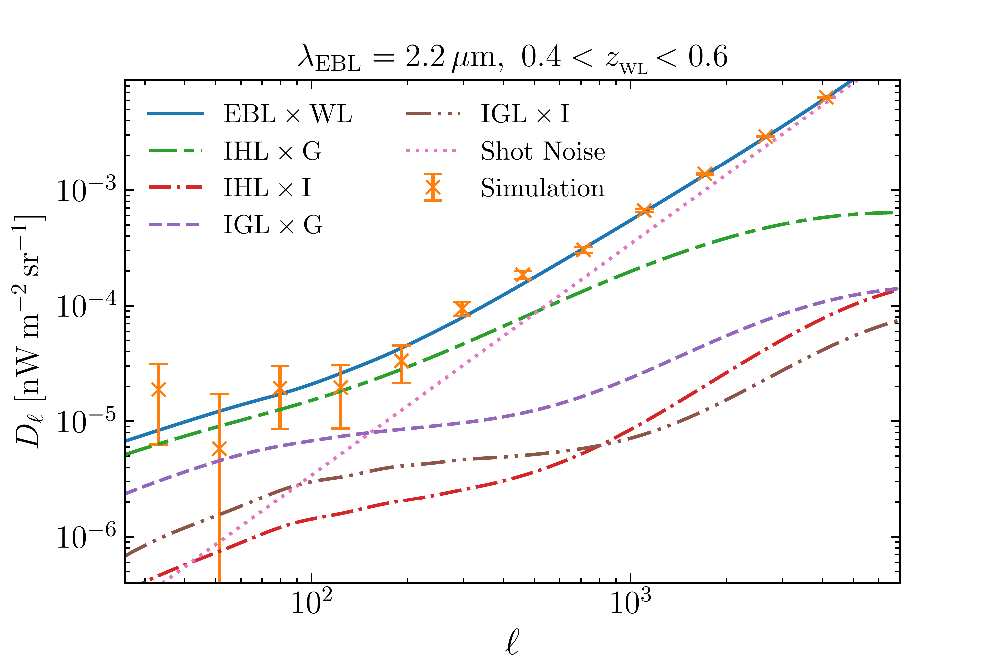
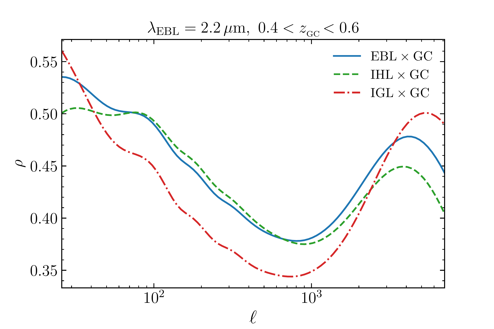
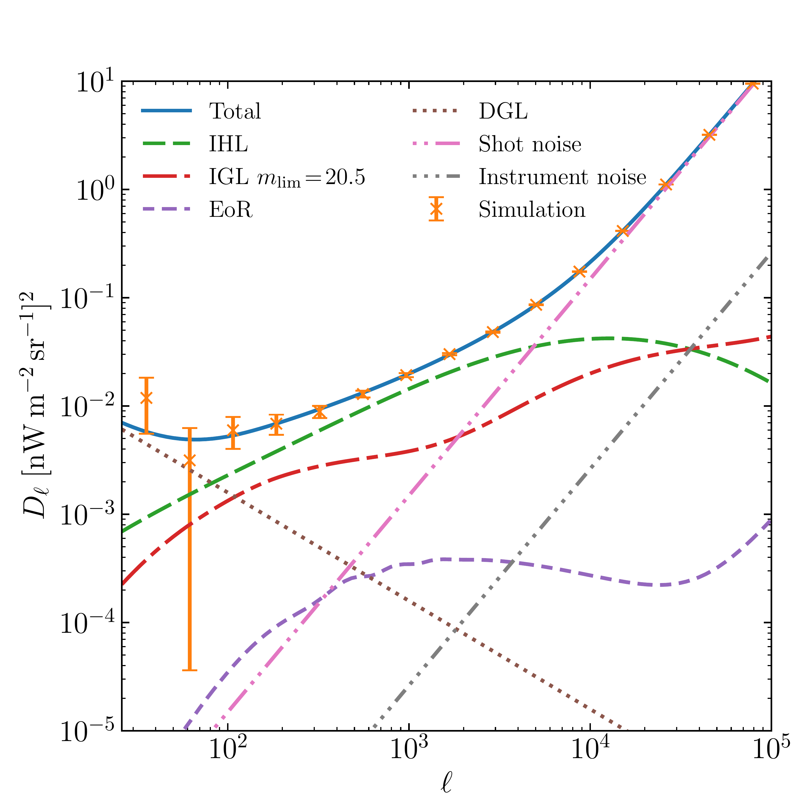

$\newcommand{\ensuremath}{}$
$\newcommand{\xspace}{}$
$\newcommand{\object}[1]{\texttt{#1}}$
$\newcommand{\farcs}{{.}''}$
$\newcommand{\farcm}{{.}'}$
$\newcommand{\arcsec}{''}$
$\newcommand{\arcmin}{'}$
$\newcommand{\ion}[2]{#1#2}$
$\newcommand{\textsc}[1]{\textrm{#1}}$
$\newcommand{\hl}[1]{\textrm{#1}}$
$\newcommand{\footnote}[1]{}$
$\newcommand{\orcid}[1]{\orcidlink{#1}}$
$\newcommand{\pd}{\phantom{1}}$
$\newcommand{\pp}{\phantom{-}}$
$\newcommand{\arraystretch}{1.3}$
$\newcommand{\arraystretch}{1.55}$

# $\Euclid$ preparation: Decomposing components of the extragalactic background light using multi-band intensity mapping cross-correlations

<mark>Appeared on: 2026-01-30</mark> -  _21 pages, 11 figures_

E. Collaboration, et al. -- incl., <mark>K. Jahnke</mark>

**Abstract:** The extragalactic background light (EBL) fluctuations in the optical/near-IR encode the cumulative emission of unresolved galaxies (integrated galaxy light; IGL), diffuse intra-halo light (IHL), and high- $z$ sources from the epoch of reionisation (EoR), but they are difficult to disentangle with auto-spectra alone. We aim to decompose the EBL into its principal constituents using multi-band intensity mapping combined with cosmic shear and galaxy clustering. We develop a joint halo-model framework in which IHL follows a mass- and redshift-dependent luminosity scaling, IGL is set by an evolving Schechter luminosity function, and EoR emission is modelled with Pop II/III stellar emissivities and a binned star-formation efficiency. Diffuse Galactic light and shot noise are included, and cosmic shear is modelled using the nonlinear alignment model for intrinsic alignment. Using mock surveys in a flat $\Lambda$ CDM cosmology with ten spectral bands spanning 0.75--5.0 $\si{\micron}$ in the North Ecliptic Pole deep fields over about $100 \deg^2$ with source detections down to AB = 20.5 for masking, and six redshift bins to $z=2.5$ , we fit auto- and cross-power spectra using a Markov chain Monte Carlo method. The combined SPHEREx $\times$ $\Euclid$ analysis recovers all fiducial parameters within $1 \sigma$ and reduces $1 \sigma$ uncertainties on IHL parameters by 10--35 \% relative to SPHEREx EBL-only, while EoR star-formation efficiency parameters improve by 20--35 \% . Cross-correlations reveal a stronger coupling of IHL than IGL to the shear field, enhancing component separation; conversely, the high- $z$ EoR contribution shows negligible correlation with cosmic shear and galaxy clustering, aiding its isolation in the EBL. Relative to the SPHEREx EBL-only case, the inferred IHL fraction as a function of halo mass is significantly tightened over $10^{11}$ – $10^{14} \si{\solarmass}$ , with uncertainties reduced by 5--30 \% , and the resulting star-formation rate density constraints extend to $z\approx11$ , with uncertainty reductions of 22--31 \% . SPHEREx $\times$ $\Euclid$ provides a robust, systematics-aware route to component-resolved EBL measurements and improved constraints on galaxy formation.

**Figure 6. -** Kernel of different EBL components and cosmic shear signal as functions of redshift. *Left*: Kernels of IHL (*upper*) and IGL (*lower*) signals in EBL (IGL with masking down to AB = 20.5), respectively. *Right*: Kernels of the galaxy clustering (*upper*) and cosmic shear (*lower*), respectively. (*fig:kernel*)

**Figure 9. -** Components of the cross angular power spectrum between EBL at 2.2 $\si{\micron}$ and cosmic shear/galaxy clustering at the tomographic redshift bin with $0.4\!<\!z_{\rm ph}\!<\!0.6$ are shown in the left panels, and their correlation coefficient are shown in the right panels. We use the same colour and type of line to present the same component in the left and right panels. *Top*: The blue solid lines denote the cross-correlation between the total components of EBL, and the green, red, purple, and brown lines represent the cross-correlation of IHL-gravitational (IHL$\times$G), IHL-intrinsic (IHL$\times$I), IGL-gravitational (IGL$\times$G), and IGL-intrinsic (IGL$\times$I) signals, respectively. Note that the value of IHL$\times$I and IGL$\times$I are negative. *Bottom*: The solid blue lines represent the cross-correlation of the total EBL with galaxy clustering. The green and red lines are the IHL-galaxy clustering (IHL$\times$GC) and IGL-galaxy clustering (IGL$\times$GC) signals, respectively. (*fig:cross_sp*)

**Figure 1. -** Components of the EBL anisotropy power spectrum at 2.2 $\si{\micron}$. Here, $D_{\ell}=\ell (\ell+1) C_{\ell}/2\pi$. The blue solid line denotes the total power spectrum with noise, the green, red, and purple dashed lines denote the power spectra of the IHL, IGL, and EoR signals, respectively. DGL is shown as a brown dotted line, for an intensity level comparable to that of the NEP deep field. The shot noise and instrument noise are shown with pink and grey dash-dotted lines, respectively. The orange crosses with error bars represent mock SPHEREx data. (*fig:EBL_spectra*)

