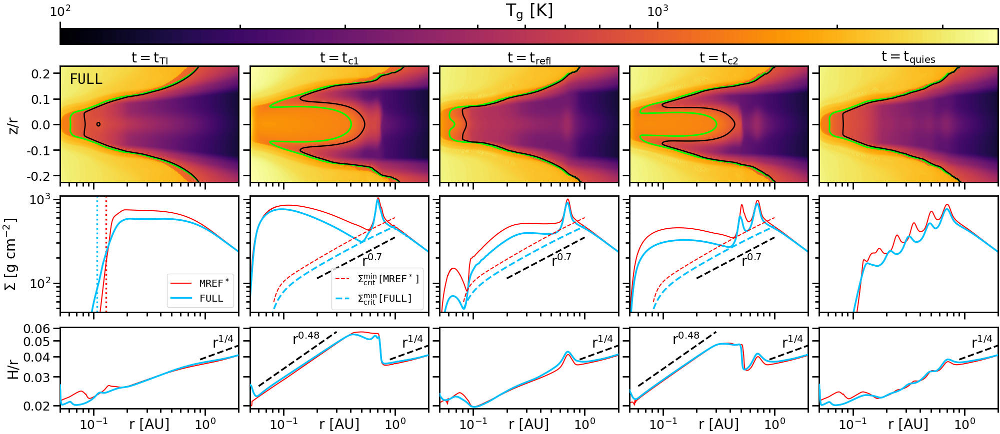

$\newcommand{\ensuremath}{}$
$\newcommand{\xspace}{}$
$\newcommand{\object}[1]{\texttt{#1}}$
$\newcommand{\farcs}{{.}''}$
$\newcommand{\farcm}{{.}'}$
$\newcommand{\arcsec}{''}$
$\newcommand{\arcmin}{'}$
$\newcommand{\ion}[2]{#1#2}$
$\newcommand{\textsc}[1]{\textrm{#1}}$
$\newcommand{\hl}[1]{\textrm{#1}}$
$\newcommand{\footnote}[1]{}$
$\newcommand{\vect}[1]{\mathbf{#1}}$
$\newcommand{\rot}[1]{\vect{\nabla}\times{#1}}$
$\newcommand$
$\newcommand{\sref}[1]{Sec.~\ref{#1}}$
$\newcommand{\tab}[1]{Table~\ref{#1}}$
$\newcommand{\fig}[1]{Fig.~\ref{#1}}$
$\newcommand{\equ}[1]{Eq.~(\ref{#1})}$
$\newcommand{\equo}[1]{Eq.~\ref{#1}}$
$\newcommand{\equs}[2]{Eqs.~(\ref{#1})~-~(\ref{#2})}$
$\newcommand{\equos}[2]{Eqs.~\ref{#1}~-~\ref{#2}}$
$\newcommand{\Msunpyr}{\mathrm{M_\odot/yr}}$
$\newcommand{\colout}[1]{\bgroup\markoverwith{\textcolor{#1}{\rule[.5ex]{2pt}{0.4pt}}}\ULon}$
$\newcommand{\pder}[2][]{\frac{\partial#1}{\partial#2}}$
$\newcommand{\grad}[1]{\nabla{#1}}$
$\newcommand{\div}[1]{\nabla\cdot\mathchoice{#1}}$
$\newcommand{\arraystretch}{1.5}$
$\newcommand{\arraystretch}{1.1}$
$\newcommand{\arraystretch}{1.35}$
$\newcommand{\arraystretch}{1.1}$
$\newcommand{\cs}{c_{\sf s}}$
$\newcommand{\Teff}{T_{\sf eff}}$

# The role of detailed gas and dust opacities in shaping the evolution of the inner disc edge subject to episodic accretion 

<mark>Appeared on: 2026-02-12</mark> -  _22 pages, 15 figures, accepted for publication in A&A_

<mark>M. Cecil</mark>, et al. -- incl., <mark>M. Flock</mark>, <mark>P. Sudarshan</mark>

**Abstract:** The transition in turbulence in the inner regions of protoplanetary discs and the closely connected dust sublimation front lead to periodic instability, manifesting as episodic accretion outbursts. For the corresponding interplay between heating and cooling, the opacity of the material needs to be treated carefully. We investigate the effects of different dust and gas opacity descriptions on the structure and evolution of the inner regions of protoplanetary discs. The influence on the episodic instability of the inner disc edge is hereby of central interest. Two-dimensional (2D) axisymmetric radiation hydrodynamic models are employed to simulate the evolution of the inner disc over the course of several thousand years. Our simulations greatly expand on previously published models by implementing detailed descriptions of the gas and dust opacities in terms of both their mean and frequency-dependent values. This allows us to also consider binned frequency-dependent irradiation from the central star. The adaptive opacity description impacts the structure of the inner disc rim to a great extent, with the gas opacities' contribution having the most significant influence. The resulting effects include the shift in position of both the dust sublimation front and the dead zone inner edge (DZIE), a significantly altered temperature in the dust-free region and the manifestation of the equilibrium temperature degeneracy as a sharp temperature transition. The episodic instability due to the activation of the magneto-rotational instability (MRI) in the dead zone still occurs, but at lower inner disc densities. While the gas opacities set the initial conditions for the instability by determining the location of the DZIE, the evolution of the outburst itself is mainly governed by the dust opacities. The analysis of criteria for non-axisymmetric instabilities reveals possible breaking of the density peaks produced during the burst phase. However, due to the periodicity of the instability cycle, the DZIE itself may remain stable throughout the quiescent phases according to linear criteria applied to our axisymmetric models. Although the thermal structure of the inner disc is crucially affected by different opacity descriptions, especially by the contribution of gas, the mechanism of the periodic instability of the DZIE remains active and is only marginally influenced by the gas opacities. The observational consequences of the severely altered temperatures may be significant and require further investigation.

**Figure 12. -** Evolution of the outburst in the \texttt{FULL} model compared to $\texttt{MREF}^*$. The different columns correspond to different evolutionary stages, starting from the ignition of the burst at $t=t_\mathrm{TI}$, chronologically proceeding through the burst stage and ending with the beginning of the next quiescent state at $t=t_\mathrm{quies}$. The top row shows the temperature maps of \texttt{FULL} with the black and green contour lines marking the MRI-transition and the dust sublimation front. The middle row depicts the surface densities for both $\texttt{MREF}^*$ and \texttt{FULL} at the same stages during their respective evolution. The vertical dotted lines in the first panel indicate the locations of the DZIE in the corresponding model of the same colour. The panels in the second, third and fourth column also show the respective profiles of $\Sigma_\mathrm{min}^\mathrm{crit}$ together with a reference power law profile of $r^{0.7}$. The bottom row represents the aspect ratios $H/r$ of both models. The $r^{1/4}$ profile indicates the slope of $H/r$ in the outer disc (>2 AU). In the high-state regions, an additional reference profile of $r^{0.48}$ is shown. (*fig:burststructure*)

**Figure 3. -** Differences between the models \texttt{DUST} and \texttt{FULL} during quiescence (panel a) and outburst (panel b). The coloured contour lines represent the same transitions as in Fig. \ref{fig:MREF_DUST_diff}, with the solid lines corresponding to \texttt{DUST} and the dashed lines to \texttt{FULL}. The upper halves of the panels show the differences in temperature between the two models, while the lower halves depict the absolute temperature of \texttt{DUST}.  (*fig:old_new_diff*)

**Figure 14. -** Visualisation of the temperature jump as a consequence of the equilibrium temperature degeneracy. Panels (a) and (c) display temperature maps of the quiescent phase for the models \texttt{FULL} and \texttt{NOFREQIRR}, respectively. The red dashed lines show the radial profiles of the temperatures at a height of $z/r=0.2$(indicated by the white dotted line). The solution of Eq. \ref{eq:T_eq} for $T_\mathrm{eq}$ at every radius is represented by the blue line. The green contours mark the dust sublimation fronts. Panels (b) and (d) show the function given in Eq. \ref{eq:f_Teq}, evaluated at four different radii for both models, respectively. The star-shaped markers indicate which of the available solutions is adopted by the solver at each radius. The same markers have been used to locate the respective evaluation radii in panels (a) and (c). (*fig:rootfinder*)

