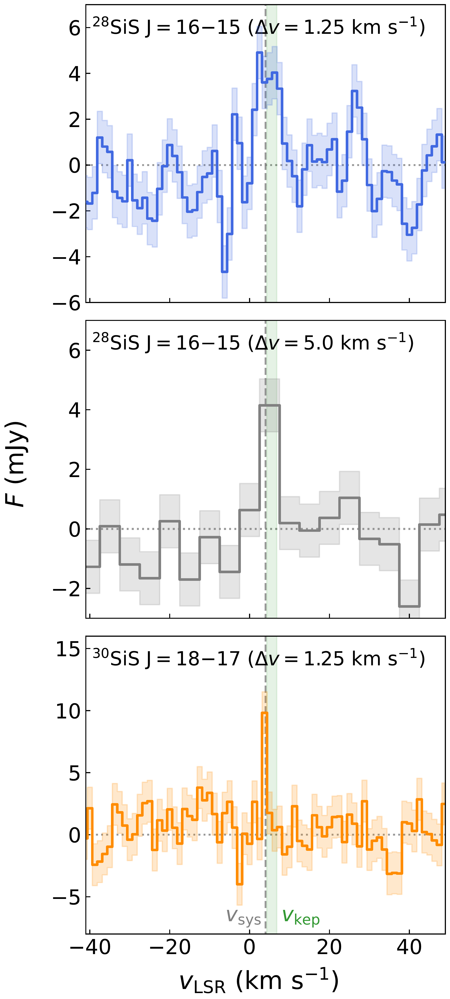
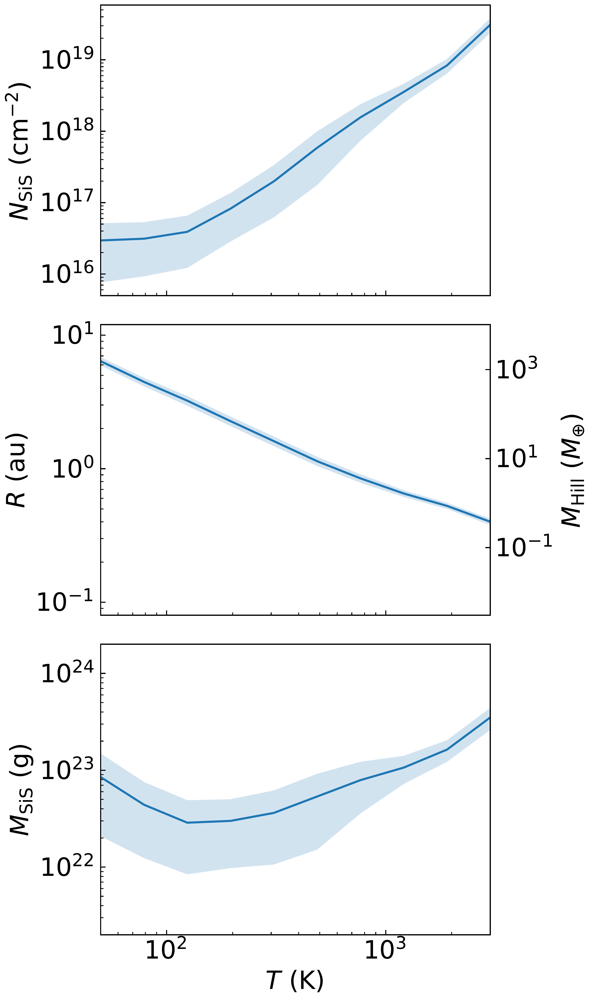

$\newcommand{\ensuremath}{}$
$\newcommand{\xspace}{}$
$\newcommand{\object}[1]{\texttt{#1}}$
$\newcommand{\farcs}{{.}''}$
$\newcommand{\farcm}{{.}'}$
$\newcommand{\arcsec}{''}$
$\newcommand{\arcmin}{'}$
$\newcommand{\ion}[2]{#1#2}$
$\newcommand{\textsc}[1]{\textrm{#1}}$
$\newcommand{\hl}[1]{\textrm{#1}}$
$\newcommand{\footnote}[1]{}$
$\newcommand{\vdag}{(v)^\dagger}$
$\newcommand$
$\newcommand$
$\newcommand$
$\newcommand$
$\newcommand$
$\newcommand$

#  A Protoplanet Candidate in the PDS 66 Disk Indicated by Silicon Sulfide Isotopologues 

<mark>Appeared on: 2026-02-16</mark> -  _16 pages, 8 figures, accepted for publication in ApJL_

T. C. Yoshida, et al. -- incl., <mark>M. Benisty</mark>, <mark>K. Doi</mark>

**Abstract:** Despite observational progress in planet formation, the stage in which planetesimals grow into planets remains poorly understood.During this phase, protoplanets may develop gaseous envelopes that are warmer than the surrounding disk gas, potentially providing observable signatures through molecules otherwise depleted in cold regions.In this Letter, we report the detection of the silicon sulfide isotopologues $\isis$ and $\jsis$ in the protoplanetary disk around PDS 66 (MP Mus) at a significance of ${\sim}5{-}6\sigma$ , using the Atacama Large Millimeter/submillimeter Array.These constitute the second and first detections of $\rm ^{28}SiS$ and $\rm ^{30}SiS$ in a protoplanetary disk, respectively.The emission appears as a compact source at $r=60$ au in the southwestern region of the disk, unresolved with a ${\sim}0\farcs5$ beam, and shows a velocity consistent with Keplerian rotation, suggesting a protoplanetary origin.By modeling the line fluxes, we constrain the emitting radius to ${\sim}0.5{-}4$ au and estimate an SiS mass of $10^{22}{-}10^{23}$ g, corresponding to at least ${\sim}10\%$ of the silicon contained in local dust grains.Because complete sublimation of a substantial fraction of dust grains by local processes is difficult to achieve, this result instead implies an accumulation of silicon from a larger region.We propose that a circumplanetary envelope surrounding a low-mass protoplanet, where pebble accretion and subsequent sublimation of grains may enhance gaseus silicon abundance with respect to observable dust grains around it, can account for the observed characteristics.

**Figure 7. -** Upper panels: 338 GHz continuum image \citep{2025ApJ...984L...9C} and $Q_{\phi}$ image in the H band \citep{2018ApJ...863...44A}. Bottom panels: S/N maps of the \isis and \jsis lines at channels that cover $v_{\rm LSR} \simeq 2.5-7.5 \kms$ and $3.1-4.4 \kms$, where the emission peaks. Note that there might be uncertainty in the rest frequency adopted here (Appendix \ref{app:freq}).
In all panels, the dotted and dashed ellipses indicate radii of $r=60$ and $70$ au, corresponding roughly to the edge of the mm-continuum disk \citep{2023A&A...673A..77R, 2025ApJ...984L...9C}. Contours show the 3 and $6\sigma$ levels of the \jsis line, and the apparent shift between two lines can be explained by statistical error of astrometry (Section \ref{sec:res1}).  The star symbol marks the position of the central star, and the gray ellipse in the lower left corner represents the synthesized beam (except for the H-band image). (*fig:mom0*)

**Figure 2. -** Spectra of the \isis and \jsis lines extracted at the peak S/N positions (Figure \ref{fig:mom0}). The top and bottom panels show spectra from the narrow channel-width cubes, while the middle panel corresponds to the wide-channel \isis cube. The shaded regions indicate $1\sigma$ noise levels. The vertical dashed line marks the systemic velocity, and the green band represents the range of projected Keplerian velocities within one beam. (*fig:spec*)

**Figure 3. -** Derived SiS column densities ($N_{\rm SiS}$) and emitting radii ($R$) as a function of the assumed temperature. The bottom panel shows the SiS mass ($M_{\rm SiS}$). For the middle panel ($R$), we also plot the planet's mass assuming that the emitting radius equals to the Hill radius (see Section \ref{sec:pa}).  (*fig:quantities*)

