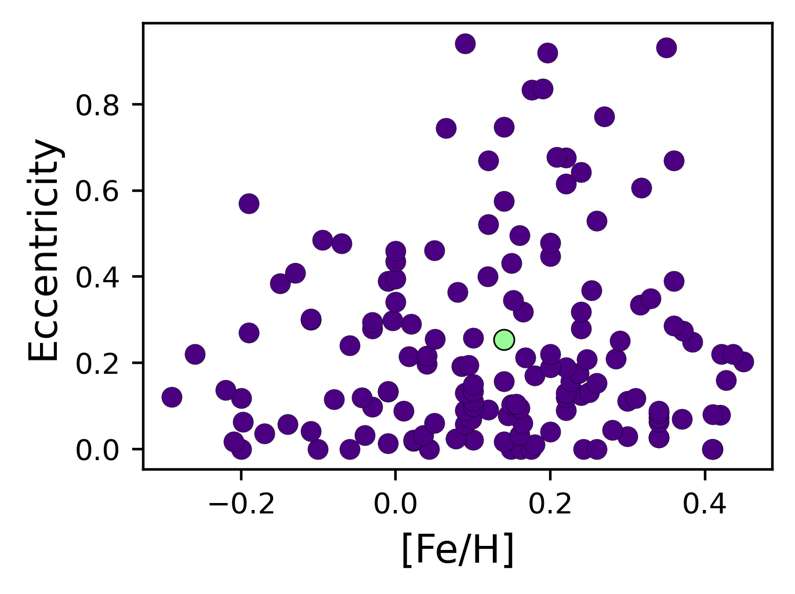

$\newcommand{\ensuremath}{}$
$\newcommand{\xspace}{}$
$\newcommand{\object}[1]{\texttt{#1}}$
$\newcommand{\farcs}{{.}''}$
$\newcommand{\farcm}{{.}'}$
$\newcommand{\arcsec}{''}$
$\newcommand{\arcmin}{'}$
$\newcommand{\ion}[2]{#1#2}$
$\newcommand{\textsc}[1]{\textrm{#1}}$
$\newcommand{\hl}[1]{\textrm{#1}}$
$\newcommand{\footnote}[1]{}$
$\newcommand{\feh}{\ensuremath{{\rm[Fe/H]}}}$
$\newcommand{\teff}{\ensuremath{T_{\rm eff}}}$
$\newcommand{\teq}{\ensuremath{T_{\rm eq}}}$
$\newcommand{\logg}{\ensuremath{\log{g}}}$
$\newcommand{\lightkurve}{\texttt{lightkurve}}$
$\newcommand{\astrocut}{\texttt{astrocut}}$
$\newcommand{\astroquery}{\texttt{astrocut}}$
$\newcommand{\tesseract}{\texttt{tesseract}}$
$\newcommand{\juliet}{\texttt{juliet}}$
$\newcommand{\zaspe}{\texttt{ZASPE}}$
$\newcommand{\ceres}{\texttt{CERES}}$
$\newcommand{\tess}{\textit{TESS}}$
$\newcommand{\vsini}{\ensuremath{v \sin{i}}}$
$\newcommand{\kms}{\ensuremath{{\rm km s^{-1}}}}$
$\newcommand{\mjup}{\ensuremath{{\rm M_{J}}}}$
$\newcommand{\mearth}{\ensuremath{{\rm M}_{\oplus}}}$
$\newcommand{\mplanet}{\ensuremath{{\rm M_P}}}$
$\newcommand{\rjup}{\ensuremath{{\rm R_J}}}$
$\newcommand{\rplanet}{\ensuremath{{\rm R_P}}}$
$\newcommand{\rstar}{\ensuremath{{\rm R}_{\star}}}$
$\newcommand{\mstar}{\ensuremath{{\rm M}_{\star}}}$
$\newcommand{\lstar}{\ensuremath{{\rm L}_{\star}}}$
$\newcommand{\rsun}{\ensuremath{{\rm R}_{\odot}}}$
$\newcommand{\msun}{\ensuremath{{\rm M}_{\odot}}}$
$\newcommand{\lsun}{\ensuremath{{\rm L}_{\odot}}}$
$\newcommand{\rhoplanet}{\ensuremath{{\rm \rho_P}}}$
$\newcommand{\gccm}{\ensuremath{\mathrm{g} \mathrm{cm}^{-3}}}$
$\newcommand{\mstA}{\ensuremath{1.386_{-0.071}^{+0.071}}}$
$\newcommand{\rstA}{\ensuremath{1.856_{-0.079}^{+0.079}}}$
$\newcommand{\rhostA}{\ensuremath{306_{-39}^{+46}}}$
$\newcommand{\lstA}{\ensuremath{4.7_{-0.2}^{+0.2}}}$
$\newcommand{\ageA}{\ensuremath{2.8_{-0.6}^{+0.6}}}$
$\newcommand{\AvA}{\ensuremath{0.08_{-0.05}^{+0.05}}}$
$\newcommand{\stname}{TIC65910228}$
$\newcommand{\teffA}{\ensuremath{6235.0_{-175}^{+175}}}$
$\newcommand{\fehA}{\ensuremath{0.14_{-0.05}^{+0.05}}}$
$\newcommand{\loggA}{\ensuremath{4.043_{-0.02}^{+0.02}}}$
$\newcommand{\vsiniA}{\ensuremath{8.7_{-0.5}^{+0.5}}}$
$\newcommand{\plname}{TIC65910228b}$
$\newcommand{\aA}{\ensuremath{0.697_{-0.012}^{+0.011}}}$
$\newcommand{\mplA}{\ensuremath{4.554_{-0.247}^{+0.255}}}$
$\newcommand{\rplA}{\ensuremath{1.088_{-0.057}^{+0.061}}}$
$\newcommand{\rhoplA}{\ensuremath{4.374_{-0.674}^{+0.800}}}$
$\newcommand{\teqA}{\ensuremath{582_{-8}^{+8}}}$
$\newcommand{\rprs}{\ensuremath{0.0602_{0.0019}^{0.0022}}}$
$\newcommand{\plbA}{\ensuremath{0.8135_{0.0260}^{0.0200}}}$
$\newcommand{\plaR}{\ensuremath{80.812_{0.698}^{0.680}}}$
$\newcommand{\plinc}{\ensuremath{89.53_{0.01}^{0.01}}}$
$\newcommand{\tdur}{\ensuremath{11.61_{0.41}^{0.47}}}$
$\newcommand{\gplA}{\ensuremath{95.1_{10.4}^{11.8}}}$
$\newcommand{\plecc}{\ensuremath{0.25_{-0.04}^{+0.03}}}$
$\newcommand{\plperA}{\ensuremath{180.524140_{-0.001048}^{+0.000978}}}$
$\newcommand{\rhopost}{\ensuremath{306.34_{-7.87}^{+7.81}}}$
$\newcommand{\plephem}{\ensuremath{2459209.229716_{-0.002220}^{+0.002145}}}$
$\newcommand{\plruno}{\ensuremath{0.8757_{-0.0173}^{+0.0133}}}$
$\newcommand{\plrdos}{\ensuremath{0.0602_{-0.0022}^{+0.0019}}}$
$\newcommand{\plK}{\ensuremath{131.833_{-5.866}^{+5.653}}}$
$\newcommand{\plomega}{\ensuremath{279.13_{-2.63}^{+3.31}}}$
$\newcommand{\mfluxtess}{\ensuremath{196_{327}^{+317} \times 10^{-7}}}$
$\newcommand{\sigmatess}{\ensuremath{2_{-2}^{+13}}}$
$\newcommand{\qunotess}{\ensuremath{0.519_{-0.165}^{+0.248}}}$
$\newcommand{\qdostess}{\ensuremath{0.406_{-0.274}^{+0.353}}}$
$\newcommand{\gpsigmatess}{\ensuremath{100_{-19}^{+29} \times 10^{-6}}}$
$\newcommand{\gprhotess}{\ensuremath{1.209_{-0.335}^{+0.503}}}$
$\newcommand{\mfluxhatpi}{\ensuremath{46_{223}^{+233} \times 10^{-7}}}$
$\newcommand{\sigmahatpi}{\ensuremath{0_{-0}^{+12}}}$
$\newcommand{\qunohatpi}{\ensuremath{0.276_{-0.200}^{+0.337}}}$
$\newcommand{\qdoshatpi}{\ensuremath{0.431_{-0.308}^{+0.352}}}$
$\newcommand{\diluthatpi}{\ensuremath{0.904_{-0.066}^{+0.062}}}$
$\newcommand{\mfluxomes}{\ensuremath{2327_{1663}^{+1671} \times 10^{-7}}}$
$\newcommand{\sigmaomes}{\ensuremath{1_{-1}^{+180}}}$
$\newcommand{\qunoomes}{\ensuremath{0.574_{-0.279}^{+0.265}}}$
$\newcommand{\qdosomes}{\ensuremath{0.406_{-0.291}^{+0.315}}}$
$\newcommand{\muferos}{\ensuremath{20027_{8}^{+7}}}$
$\newcommand{\sigmaferos}{\ensuremath{7_{-6}^{+17}}}$
$\newcommand{\mupspec}{\ensuremath{20063_{-4}^{+4}}}$
$\newcommand{\sigmapspec}{\ensuremath{19_{-4}^{+4}}}$
$\newcommand{\arraystretch}{1.2}$

# TIC65910228b: A single-transit discovery of a massive long-period warm Jupiter with TESS

<mark>Appeared on: 2026-02-16</mark> -  _11 pages, 11 figures_

F. I. Rojas, et al. -- incl., <mark>L. Acuña</mark>, <mark>T. Henning</mark>, <mark>Y. Reinarz</mark>

**Abstract:** Warm Jupiters are excellent case studies for the investigation of giant planet internal structures and formation theories. However, the sample of long-period transiting giants is still small today for a better understanding of this population. Starting from a single transit found in the Transiting Exoplanet Survey Satellite (TESS) data, we confirm the planetary nature of the signal and measure its orbital parameters, mass, and radius. We put this system in the context of long-period giant transiting planets and analyzed the viability to sustain atmospheric or dynamical follow-up. We carried out a spectroscopic follow-up using FEROS and PLATOSpec to obtain precise radial velocities. We added a photometric follow-up with HATPI and Observatoire Moana to obtain a more precise estimate of the orbital period. We derived the orbital and physical parameters through a joint analysis of this data. We report the discovery and characterization of $\plname$ , a transiting warm Jupiter with a mass of $4.554\pm0.255$ $\mjup$ and a radius of $1.088\pm0.061$ $\rjup$ , orbiting an evolved F-type star every $\sim180.52$ days in an eccentric orbit ( $e=0.25\pm 0.04$ ). This planet joins a still under-explored population of long-period ( $P>100$ ) massive ( $M_p > 4$ $\mjup$ ) transiting giant planets, being one of the few with a mild eccentricity. This target is a nice example of the potential of single-transit events to populate this region of the parameter space.

**Figure 7. -** Top panel: Observed transits with TESS, HATPI and OM-ES1, respectively. Model from joint-fit is overplotted. White circles correspond to 1-hour bins in HATPI and OMES1 light curves. Bottom panel: Residuals after removing the transit model. (*fig:LCs*)

**Figure 10. -** Planets with $P>10$ days and their orbital period vs eccentricity and planetary radii. The left panel shows the dependency of orbital period on eccentricity. $\log g$ is plotted in color scale. The right panel shows the period-radius diagram with $\plname$ being one of the longer period giant planets discovered. (*fig:PvseR*)

**Figure 11. -** Left: Mass vs stellar metallicity diagram for planets with $P>10$ d. Kernel density estimation for planets with mass lower and higher than $0.1$\mjup are plotted for reference. Right: Metallicity vs eccentricity diagram for planets with $P>10$ d and $M>0.1$\mjup. $\plname$ is shown in green in both panels. (*fig:Mvsmet*)

