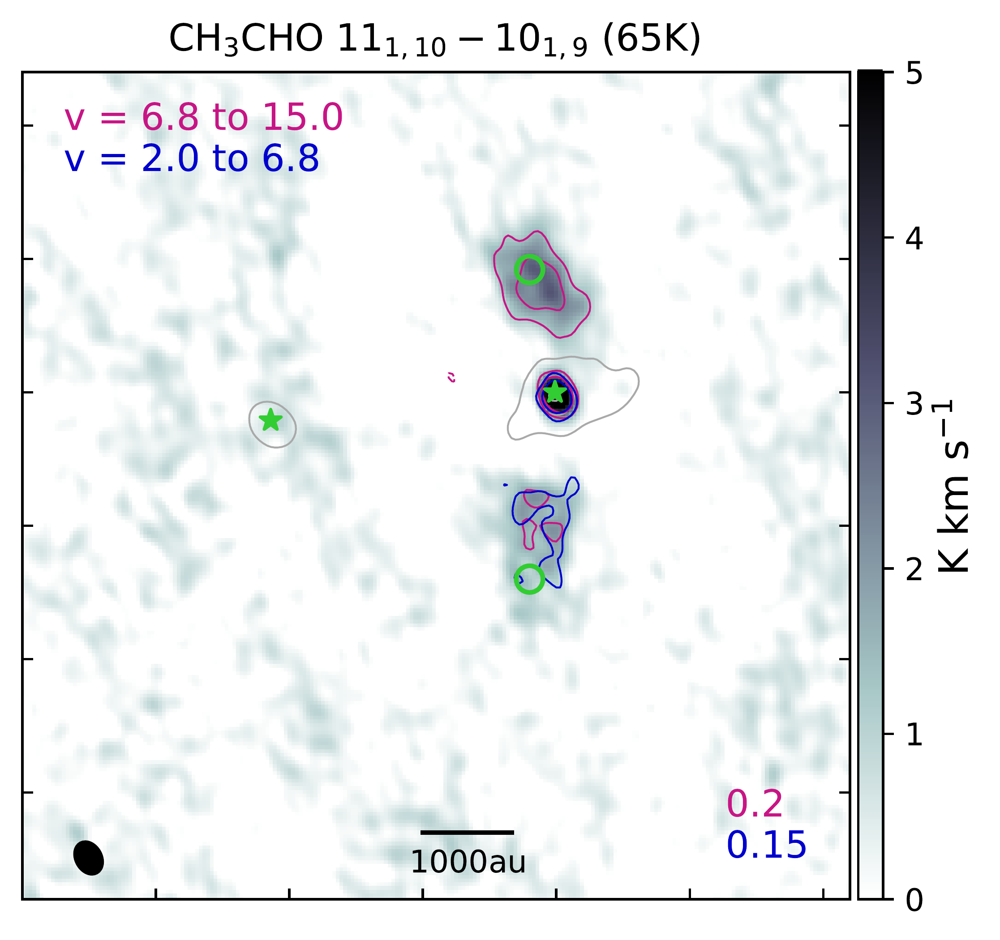
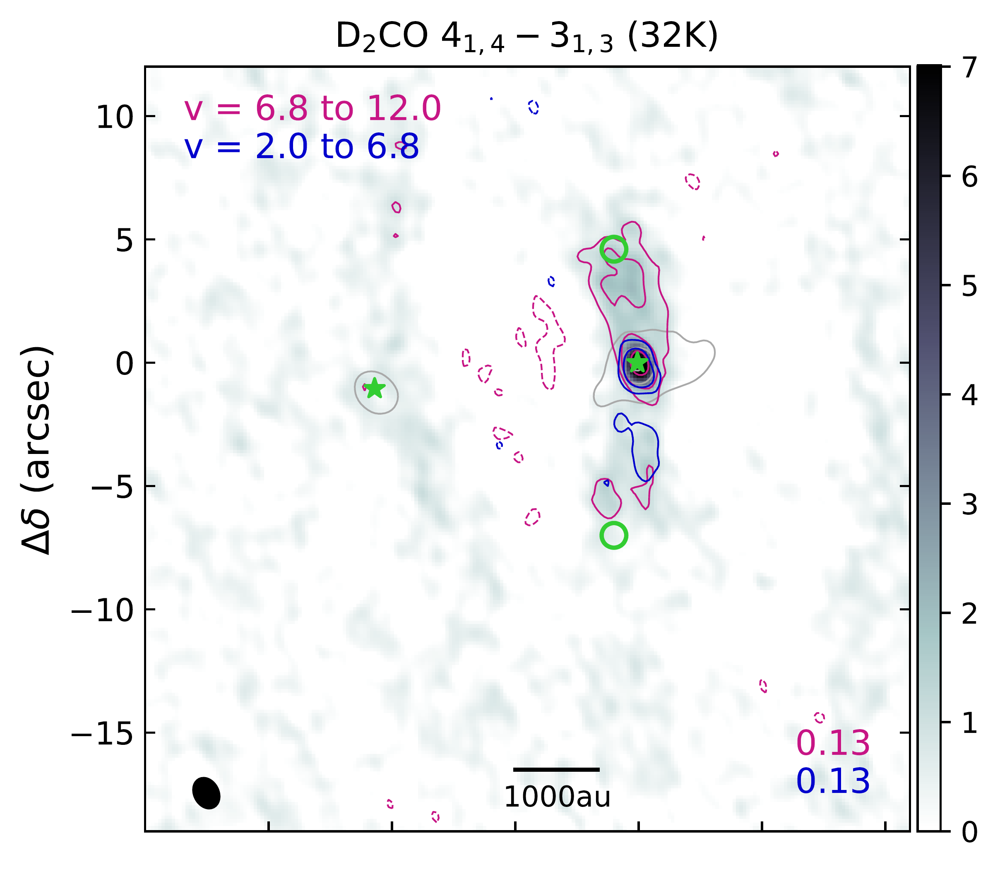
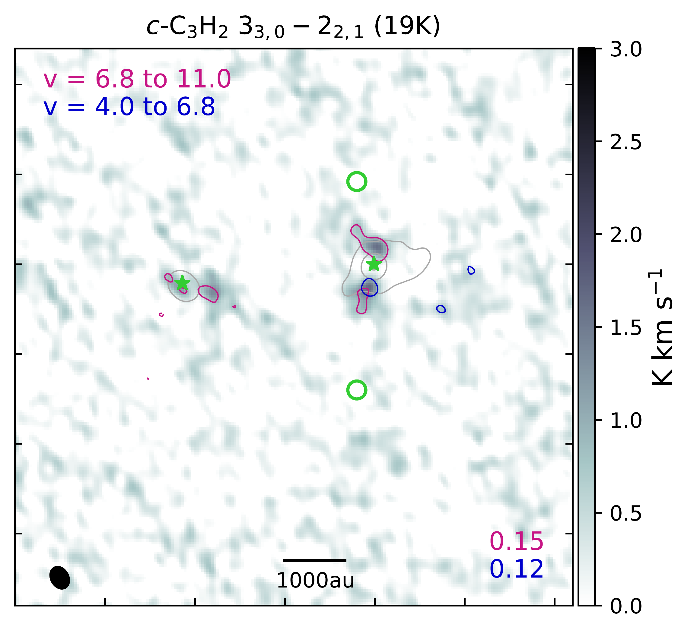

$\newcommand{\ensuremath}{}$
$\newcommand{\xspace}{}$
$\newcommand{\object}[1]{\texttt{#1}}$
$\newcommand{\farcs}{{.}''}$
$\newcommand{\farcm}{{.}'}$
$\newcommand{\arcsec}{''}$
$\newcommand{\arcmin}{'}$
$\newcommand{\ion}[2]{#1#2}$
$\newcommand{\textsc}[1]{\textrm{#1}}$
$\newcommand{\hl}[1]{\textrm{#1}}$
$\newcommand{\footnote}[1]{}$
$\newcommand{\mmc}{CH_3SH\xspace}$
$\newcommand{\met}{CH_3OH\xspace}$
$\newcommand{\metc}{CH_3CN\xspace}$
$\newcommand{\metctr}{CH_3^{13}CN\xspace}$
$\newcommand{\et}{C_2H_5OH\xspace}$
$\newcommand{\etc}{C_2H_5CN\xspace}$
$\newcommand{\vc}{C_2H_3CN\xspace}$
$\newcommand{\dme}{CH_3OCH_3\xspace}$
$\newcommand{\mf}{CH_3OCHO\xspace}$
$\newcommand{\mic}{CH_3NCO\xspace}$
$\newcommand{\ad}{CH_3CHO\xspace}$
$\newcommand{\fmm}{NH_2CHO\xspace}$
$\newcommand{\2}{_2}$
$\newcommand{\3}{_3}$
$\newcommand{\5}{_5}$
$\newcommand{\7}{_7}$
$\newcommand{\ct}{^{13}}$
$\newcommand{\cd}{^{12}}$
$\newcommand{\ratio}{^{12}C / ^{13}C\xspace}$
$\newcommand{\oratio}{^{16}O / ^{18}O\xspace}$
$\newcommand{\odh}{^{18}}$
$\newcommand{\scm}{cm^{-2}\xspace}$
$\newcommand{\kms}{ km s^{-1}\xspace}$

# PRODIGE -- envelope to disk with NOEMA: VII. (Complex) organic molecules in the NGC1333 IRAS 4B1 outflow: \ A new laboratory for shock chemistry

<mark>Appeared on: 2026-02-20</mark> -  _Accepted for publication in A&A_

L. A. Busch, et al. -- incl., <mark>C. Gieser</mark>, <mark>T. Henning</mark>, <mark>D. Semenov</mark>

**Abstract:** Shock chemistry is an excellent tool to shed light on the formation and destruction mechanisms of complex organic molecules (COMs). The L1157-mm outflow is the only low-mass protostellar outflow that has extensively been studied in this regard. We aim to map COM emission and derive the molecular composition of the protostellar outflow driven by the Class 0 protostar NGC 1333 IRAS 4B1 to introduce it as a new laboratory to study the impact of shocks on COM chemistry. We used the data taken as part of the PRODIGE (PROtostars \& DIsks: Global Evolution) large program to compute integrated intensity maps of outflow emission to identify spatial differences between species. The emission spectra were then analysed towards two positions, one in each outflow lobe, by deriving synthetic spectra and population diagrams assuming conditions of local thermodynamic equilibrium (LTE). In addition to typical outflow tracers such as SiO and CO, outflow emission is seen from H \2 CO, HNCO, and HC \3 N, as well as from the COMs $\met$ , $\metc$ , and $\ad$ , and even from deuterated species such as DCN, D \2 CO, and CH \2 DOH. Maps of integrated intensity ratios between $\met$ and DCN, D \2 CO, and $\ad$ reveal gradients with distance from the protostar. For DCN and D \2 CO, this may reflect their prestellar abundance profile, provided the outflow is young enough, while an explanation is  still required for $\ad$ .   Intensity ratio maps of HC \3 N and $\metc$ with respect to $\met$ peak in the southern lobe where temperatures are highest. This may point to enhanced HC \3 N and $\metc$ formation at this location, potentially in the warmer gas phase.   Rotational temperatures are found in the range $\sim$ 50 --100 K, which is, on average, warmer than for the L1157-B1 shock spot ( $\lesssim$ 30 K). Abundances with respect to $\met$ are higher by factors of a few than for L1157-B1. For the first time, we securely detected COMs $\metc$ , $\ad$ , and CH \2 DOH in the IRAS 4B1 outflow, serendipitously with limited sensitivity and bandwidth. Targeted observations will enable the discovery of new COMs and a more detailed analysis of their emission. Morphological differences between molecules in the IRAS 4B1 outflow lobes and their relative abundances provide first proof that this outflow is a promising new laboratory for shock chemistry, which will offer crucial information on COM formation and destruction as well as outflow structure and kinematics.

**Figure 11. -** Integrated intensity maps towards IRAS 4B1 and 4B2 (green stars) for the molecular transitions that are written on top with their respective upper-level energy. Contours are at $-$5$\sigma$ 5$\sigma$, 10$\sigma$, and then increase by a factor 3 for all but SiO, CO, H\2CO, and $\met$, for which contours start at $-$10$\sigma$ and 10$\sigma$. The noise levels, $\sigma$, are measured in the respective maps and are written in the bottom right. Velocity (in $\kms$) ranges for integration are indicated in the top left. The grey scale shows the sum of the red- and blueshifted maps. The HPBW is shown in the bottom left. The dashed grey circle indicates the primary beam ($\sim$23$\arcsec$). Positions R1 and B1 (green circles) are selected for further spectral-line analysis. (*fig:mom0*)

**Figure 1. -** Integrated intensity maps towards IRAS 4B1 (yellow star) for SiO 2 -- 1 ($E_u=31$ K; colour) and $\met$$4_2-3_1$ and DCN 3 -- 2 ($E_u=45$ K and 21 K, respectively; contours). The SiO maps are integrated from $-25$ to 6 $\kms$ and 6.8 to 47 $\kms$ and show emission above 10$\sigma$ with $\sigma_\mathrm{blue}=0.42$ K $\kms$ and $\sigma_\mathrm{red}=0.49$ K $\kms$. Contours are at $-$30$\sigma$,$-$15$\sigma$, 15$\sigma$, 30$\sigma$, and then increase by a factor of 3 for $\met$($\sigma_\mathrm{blue}=0.25$ K $\kms$ and $\sigma_\mathrm{red}=0.23$ K $\kms$) and at $-$10$\sigma$, $-$5$\sigma$, 5$\sigma$, 10$\sigma$, and then increase by a factor of 3 for DCN ($\sigma_\mathrm{blue}=0.17$ K $\kms$ and $\sigma_\mathrm{red}=0.24$ K $\kms$). Velocity ranges (in $\kms$) used for the integration of $\met$ and DCN emission are indicated in the top left. The HPBW is shown in the bottom left. Positions R1 and B1 were selected for further spectral-line analysis (Sect. \ref{ss:analysis}). Black crosses indicate H\2 knots \citep[][]{Choi2011}. (*fig:main*)

**Figure 2. -** Integrated intensity ratios, $(W_\mathrm{mol} / W_\mathrm{CH_3OH})$ / $( W_\mathrm{mol} / W_\mathrm{CH_3OH})_\mathrm{max}$ of various molecular transitions with either $\met$$10_{2,9}-9_{3,6}$($E_u=165$ K; for HC\3N and $\met$c) or $5_{1,4}-4_{2,2}$($E_u=56$ K; for D\2CO, DCN, HNCO, and $\ad$) towards the IRAS 4B1 outflow. Integrated intensities contain the sum of blue- and redshifted emission (cf. Fig. \ref{fig:mom0} and spectra in Fig. \ref{fig:spectra}). The ratio is only shown if both molecules are above a 5$\sigma$ threshold, where $\sigma$ is the noise level in the respective map. Another mask with a 1$\arcsec$  radius around the protostar is applied to the ratios.
    Black contours show the integrated intensities of $\met$, starting at $-5\sigma$, 5$\sigma$, and then increasing by a factor of 2, where $\sigma=0.34$ K $\kms$. The molecule as well as the upper-level energy of the shown transition are in the top left corner. In all panels, the white star marks the position of IRAS 4B1. The HPBW is shown in the bottom left corner and black crosses mark H\2 knots  ([Choi and Lee 2011](https://ui.adsabs.harvard.edu/abs/2011JKAS...44..201C)) . Spectroscopic information on the shown transitions are given in Table \ref{tab:lines}. (*fig:ratios*)

