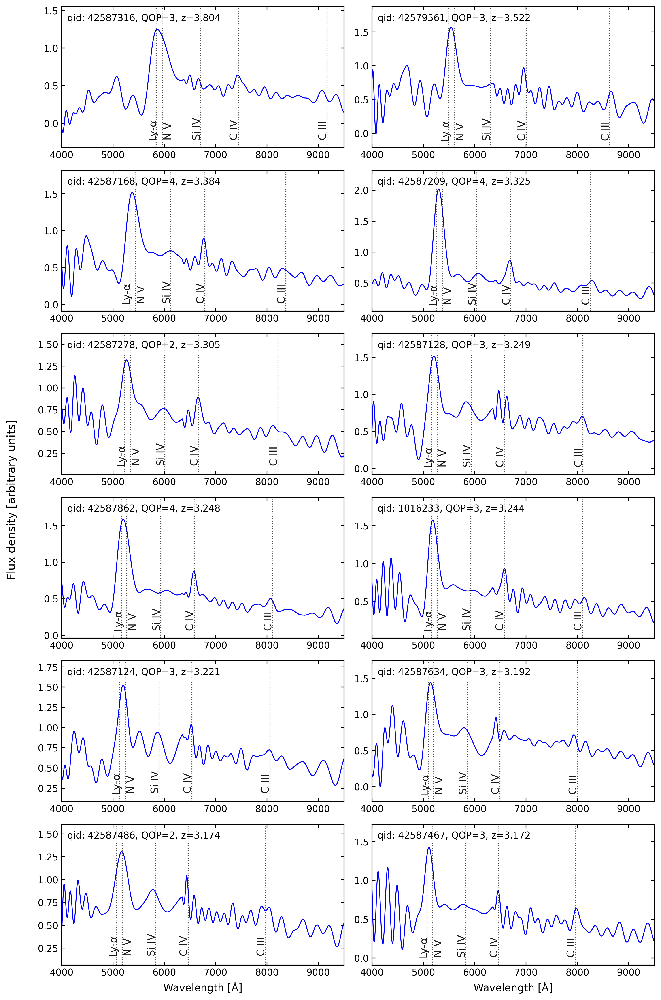
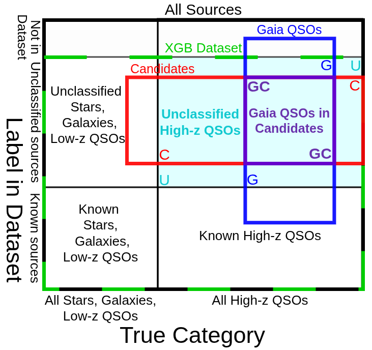
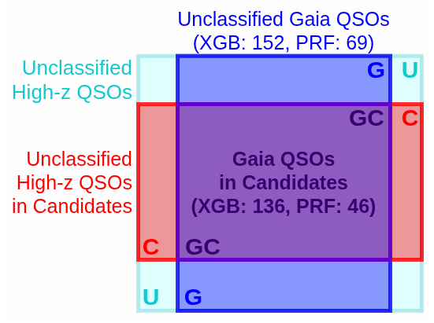
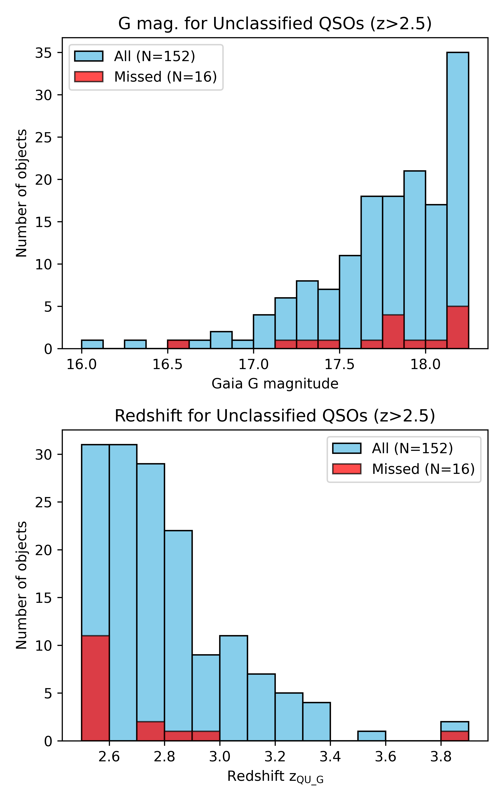

$\newcommand{\ensuremath}{}$
$\newcommand{\xspace}{}$
$\newcommand{\object}[1]{\texttt{#1}}$
$\newcommand{\farcs}{{.}''}$
$\newcommand{\farcm}{{.}'}$
$\newcommand{\arcsec}{''}$
$\newcommand{\arcmin}{'}$
$\newcommand{\ion}[2]{#1#2}$
$\newcommand{\textsc}[1]{\textrm{#1}}$
$\newcommand{\hl}[1]{\textrm{#1}}$
$\newcommand{\footnote}[1]{}$
$\newcommand{\rosso}{\color{red}}$
$\newcommand{\verde}{\color{green}}$
$\newcommand{\bottomfraction}{0.8}$
$\newcommand{\textfraction}{0.1}$

# Estimating the completeness of the QUBRICS Survey with 3501 QSO redshifts from Gaia DR3 spectra

<mark>Appeared on: 2026-03-10</mark> -  _14 pages, 9 figures, accepted for publication in Astronomy & Astrophysics; abstract abridged_

M. Porru, et al. -- incl., <mark>F. C. Tegli</mark>

**Abstract:** Quasi-Stellar Objects (QSOs) are essential for investigating the structure and evolution of the Universe. Historically, their identification has been concentrated in the northern hemisphere, primarily due to the sky coverage of major astronomical surveys. The QUBRICS (QUasars as BRIght beacons for Cosmology in the Southern hemisphere) survey, started in 2019 to address this asymmetry, has identified more than 1300 new bright ( $i<19.5$ ) high-redshift ( $2.5<z<6$ ) QSOs in the southern sky. This study aims to quantify, using an independent QSO sample, the completeness and recall of the QUBRICS QSO selection methods, based on XGB (eXtreme Gradient Boosting) and PRF (Probabilistic Random Forest), since completeness is a fundamental metric for ensuring the statistical robustness of QSO-based cosmological investigations. A subset ( $G<18.25$ , $|b|>25$ deg, negligible parallax and proper motion) of Gaia DR3 sources with low-resolution spectra was analyzed, obtaining a sample of 3501 QSOs.   To determine how many QSOs were correctly identified as candidates, we crossmatched this independent sample with the datasets used for selection: 894 QSOs with $z>2.5$ fell within the XGB dataset footprint, of which 152 were unclassified and thus eligible for completeness testing. Similarly, 675 QSOs with $z>2.5$ were within the PRF dataset footprint, including 69 unclassified objects. The XGB correctly identified as candidates 136 (89 \% ) of the 152 QSOs with $z>2.5$ present in the XGB dataset as unclassified objects.   The PRF correctly identified as candidates 46 (66 \% ) of the 69 QSOs with $z>2.5$ present in the PRF dataset as unclassified objects. These findings confirm the high efficiency of the QUBRICS selection methods (recall $=89\%$ ) and provide the completeness estimate for spectroscopically confirmed QSOs (82 \% ), necessary for cosmological studies using QUBRICS data. This work also provides reliable redshifts for 1223 new QSOs (median redshift $z=2.1$ and magnitude $G=17.8$ ), that will help improve the performance of future selections.

**Figure 8. -** Gaia spectra of the 12 highest-redshift QSOs discovered in this work (see Table \ref{tab:qso_sample}). (*Fig:qso_sample_spectra*)

**Figure 5. -** Schematic representation of the datasets used in the QUBRICS survey and in this paper. The outermost black rectangle contains all the sources within a given footprint and magnitude range.
    The green dashed rectangle denotes the dataset used in the XGB selection. Vertical divisions separate the sources according to their true category, while horizontal divisions separate the sources according to their label in the database. Known uninteresting sources (stars, galaxies, low-redshift QSOs) are in the bottom left quadrant; known high-redshift QSOs are in the bottom right quadrant; unclassified sources that are stars, galaxies or low-redshift QSOs are in the top left quadrant; unclassified sources that are high-redshift QSOs are in the top right.
    The region of interest is highlighted in cyan and by the letter {\color{cyan} U}: this is the set of of all true high-redshift QSOs that are unclassified in the dataset.
    The red rectangle represents the set of QSO candidates predicted by the XGB, and its intersection {\color{red} C} with the {\color{cyan} U} region is the set of unclassified high-redshift QSOs that are also candidates.
    The blue rectangle represents the set of Gaia QSOs, and its intersection {\color{blue} G} with the cyan {\color{cyan} U} region is the set of Gaia QSOs that are unclassified in the dataset.A zoom-in of the region of interest {\color{cyan} U} in Fig. \ref{fig:datasets_diagram}. The intersection {\color{violet} GC} between the blue and red rectangles is the set of unclassified high-redshift QSOs in the dataset that are both QSO candidates and in the Gaia QSO sample.
    Completeness and recall metrics are defined in terms of these intersections in Sect. \ref{sec:Reliability}. (*fig:datasets_diagram*)

**Figure 3. -** **Top panel**: histogram of the Gaia G magnitude for the 152 QSOs with no classification in the XGB sample, with the 16 QSOs that were not identified as candidates ("missed") highlighted in red.
    **Bottom panel**: histogram of the $z_{\rm QU\_G}$ redshifts for the 152 QSOs with no classification in the XGB sample, with the 16 QSOs that were not identified as candidates ("Missed") highlighted in red. (*Fig:xgb_G-z_hist*)

