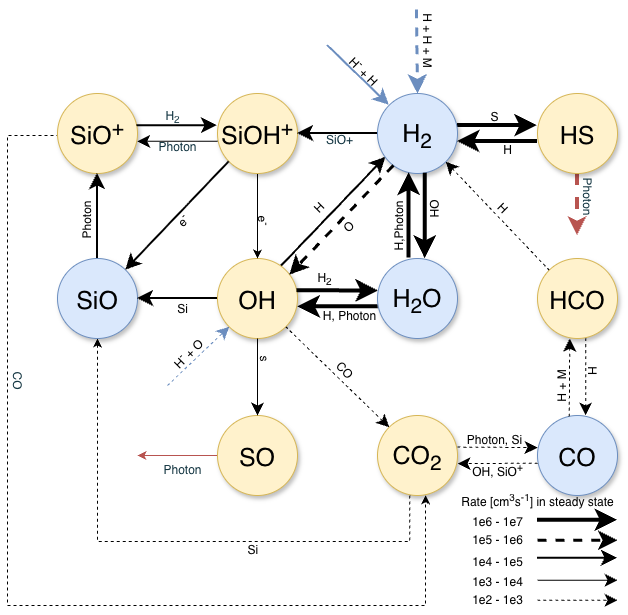
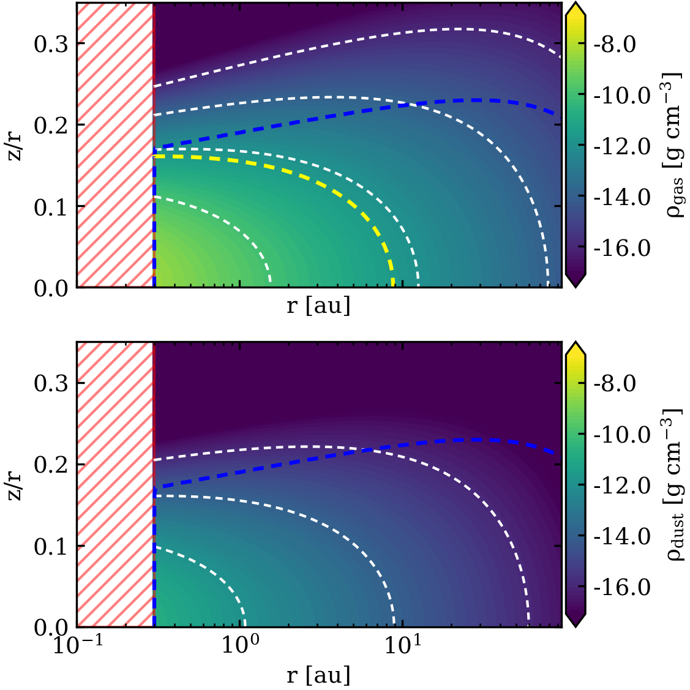
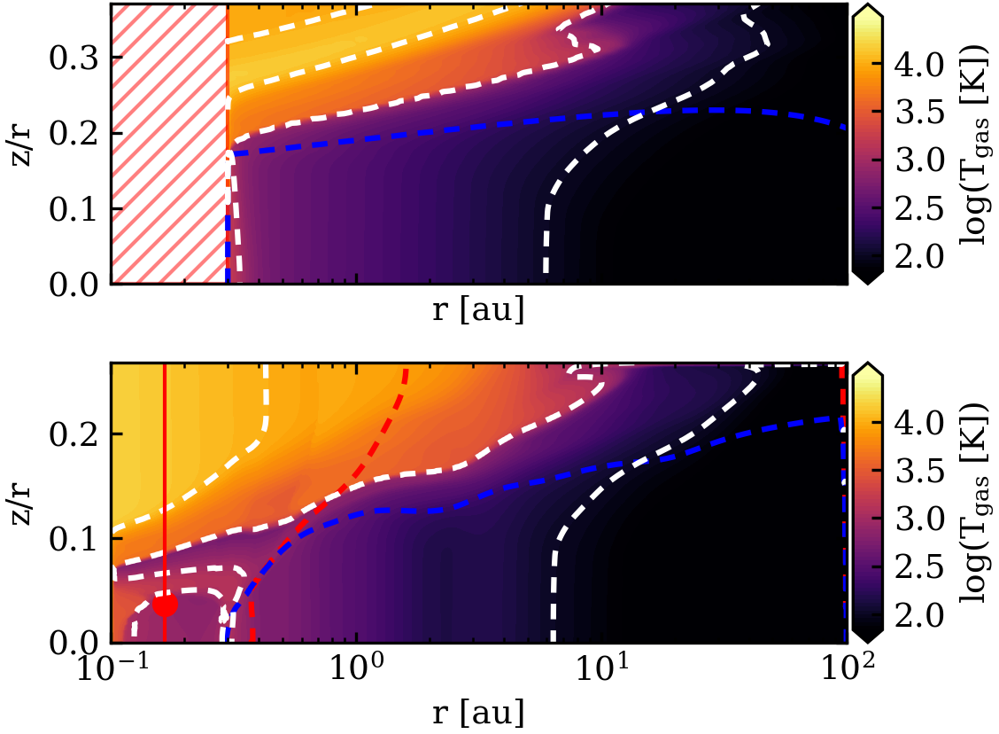

$\newcommand{\ensuremath}{}$
$\newcommand{\xspace}{}$
$\newcommand{\object}[1]{\texttt{#1}}$
$\newcommand{\farcs}{{.}''}$
$\newcommand{\farcm}{{.}'}$
$\newcommand{\arcsec}{''}$
$\newcommand{\arcmin}{'}$
$\newcommand{\ion}[2]{#1#2}$
$\newcommand{\textsc}[1]{\textrm{#1}}$
$\newcommand{\hl}[1]{\textrm{#1}}$
$\newcommand{\footnote}[1]{}$

# Gas chemistry in the dust depleted inner regions \    of protoplanetary disks: I. Near-IR spectra and overtones 

<mark>Appeared on: 2026-03-10</mark> -  _10 pages, 11 figures, accepted for publication in A&A_

J. Bethlehem, et al. -- incl., <mark>M. Flock</mark>

**Abstract:** The molecular composition inside the dust sublimation zones of protoplanetary disks is mostly unknown but important to understanding terrestrial planet formation. A few molecules have been observed from this region, specifically $\ce{CO}$ , $\ce{H2O}$ , $\ce{OH}$ and $\ce{SiO}$ . The small surface area makes observing this region difficult, hence modeling is required to disentangle the innermost disk from regions further out. We model a protoplanetary disk around a Herbig-type star including the dust depleted inner region ( $\approx$ 0.1-0.3 au) and aim to investigate the chemistry of this region and explain existing and future observations. We post-process the dust and gas distribution of a magnetohydrostatic model with the radiation thermochemical code ProDiMo to study the chemistry and to produce observables. We find that the dust free inner disk is a molecular rich environment, where besides $\ce{CO}$ we also find $\ce{H2}$ , $\ce{H2O}$ and $\ce{SiO}$ . The gas temperature profile is complex and fluctuates between 700 and 2000 K, which is warm enough to produce CO overtone line emission. Next to the CO overtone lines we also find strong high J-level fundamental CO lines between 4.3 and 4.6 $\si{\mu m}$ . The elemental enrichment of $\ce{Si}$ due to dust sublimation leads to 2 orders of magnitude more $\ce{SiO}$ abundance. The $\ce{SiO}$ gas has average temperatures of $\approx$ 1000 K resulting in strong $\ce{SiO}$ overtone emission in the spectral range between 4 and 4.3 $\si{\mu m}$ . We predict that the gas density in the dust depleted inner disk is high enough to allow for $\ce{H2}$ formation, resulting in an molecular rich environment. For our representative Herbig model, the dust-depleted inner disk is responsible for at least 90 \% of the line emission for $\ce{CO}$ and $\ce{H2O}$ between 1 and 28 $\si{\mu m}$ . Next to CO overtone lines, $\ce{SiO}$ overtone lines are expected to be an important tracer of a dust free inner disk.

**Figure 6. -** Reaction network of steady state chemistry at r = 0.165 au and z = 0.0061 au where $T_{\text{gas}} = 780\text{K}$. The abundances for the species marked in blue are shown in Fig. \ref{Molecules} and their formation and destruction reactions are described in more detail and shown in Table \ref{H2_formation}, \ref{CO_formation}, \ref{H2O_formation}\&\ref{SiO_formation}. (*Reaction_network*)

**Figure 2. -** Gas and dust density of a typical ProDiMo Herbig disk model. The red hatched area is generally not modeled as it is beyond the expected dust rim at 0.3 au. The blue dashed line indicates where the visual extinction reaches unity ($A_V = 1$), the white dashed contours align with the values on the colorbar. The yellow dashed line indicates where $n_{\langle H \rangle} = 10^{12}$\si{cm^{-3}}.  (*M1_dens*)

**Figure 4. -** The top panel shows the temperature profile of a standard ProDiMo model and the bottom shows the temperature profile of our model that includes a dust depleted inner disk and increased inner disk gas-phase elemental abundances (see Table \ref{Elemental composition}). The blue dashed line indicates where the visual extinction reaches unity ($A_V = 1$), the white contours show the gas temperatures of 100, 1000 and 10000 K. The red vertical line indicates where the temperature is analyzed in Fig. \ref{Heat_cool_abundance} and the red dot is the grid point at which the chemistry is analyzed (Fig. \ref{Reaction_network}). (*temp_profile*)

