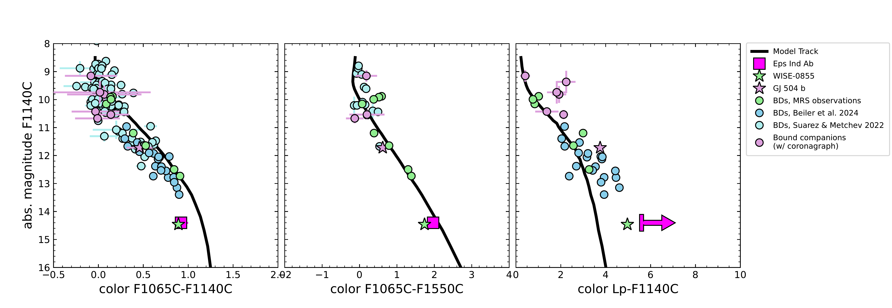
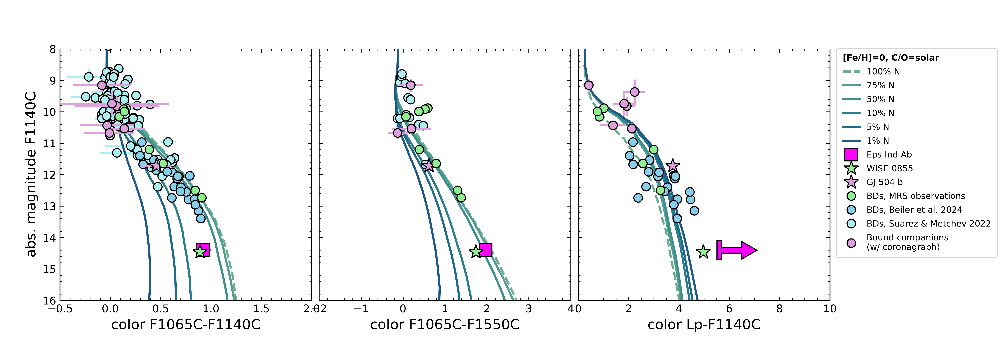
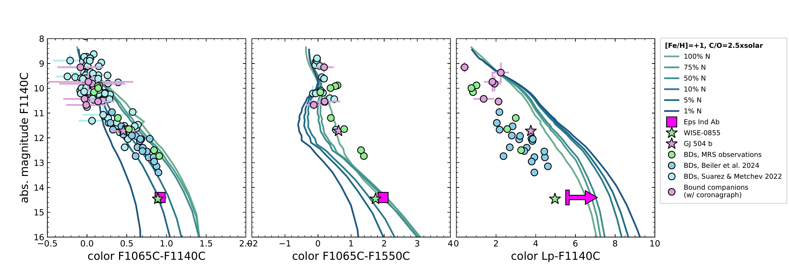
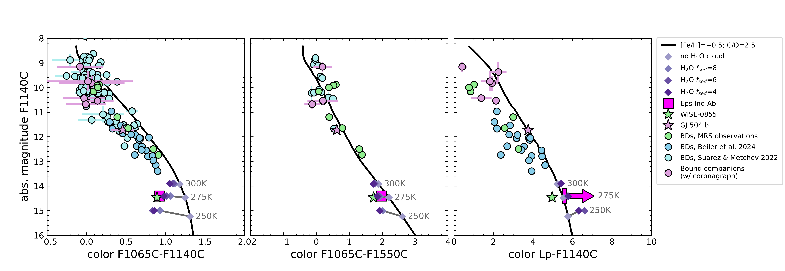
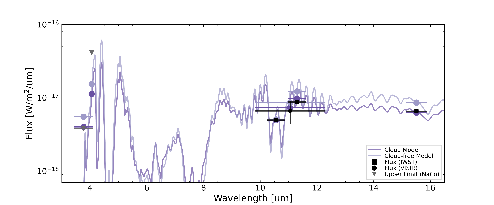

$\newcommand{\ensuremath}{}$
$\newcommand{\xspace}{}$
$\newcommand{\object}[1]{\texttt{#1}}$
$\newcommand{\farcs}{{.}''}$
$\newcommand{\farcm}{{.}'}$
$\newcommand{\arcsec}{''}$
$\newcommand{\arcmin}{'}$
$\newcommand{\ion}[2]{#1#2}$
$\newcommand{\textsc}[1]{\textrm{#1}}$
$\newcommand{\hl}[1]{\textrm{#1}}$
$\newcommand{\footnote}[1]{}$
$\newcommand{\vdag}{(v)^\dagger}$
$\newcommand$
$\newcommand$
$\newcommand{\Mjup}{\ensuremath{M_{\text{Jup}}}}$
$\newcommand{\arraystretch}{1.3}$

# A second visit to Eps Ind Ab with JWST: new photometry confirms ammonia and suggests thick clouds in the exoplanet atmosphere of the closest super-Jupiter.

<mark>Appeared on: 2026-03-11</mark> -  _Accepted for publication in ApJ Letters. 12 pages (7 figures, 3 tables) + appendices_

E. C. Matthews, et al. -- incl., <mark>B. Rajpoot</mark>, <mark>I. J. M. Crossfield</mark>

**Abstract:** With JWST, we are directly imaging cold ( $\sim$ 200-300K), solar-age giant exoplanets for the first time. At these temperatures many molecular features appear and water-ice clouds may condense and affect the emission spectrum; early photometric measurements of cold giant planets are already showing some tension with the predictions of cloud-free, solar-metallicity atmosphere models.Here we present new JWST/MIRI coronagraphic observations of the cold giant exoplanet Eps Ind Ab at 11.3 $\micron$ . Together with archival data, we use these new observations to study the atmosphere of this cold exoplanet, and we also re-fit its orbit, finding an updated mass of $7.6\pm0.7$ $\Mjup$ and an eccentricity of $0.24^{+0.11}_{-0.08}$ .The planet is significantly brighter (by $0.88\pm0.08$ mag) at 11.3 $\micron$ than at 10.6 $\micron$ , indicating the presence of ammonia. However, this ammonia feature is shallower than expected. This could indicate a low-metallicity or nitrogen-depleted atmosphere, but our preferred explanation is the presence of thick water-ice clouds that suppress the ammonia feature and the near-IR emission of Eps Ind Ab.Photometry of the small but growing sample of cold, giant exoplanets demonstrates that they are consistently fainter than expected between 3 to 5 $\micron$ , consistent with the water-ice cloud hypothesis. 10.6 $\micron$ and 11.3 $\micron$ photometry of this cold exoplanet sample would be valuable to determine whether the suppressed ammonia feature is universal, and to frame a new open question about the underlying physical cause.

**Figure 5. -** CMD positions of Eps Ind Ab, as well as a number of other cold brown dwarfs (with details provided in Section \ref{sec:archivalbds}), considering the three JWST filters as well as the NaCo L' filter (for which there is a non-detection of Eps Ind Ab; the base of the arrow is the 5$\sigma$ lower limit in L'-F1065C color for this planet). Models are from the Sonora Flame Skimmer grid (Mang et al. in prep.), and have solar metallicity and C/O and $K_{\rm zz}=10^7$ cm$^2$/s. These models broadly explain the population of warmer brown dwarfs, and in particular the trend whereby the F1065C-F1140C color becomes increasingly red, tracing an increasingly deep ammonia feature, in cooler brown dwarfs. However, both Eps Ind Ab and WISE 0855 show significantly bluer F1065C-F1140C colors than these simple models, indicating that the ammonia feature is smaller than expected. Eps Ind Ab and WISE 0855 have remarkably similar mid-IR magnitudes and colors, but Eps Ind Ab is significantly redder in L'-F1065C (i.e., it is significantly fainter at L'), and we discuss potential explanations in the text. (*fig:ammonia_cmd*)

**Figure 7. -** Same as Figure \ref{fig:ammonia_cmd}, but for models depleted in nitrogen. The top and bottom rows show respectively the case of solar metallicity and C/O, and of enhanced metallicity and C/O as found for Eps Ind Ab in  ([Matthews, Carter and Pathak 2024]()) . Percentage labels indicate the nitrogen content of each atmosphere as a fraction of equilibrium models, and the model from Fig. \ref{fig:ammonia_cmd} is highlighted with a dashed line. Atmospheres strongly depleted (to 5\%) in nitrogen are consistent with both the F1065C-F1140C color of Eps Ind Ab and WISE 0855, and strongly N-depleted atmospheres also have bluer L'-F1065C colors. However, only in models with _both_(1) depleted nitrogen and (2) enhanced metallicity and C/O is the L'-F1065C color sufficiently blue to match the observational constraints for Eps Ind Ab. (*fig:ammonia_cmd_depletion*)

**Figure 8. -** **Upper panel:** CMD as in Fig. \ref{fig:ammonia_cmd}, but with the impact of clouds highlighted. The black line shows the trend for the best-fit [Fe/H] and C/O from our small grid (see text), while the purple diamonds show the impact of introducing increasingly thick water-ice clouds (parametrized via $f_{\rm sed}$), for models with temperatures 250 K, 275 K and 300 K. Clouds have a more dramatic impact on the photometry at lower temperatures where they reduce the relative depth of the ammonia feature, making the F1065C-F1140C and F1065C-F1550C colors redder, and subdue the near-IR emission, making the Lp-F1140C color redder. (*fig:cloud_model*)

