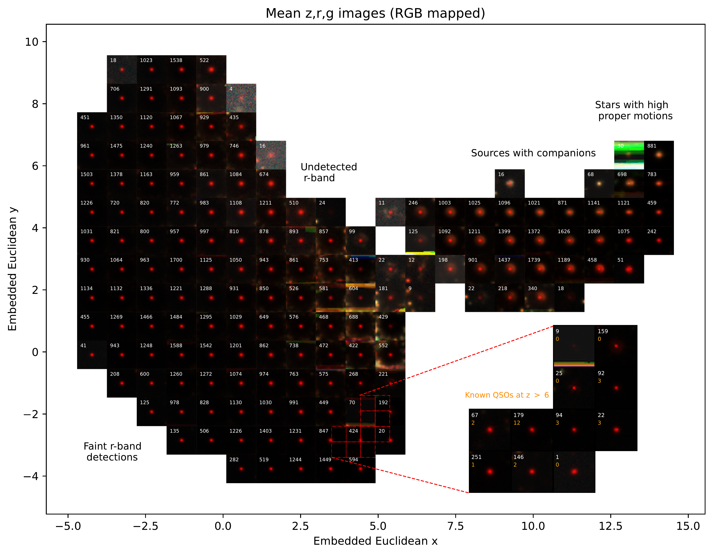
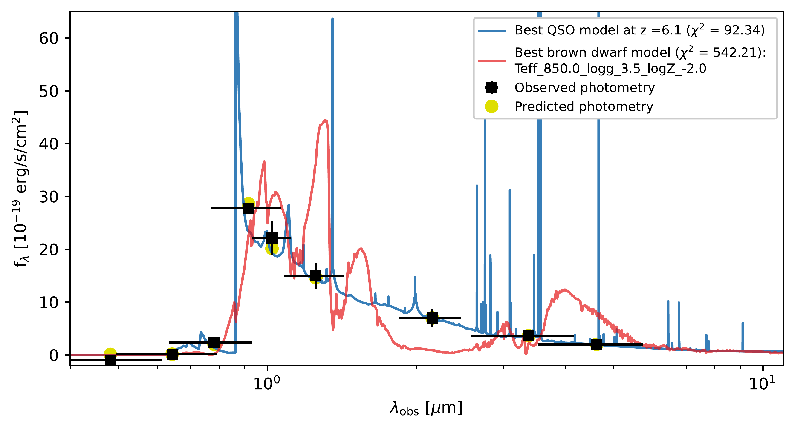
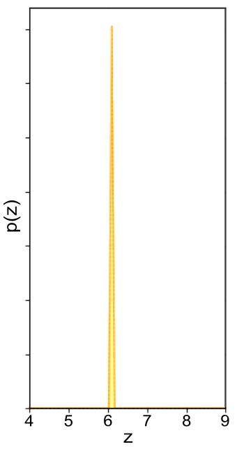
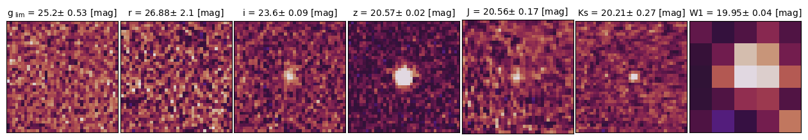
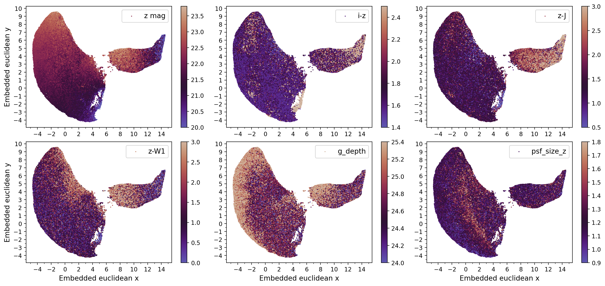

$\newcommand{\ensuremath}{}$
$\newcommand{\xspace}{}$
$\newcommand{\object}[1]{\texttt{#1}}$
$\newcommand{\farcs}{{.}''}$
$\newcommand{\farcm}{{.}'}$
$\newcommand{\arcsec}{''}$
$\newcommand{\arcmin}{'}$
$\newcommand{\ion}[2]{#1#2}$
$\newcommand{\textsc}[1]{\textrm{#1}}$
$\newcommand{\hl}[1]{\textrm{#1}}$
$\newcommand{\footnote}[1]{}$
$\newcommand{\orcid}[1]{\href{https://orcid.org/#1}{\includesvg[width=10pt]{plots/orcid.svg}}}$
$\newcommand$

# 16 new quasars at the end of the reionization unveiled by self-supervised learning

<mark>Appeared on: 2026-03-11</mark> -  _29 pages, 8 figures, Accepted for publication by A&A_

L. Martínez-Ramírez, et al. -- incl., <mark>J. Wolf</mark>, <mark>S. Belladitta</mark>, <mark>E. Bañados</mark>, <mark>R. E. Hviding</mark>

**Abstract:** Luminous quasars at _z_ $>$ 6 are key probes of early supermassive black hole (SMBH) growth, massive galaxy evolution, and intergalactic medium properties during cosmic reionization. However, their discovery is very challenging due to their scarcity and overwhelming contamination. Foreground ultracool dwarfs (UCDs) outnumber $z>6$ quasars by 2-4 orders of magnitude. In this work, we leveraged the extensive coverage of DESI Legacy Survey DR10 to conduct a self-supervised search for quasars at _z_ $>$ 6, directly analyzing multiband optical images and minimizing the biases of the traditional catalog-driven color-color selection criteria.  By applying a contrastive learning (CL) method followed by spectral energy distribution (SED) fitting prioritization, we identified 1139 high-priority quasar candidates, for which we expect a competitive 1:1 quasar-to-UCD ratio based on the literature samples. We spectroscopically confirm 16 new quasars at $z = 5.94-6.45$ , achieving a $45\%$ success rate.  Remarkably, all 16 objects are relatively bright (M $_{1450} < $ $-25.5$ ) quasars, including several with unusual properties such as narrow $\ion{Ly}{$\alpha$}$ emission (FWHM $\lesssim$ 2600 km s $^{-1}$ ), strong $\ion{Ly}{$\alpha$}$ + $\ion{N}{V}$ emission with an equivalent width $>100  Å$ , and a mild observed-frame red near-infrared (NIR) continua ( $z - J > 0.4$ ). Notably, three of them would have been missed by traditional color–color selections.  These results highlight the power of self-supervised machine learning, combined with SED fitting prioritization, to uncover rare, distant sources beyond the limitations of conventional techniques.  Our approach offers a scalable and robust framework for data mining and can be readily extended to forthcoming wide-field surveys such as Rubin/LSST, 4MOST, _Euclid_ , and Roman.  These applications will advance the census of high-redshift quasars, potentially extend the redshift frontier, and improve constraints on SMBH formation and evolution in the first billion years of the Universe.

**Figure 8. -** Mean pixel-by-pixel $z$, $r$, and $g$ band fluxes (RGB mapped) within $15 \times 15$ binned embedded space. The number of sources within each bin contributing to the mean is shown in white in the upper left side of each image. The red dashed lines highlight a region with the highest number of known quasars, with a zoom-in binned embedded space on the right side. The number of known quasars in each bin at the zoom-in plot is shown in orange, below the number of sources in white.  (*average_images*)

**Figure 9. -** Example of an SED fitting result and the photometric redshift probability distribution function (_top panels_). LS DR10, VHS DR7, and WISE postage stamps of the photometry used (_bottom panel_) for the source LS J000-79.
   _Top left_: The blue curve represents the best-fit model given by the QSO1 template (see \citealt{salvato2022erosita} for details) at redshift 6.096, while the red curve shows the best-fit brown dwarf template from \cite{meisner2021new}. The observed photometry represented by black squares with error bars corresponds to the DECam, VHS, and WISE catalogs and their uncertainties, while the yellow circles are the expected flux densities assuming the best quasar model. _Top right_: photometric redshift probability distribution function. Despite the distribution extending over $z = [0,12]$, we limited the plot to the range $z = [4,9]$ for better visualization. (*SEDfitting_PSO1.55*)

**Figure 11. -** Color-coded embedded space maps showing catalog photometric features.  _Top row_(left to right): $z$-band magnitude, $i-z$ color, and $z-J$ color. _Bottom row_: $z$-W1 color, $g$-band depth, and $z$-band PSF size. _Top left_: magnitude gradients across both regions underscore the crucial role of the brightness in shaping the low-dimensional representation. _Top center_: Multiple regions of strong $i-z$ color indicate that while this feature may not fully dominate the embedding, it still plays a key role—evidenced by patterns and some clustering that overlap with the positions of spectroscopically confirmed quasars. _Top right_: The $z-J$ color map reveals populations consistent with blue quasars ($z-J \leq 0.5$), quasars with intermediate colors ($z-J \sim 1.0$–1.5), and a population with red NIR slopes ($z-J >2 $), supporting the potential of the model to uncover diverse quasar types. _Bottom left_: Red $z$-W1 colors seem to reflect the W1 blending due to companions and potential faint T dwarf populations. _Bottom center_: Subtle observational systematics, such as variations in background noise texture, may influence the latent space structure as evidenced by the $g$-band depth pattern.  _Bottom right_: Larger PSFs point to a mix of slightly extended or noisy $z$-band images. (*photometric_properties*)

