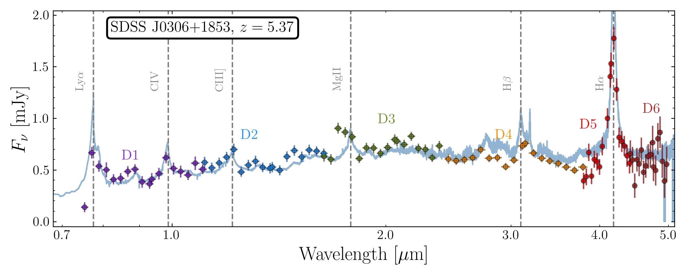
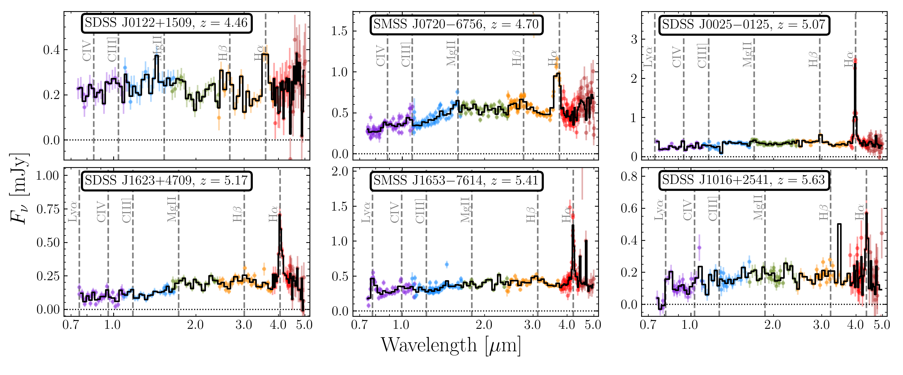
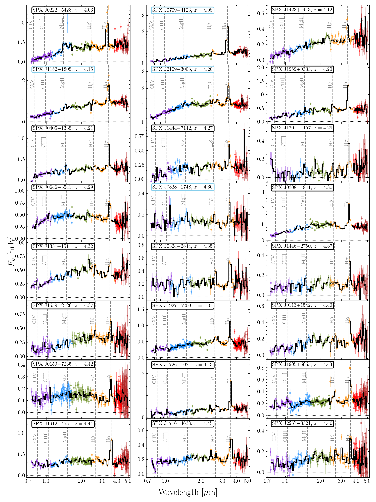

$\newcommand{\ensuremath}{}$
$\newcommand{\xspace}{}$
$\newcommand{\object}[1]{\texttt{#1}}$
$\newcommand{\farcs}{{.}''}$
$\newcommand{\farcm}{{.}'}$
$\newcommand{\arcsec}{''}$
$\newcommand{\arcmin}{'}$
$\newcommand{\ion}[2]{#1#2}$
$\newcommand{\textsc}[1]{\textrm{#1}}$
$\newcommand{\hl}[1]{\textrm{#1}}$
$\newcommand{\footnote}[1]{}$
$\newcommand{\hiztot}{306 }$
$\newcommand{\hizknown}{219 }$
$\newcommand{\hiznew}{87 }$
$\newcommand{\hiznewb}{19 }$
$\newcommand{\hizconf}{11 }$
$\newcommand{\hizconfb}{29 }$
$\newcommand{\lowztot}{247 }$
$\newcommand{\lowzknown}{44 }$
$\newcommand{\lowznew}{203 }$
$\newcommand{\noop}[1]$
$\newcommand\natexlab{#1}$

# Three Hundred Quasars from the Couch:\ A first look at high-redshift quasar discovery with SPHEREx:  

<mark>Appeared on: 2026-03-12</mark> -  _12+4 pages, 11+2 figures, submitted to A&A_

F. B. Davies, et al. -- incl., <mark>E. Bañados</mark>, <mark>S. Belladitta</mark>

**Abstract:** Photometric selection of luminous high-redshift ( $z\gtrsim4$ ) quasars is plagued by contamination from numerous low-mass Galactic stars, reddened lower-redshift quasars, as well as compact luminous red galaxies. Confirmation of these rare objects thus requires extensive spectroscopic campaigns on 4 and 8-meter-class telescopes with relatively low success rates. Here we demonstrate the utility of SPHEREx spectrophotometric survey data for quasar confirmation with no ground-based follow-up required, "from the couch," applied to candidates from a purposefully simplistic photometric and astrometric $*Gaia*$ + $*WISE*$ selection down to low Galactic latitudes ( $|b|\geq8^\circ$ ). Primarily from the detection of their strong broad H $\alpha$ emission lines, we discover $\hiznew$ new luminous $4.0 < z < 5.7$ quasars with median $M_\text{1450} = -27.5$ , including $\hiznewb$ quasars at $z>5$ , and recover $\hizknown$ previously published quasars at $z>4$ . We validate our SPHEREx selection with a 100 \% confirmation rate in ground-based spectroscopic follow-up of $\hizconfb$ of our new $z>4$ quasars, including $\hizconf$ unpublished archival spectra. We also discover $\lowznew$ additional lower-redshift quasars at $0.3 < z < 4$ , consisting primarily of relatively rare highly-reddened and strong broad-absorption-line objects that are likely missed by traditional quasar surveys. Finally, we show that the Ly $\alpha$ absorption breaks and H $\alpha$ lines of luminous quasars are already detectable at redshifts $5.7\lesssim z\lesssim6.5$ after the completion of only the first of four all-sky surveys to be performed by SPHEREx during its planned two-year mission.

**Figure 4. -** SPHEREx spectrophotometry of the luminous ($M_{1450} = -28.9$) previously-known quasar SDSS J0306$+$1853 \citep{Wang15} at $z=5.37$\citep{Brazzini25} is shown by the colored points, and the blue curve shows the \citet{Selsing16} quasar template for comparison. The labels D1 through D6 indicate the six detectors of SPHEREx probing consecutive spectrophotometric bands. The most prominent features enabling the quasar's idenfication in SPHEREx data are the broad and strong H$\alpha$ line and the Ly$\alpha$ continuum break. (*fig:j0306*)

**Figure 7. -** Example spectrophotometry of previously known quasars recovered by our SPHEREx quasar search. The small transparent rainbow points show the raw measurements from the individual SPHEREx detectors (e.g. Figure \ref{fig:j0306}),
    while the black curve is re-binned onto a common wavelength grid.
    The wavelengths of common emission lines are shown by the vertical dashed lines. (*fig:hiz_known*)

**Figure 8. -** Gallery of new $4 < z < 5$ quasars identified in our SPHEREx search. Similar to Figure \ref{fig:hiz_known}, the wavelengths of common emission lines are shown by the vertical dashed lines. (*fig:z45_1*)

