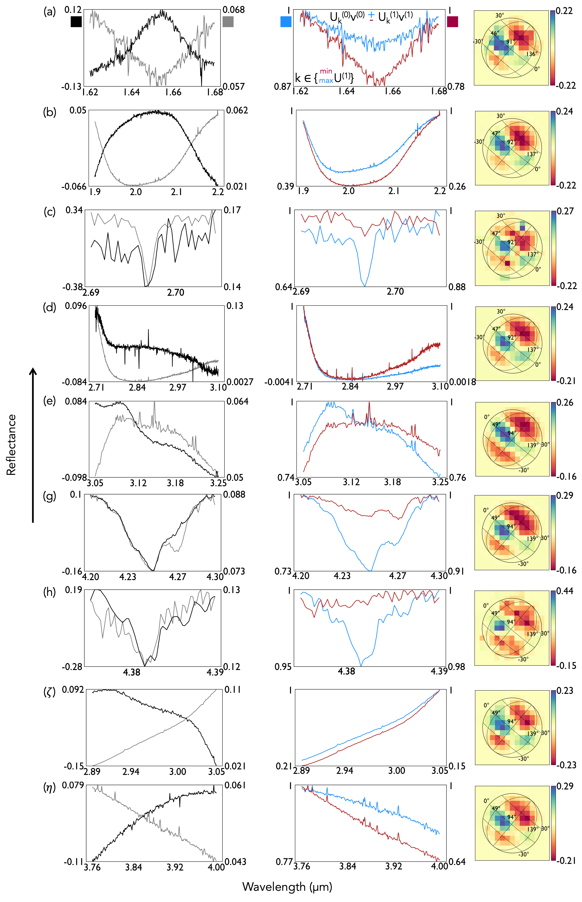

$\newcommand{\ensuremath}{}$
$\newcommand{\xspace}{}$
$\newcommand{\object}[1]{\texttt{#1}}$
$\newcommand{\farcs}{{.}''}$
$\newcommand{\farcm}{{.}'}$
$\newcommand{\arcsec}{''}$
$\newcommand{\arcmin}{'}$
$\newcommand{\ion}[2]{#1#2}$
$\newcommand{\textsc}[1]{\textrm{#1}}$
$\newcommand{\hl}[1]{\textrm{#1}}$
$\newcommand{\footnote}[1]{}$
$\newcommand{\vdag}{(v)^\dagger}$
$\newcommand$
$\newcommand$

# Spectral Decomposition Reveals Surface Processes on Europa

<mark>Appeared on: 2026-03-12</mark> - 

G. Yoffe, <mark>S. Shahaf</mark>

**Abstract:** Competing processes shape Europa's surface: geological activity replenishes material through resurfacing, while bombardment by charged particles alters surface chemical composition. Each process leaves distinct spectral signatures. We present a novel data-driven analysis of JWST NIRSpec-IFU observations of Europa's leading hemisphere across three observing geometries, targeting nine spectral bands sensitive to water ice, radiolytic products, and volatiles. Through spectral factorization, we isolate the dominant components of spectral variability and reconstruct their spatial distributions. We find that $CO_2$ enrichment extends beyond Tara Regio, and covers multiple chaos units in a lens-like pattern. These $CO_2$ -enriched areas co-occur with anomalous ice-texture signatures. Together, these findings suggest that enrichment in volatiles on Europa may reflect retention-favorable near-surface microphysics as well as emplacement, refining how they are interpreted in the context of surface--interior exchange.This has implications for interpreting the sources and supply rates of extant carbon-bearing species and, ultimately, for assessing Europa's habitability.

**Figure 3. -** Spectral and spatial modes of Europa's diagnostic bands. Left: zeroth and first spectral modes, $v^{(0)}$(gray) and $v^{(1)}$(black) (see Section \ref{sec: principal spectra}). The left and right ordinates give the true extrema of $v^{(0)}$ and $v^{(1)}$, marked by gray and black squares in panel (a), while the plotted curves are rescaled for clarity. Middle: spectra from the spaxels where the first spatial mode ($u^{(1)}$) peaks (blue) and reaches its minimum (red), each scaled so its own maximum is 1 (minima shown relative to that peak). The left ordinate corresponds to the blue spectrum and the right ordinate to the red spectrum, as indicated by the colored squares in panel (a); both spectra are rescaled for presentation. Right: first spatial mode, $u^{(1)}$, corresponding to the principal spectra shown in the middle and left panels (see Section \ref{sec: spatial modes}). (*fig: spectrum_decomposition*)

**Figure 4. -** Qualitative projections of best-fit spherical harmonic models for the first-order spatial modes, $u^{(1)}$, associated with four molecular bands (labeled a-h, excluding the $H_2$$O_2$ feature) and two newly characterized broadband continuum band-widening features (labeled $\zeta$,$\eta$), overplotted on a binary mask of Tara (black; right-hand feature) and Powys (black; left-hand feature) Regiones. Colors indicate the signed values of $u^{(1)}$(blue: positive; red: negative), scaled to the extrema of each fitted mode; corresponding numerical ranges are shown in Figure \ref{fig: spectrum_decomposition}. (*fig: projections*)

**Figure 5. -** Qualitative projections of the best-fit three-dimensional spherical-harmonic model to the jointly decomposed first spatial mode, $u^{(1)}$, derived from three viewing geometries of Europa's leading hemisphere. (e) Water-ice 3.1 µm Fresnel peak ($\ell_{\rm{max}}=6$). (g) $CO_2$ absorption doublet near 4.25 µm ($\ell_{\rm{max}}=7$). Shaded outlines mark Tara, Powys, and the leading-hemisphere part of Annwn Regiones. The left panels show jointly decomposed spectral modes ($v^{(0)}$ and $v^{(1)}$ in gray and black, respectively) and spectra from the spaxels where the joint spatial mode peaks (blue) and reaches its minimum (red).
 (*fig: fresnel_co2_mult_proj*)

