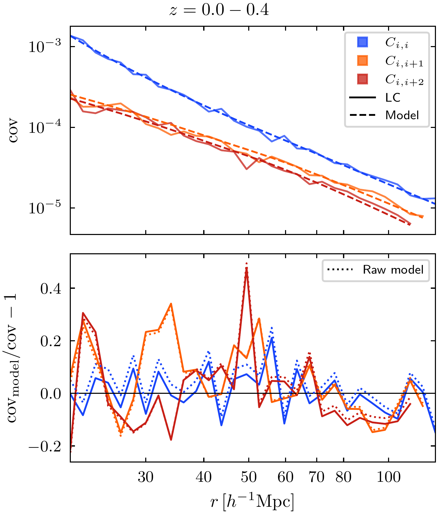
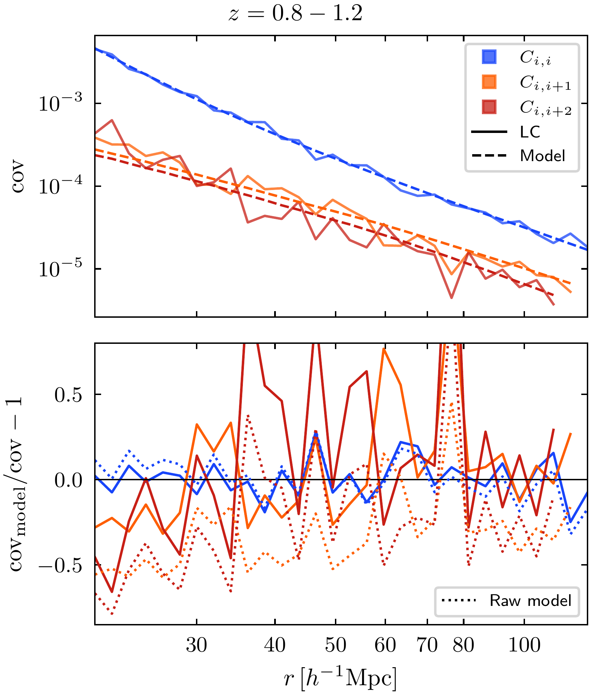
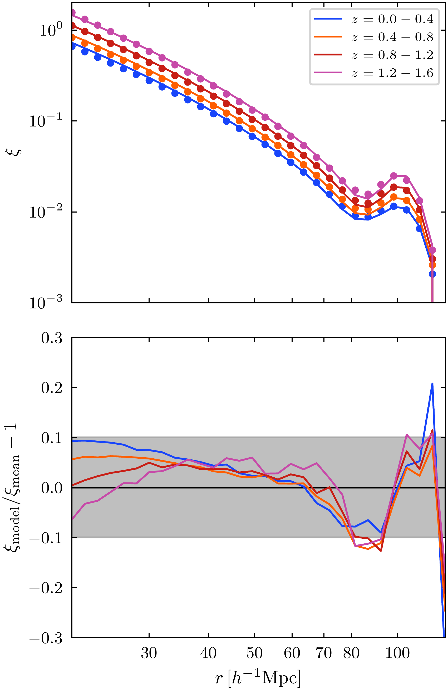
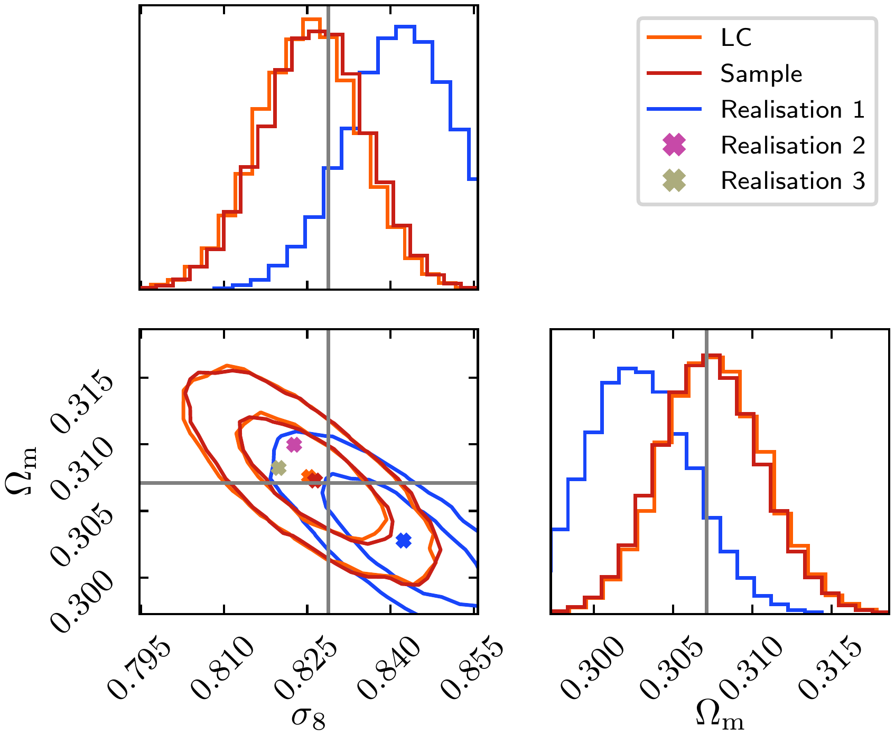

$\newcommand{\ensuremath}{}$
$\newcommand{\xspace}{}$
$\newcommand{\object}[1]{\texttt{#1}}$
$\newcommand{\farcs}{{.}''}$
$\newcommand{\farcm}{{.}'}$
$\newcommand{\arcsec}{''}$
$\newcommand{\arcmin}{'}$
$\newcommand{\ion}[2]{#1#2}$
$\newcommand{\textsc}[1]{\textrm{#1}}$
$\newcommand{\hl}[1]{\textrm{#1}}$
$\newcommand{\footnote}[1]{}$
$\newcommand{\ev}[1]{\langle #1\rangle}$
$\newcommand{\hinvmpc}{h^{-1}{\rm Mpc}}$
$\newcommand{\Minv}{M^{-1}}$
$\newcommand{\Msun}{M_{\odot}}$
$\newcommand{\N}[1]{N_{\rm #1}}$
$\newcommand{\Om}{\Omega_{\rm m}}$
$\newcommand{\Pm}{P_{\rm m}(k)}$
$\newcommand{\thetab}{\vec{\Theta}}$
$\newcommand{\datab}{\vec{d}}$
$\newcommand{\modelb}{\vec{m}(\thetab)}$
$\newcommand{\covb}{\mathbf{C}(\thetab)}$
$\newcommand{\invcovb}{\mathbf{C}^{-1}(\thetab)}$
$\newcommand{\vl}[1]{\textcolor{red}{VL: #1}}$
$\newcommand{\ek}[1]{\textcolor{blue}{EK: #1}}$
$\newcommand{\jv}[1]{\textcolor{magenta}{JV: #1}}$
$\newcommand{\orcid}[1]$

# $\Euclid$\/: The linear-construction covariance and cosmology$\thanks{This paper is published on     behalf of the Euclid Consortium}$

<mark>Appeared on: 2026-03-12</mark> -  _12 pages, 5 figures, 3 tables_

V. Lindholm, et al. -- incl., <mark>K. Jahnke</mark>

**Abstract:** ${We study the properties of galaxy cluster 2-point correlation function covariance matrices estimated using the linear-construction (LC) method, which is computationally up to 20 times faster than   the standard sample-covariance method. Our goal is to assess how well the LC method performs in cosmological parameter estimation compared to the sample covariance.}$ ${We use a set of 1000 mock dark matter halo catalogues to compute both the LC-covariance and the sample-covariance estimates in four redshift shells. These numerical matrices are used to fit a theoretical four-parameter model for the covariance.   We then use the two fitted covariance models in a likelihood function to estimate two cosmological parameters -- the matter density parameter $\Om$ and the amplitude of the matter density fluctuations $\sigma_8$ -- from the simulated mock catalogues. The purpose of this is to validate the LC-covariance-based model against the sample-covariance model. The catalogues were simulated assuming the spatially flat $\Lambda$CDM cosmology, with $\Om = 0.30711$ and $\sigma_8=0.8288$.   }$ ${We find that the parameter posteriors obtained using the sample- and LC-covariance models agree well with each other and with the simulation cosmology. The two pairs of marginalized constraints are $\Om = 0.307 \pm 0.003$ and $\sigma_8 = 0.826\pm 0.009$ (sample covariance), and $\Om = 0.308 \pm 0.003$ and $\sigma_8 = 0.825 \pm 0.009$ (LC covariance). The posterior widths are the same, and the difference in the median values is less than $0.16 \sigma$ for both parameters.}$

**Figure 4. -** Comparison of the covariance model and the numerical LC covariance. *Top panels*: the first three diagonals of the LC covariance (solid lines), and the model covariance (dashed lines) from Eq. \eqref{eq:cov-model2} with parameters $p_k$ for LC given in Table \ref{tab:params-cov}. *Bottom panels*: the relative difference of the model with respect to the LC covariance (solid lines), in addition to the difference of the "raw" covariance model (the free parameters $p_k$ set to unity in Eq. \ref{eq:cov-model2} or Eq. \ref{eq:cov-model3}) with respect to the numerical LC covariance (dotted lines). *Left column*: the $z=0.0$--$0.4$ shell. *Right column*: the $z=0.8$--$1.2$ shell. (*fig:cov-diags-lc*)

**Figure 1. -** Comparison of the modelled 2PCF, $\xi(r)$, and the mean measured from 1000 simulations. *Top panel*: the mean measured (points) and model (solid lines) 2PCF in four redshift shells. *Bottom panel*: the relative difference between the model and the measurement. The grey box shows the 10\% region. (*fig:xi*)

**Figure 2. -** Posterior distribution for $\Om$ and $\sigma_8$ obtained from four redshift shells. The LC covariance is shown in orange, and the sample covariance in red. The grey crosshair shows the values used in the simulation. The blue contours show the posterior in the case of the sample covariance, when constructing a likelihood from a single 2PCF realisation instead of the mean over the 1000 light cones. Crosses of corresponding colours show the median of each distribution. We have also plotted medians from two additional individual realisations to further illustrate their spread. The 2D contours correspond to the 68\% and 95\% confidence regions. (*fig:posterior*)

