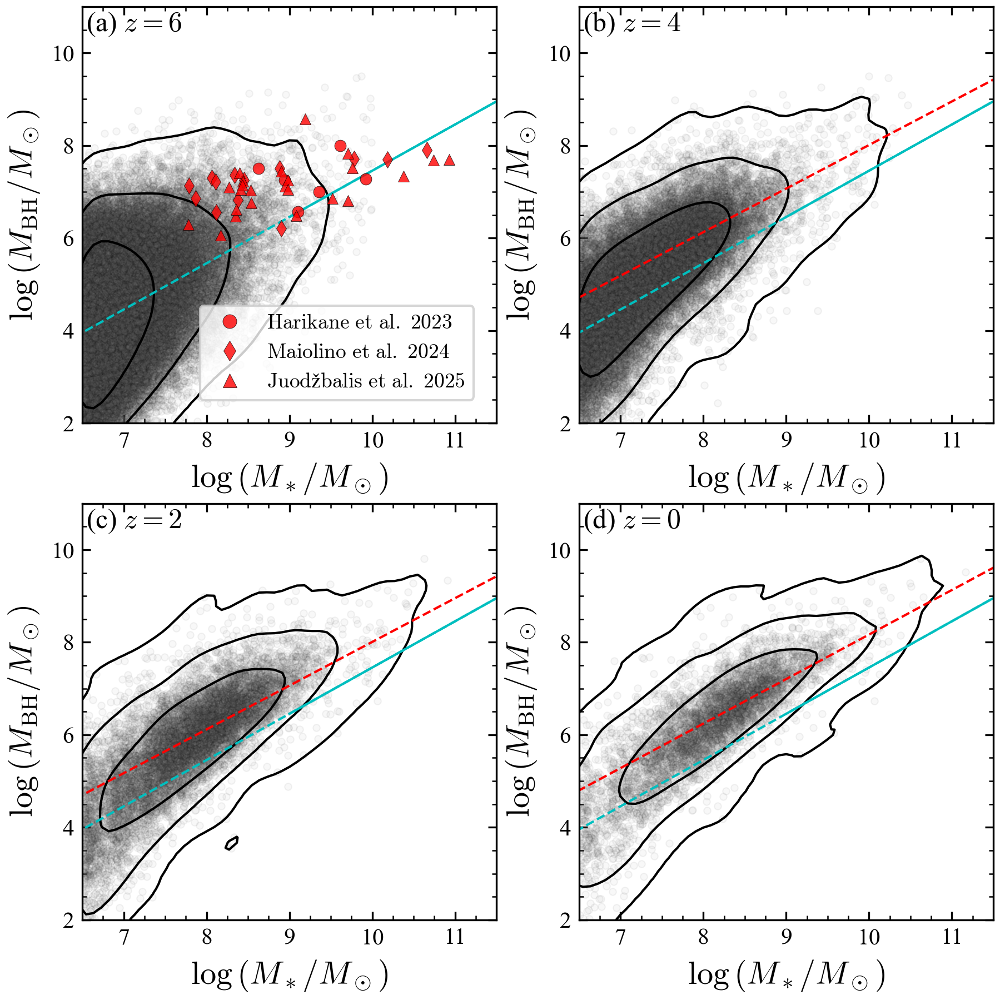
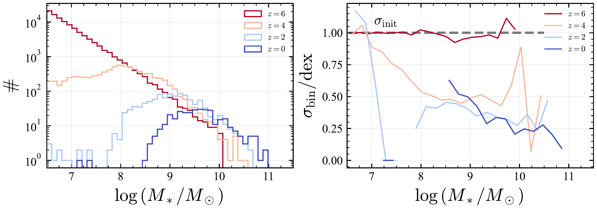
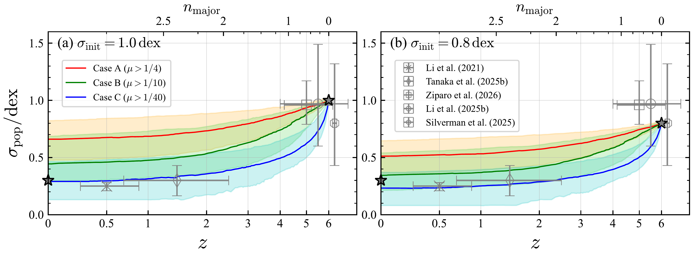

$\newcommand{\ensuremath}{}$
$\newcommand{\xspace}{}$
$\newcommand{\object}[1]{\texttt{#1}}$
$\newcommand{\farcs}{{.}''}$
$\newcommand{\farcm}{{.}'}$
$\newcommand{\arcsec}{''}$
$\newcommand{\arcmin}{'}$
$\newcommand{\ion}[2]{#1#2}$
$\newcommand{\textsc}[1]{\textrm{#1}}$
$\newcommand{\hl}[1]{\textrm{#1}}$
$\newcommand{\footnote}[1]{}$
$\newcommand{\theH@article}$
$\newcommand{\theHsection}{\arabic{section}}$
$\newcommand{\theHsubsection}{\arabic{section}.\arabic{subsection}}$
$\newcommand{\theHsubsubsection}{\arabic{section}.\arabic{subsection}.\arabic{subsubsection}}$

# Merger-driven buildup of the $M_{\rm BH} \mathchar`- M_*$ relation bridging $\hbox{high-$z$}$ overmassive black holes with the local relation

<mark>Appeared on: 2026-03-13</mark> -  _9 pages and 8 figures_

T. S. Tanaka, et al. -- incl., <mark>K. Jahnke</mark>, <mark>J. Li</mark>

**Abstract:** The origin of the mass scaling relation between supermassive black holes (SMBHs, $M_{\rm BH}$ ) and galaxies ( $M_*$ ) remains a key open question.Rather than invoking AGN feedback, a non-causal mechanism has been proposed in which multiple mergers average out the $M_{\rm BH}/M_*$ ratio, thus decreasing its scatter ( $\sigma$ ) and forming a tight local mass relation over cosmic history.A larger scatter in the relation at higher redshift suggested from a non-causal evolutionary scenario may be evident from recent JWST observations of overmassive SMBHs at high redshift.Here, we carry out a Monte Carlo simulation of solely merger-induced evolution of galaxies and their SMBHs which incorporates recent high-redshift observational constraints on $\sigma$ and the galaxy merger rate.We find that the dispersion in the local mass relation can be reproduced, even when starting from a highly scattered population at $z\sim6$ with $\sigma=0.8 {\rm dex}$ or $1.0 {\rm dex}$ , which are in agreement with recent JWST studies.The redshift evolution of the scatter is highly sensitive to the mass ratio between merging pairs and the merger rate, and minor mergers with higher frequency than major mergers can also contribute to the scatter evolution, highlighting the importance of accurately constraining these parameters at high redshift through observations.Furthermore, statistical surveys aimed at determining the $M_*$ -dependence of $\sigma$ and constraining $\sigma$ at $z\sim3 \mathchar`- 4$ will be effective in testing this scenario.

**Figure 1. -** Redshift evolution of the $M_{\rm BH} \mathchar`- M_*$ relation with $\sigma_{\rm init}=1 {\rm dex}$ for case C ($\mu>1/40$) and the depletion scenario.
Panels (a)--(d) correspond to $z=6$(initial distribution), $z=4$, $z=2$, and $z=0$.
Cyan and red lines indicate the local relation assumed to generate the initial distribution and the (log-)linear function (equation \ref{eq:local}) fitted to the objects with $\log M_*$ over their median at each redshift, respectively.
Black contours represent the distributions corresponding to the 68\%, 95\%, and 99\% distributions from inner to outer.
JWST-discovered high-$z$ AGNs \citep{Harikane2023, Maiolino2023, Joudzbalis2025} are shown in red circles, diamonds, and triangles in panel (a).
 (*fig:mm*)

**Figure 5. -** (Left) Distribution of $\log M_*$ at each redshift.
(Right) The $M_*$-dependence of the scatter of the $M_{\rm BH} \mathchar`- M_*$ relation in each $\log M_*$ bin ($\sigma_{\rm bin}$).
Both panels show the results for $\sigma_{\rm init}=1 {\rm dex}$, case C, and the depletion scenario.
Line colors represent redshift, transitioning from red at $z=6$(initial) to blue at $z=0$.
 (*fig:sigma_Ms*)

**Figure 6. -** 
Redshift evolution of the scatter of the $M_{\rm BH} \mathchar`- M_*$ relation ($\sigma_{\rm pop}$) for the depletion scenario.
The left and right panels show the evolution starting from $\sigma_{\rm init}=1.0 {\rm dex}$ and ${\rm 0.8 {\rm dex}}$.
Red, green, and blue curves indicate the results for case A ($\mu>1/4$), case B ($\mu>1/10$), and case C ($\mu>1/40$).
Shaded regions indicate the 68\% confidence intervals.
Gray stars indicate the starting point of the simulations and the typical scatter of the local relation ($\sigma_{\rm pop}=0.3 {\rm dex}$ at $z=0$).
Gray plots with error bars indicate the observational constraints on $\sigma$\citep{Li2021_HSC, Tanaka2024, Li2024_iceburg, Ziparo2026, Silverman2025}.
 (*fig:sigma_z*)

