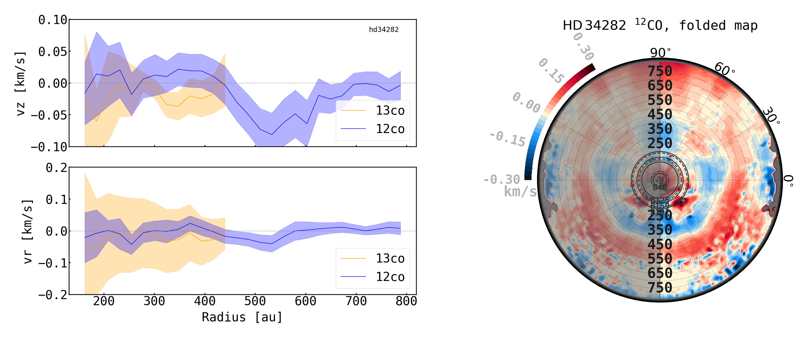
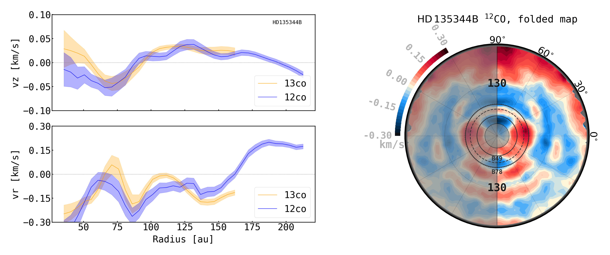
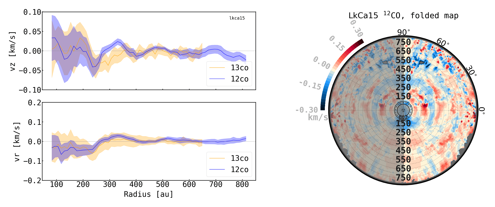
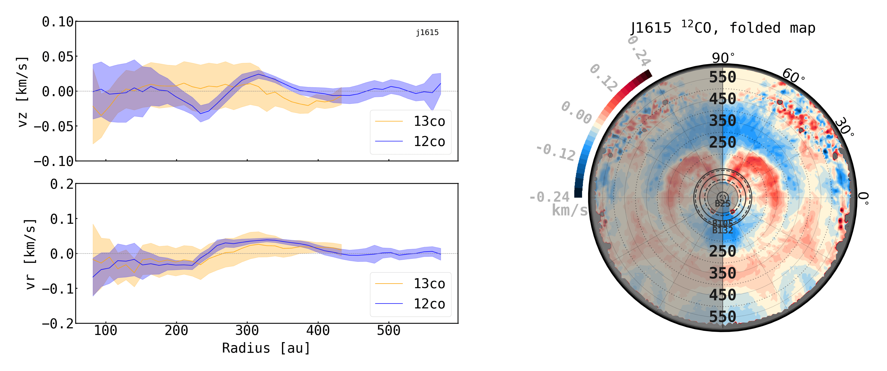
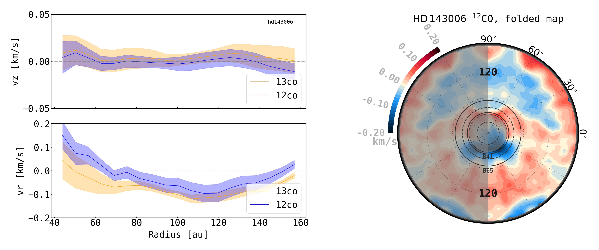
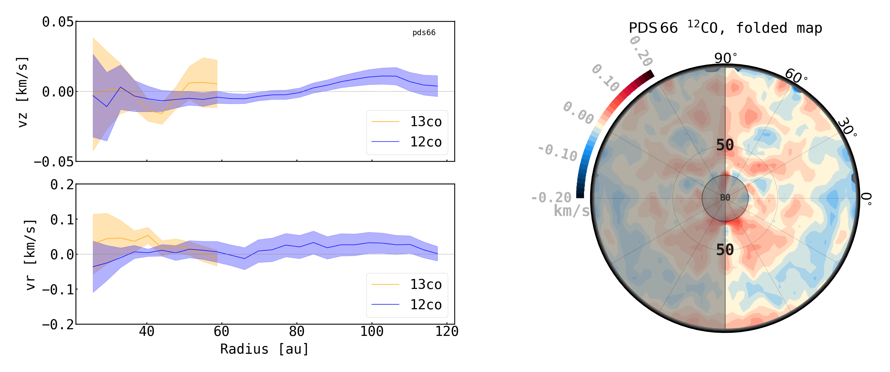
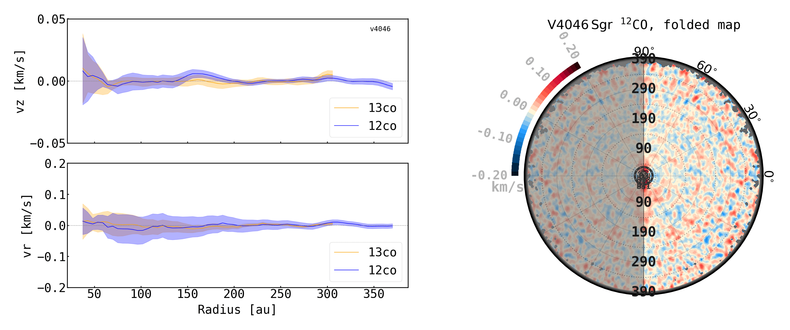
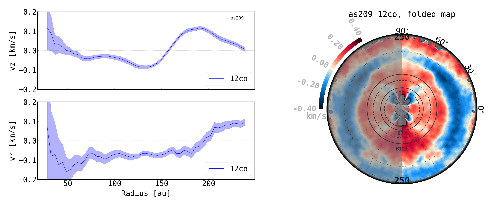
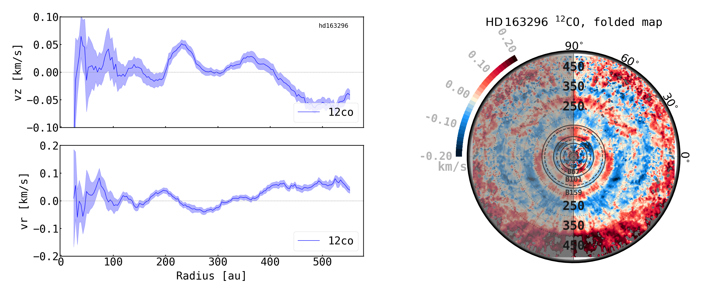
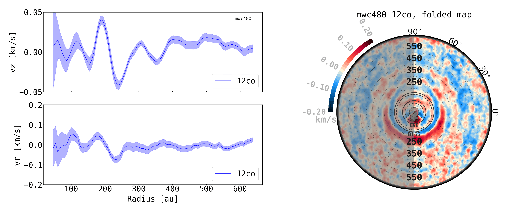

$\newcommand{\ensuremath}{}$
$\newcommand{\xspace}{}$
$\newcommand{\object}[1]{\texttt{#1}}$
$\newcommand{\farcs}{{.}''}$
$\newcommand{\farcm}{{.}'}$
$\newcommand{\arcsec}{''}$
$\newcommand{\arcmin}{'}$
$\newcommand{\ion}[2]{#1#2}$
$\newcommand{\textsc}[1]{\textrm{#1}}$
$\newcommand{\hl}[1]{\textrm{#1}}$
$\newcommand{\footnote}[1]{}$
$\newcommand{\vdag}{(v)^\dagger}$
$\newcommand$
$\newcommand$
$\newcommand{\InstMPIA}{Max-Planck Institute for Astronomy (MPIA), Königstuhl 17, 69117 Heidelberg, Germany}$
$\newcommand{\InstMIT}{Department of Earth, Atmospheric, and Planetary Sciences, Massachusetts Institute of Technology, Cambridge, MA 02139, USA}$
$\newcommand{\InstOCA}{Université Côte d’Azur, Observatoire de la Côte d’Azur, CNRS, Laboratoire Lagrange, France}$
$\newcommand{\InstMilano}{Dipartimento di Fisica, Università degli Studi di Milano, Via Celoria 16, 20133 Milano, Italy}$
$\newcommand{\InstNAOJ}{National Astronomical Observatory of Japan, Osawa 2-21-1, Mitaka, Tokyo 181-8588, Japan}$
$\newcommand{\InstAIJ}{Astronomical Institute, Graduate School of Science, Tohoku University, 6-3 Aoba, Aramaki, Aoba-ku, Sendai, Miyagi 980-8578 Japan}$
$\newcommand{\InstIPAGGrenoble}{Univ. Grenoble Alpes, CNRS, IPAG, 38000 Grenoble, France}$
$\newcommand{\InstMonash}{School of Physics and Astronomy, Monash University, Clayton VIC 3800, Australia}$
$\newcommand{\InstCfA}{Center for Astrophysics | Harvard \& Smithsonian, Cambridge, MA 02138, USA}$
$\newcommand{\InstFlorida}{Department of Astronomy, University of Florida, Gainesville, FL 32611, USA}$
$\newcommand{\InstChile}{Departamento de Astronomía, Universidad de Chile, Camino El Observatorio 1515, Las Condes, Santiago, Chile}$
$\newcommand{\InstStAndrewsPhysics}{School of Physics \& Astronomy, University of St. Andrews, North Haugh, St. Andrews KY16 9SS, UK}$
$\newcommand{\InstStAndrewsExoplanets}{Centre for Exoplanet Science, University of St. Andrews, North Haugh, St. Andrews, KY16 9SS, UK}$
$\newcommand{\InstRicePhysics}{Department of Physics and Astronomy, Rice University, Houston, TX 77005, USA}$
$\newcommand{\InstLANL}{Los Alamos National Laboratory, Los Alamos, NM 87545, USA}$
$\newcommand{\InstUGAphysics}{Department of Physics and Astronomy, The University of Georgia, Athens, GA 30602, USA}$
$\newcommand{\InstUGACSP}{Center for Simulational Physics, The University of Georgia, Athens, GA 30602, USA}$
$\newcommand{\InstUGAIA}{Institute for Artificial Intelligence, The University of Georgia, Athens, GA, 30602, USA}$
$\newcommand{\InstColumbia}{Department of Astronomy, Columbia University, 538 W. 120th Street, Pupin Hall, New York, NY, USA}$
$\newcommand{\InstLeeds}{School of Physics and Astronomy, University of Leeds, Leeds, UK, LS2 9JT}$
$\newcommand{\InstRiceSpace}{Rice Space Institute, Rice University, 6100 Main St, Houston, TX 77005, USA}$
$\newcommand{\InstLeiden}{Leiden Observatory, Leiden University, P.O. Box 9513, NL-2300 RA Leiden, The Netherlands}$
$\newcommand{\InstESO}{European Southern Observatory, Karl-Schwarzschild-Str. 2, D-85748 Garching bei München, Germany}$
$\newcommand{\InstNHFP}{NASA Hubble Fellowship Program Sagan Fellow}$
$\newcommand{\InstIbaraki}{College of Science, Ibaraki University, 2-1-1 Bunkyo, Mito, Ibaraki 310-8512, Japan}$
$\newcommand{\InstCambridge}{Institute of Astronomy, University of Cambridge, Madingley Road, CB3 0HA, Cambridge, UK}$
$\newcommand{\InstNRAO}{National Radio Astronomy Observatory, 520 Edgemont Rd., Charlottesville, VA 22903, USA}$
$\newcommand{\InstUNAM}{Instituto de Ciencias Físicas, Universidad Nacional Autónoma de México, Av. Universidad s/n, 62210 Cuernavaca, Mor., Mexico}$
$\newcommand{\InstBologna}{Alma Mater Studiorum Università di Bologna, Dipartimento di Fisica e Astronomia (DIFA), Via Gobetti 93/2, 40129 Bologna, Italy}$
$\newcommand{\InstArcetri}{INAF-Osservatorio Astrofisico di Arcetri, Largo E. Fermi 5, 50125 Firenze, Italy}$
$\newcommand{\InstASIAA}{Academia Sinica Institute of Astronomy \& Astrophysics, 11F of Astronomy-Mathematics Building, AS/NTU, No.1, Sec. 4, Roosevelt Rd, Taipei 10617, Taiwan}$
$\newcommand{\InstWesleyan}{Department of Astronomy, Van Vleck Observatory, Wesleyan University, 96 Foss Hill Drive, Middletown, CT 06459, USA}$
$\newcommand{\InstPennState}{Department of Astronomy \& Astrophysics, 525 Davey Laboratory, The Pennsylvania State University, University Park, PA 16802, USA}$
$\newcommand{\InstSOKENDAI}{Department of Astronomical Science, The Graduate University for Advanced Studies, SOKENDAI, 2-21-1 Osawa, Mitaka, Tokyo 181-8588, Japan}$
$\newcommand{\InstQMUL}{Astronomy Unit, School of Physics and Astronomy, Queen Mary University of London, London E1 4NS, UK}$
$\newcommand{\InstTokyo}{Department of Astronomy, Graduate School of Science, The University of Tokyo, 7-3-1 Hongo, Bunkyo-ku, Tokyo 113-0033, Japan}$

# exoALMA XXI: The Morphology and Dynamics of Vertical Flows

<mark>Appeared on: 2026-03-16</mark> -  _Accepted in ApJ Letters_

<mark>M. Benisty</mark>, et al. -- incl., <mark>D. Fasano</mark>, <mark>M. Flock</mark>

**Abstract:** Vertical gas flows, such as winds and meridional circulations, are natural outcomes of protoplanetary disk processes and play a critical role in the earliest stages of planet formation. We analyze vertical gas motions in 14 disks as part of the exoALMA Large Program, focusing on the $\twCOfull$ and $\thCOfull$ emission lines. Using $\discminer$ to model the Keplerian velocity field, we extract line-of-sight velocity residuals and measure the radial and vertical components of the gas motion. Vertical motions are detected in most disks. Two types of patterns emerge: (1) oscillatory up/down flows, likely linked to instabilities, and (2) transitions from downward to upward motions that we interpret as the base of a disk wind. In most cases, the velocity amplitudes are of a few tens of m/s. Two disks, however, MWC758 and CQ Tau, show two spiral velocity features in their residual maps, red- and blue-shifted, which we interpret as vertical velocities reaching up to $\sim$ 350 m/s ( $\sim$ 0.7 $c_s$ ), consistent with gas motion in eccentric disks. Fast upward motions (up to 500 m/s; $\sim$ 1.8 $c_s$ ) is also detected in the outer disk of MWC758. Synthetic observations from (magneto)hydrodynamic simulations validate the reliability of our method. Although strong molecular winds appear to be relatively rare in $\twCO$ and $\thCO$ , our study shows that, when traced by deep high spectral resolution line data, protoplanetary disks exhibit ubiquitous vertical flows.  However, their overall velocity structure is highly complex, preventing to identifya coherent, dominant physical mechanism driving the vertical motions across all disks, thus requiring further theoretical investigation.

**Figure 6. -** Gallery of azimuthally averaged vertical (top panels) and radial velocity (bottom panels) profiles. Blue lines are \twCO  and yellow lines are \thCO . The errors are the standard deviation along each annulus. On the right, the folded residual maps for \twCO  are presented, in which any significant coherent vertical flow appears as an arc of uniform color (blue or red).
     (*fig:vz1D*)

**Figure 12. -** Same as Figure \ref{fig:vz1D}, for three targets that don't show strong vertical motion. (*fig:vz1Dno*)

**Figure 13. -** Same as Figure \ref{fig:vz1D} but for MAPS targets. (*fig:vz1DMAPS*)

