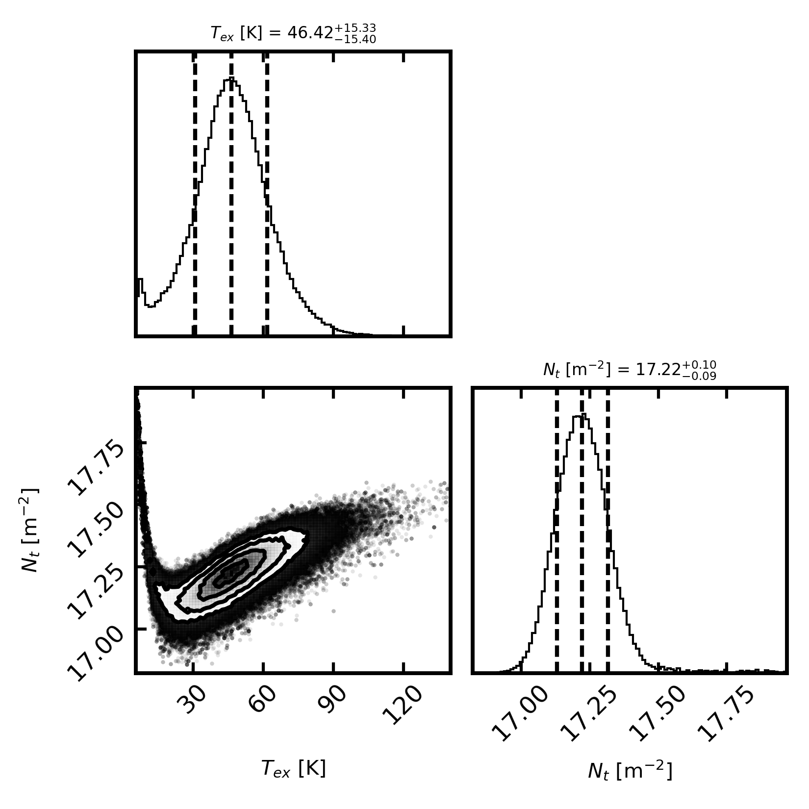
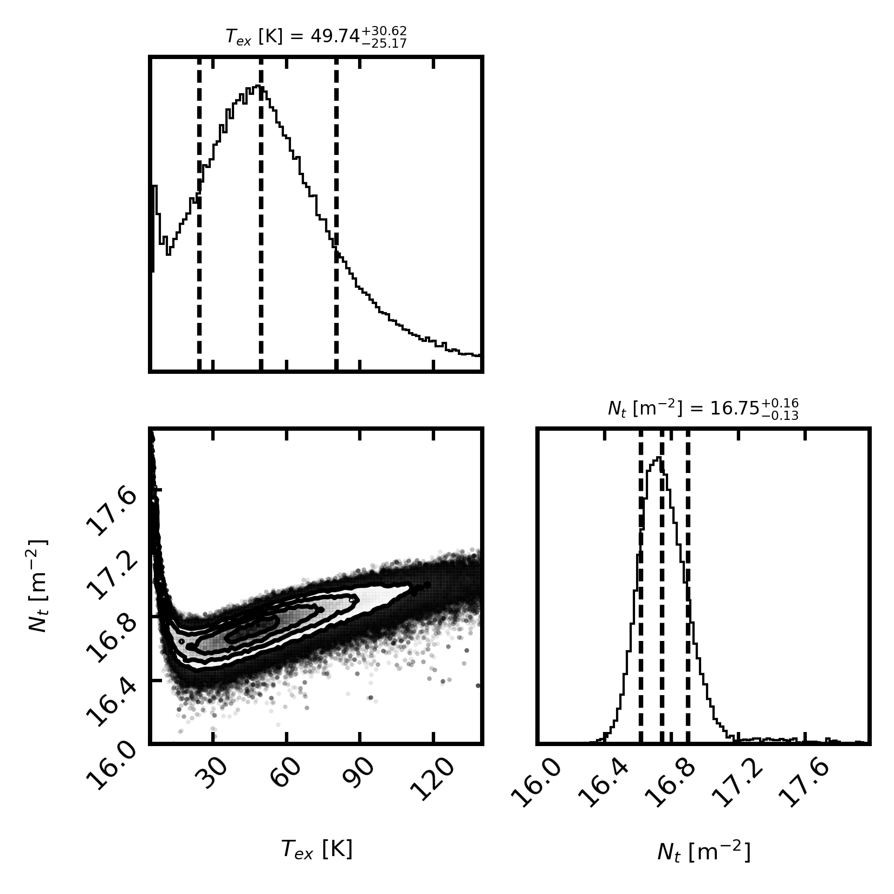
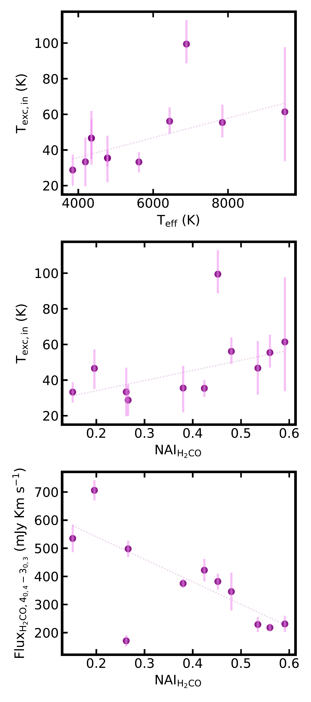

$\newcommand{\ensuremath}{}$
$\newcommand{\xspace}{}$
$\newcommand{\object}[1]{\texttt{#1}}$
$\newcommand{\farcs}{{.}''}$
$\newcommand{\farcm}{{.}'}$
$\newcommand{\arcsec}{''}$
$\newcommand{\arcmin}{'}$
$\newcommand{\ion}[2]{#1#2}$
$\newcommand{\textsc}[1]{\textrm{#1}}$
$\newcommand{\hl}[1]{\textrm{#1}}$
$\newcommand{\footnote}[1]{}$
$\newcommand{\vdag}{(v)^\dagger}$
$\newcommand$
$\newcommand$
$\newcommand{\arraystretch}{1.3}$
$\newcommand{\arraystretch}{1.3}$

# exoALMA. XXIV. Formaldehyde Emission in Protoplanetary Disks of exoALMA Compared with Their Properties and Dynamical State.

<mark>Appeared on: 2026-03-16</mark> -  _Accepted for publication in ApJL_

F. Alarcón, et al. -- incl., <mark>M. Benisty</mark>

**Abstract:** The presence of asymmetries and substructures in protoplanetary disks, revealed by both dust and gas emission, highlights the potential interplay and the broader connection between chemistry and dynamics in disk evolution. We explore multiple relationships using the nonparametric Kendall- $\tau$ correlation to examine formaldehyde ($H_2$ CO) emission with relation to stellar and disk properties for a subset of disks from the exoALMA sample. We also retrieve the $H_2$ CO column density and excitation temperature using four transitions, measured in radial bins of 100 au, and quantify the level of asymmetry in the resolved peak intensity of the $H_2$ CO emission. From our correlation analysis, we find no correlations with sufficient statistical significance. However, we identify tentative relationships that can be tested with larger samples. In particular, we report a proposed correlation ( $2.1\sigma$ ) between stellar effective temperature and the formaldehyde excitation conditions, suggesting that, to first order, the central star dominates the nature of the $H_2$ CO emission over possible dynamical asymmetries traced by dust. Although a correlation with the stellar luminosity was also expected, a larger sample is required to confirm or refute this trend. A possible correlation with spectral type, together with the broad range of $H_2$ CO excitation temperatures within the inner 100 au of the studied disks, hint at possible multiple chemical formation pathways for $H_2$ CO, including both gas-phase reactions and ice-surface chemistry on dust grains.

**Figure 10. -** Corner plots of the MCMC fitting of the rotational diagrams of AA Tau. **Left**: Inner 100 au. **Right**: 100-200 au annular region.
               (*Fig:corner_aatau*)

**Figure 3. -** Subset of correlations explored with $z$-scores $\geq$2.00 between the NAI$_\mathrm{H_2CO}$, the total $H_2$CO$_{\mathrm{4(0,4)-3(0,3)}}$ line flux, and the retrieved excitation temperature of formaldehyde in the inner 100 au of the observed disks. (*Fig:corr_all*)

**Figure 6. -** **Left**: integrated emission maps of the $H_2$CO 4(0,4)-3(0,3) line for the observed sources. **Right:** peak intensity emission for the same line. Continuum emission at 0.8 mm contours is overlaid to compare with the formaldehyde emission in the disks. Beams are illustrated on the bottom-right with solid white for continuum images and dashed lines for line emission. The bottom-left bar represents a respective 100 au physical scale for each source. For most disks, there are no clear correspondences between the dust continuum contours and the integrated maps. (*Fig:MOM0*)

