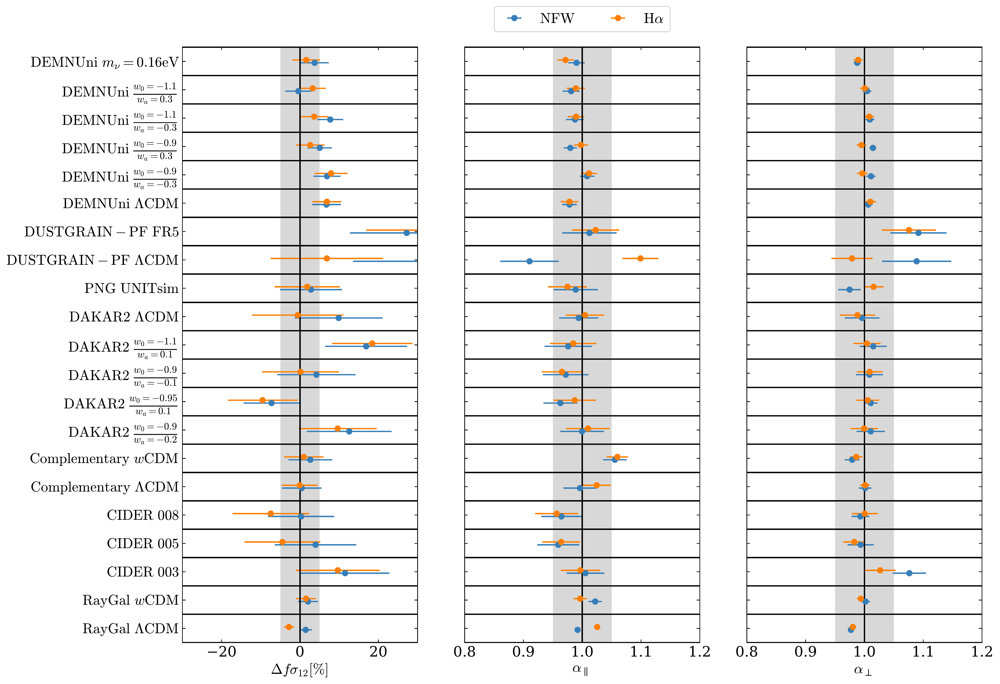
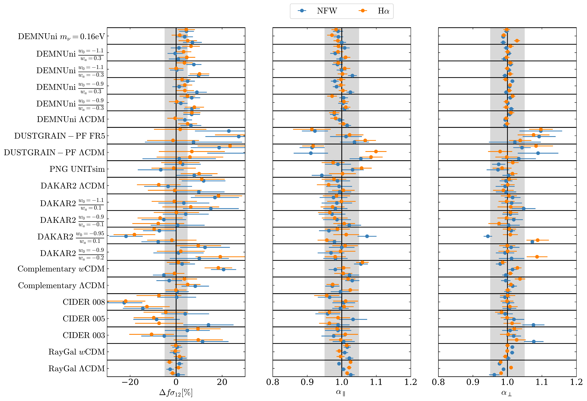
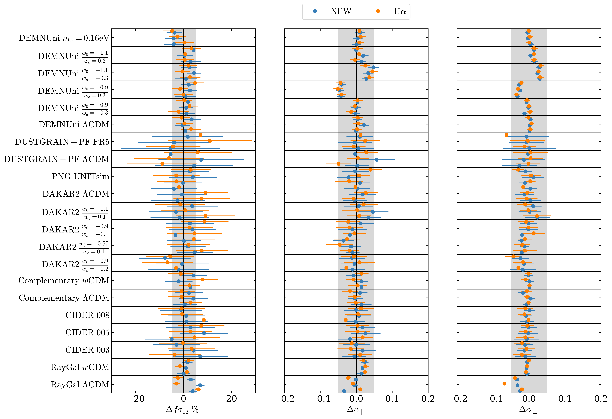

$\newcommand{\ensuremath}{}$
$\newcommand{\xspace}{}$
$\newcommand{\object}[1]{\texttt{#1}}$
$\newcommand{\farcs}{{.}''}$
$\newcommand{\farcm}{{.}'}$
$\newcommand{\arcsec}{''}$
$\newcommand{\arcmin}{'}$
$\newcommand{\ion}[2]{#1#2}$
$\newcommand{\textsc}[1]{\textrm{#1}}$
$\newcommand{\hl}[1]{\textrm{#1}}$
$\newcommand{\footnote}[1]{}$
$\newcommand{\dd}{\mathrm{d}}$
$\newcommand{\ncen}{N_{\rm cen}}$
$\newcommand{\nsat}{N_{\rm sat}}$
$\newcommand{\mvir}{\ensuremath{M_{\rm vir}}\xspace}$
$\newcommand{\ev}[1]{\left\langle #1 \right\rangle}$
$\newcommand{\lcdm}{\LambdaCDM\xspace}$
$\newcommand{\wcdm}{wCDM\xspace}$
$\newcommand{\wwcdm}{w_0w_aCDM\xspace}$
$\newcommand{\om}{\Omega_\mathrm{m}}$
$\newcommand{\ob}{\Omega_\mathrm{b}}$
$\newcommand{\ol}{\Omega_\Lambda}$
$\newcommand{\fR}{f_\mathrm{R}}$
$\newcommand{\fRz}{\overline{f_\mathrm{R0}}}$
$\newcommand{\horc}{H_0r_\mathrm{c}}$
$\newcommand{\fnl}[0]{f_{\rm NL}\xspace}$
$\newcommand{\xv}{\bm{x}}$
$\newcommand{\kv}{\bm{k}}$
$\newcommand{\kmsmpc}{  \mathrm{km}/\mathrm{s}/\mathrm{Mpc}}$
$\newcommand{\kpcoh}{  h^{-1}\mathrm{kpc}}$
$\newcommand{\mpcoh}{  \si{\hMpc}}$
$\newcommand{\gpcoh}{  h^{-1}\mathrm{Gpc}}$
$\newcommand{\gpcohcube}{  h^{-3}\mathrm{Gpc}^3}$
$\newcommand{\homopc}{  h  \mathrm{Mpc}^{-1}}$
$\newcommand{\msoh}{  h^{-1} M_\odot}$
$\newcommand{\de}{\mathrm{DE}}$
$\newcommand{\neff}{N_{\rm eff}}$
$\newcommand{\OmegaDE}{\Omega_\de}$
$\newcommand{\Omegam}{\Omega_\mathrm{m}}$
$\newcommand{\vdg}{VDG_\infty\xspace}$
$\newcommand{\floor}{  \mathrm{floor}}$
$\newcommand{\getdist}{\texttt{GetDist}\xspace}$
$\newcommand{\comet}{\texttt{COMET}\xspace}$
$\newcommand{\rockstar}{\texttt{ROCKSTAR}\xspace}$
$\newcommand{\scipic}{\texttt{SciPic}\xspace}$
$\newcommand{\corrfunc}{\texttt{Corrfunc}\xspace}$
$\newcommand{\multinest}{\texttt{MultiNest}\xspace}$
$\newcommand{\PGadgetTwo}{\texttt{P-GADGET2}\xspace}$
$\newcommand{\PGadgetThree}{\texttt{P-GADGET3}\xspace}$
$\newcommand{\ECOSMOG}{\texttt{ecosmog}\xspace}$
$\newcommand{\COLA}{\texttt{cola}\xspace}$
$\newcommand{\RAMSES}{\texttt{RAMSES}\xspace}$
$\newcommand{\FASTPM}{\texttt{FastPM}\xspace}$
$\newcommand{\AREPO}{\texttt{AREPO}\xspace}$
$\newcommand{\MGAREPO}{\texttt{MG-AREPO}\xspace}$
$\newcommand{\CGADGET}{\texttt{C-GADGET}\xspace}$
$\newcommand{\LGADGET}{\texttt{L-GADGET}\xspace}$
$\newcommand{\LGADGETTWO}{\texttt{L-GADGET2}\xspace}$
$\newcommand{\GADGETTWO}{\texttt{GADGET2}\xspace}$
$\newcommand{\GADGETFOUR}{\texttt{GADGET4}\xspace}$
$\newcommand{\GADGET}{\texttt{GADGET}\xspace}$
$\newcommand{\MGGADGET}{\texttt{MG-GADGET}\xspace}$
$\newcommand{\GEVOLUTIONONETWO}{\texttt{gevolution-1.2}\xspace}$
$\newcommand{\GIZMO}{\texttt{GIZMO}\xspace}$
$\newcommand{\KEVOLUTION}{\texttt{k-evolution}\xspace}$
$\newcommand{\NGENIC}{\texttt{N-GenIC}\xspace}$
$\newcommand{\CAMB}{\texttt{CAMB}\xspace}$
$\newcommand{\FLAGSHIP}{\textsc{Flagship}\xspace}$
$\newcommand{\FLAGSHIPTWO}{\textsc{Flagship 2}\xspace}$
$\newcommand{\COMPLEMENTARY}{\textsc{Complementary}\xspace}$
$\newcommand{\DEMNUni}{\textsc{DEMNUni}\xspace}$
$\newcommand{\RAYGAL}{\textsc{RayGal}\xspace}$
$\newcommand{\ELEPHANT}{\textsc{Elephant}\xspace}$
$\newcommand{\ColaHiRes}{\textsc{COLA HiRes}\xspace}$
$\newcommand{\DUSTGRAIN}{\textsc{DUSTGRAIN}\xspace}$
$\newcommand{\DUSTGRAINPATHFINDER}{\textsc{DUSTGRAIN-PF}\xspace}$
$\newcommand{\CIDER}{\textsc{CiDER}\xspace}$
$\newcommand{\DAKAR}{\textsc{DAKAR}\xspace}$
$\newcommand{\DAKARTWO}{\textsc{DAKAR2}\xspace}$
$\newcommand{\DAKARONEANDTWO}{\textsc{DAKAR (1\&2)}\xspace}$
$\newcommand{\ClusteringDE}{\textsc{Clustering DE}\xspace}$
$\newcommand{\FORGE}{\textsc{FORGE}\xspace}$
$\newcommand{\BRIDGE}{\textsc{BRIDGE}\xspace}$
$\newcommand{\PNGUNITsim}{\textsc{PNG-UNIT}\xspace}$
$\newcommand{\UNITsims}{\textsc{UNITsims}\xspace}$
$\newcommand{\ff}{{\mathcal F}}$
$\newcommand{\dif}{{\mathrm d}}$
$\newcommand{\red}[1]{\textcolor{red}{#1}}$
$\newcommand{\magenta}[1]{\textcolor{magenta}{ #1}}$
$\newcommand{\green}[1]{\textcolor{green}{{#1}}}$
$\newcommand{\blue}[1]{\textcolor{blue}{{#1}}}$
$\newcommand{\cyan}[1]{\textcolor{cyan}{{#1}}}$
$\newcommand{\mab}[1]{ \textcolor{cyan}{(MAB: {#1})} }$
$\newcommand{\santi}[1]{ \textcolor{green}{(SA: {#1})} }$
$\newcommand{\GR}[1]{\textcolor{blue}{GR: #1}}$
$\newcommand{Ç}[1]{\textbf{\textcolor{magenta}{[Melita: #1]}}}$
$\newcommand{\KK}[1]$
$\newcommand{ç}[1]{{\textcolor{magenta}{#1}}}$
$\newcommand{\orcid}[1]$
$\newcommand{\linenumbers}[0]$

# $\Euclid$ preparation: Simulated galaxy catalogues for non-standard cosmological models

<mark>Appeared on: 2026-03-16</mark> -  _14+9 pages, 3+4 figures, submitted_

E. Collaboration, et al. -- incl., <mark>K. Jahnke</mark>

**Abstract:** Stage-IV galaxy surveys will provide the opportunity to test cosmological models and the underlying theory of gravity with unparalleled precision.   In this context, it is crucial for the $\Euclid$ mission to leverage its spectroscopic and photometric probes to systematically investigate and incorporate non-standard cosmological models, including modified gravity, alternative dark energy scenarios, massive neutrinos, and primordial non-Gaussianity.For this, we produce and release publicly simulated galaxy catalogues from a broad suite of non-standard cosmological simulations, which we processed through a model-independent analytical pipeline, making use of $\rockstar$ for halo identification, and a modified version of the $\scipic$ library for the galaxy-halo connection using the halo occupation distribution framework. We investigate their galaxy-clustering characteristics via the multipoles of the 2-point correlation function in redshift space and $\vdg$ , a highly performant, state-of-the-art model for galaxy clustering.Across a wide range of models, the linear growth rate multiplied by the matter density within spheres of radius 12 Mpc, $f\sigma_{12}$ , exhibits a notable robustness to the choice of cosmological template. Compared to previous works, our study extends this result to numerous scenarios with markedly distinct gravitational or dark energy dynamics.We find that the most of the scatter in cosmological parameter inference already appears when using the cosmological model of the simulations as templates. Using a `wrong' template can also introduce an additional scatter, although with smaller amplitude. Often, we find deviations much larger than error bars, meaning that the Gaussian approximation for the covariance might need to be further studied.Looking ahead, future cosmological investigations must broaden their scope to include a diverse array of non-standard theoretical frameworks, extending beyond $\lcdm$ and rudimentary dynamic dark energy models.

**Figure 2. -** Marginalised constraints on the template-fitting parameters of the $\vdg$ model with NFW (blue) and H$\alpha$(orange) profiles, using the same cosmology for the simulation and the template. We show the relative difference $\Delta f\sigma_{12}$ on the $f\sigma_{12}$ parameter with respect to its fiducial value, and the absolute values of the dilation parameters $\alpha_\perp$ and $\alpha_\parallel$. The grey shaded area shows the $\pm$ 5\% limits. (*fig:results_template_same_LL_bestaxis*)

**Figure 4. -** Same as Fig. \ref{fig:results_template_same_LL_bestaxis}, but where each point is duplicated three times, according to the redshift-space distortion projection along the $x$, $y$, and $z$ axes (from bottom to top). (*fig:results_template_same_LL_allaxis*)

**Figure 5. -** Same as Fig. \ref{fig:results_template_same_LL_allaxis} but using a template with the simulations cosmology. (*fig:results_template_fs2_LL_allaxis*)

