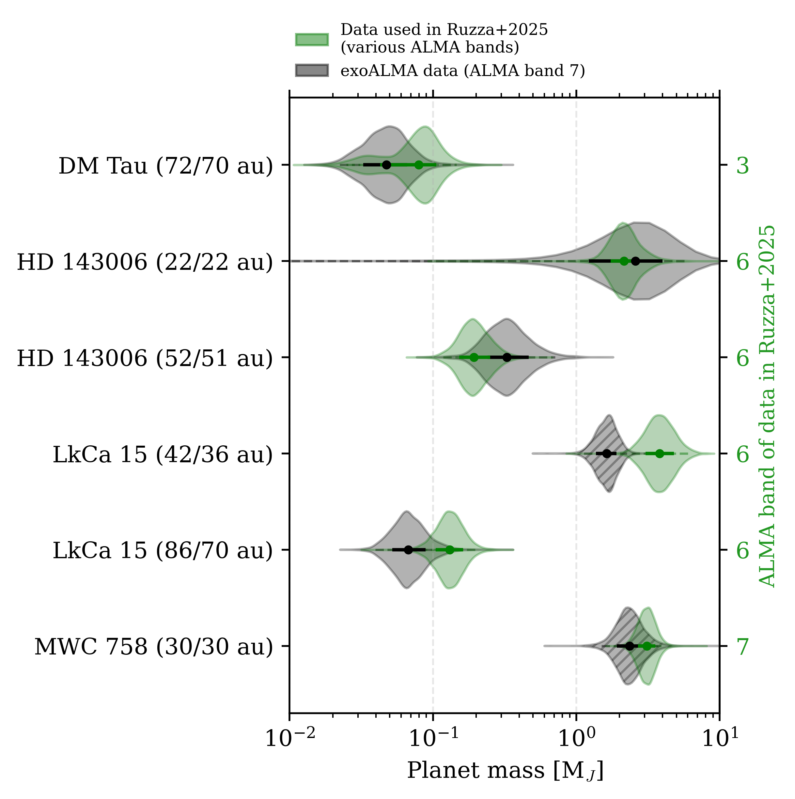
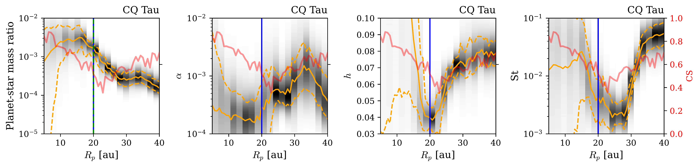
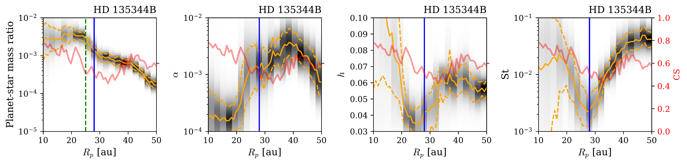
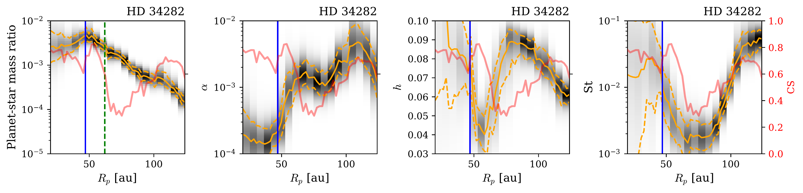
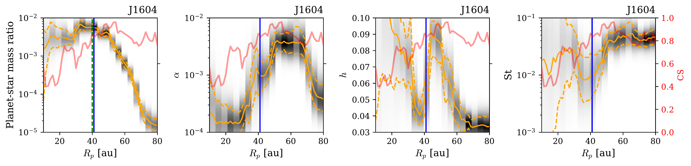
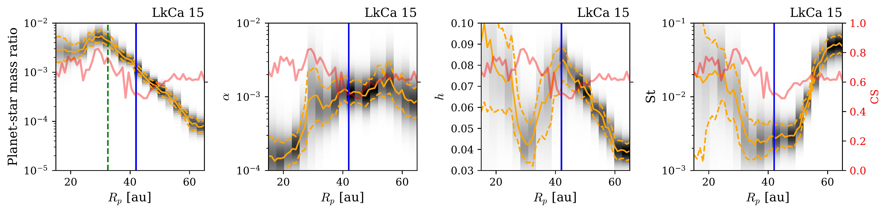
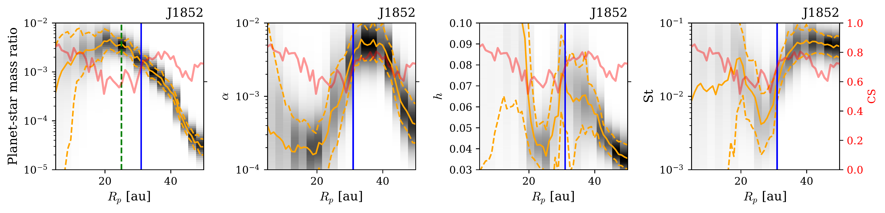
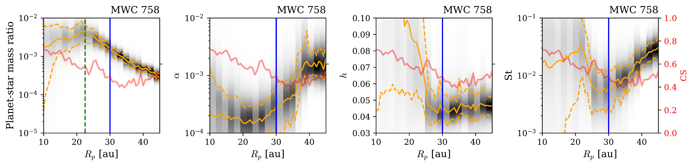
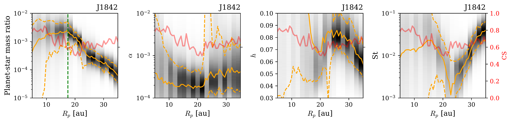

$\newcommand{\ensuremath}{}$
$\newcommand{\xspace}{}$
$\newcommand{\object}[1]{\texttt{#1}}$
$\newcommand{\farcs}{{.}''}$
$\newcommand{\farcm}{{.}'}$
$\newcommand{\arcsec}{''}$
$\newcommand{\arcmin}{'}$
$\newcommand{\ion}[2]{#1#2}$
$\newcommand{\textsc}[1]{\textrm{#1}}$
$\newcommand{\hl}[1]{\textrm{#1}}$
$\newcommand{\footnote}[1]{}$
$\newcommand{\vdag}{(v)^\dagger}$
$\newcommand$
$\newcommand$

# exoALMA XXIII. Estimating Disk and Planet Properties from Dust Morphologies with DBNets2.0

<mark>Appeared on: 2026-03-16</mark> -  _This paper is part of the exoALMA Focus Issue of The Astrophysical Journal Letters_

A. Ruzza, et al. -- incl., <mark>M. Benisty</mark>, <mark>D. Fasano</mark>

**Abstract:** The exoALMA large program provided an unprecedented view of the morphology and kinematics of 15 circumstellar disks, offering a biased but homogenous and well-characterized sample for population-level analysis. Continuum observations revealed numerous dust substructures, known to be potential signatures of embedded planets. We analyze the observed dust morphologies with the simulation-based inference tool DBNets2.0, assuming these are due to embedded planets at fixed locations, to infer the system properties.We estimate the putative planet mass, the disk $\alpha$ -viscosity, scale-height, and dust Stokes number that would reproduce 19 substructures in 13 of the 15 exoALMA disks. We compare our results with literature estimates derived with different methods, and find good agreement in most cases. We further explore the implications of the inferred disk properties for accretion, showing that for the Herbig stars in our sample, the implied viscous accretion timescales are too long to account for their observed stellar accretion rates. Regarding planet migration, our results favor inward migration, with only three putative planets expected to migrate outward. Finally, we check for correlations of the inferred disk and planet properties with the disks' gas-to-dust mass ratio, non-axisymmetry index, and masses of the gas, dust, and host stars, finding no remarkable trend.

**Figure 3. -** Comparison, for the overlapping objects, of DBNets2.0 estimates derived in \citetalias{Ruzza2025DBNets2.0:Discs} on archival data (green violins) with those obtained in this work on the exoALMA observations (black violins). On the right, in green, the Band of the continuum observation used in \citetalias{Ruzza2025DBNets2.0:Discs}. Near each disk name we report the assumed planet locations, respectively in \citetalias{Ruzza2025DBNets2.0:Discs} and in this work. Violin plots of estimates corresponding to confidence scores below the acceptance threshold in either work are hatched. (*fig:comp_ruzza25*)

**Figure 6. -** Sensitivity of DBNets2.0 inferred disk properties to the assumed planet location for all cavities considered in this study. The black 2D histograms represent the inferred distributions. The overlayed orange lines mark the 16th, 50th and 84th percentiles of the inferred posterior distributions. The vertical blue lines indicate the fiducial planet locations assumed in this work. The vertical green dashed lines mark $R_\text{edge}/2$, where $R_\text{edge}$ is the radial location of the cavity edge. The red lines indicate DBNets2.0 confidence score. (*fig:rpdeg*)

**Figure 7. -** Sensitivity of DBNets2.0 inferred disk properties to the assumed planet location for the three peculiar cases of J1852, MWC 758, and J1842. In the two former disks, the considered substructures are large gaps with, respectively, a small inner disk and a faint inner ring. The latter disk presents a cavity, which was discarded from our analysis due to the lack of previous works suggesting possible planet locations. The black 2D histograms represent the inferred distributions. The overlayed orange lines mark the 16th, 50th and 84th percentiles of the inferred posterior distributions. The vertical blue lines indicate the putative planet location assumed in this work. The vertical green dashed lines mark $R_\text{edge}/2$, where $R_\text{edge}$ is the radial location of the cavity edge. The red lines indicate DBNets2.0 confidence score. (*fig:rpdeg2*)

