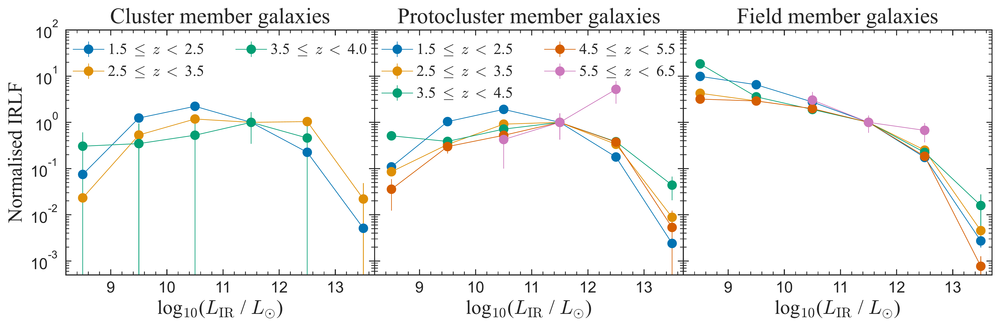
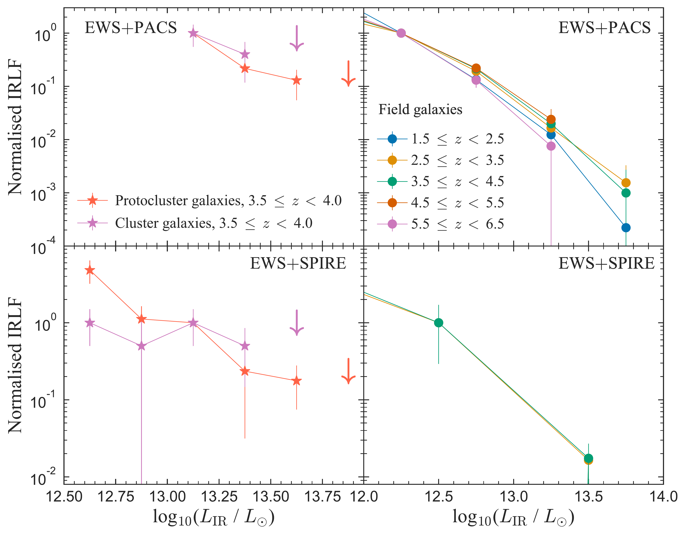
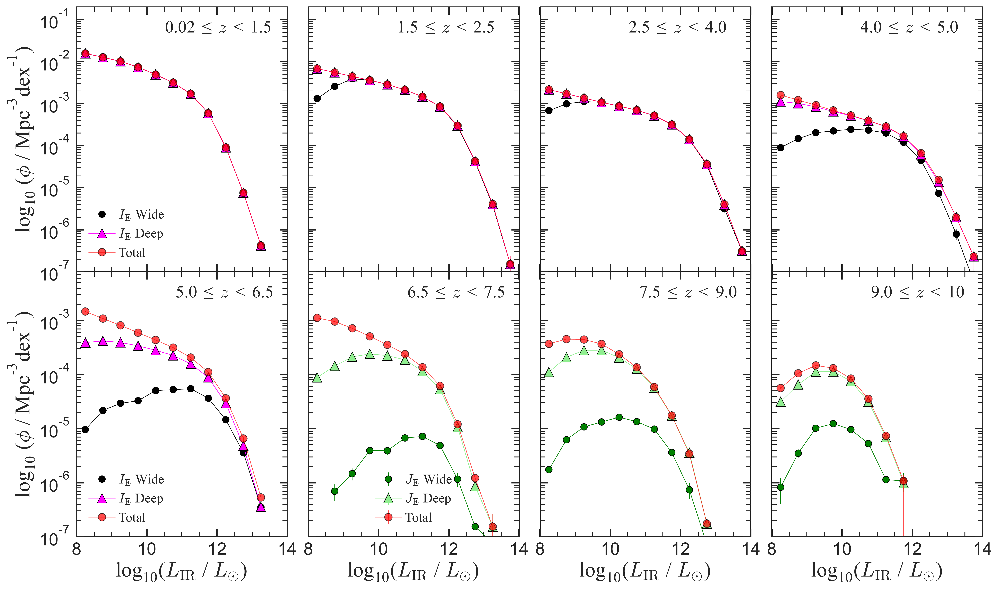

$\newcommand{\ensuremath}{}$
$\newcommand{\xspace}{}$
$\newcommand{\object}[1]{\texttt{#1}}$
$\newcommand{\farcs}{{.}''}$
$\newcommand{\farcm}{{.}'}$
$\newcommand{\arcsec}{''}$
$\newcommand{\arcmin}{'}$
$\newcommand{\ion}[2]{#1#2}$
$\newcommand{\textsc}[1]{\textrm{#1}}$
$\newcommand{\hl}[1]{\textrm{#1}}$
$\newcommand{\footnote}[1]{}$
$\newcommand{\orcid}[1]{\orcidlink{#1}}$
$\newcommand{\linenumbers}[0]$

# $\Euclid$ preparation: Far-infrared predictions for $\Euclid$ galaxy catalogues: cluster, protocluster, and field

<mark>Appeared on: 2026-03-16</mark> -  _25 pages, 17 figures, submitted to A&A_

E. Collaboration, et al. -- incl., <mark>K. Jahnke</mark>

**Abstract:** The MAMBO mock galaxy catalogue, based on the Millennium Simulation with empirically assigned galaxy properties, provides predictions of far-infrared (FIR) fluxes and physical parameters of $\Euclid$ -detectable galaxies. We present the predicted FIR flux distributions and confirm that only the brightest $\Euclid$ sources will be detectable in existing FIR surveys. To characterise the broader $\Euclid$ population, we employ stacking to measure the mean dust properties as a function of stellar mass and redshift. We find dust temperatures and infrared luminosities increase with redshift across all mass bins, while dust masses remain roughly constant. FIR number counts from MAMBO show overall good agreement with observations, and the total infrared luminosity function (IRLF) reproduces published estimates across most redshift ranges, extending to $z \sim 10$ . Comparing the Euclid Wide and Deep Surveys, we find that the EDS recovers the total IRLF to fainter luminosities and higher redshifts (up to $z \sim 6$ in $I_{\rm E}$ ), although its detectability falls below $80\%$ at $z > 4$ , whereas the EWS becomes strongly incomplete beyond $z \sim 2$ . We also examine the dependence of the IRLF on environment. Schechter fits indicate that the faint-end slope $\alpha$ flattens with redshift for cluster and protocluster galaxies, while remaining approximately constant for field populations. Imposing additional detection limits from _Herschel_ -PACS and SPIRE shows that only the most luminous ( $L_{\rm IR} \gtrsim 10^{12.5} L_{\odot}$ ) galaxies remain detectable at $z \sim 4$ , but the limited MAMBO area (3.14 deg $^2$ ) is inadequate for statistically robust ( $>3\sigma$ ) constraints. Survey areas at least 30 times larger are required. Overall, the MAMBO FIR extension reproduces key number count and IRLF trends, provides realistic predictions for FIR-detected $\Euclid$ galaxies, and highlights the importance of synergies with current ( _Herschel_ , ALMA) and future FIR/sub-mm facilities (e.g. PRIMA, CCAT) to probe environmental dependence with sufficient depth and area.

**Figure 14. -** Completeness-corrected IRLF of MAMBO mock galaxies based on their environment: cluster, protocluster, or field. The LFs are normalised such that $\logten(\phi / \rm{Mpc}^{-3} dex^{-1}) = 1$ at $\logten(L_{\mathrm{IR}} / L_\odot) = 11.5$ for each redshift bin. The legend for protocluster member galaxies also applies to field member galaxies. (*LF env comparison normalised*)

**Figure 15. -** *Top row*: Completeness-corrected IRLF of MAMBO mock galaxies based on their environment given that they are detected by the EWS and _Spitzer_-PACS. The cluster and protocluster LFs are normalised at $\logten(L_{\mathrm{IR}}/L_\odot) = 13.125$ and the field LFs at $12.25$. $3\sigma$ upper limits, denoted by a downwards arrow, are shown where there is only one source per luminosity bin. The legend in the top row also applies to the bottom row.
*Bottom row*: Completeness-corrected IRLF of MAMBO mock galaxies based on their environment, given that they are detected by the EWS and \Herschel-SPIRE. The cluster and protocluster apparent LFs are normalised at $\logten(L_{\mathrm{IR}}/L_\odot) = 13.125$ and the field LFs at $12.5$. (*LF fir env comparison normalised*)

**Figure 13. -** $1/V_{\rm max}$-derived IRLF for the EDS-detectable sample compared to the EWS-detectable sample. Additionally plotted for comparison is the total IRLF of all the galaxies within the _Euclid_ MAMBO mock, shown by the red circles. (*LF fir flux lim deep*)

