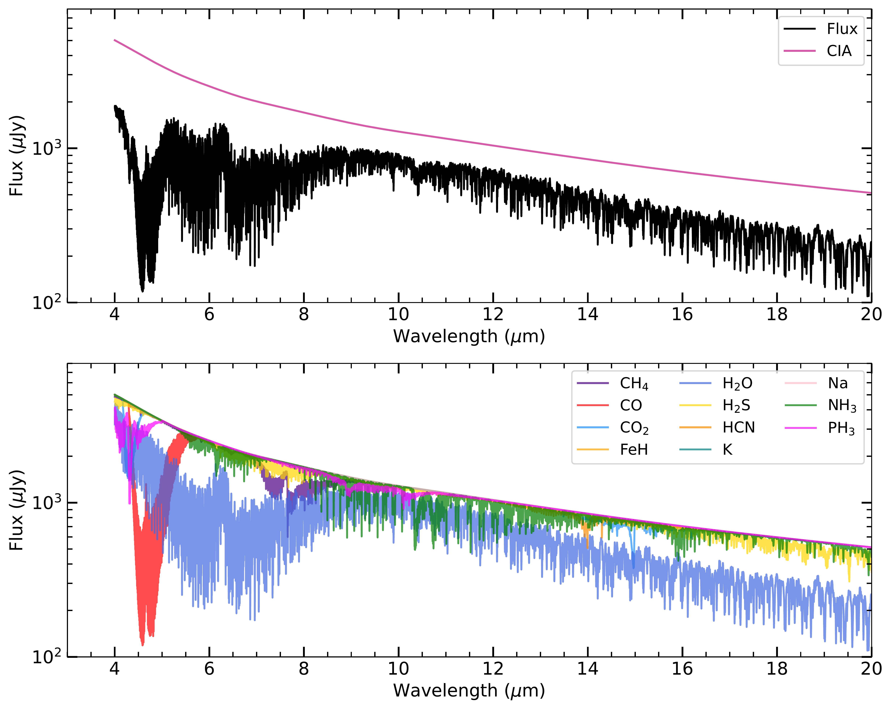
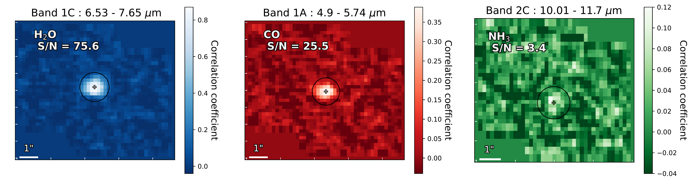
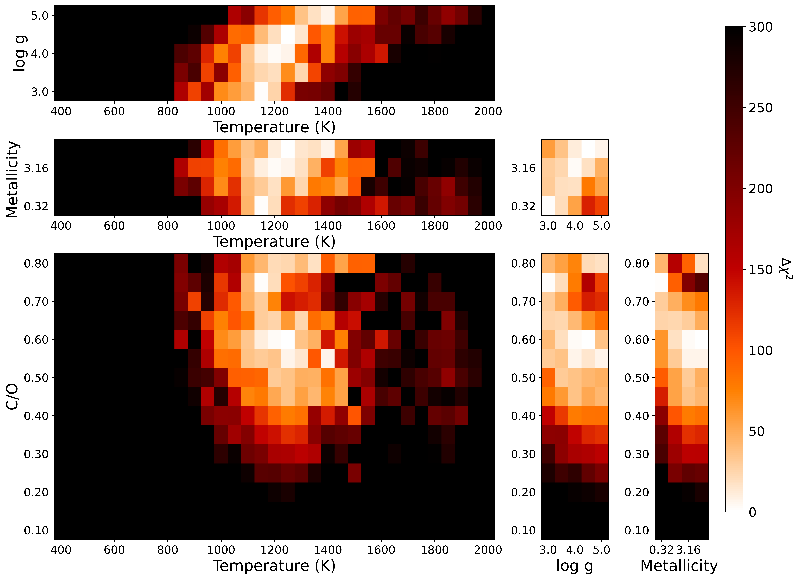
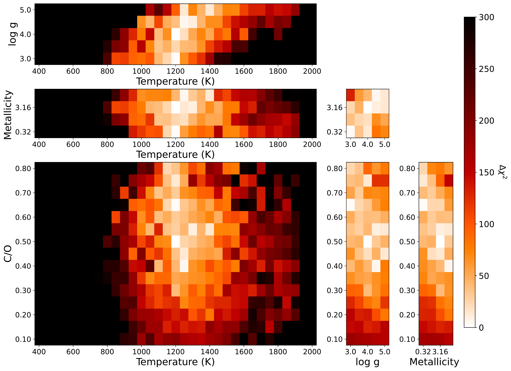

$\newcommand{\ensuremath}{}$
$\newcommand{\xspace}{}$
$\newcommand{\object}[1]{\texttt{#1}}$
$\newcommand{\farcs}{{.}''}$
$\newcommand{\farcm}{{.}'}$
$\newcommand{\arcsec}{''}$
$\newcommand{\arcmin}{'}$
$\newcommand{\ion}[2]{#1#2}$
$\newcommand{\textsc}[1]{\textrm{#1}}$
$\newcommand{\hl}[1]{\textrm{#1}}$
$\newcommand{\footnote}[1]{}$
$\newcommand{\vdag}{(v)^\dagger}$
$\newcommand$
$\newcommand$
$\newcommand{\mathilde}[1]{\textcolor{ForestGreen}{#1}}$
$\newcommand{\todo}[1]{\textcolor{red}{#1}}$

# The JWST Early Release Science Program for Direct Observations of Exoplanetary Systems.\ VIII. Molecular Mapping Performance with JWST/MIRI MRS: VHS 1256 b as a case study

<mark>Appeared on: 2026-03-17</mark> -  _Accepted in ApJ. Part of an ApJ Focus Issue from the ERS_

M. Mâlin, et al. -- incl., <mark>T. Henning</mark>, <mark>M. Samland</mark>

**Abstract:** VHS 1256 b was the first planetary-mass companion to be observed with the James Webb Space Telescope's Mid-Infrared Instrument (JWST/MIRI) using the Medium-Resolution Spectrometer (MRS).The MRS provides high-quality integral-field spectral data in the mid-infrared (IR) wavelengths from 4.9 to 18 $\mu$ m.This dataset serves as a testbed for applying cross-correlation techniques to characterize exoplanet atmospheres.We implement the so-called molecular mapping approach, which consists of performing a spectral cross-correlation between each spectral pixel and atmospheric model templates.We compare these results with those obtained from cross-correlation of the extracted spectrum.Using a self-consistent \texttt{Exo-REM} atmospheric model grid, we constrain the temperature, surface gravity, C/O ratio, and metallicity, finding values consistent with those obtained from other analysis methods.We detect CO (S/N $\sim$ 25) and $H_2$ O (S/N $\sim$ 76), with tentative detections of $NH_3$ and $CH_4$ (S/N $\sim$ 3).We test cross-correlation to measure trace-species abundances and isotopic ratios.We measure a volume mixing ratio of $[\rm NH_3] =-5.73^{+0.15}_{-0.14}$ and an isotopic ratio $^{12}\mathrm{C}/^{13}\mathrm{C}=77.8^{+13}_{-10}$ , both consistent with free-chemistry retrievals.The derived $NH_3$ volume mixing ratio, combined with the measured temperature and radius, is consistent with VHS 1256 b having a mass above the deuterium-burning limit.These results demonstrate the diagnostic power of mid-IR spectroscopy and highlight cross-correlation as a robust method for characterizing directly imaged exoplanets, even in future higher-contrast regimes where spectral extraction becomes challenging.Future MIRI MRS observations across a wider range of temperatures and masses will further expand our understanding of planetary atmospheric chemistry.

**Figure 5. -** 
    Top: \texttt{Exo-REM} molecular template spectrum used in the molecular mapping analysis.
    The collision-induced absorption (CIA) continuum is also shown.
    Bottom: Each template corresponds to a different molecule whose detection was tested in the analysis. (*fig:ExoREM_molec_templates*)

**Figure 13. -** Correlation maps with molecular templates presented in the band where the detection is the highest. The position of VHS 1256 b measured in the cubes is indicated by the black cross. (*fig:corr_maps_molec*)

**Figure 1. -** 
    Grids of the correlation values with the \texttt{Exo-REM} models, converted into the $\Delta\chi2$.
    Metallicity is expressed relative to the solar value $Z/Z_{\odot}$.
    Color scales are the same in each subplot.
    Top 3 panel : Band 1A (4.90--5.74 $\mu$m).
    Bottom 3 panel: All MRS wavelength range (4.90--17.98 $\mu$m). (*fig:correlation_grid*)

