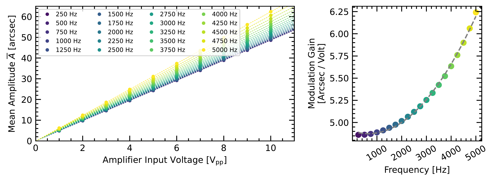
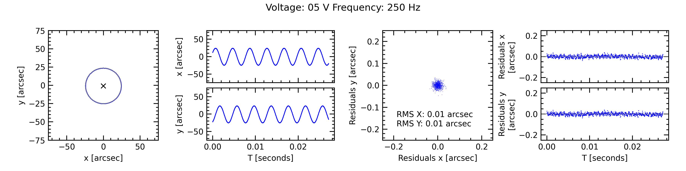
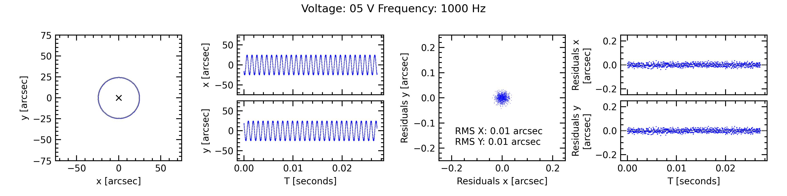
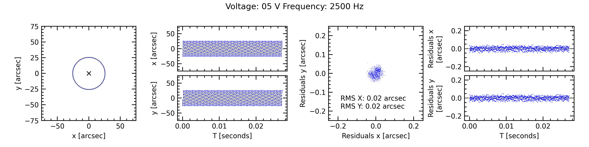
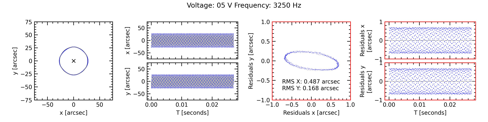
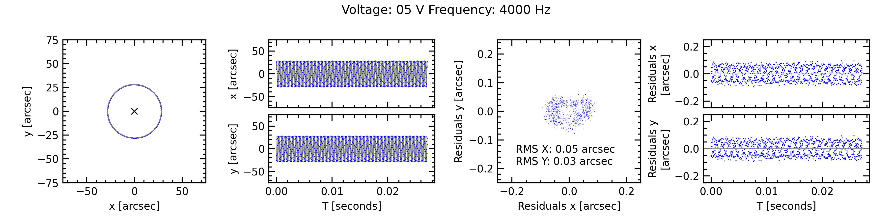
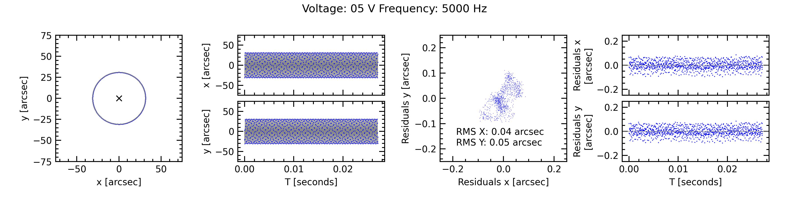
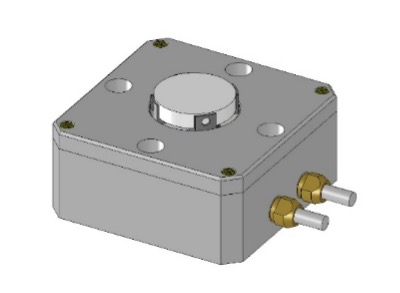
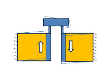

$\newcommand{\ensuremath}{}$
$\newcommand{\xspace}{}$
$\newcommand{\object}[1]{\texttt{#1}}$
$\newcommand{\farcs}{{.}''}$
$\newcommand{\farcm}{{.}'}$
$\newcommand{\arcsec}{''}$
$\newcommand{\arcmin}{'}$
$\newcommand{\ion}[2]{#1#2}$
$\newcommand{\textsc}[1]{\textrm{#1}}$
$\newcommand{\hl}[1]{\textrm{#1}}$
$\newcommand{\footnote}[1]{}$
$\newcommand$
$\newcommand{\todo}[1]{{\textcolor{red}{TODO: #1}}}$
$\newcommand$
$\newcommand$
$\newcommand{\sectionautorefname}{Section}$

# A 5kHz Modulator for Pyramid Wavefront Sensors

<mark>Appeared on: 2026-03-18</mark> -  _20 pages, 11 Figures. Published in Experimental Astronomy_

M. Häberle, et al. -- incl., <mark>V. Naranjo</mark>, <mark>Y. Reinarz</mark>, <mark>M. Feldt</mark>, <mark>S. Scheithauer</mark>, <mark>T. Bertram</mark>

**Abstract:** Despite the emergence of new types of wavefront sensors, the modulated pyramid wavefront sensor remains the workhorse for ELT instrumentation, and is among the options even for advanced high-contrast, high-Strehl instrumentation like PCS and SAXO+.  To achieve the required degree of wavefront control, an operation at frequencies of 3kHz, ideally up to 5kHz, is necessary, requiring an optomechanical device capable of delivering accurate circular modulation patterns with these frequencies.Here, we present tests of a novel type of high-frequency modulator based on shearing piezo actuators.The modulator prototype moves a flat circular mirror (15mm diameter) with a tip-tilt range of plus/minus 50 arcsec.  At a typical 10mm pupil diameter on the modulator mirror, and operating at 2.2 µm, this will create a modulation circle with a radius of slightly greater than 2 $\lambda$ /D.  While this is less than conventionally specified for most instruments, it should already be sufficient for any practical application except for very bad conditions or extended targets.We performed modulation tests at frequencies between 250 Hz to 5 kHz using a test setup including a modulated laser beam probed with a high-speed camera. The prototype showed stable behaviour during a one-hour-long operation at a maximum frequency of 5 kHz and with negligible heat generation. The maximum modulation amplitude was 60 arcsec. We observed very accurate reproduction of the input modulation pattern with typical ellipticities less than 1 \% and random deviations below 0.2 \% for frequencies below 4.5 kHz.These tests demonstrate the prototype's capabilities and could be followed by on-sky tests or the integration of the modulator into XAO testbeds.

**Figure 7. -** _Left: _ Measured modulation amplitude plotted against input voltage for the 20 different probed frequencies. _Right:_ Modulation gain plotted against the frequencies. The dashed line is a 2$^{\rm nd}$ order polynomial fit to the datapoints. (*fig:amplitude*)

**Figure 10. -** Measured modulation patterns (_first and second column_) and residuals (_third and fourth column_) from perfect elliptical modulation for six different frequencies and an amplifier input voltage of 5V$_{\rm pp}$, corresponding to about half of the maximum probed amplitude. Note the resonant behaviour at 3250 Hz. The different plot scale in the residuals is indicated by red axis spines. (*fig:residuals1*)

**Figure 1. -** _Left:_ 3D Design drawing of the high-frequency modulator prototype. _Right: _ 2D Schematic showing the push-pull actuation principle. (*fig:modulator_design*)

