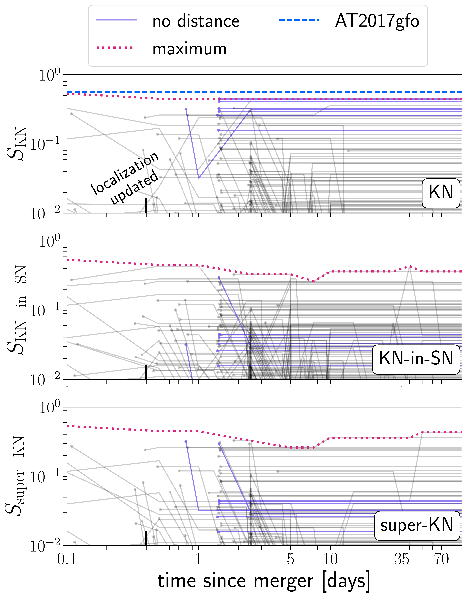
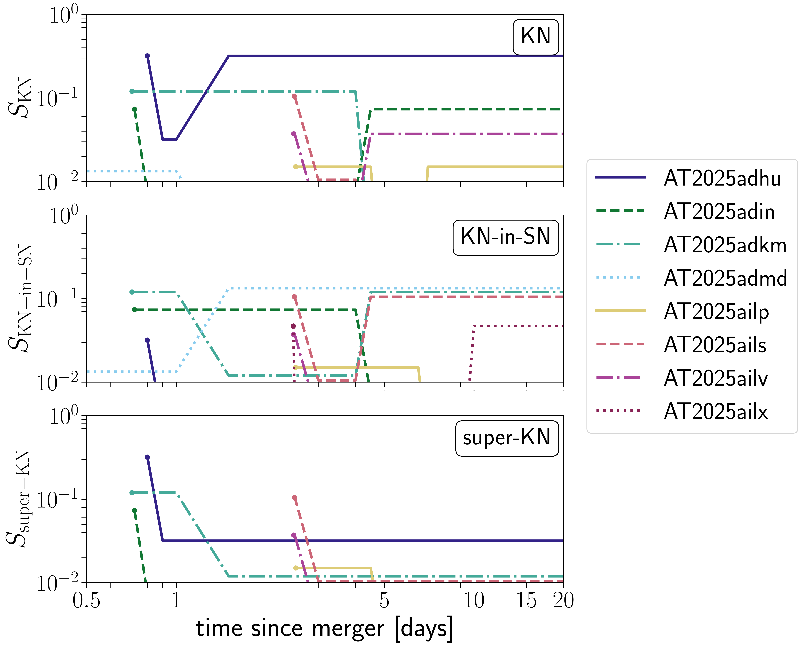

$\newcommand{\ensuremath}{}$
$\newcommand{\xspace}{}$
$\newcommand{\object}[1]{\texttt{#1}}$
$\newcommand{\farcs}{{.}''}$
$\newcommand{\farcm}{{.}'}$
$\newcommand{\arcsec}{''}$
$\newcommand{\arcmin}{'}$
$\newcommand{\ion}[2]{#1#2}$
$\newcommand{\textsc}[1]{\textrm{#1}}$
$\newcommand{\hl}[1]{\textrm{#1}}$
$\newcommand{\footnote}[1]{}$
$\newcommand{\vdag}{(v)^\dagger}$
$\newcommand$
$\newcommand$
$\newcommand$
$\newcommand$
$\newcommand{\remove}[1]{{\color{magenta} \st{#1}}}$
$\newcommand{\addtext}[1]{{\color{brown} #1}}$
$\newcommand{\LCO}{\affiliation{Las Cumbres Observatory, 6740 Cortona Drive, Suite 102, Goleta, CA 93117-5575, USA}}$
$\newcommand{\UCSB}{\affiliation{Department of Physics, University of California, Santa Barbara, CA 93106-9530, USA}}$
$\newcommand{\KITP}{\affiliation{Kavli Institute for Theoretical Physics, University of California, Santa Barbara, CA 93106-4030, USA}}$
$\newcommand{\UCD}{\affiliation{Department of Physics, University of California, 1 Shields Avenue, Davis, CA 95616-5270, USA}}$
$\newcommand{\WIS}{\affiliation{Department of Particle Physics and Astrophysics, Weizmann Institute of Science, 76100 Rehovot, Israel}}$
$\newcommand{\OKC}{\affiliation{Oskar Klein Centre, Department of Astronomy, Stockholm University, Albanova University Centre, SE-106 91 Stockholm, Sweden}}$
$\newcommand{\OAPD}{\affiliation{INAF-Osservatorio Astronomico di Padova, Vicolo dell'Osservatorio 5, I-35122 Padova, Italy}}$
$\newcommand{\Caltech}{\affiliation{Cahill Center for Astronomy and Astrophysics, California Institute of Technology, Mail Code 249-17, Pasadena, CA 91125, USA}}$
$\newcommand{\GSFC}{\affiliation{Astrophysics Science Division, NASA Goddard Space Flight Center, Mail Code 661, Greenbelt, MD 20771, USA}}$
$\newcommand{\UMD}{\affiliation{Joint Space-Science Institute, University of Maryland, College Park, MD 20742, USA}}$
$\newcommand{\UCB}{\affiliation{Department of Astronomy, University of California, Berkeley, CA 94720-3411, USA}}$
$\newcommand{\TTU}{\affiliation{Department of Physics, Texas Tech University, Box 41051, Lubbock, TX 79409-1051, USA}}$
$\newcommand{\STScI}{\affiliation{Space Telescope Science Institute, 3700 San Martin Drive, Baltimore, MD 21218, USA}}$
$\newcommand{\UT}{\affiliation{Department of Astronomy, The University of Texas at Austin, 2515 Speedway, Stop C1400, Austin, TX 78712, USA}}$
$\newcommand{\IoA}{\affiliation{Institute of Astronomy, University of Cambridge, Madingley Road, Cambridge CB3 0HA, UK}}$
$\newcommand{\QUB}{\affiliation{Astrophysics Research Centre, School of Mathematics and Physics, Queen's University Belfast, Belfast BT7 1NN, UK}}$
$\newcommand{\IPAC}{\affiliation{Spitzer Science Center, California Institute of Technology, Pasadena, CA 91125, USA}}$
$\newcommand{\JPL}{\affiliation{Jet Propulsion Laboratory, California Institute of Technology, 4800 Oak Grove Dr, Pasadena, CA 91109, USA}}$
$\newcommand{\Southampton}{\affiliation{Department of Physics and Astronomy, University of Southampton, Southampton SO17 1BJ, UK}}$
$\newcommand{\LANL}{\affiliation{Space and Remote Sensing, MS B244, Los Alamos National Laboratory, Los Alamos, NM 87545, USA}}$
$\newcommand{\Tsinghua}{\affiliation{Physics Department and Tsinghua Center for Astrophysics, Tsinghua University, Beijing, 100084, People's Republic of China}}$
$\newcommand{\NAOC}{\affiliation{National Astronomical Observatory of China, Chinese Academy of Sciences, Beijing, 100012, People's Republic of China}}$
$\newcommand{\Itagaki}{\affiliation{Itagaki Astronomical Observatory, Yamagata 990-2492, Japan}}$
$\newcommand{\Einstein}{\altaffiliation{Einstein Fellow}}$
$\newcommand{\Hubble}{\altaffiliation{Hubble Fellow}}$
$\newcommand{\CfA}{\affiliation{Center for Astrophysics \textbar  Harvard \& Smithsonian, 60 Garden Street, Cambridge, MA 02138-1516, USA}}$
$\newcommand{\UA}{\affiliation{Department of Astronomy and Steward Observatory, University of Arizona, 933 North Cherry Avenue, Tucson, AZ 85721-0065, USA}}$
$\newcommand{\MPA}{\affiliation{Max-Planck-Institut für Astrophysik, Karl-Schwarzschild-Stra\ss e 1, D-85748 Garching, Germany}}$
$\newcommand{\DSFP}{\altaffiliation{LSST-DA Data Science Fellow}}$
$\newcommand{\catalyst}{\altaffiliation{LSST-DA Catalyst Fellow}}$
$\newcommand{\HCO}{\affiliation{Harvard College Observatory, 60 Garden Street, Cambridge, MA 02138-1516, USA}}$
$\newcommand{\Carnegie}{\affiliation{Observatories of the Carnegie Institute for Science, 813 Santa Barbara Street, Pasadena, CA 91101-1232, USA}}$
$\newcommand{\TAU}{\affiliation{School of Physics and Astronomy, Tel Aviv University, Tel Aviv 69978, Israel}}$
$\newcommand{\Edinburgh}{\affiliation{Institute for Astronomy, University of Edinburgh, Royal Observatory, Blackford Hill EH9 3HJ, UK}}$
$\newcommand{\Birmingham}{\affiliation{Birmingham Institute for Gravitational Wave Astronomy and School of Physics and Astronomy, University of Birmingham, Birmingham B15 2TT, UK}}$
$\newcommand{\CIERA}{\affiliation{Center for Interdisciplinary Exploration and Research in Astrophysics, Northwestern University, 1800 Sherman Ave., 8th Floor, Evanston, IL 60201, USA}}$
$\newcommand{\NUPA}{\affiliation{Department of Physics and Astronomy, Northwestern University, 2145 Sheridan Road, Evanston, IL 60208, USA}}$
$\newcommand{\Bath}{\affiliation{Department of Physics, University of Bath, Claverton Down, Bath BA2 7AY, UK}}$
$\newcommand{\CTIO}{\affiliation{Cerro Tololo Inter-American Observatory, National Optical Astronomy Observatory, Casilla 603, La Serena, Chile}}$
$\newcommand{\Potsdam}{\affiliation{Institut für Physik und Astronomie, Universität Potsdam, Haus 28, Karl-Liebknecht-Str. 24/25, D-14476 Potsdam-Golm, Germany}}$
$\newcommand{\INPE}{\affiliation{Instituto Nacional de Pesquisas Espaciais, Avenida dos Astronautas 1758, 12227-010, São José dos Campos -- SP, Brazil}}$
$\newcommand{\UNC}{\affiliation{Department of Physics and Astronomy, University of North Carolina, 120 East Cameron Avenue, Chapel Hill, NC 27599, USA}}$
$\newcommand{\Ohio}{\affiliation{Astrophysical Institute, Department of Physics and Astronomy, 251B Clippinger Lab, Ohio University, Athens, OH 45701-2942, USA}}$
$\newcommand{ÅS}{\affiliation{American Astronomical Society, 1667 K~Street NW, Suite 800, Washington, DC 20006-1681, USA}}$
$\newcommand{\MMT}{\affiliation{MMT and Steward Observatories, University of Arizona, 933 North Cherry Avenue, Tucson, AZ 85721-0065, USA}}$
$\newcommand{\Geneva}{\affiliation{ISDC, Department of Astronomy, University of Geneva, Chemin d'Écogia, 16 CH-1290 Versoix, Switzerland}}$
$\newcommand{\Steward}{\affiliation{Steward Observatory, University of Arizona, 933 North Cherry Avenue, Tucson, AZ 85721, USA}}$
$\newcommand{\Leiden}{\affiliation{Leiden Observatory, Leiden University, PO Box 9513, 2300 RA Leiden, The Netherlands}}$
$\newcommand{\PSU}{\affiliation{Department of Astronomy \& Astrophysics, The Pennsylvania State University, University Park, PA 16802, USA}}$
$\newcommand{\PSUa}{\affiliation{Department of Astronomy \& Astrophysics, The Pennsylvania State University, University Park, PA 16802, USA}}$
$\newcommand{\PSUb}{\affiliation{Institute for Computational \& Data Sciences, The Pennsylvania State University, University Park, PA 16802, USA}}$
$\newcommand{\PSUc}{\affiliation{Institute for Gravitation and the Cosmos, The Pennsylvania State University, University Park, PA 16802, USA}}$
$\newcommand{\IAIFI}{\affiliation{The NSF AI Institute for Artificial Intelligence and Fundamental Interactions, USA}}$
$\newcommand{\JHU}{\affiliation{Department of Physics and Astronomy, Johns Hopkins University, 3400 North Charles Street, Baltimore, MD 21218, USA}}$
$\newcommand{\Utah}{\affiliation{Department of Physics \& Astronomy, University of Utah, Salt Lake City, UT 84112, USA}}$
$\newcommand{\UIUC}{\affiliation{Department of Astronomy, University of Illinois, 1002 W. Green St., Urbana, IL 61801, USA}}$
$\newcommand{\Maryland}{\affiliation{Department of Astronomy, University of Maryland, College Park, MD 20742-2421, USA}}$
$\newcommand{\keck}{\affiliation{W.~M.~Keck Observatory, 65-1120 M\=amalahoa Highway, Kamuela, HI 96743-8431, USA}}$
$\newcommand{\cbpf}{\affiliation{Laboratório de Inteligência Artificial, Centro Brasileiro de Pesquisas Físicas, 138 Rua Dr. Xavier Sigaud 150, CEP 22290-180, 139 Rio de Janeiro, RJ, Brazil}}$
$\newcommand{\UFRJ}{\affiliation{Instituto de Física, Universidade Federal do Rio de Janeiro (UFRJ), Caixa Postal 68528, 21941-972 Rio de Janeiro, Brazil}}$
$\newcommand{\Monash}{\affiliation{School of Physics and Astronomy, Monash University, Clayton, Victoria 3800, Australia}}$
$\newcommand{\UCSD}{\affiliation{Department of Astronomy \& Astrophysics, University of California, San Diego, 9500 Gilman Drive, MC 0424, La Jolla, CA 92093-0424, USA}}$
$\newcommand{\Northwestern}{\affiliation{Department of Physics and Astronomy, Northwestern University, Evanston, IL 60208, USA}}$
$\newcommand{\OzGrav}{\affiliation{OzGrav: The ARC Centre of Excellence for Gravitational Wave Discovery, Clayton, Victoria 3800, Australia}}$
$\newcommand{\todo}{\textcolor{red}{TODO: }\textcolor{red}}$
$\newcommand{\note}{\textcolor{blue}{NOTE: }\textcolor{blue}}$
$\newcommand{\citneeded}{\textcolor{red}{\textbf{(citation needed)}}}$
$\newcommand{\eg}{{\it e.g.}}$
$\newcommand{\et}{{\it et al.}}$
$\newcommand{\ie}{{\it i.e.}}$
$\newcommand{\cf}{{\it cf.}}$
$\newcommand{\franz25}{\citetalias{franz2025}}$

# Search For a Counterpart to the Subsolar Mass Gravitational Wave Candidate S251112cm

<mark>Appeared on: 2026-03-19</mark> -  _20 pages, 8 figures in body; submitted to ApJ; comments welcome!_

N. Vieira, et al. -- incl., <mark>K. Paterson</mark>

**Abstract:** The recent gravitational-wave (GW) alert from a compact object merger involving at least one subsolar mass (SSM) object has prompted questions about their origins. S251112cm is reported by LIGO/Virgo with a false alarm rate of 1 per 6.2 years, nearby luminosity distance $93 \pm 27$ Mpc, probability of containing a SSM object of 100 \% , and probability of containing a $1-3 M_\odot$ object of just 8 \% . Such a system likely did not involve the supersolar neutron stars or black holes invoked to explain kilonovae. One must then also invoke hitherto unobserved and speculative models to produce SSM mergers and the resultant electromagnetic (EM) counterparts. We introduce a framework which vets and scores candidate counterparts to SSM GW events to inform follow-up in search of any among the zoo of potential EM transients: kilonovae, kilonovae-within-supernovae, super-kilonovae, or AGN flares from binary black hole mergers. We use a suite of telescopes to perform tiling, galaxy-targeted observations, and photometric/spectroscopic follow-up of promising candidates. In near-real time, we ingest candidates reported by the community, including some of the first observations reported by the Vera C. Rubin Observatory. We vet and score a total of 248 candidates, including 67 from Rubin, but find no likely counterpart. We nonetheless highlight candidates which demonstrate the ability of our framework to distinguish between different transient types and describe strategies to maximize the chances of detecting a counterpart to the next SSM event. Our framework will be implemented in the forthcoming Multimessenger Tool for Rapid Object Vetting and Examination ( \texttt{TROVE} ).

**Figure 5. -** **Overall scores as a function of time for all candidate optical counterparts to S251112cm.** Each trace tracks the score for one of 218 candidates. Traces begin (as marked with a dot) at the time of first $\geqslant5\sigma$ optical detection. Candidates with no distance score due to a lack of direct distance measurement or viable host galaxy are highlighted in purple. The localization region of S251112cm is updated at 0.4 days, but most candidates are discovered after this time. Several candidates are discovered at $\sim1.4$ days with DECam  (gcn42691)  and at $\sim2.4$ days with Rubin-LSST  (gcn43257) . Candidates for which scores quickly drop are those targeted by spectroscopic follow-up, driving their distance score to $\sim0$ when the distance to the candidate or its host is found to lie outside the localization volume. We highlight the final score $S_{\mathrm{KN}} = 0.56$ of AT2017gfo, known KN counterpart to the BNS merger GW170817. The highest score across all candidates at any given time, for a given transient type, is highlighted with a dotted magenta line. This maximum need not correspond to the same candidate at all times (Section \ref{ssc:candscores-time}). (*fig:all-cands-scores-over-time*)

**Figure 10. -** **Overall scores as a function of time for candidates of interest.** Each line, beginning at the point of first $\geqslant5\sigma$ optical detection, describes a candidate's score with time as new photometry is obtained. Candidates' lightcurves are included in Figure \ref{fig:interesting-lightcurves}. (*fig:interesting-cands-scores-over-time*)

**Figure 9. -** **Optical lightcurves of eight candidates of interest.** We annotate each candidate with its KN or KN-in-SN score. Lightcurves are constructed from public photometry from DECam  (gcn42691) , GOTO-South  (gcn42658) , Rubin-LSST  (gcn43257) , the WFST  (gcn42722) , ZTF  (gcn42677) , and ATLAS forced photometry  (tonry18_ATLAS,  smith20_ATLAS,  shingles21_ATLAS) . Different markers denote different instruments, while different colors indicate photometric band. For some Rubin photometry, uncertainties are on the order of point size. (*fig:interesting-lightcurves*)

