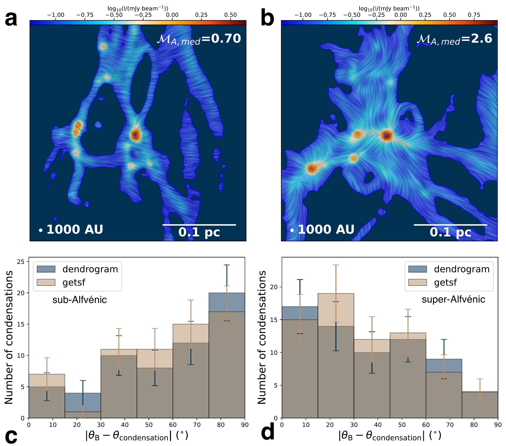
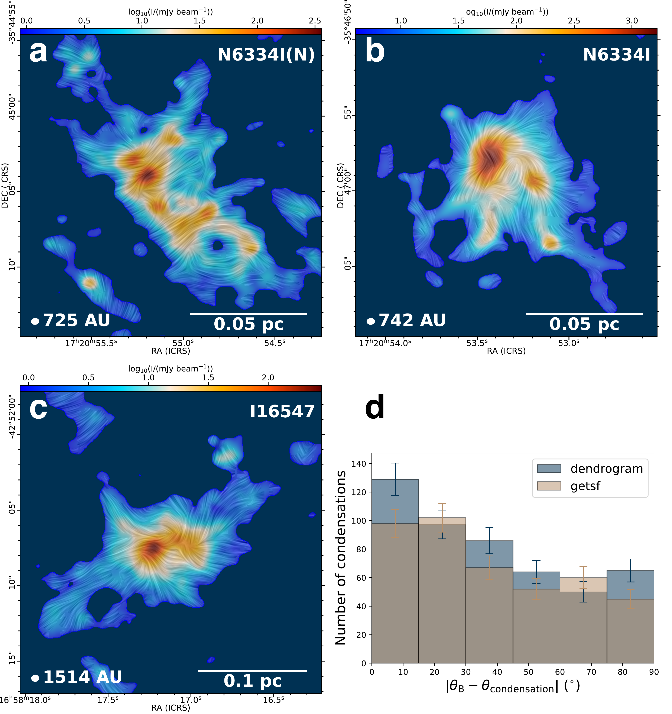
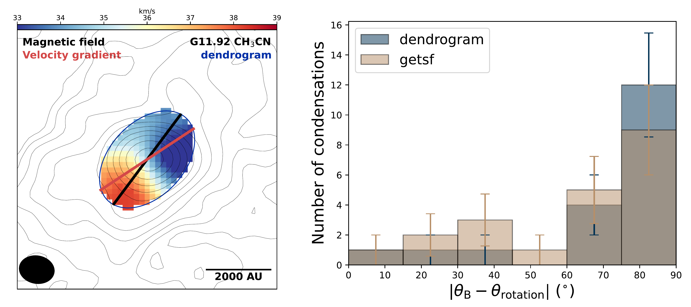

$\newcommand{\ensuremath}{}$
$\newcommand{\xspace}{}$
$\newcommand{\object}[1]{\texttt{#1}}$
$\newcommand{\farcs}{{.}''}$
$\newcommand{\farcm}{{.}'}$
$\newcommand{\arcsec}{''}$
$\newcommand{\arcmin}{'}$
$\newcommand{\ion}[2]{#1#2}$
$\newcommand{\textsc}[1]{\textrm{#1}}$
$\newcommand{\hl}[1]{\textrm{#1}}$
$\newcommand{\footnote}[1]{}$
$\newcommand{\actaa}{Acta Astron.}$
$\newcommand{\araa}{Annu. Rev. Astron. Astrophys.}$
$\newcommand{\areps}{Annu. Rev. Earth Planet. Sci.}$
$\newcommand{\aar}{Astron. Astrophys. Rev.}$
$\newcommand{\ab}{Astrobiology}$
$\newcommand{\aj}{Astron. J.}$
$\newcommand{\ac}{Astron. Comput.}$
$\newcommand{\apart}{Astropart. Phys.}$
$\newcommand{\apj}{Astrophys. J.}$
$\newcommand{\apjl}{Astrophys. J. Lett.}$
$\newcommand{\apjs}{Astrophys. J. Suppl. Ser.}$
$\newcommand{\ao}{Appl. Opt.}$
$\newcommand{\apss}{Astrophys. Space Sci.}$
$\newcommand{\aap}{Astron. Astrophys.}$
$\newcommand{\aapr}{Astron. Astrophys. Rev.}$
$\newcommand{\aaps}{Astron. Astrophys. Suppl.}$
$\newcommand{\baas}{Bull. Am. Astron. Soc.}$
$\newcommand{\caa}{Chin. Astron. Astrophys.}$
$\newcommand{\cjaa}{Chin. J. Astron. Astrophys.}$
$\newcommand{\cqg}{Class. Quantum Gravity}$
$\newcommand{\epsl}{Earth Planet. Sci. Lett.}$
$\newcommand{\expa}{Exp. Astron.}$
$\newcommand{\frass}{Front. Astron. Space Sci.}$
$\newcommand{\gal}{Galaxies}$
$\newcommand{\gca}{Geochim. Cosmochim. Acta}$
$\newcommand{\grl}{Geophys. Res. Lett.}$
$\newcommand{\icarus}{Icarus}$
$\newcommand{\ija}{Int. J. Astrobiol.}$
$\newcommand{\jatis}{J. Astron. Telesc. Instrum. Syst.}$
$\newcommand{\jcap}{J. Cosmol. Astropart. Phys.}$
$\newcommand{\jgr}{J. Geophys. Res.}$
$\newcommand{\jgrp}{J. Geophys. Res.: Planets}$
$\newcommand{\jqsrt}{J. Quant. Spectrosc. Radiat. Transf.}$
$\newcommand{\lrca}{Living Rev. Comput. Astrophys.}$
$\newcommand{\lrr}{Living Rev. Relativ.}$
$\newcommand{\lrsp}{Living Rev. Sol. Phys.}$
$\newcommand{\memsai}{Mem. Soc. Astron. Italiana}$
$\newcommand{\maps}{Meteorit. Planet. Sci.}$
$\newcommand{\mnras}{Mon. Not. R. Astron. Soc.}$
$\newcommand{\nat}{Nature}$
$\newcommand{\nastro}{Nat. Astron.}$
$\newcommand{\ncomms}{Nat. Commun.}$
$\newcommand{\ngeo}{Nat. Geosci.}$
$\newcommand{\nphys}{Nat. Phys.}$
$\newcommand{\na}{New Astron.}$
$\newcommand{\nar}{New Astron. Rev.}$
$\newcommand{\physrep}{Phys. Rep.}$
$\newcommand{\pra}{Phys. Rev. A}$
$\newcommand{\prb}{Phys. Rev. B}$
$\newcommand{\prc}{Phys. Rev. C}$
$\newcommand{\prd}{Phys. Rev. D}$
$\newcommand{\pre}{Phys. Rev. E}$
$\newcommand{\prl}{Phys. Rev. Lett.}$
$\newcommand{\psj}{Planet. Sci. J.}$
$\newcommand{\planss}{Planet. Space Sci.}$
$\newcommand{\pnas}{Proc. Natl Acad. Sci. USA}$
$\newcommand{\procspie}{Proc. SPIE}$
$\newcommand{\pasa}{Publ. Astron. Soc. Aust.}$
$\newcommand{\pasj}{Publ. Astron. Soc. Jpn}$
$\newcommand{\pasp}{Publ. Astron. Soc. Pac.}$
$\newcommand{\raa}{Res. Astron. Astrophys.}$
$\newcommand{\rmxaa}{Rev. Mexicana Astron. Astrofis.}$
$\newcommand{\sci}{Science}$
$\newcommand{\sciadv}{Sci. Adv.}$
$\newcommand{\solphys}{Sol. Phys.}$
$\newcommand{\sovast}{Soviet Astron.}$
$\newcommand{\ssr}{Space Sci. Rev.}$
$\newcommand{\uni}{Universe}$
$\newcommand{\arcsec}{^{\prime\prime}}$
$\newcommand{\arcmin}{^{\prime}}$
$\newcommand{◦}{^{\circ}}$
$\newcommand{\figurename}{Extended Data Fig.}$
$\newcommand{\figureautorefname}{Extended Data Fig.}$
$\newcommand{\figurename}{Supplementary Fig.}$
$\newcommand{\figureautorefname}{Supplementary Fig.}$

# **When turbulence beats magnetism: origin of massive star cluster seeds**

<mark>Appeared on: 2026-03-19</mark> -  _30 pages, 13 figures. Initially submitted to Nature Astronomy on October 27, 2025. The uploaded arXiv version is before the final revision_

J. Liu, et al. -- incl., <mark>H. Beuther</mark>

**Abstract:** High-mass stars form in protoclusters, where gravo-magnetic processes shape collapsing clouds and clumps to be elongated preferentially perpendicular to magnetic (B) fields. Yet it remains unclear whether gravo-magnetic processes still govern the formation of smaller-scale condensations in massive-star-forming protoclusters, which are crucial for understanding the stellar initial mass function and multiplicity.Here we report the first statistical evidence that the condensation elongations are preferentially aligned with local B fields, based on high-resolution data from the largest dust polarization survey toward 30 massive star-forming regions with the Atacama Large Millimeter/submillimeter Array (ALMA).  Our clustered massive star formation simulations reveal that this more parallel alignment is exclusively observed in models where initial turbulence dominates B fields. In contrast, models with initial B fields dominating turbulence distinctly exhibit a more perpendicular alignment.The comparison between observations and simulations suggests that turbulence could play a more important role than B fields in the formation of condensations in the context of clustered massive star formation, contradicting the prediction of classical magnetically regulated models. Moreover, we find a possibly turbulence-induced preferential misalignment between the B field and rotation axis of condensations, which may potentially reduce the magnetic braking efficiency and facilitate the formation of large protostellar disks.

**Figure 2. -** **Properties of simulated massive protocluster systems.****a--b**, Examples of synthetic observations for initially (a) sub-Alfvénic (T10M3MU1) and (b) super-Alfvénic (T10M6MU2) simulations. The initial median Alfvénic Mach number $\mathcal{M}_{\mathrm{A,med}}$(Table \ref{tab2}) is shown in the upper right corner of each panel. Maps are in the $xy$ plane and zoomed to the central 0.3 pc around the most massive protostar. The initial B field is along the $x$-axis (horizontal). The background color shows 1.3 mm dust intensity. Overlaid line patterns represent B field orientation via the line integral convolution method. **c--d**, Histogram examples of the angular difference between condensation elongation ($\theta_{\mathrm{condensation}}$) and average B field orientation ($\theta_{\mathrm{B}}$) in initially (c) sub-Alfvénic (T10M3MU1) and (d) super-Alfvénic (T10M6MU2) models, summed over 3 orthogonal planes.
 (*fig:sim*)

**Figure 1. -** **Properties of observed massive protocluster systems.****a--c**, Examples of ALMA dust polarization observations  \cite{2021ApJ...923..204C, 2024ApJ...972..115C, 2024ApJ...974..257Z}. The background color shows the 1.3 mm dust intensity. Overlaid line patterns, generated using the line integral convolution method, indicate the B field orientation where $PI/\sigma_{PI}>2$. The synthesized beam is shown as a white ellipse in the lower left corner of each panel. A scale bar is shown in the lower right corner of each panel. **d**, Histograms (with Poisson errorbars) of the angular difference between B field orientation and condensation elongation across all observed regions. Different colors represent results from different source identification algorithms.
 (*fig:obs*)

**Figure 4. -** **B-rotation alignment from observations.** Left: ALMA $CH_3$CN velocity centroid map of an example condensation. The blue ellipse outlines the structure identified by {\tt astrodendro}. The black and red lines indicate the average B field orientation and the velocity gradient direction, respectively. Contours represent dust continuum emission at levels of (3, 5, 8, 13, 21, 34, 55, 89, 144, 233, 377, 610, 987) $\times \sigma_I$. Right: Histogram of angular offsets between the average B field orientation and the inferred rotation axis of condensations.
 (*fig:obs_Brot*)

