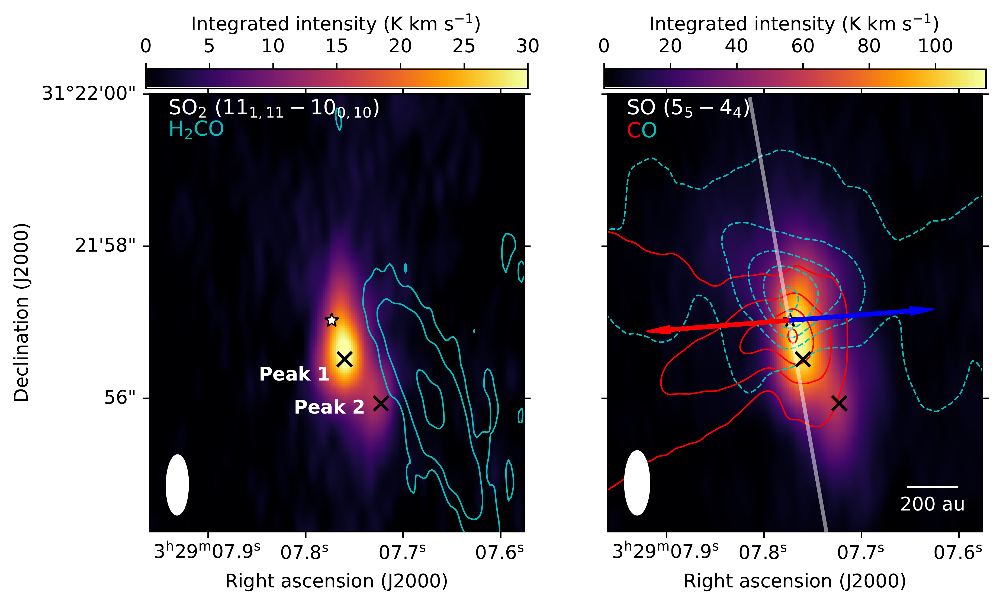
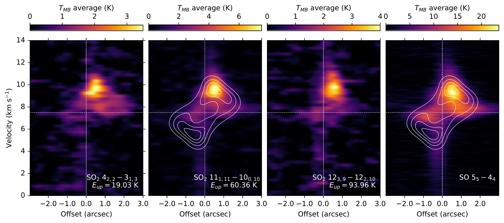
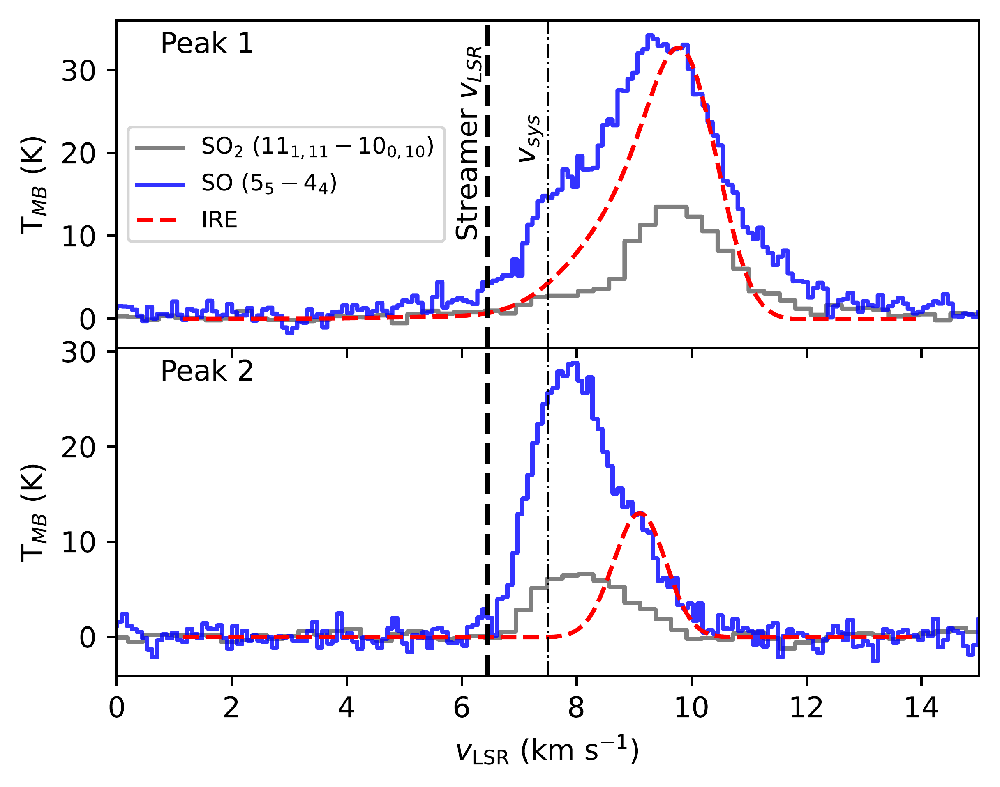

$\newcommand{\ensuremath}{}$
$\newcommand{\xspace}{}$
$\newcommand{\object}[1]{\texttt{#1}}$
$\newcommand{\farcs}{{.}''}$
$\newcommand{\farcm}{{.}'}$
$\newcommand{\arcsec}{''}$
$\newcommand{\arcmin}{'}$
$\newcommand{\ion}[2]{#1#2}$
$\newcommand{\textsc}[1]{\textrm{#1}}$
$\newcommand{\hl}[1]{\textrm{#1}}$
$\newcommand{\footnote}[1]{}$
$\newcommand{\kms}{{\ensuremath{{\rm km  s^{-1}}}}\xspace}$
$\newcommand{\Msun}{\ensuremath{\rm M_{\sun}}\xspace}$
$\newcommand{\Jyb}{\ensuremath{\rm Jy beam^{-1}}\xspace}$
$\newcommand{\vlsr}{\ensuremath{\rm v_{\mathrm{LSR}}}\xspace}$
$\newcommand{\SOt}{\ensuremath{\rm \ce{SO2}}\xspace}$
$\newcommand{\HtCO}{\ensuremath{\rm \ce{H2CO}}\xspace}$

# PRODIGE -- envelope to disk with NOEMA: VIII. Sulfur oxides trace a shock caused by a streamer in the inner envelope of a protostar

<mark>Appeared on: 2026-03-19</mark> -  _14 pages, 14 figures, 2 tables. Accepted for publication in Astronomy & Astrophysics_

M. T. Valdivia-Mena, et al. -- incl., <mark>C. Gieser</mark>, <mark>D. Semenov</mark>, <mark>T. Henning</mark>, <mark>K. Schwarz</mark>

**Abstract:** Recently, streamers have been observed causing shocks at the outer edge of protoplanetary disks. The study of sulfur-bearing species can help us to understand the physical and chemical changes caused by infalling streamers toward their landing positions. We study the physical properties traced by the emission of $\SOt$ and SO toward the Class I protostar Per-emb 50, which is possibly related to the streamer infalling toward its disk. We present new NOrthern Extended Millimeter Array (NOEMA) A-array observations as part of the large program "Protostars and Disks: Global Evolution" (PRODIGE). We analyzed the morphology of $\SOt$ and SO, and complement our interpretations with additional $\HtCO$ and CO data from the same program. We compared the $\SOt$ and SO morphology with an infalling-rotating model. We applied Bayesian model selection to the brightest $\SOt$ line to disentangle the different kinematic components traced by this molecule. We used Local Thermodynamic Equilibrium (LTE) and non-LTE analyses to determine the temperature and density of the $\SOt$ emission. There are two separate peaks of $\SOt$ emission offset toward the southwest of Per-emb 50, one brighter (peak 1) at about 180 au from the protostar, and a weaker one (peak 2) at about 400 au. Peak 2 is blueshifted with respect to an infalling-rotating envelope. We propose that this peak is caused by the shock between the inner envelope and the streamer. Peak 1 is consistent with the expected envelope motion, and could thus be caused by shocks at the disk-envelope interface, but potential streamer influence cannot be neglected. Both peaks show abundance ratios consistent with a low velocity shock ( $\sim 3-4$ $\kms$ ) when compared with shock models. Streamers can affect the physical and chemical structure of both disks and envelopes, suggesting that streamers can play an important role in shaping both structures in the embedded stages of star formation.

**Figure 11. -** NOEMA observations of molecular emission toward Per-emb 50. Left: Integrated intensity of $\SOt$$11_{1,11}-10_{0,10}$ between 6.5 and 12 $\kms$. Black crosses show the locations of the $\SOt$ peaks, labeled as peak 1 and peak 2. Cyan contours represent the $\HtCO$$3_{0,3} - 2_{0,2}$ integrated intensity between 5 and 8 $\kms$, drawn in steps of 3, 5 and 10 times rms of the integrated image (0.7 K $\kms$). Right: Integreated intensity of SO $5_{5} - 4_{4}$ between 0 and 13 $\kms$. Red and cyan contours are CO integrated intensity in redshifted and blueshifted channels, respectively, with respect to the protostar's $\vlsr$(7.5 $\kms$). Blueshifted channels are integrated between -4.3 and 5.3 $\kms$, whereas redshifted channels are between 10 and 20 $\kms$. Contours are drawn at 5 to 45 times the rms of the integrated images (4.7 K $\kms$) in steps of 10. Red and blue arrows indicate the direction of the outflow. The dashed line represents the direction of the PV diagram in Fig. \ref{fig:SO2pvdiag}. The white star marks the position of the continuum peak. The filled white ellipse represents the beam size. A scalebar in the bottom right corner represents a physical scale of 200 au. (*fig:mom0wh2co*)

**Figure 12. -** Position velocity diagrams of $\SOt$ and SO using the path shown in Fig. \ref{fig:mom0wh2co}. $\SOt$ transitions are in order of increasing upper energy levels $E_{\mathrm{up}}$ From left to right: $\SOt$$4_{2,2}-3_{1,3}$, $\SOt$$11_{1,11}-10_{0,10}$, $\SOt$$12_{3,9}-12_{2,10}$, SO $5_{5} - 4_{4}$. White contours show the normalized intensity PV diagrams for an infalling-rotating envelope, obtained with FERIA \citep{Oya2022FERIA}. (*fig:SO2pvdiag*)

**Figure 1. -** Spectra of SO $5_{5} - 4_{4}$(blue) and $\SOt$$11_{1,11}-10_{0,10}$(gray) at the two resolved peak positions, together with the spectra obtained from FERIA, normalized to the SO intensity at the peak velocity of the IRE. The vertical dashed-dotted line marks the systemic velocity of the protostar (7.5 $\kms$), whereas the thick dashed line marks the velocity of the streamer at the same distance from the protostar (in radius) as peak 2 (6.45 $\kms$, Appendix \ref{ap:streamerH2CO}).   (*fig:IREspectra*)

