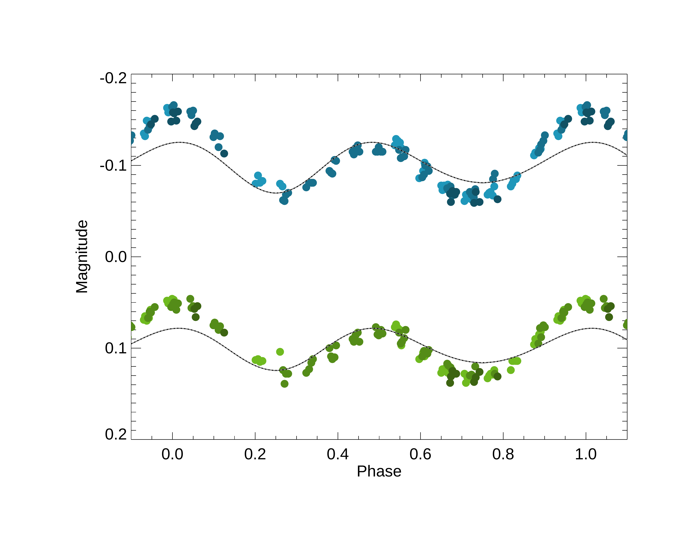
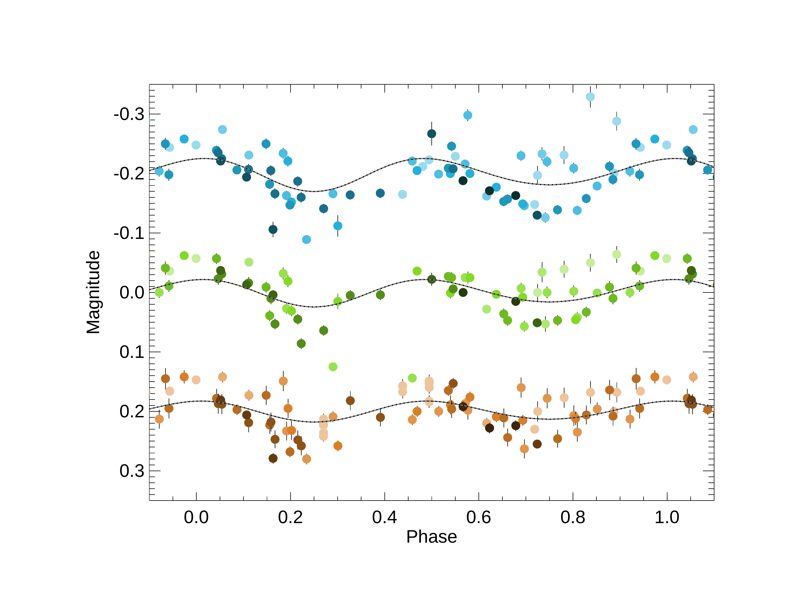

$\newcommand{\ensuremath}{}$
$\newcommand{\xspace}{}$
$\newcommand{\object}[1]{\texttt{#1}}$
$\newcommand{\farcs}{{.}''}$
$\newcommand{\farcm}{{.}'}$
$\newcommand{\arcsec}{''}$
$\newcommand{\arcmin}{'}$
$\newcommand{\ion}[2]{#1#2}$
$\newcommand{\textsc}[1]{\textrm{#1}}$
$\newcommand{\hl}[1]{\textrm{#1}}$
$\newcommand{\footnote}[1]{}$
$\newcommand{\vdag}{(v)^\dagger}$
$\newcommand$
$\newcommand$
$\newcommand{\michigan}{Department of Astronomy, University of Michigan, Ann Arbor, MI 48109, USA}$
$\newcommand{\heidelberg}{Max-Planck-Institut für Astronomie (MPIA), Königstuhl 17, 69117 Heidelberg, Germany}$
$\newcommand{\exeter}{Astrophysics Group, Department of Physics \& Astronomy, University of Exeter, Stocker Road, Exeter EX4 4QL, UK}$
$\newcommand{\grenoble}{Institut de Planetologie et d’Astrophysique de Grenoble UGA/CNRS, Grenoble F-38058, France}$
$\newcommand{\chara}{The CHARA Array of Georgia State University, Mount Wilson Observatory, Mount Wilson, CA 91203, USA}$
$\newcommand{\tsu}{Tennessee State University (retired), Nashville, TN  37209  USA}$
$\newcommand{\cires}{Cooperative Institute for Research in Environmental Sciences at the University of Colorado Boulder, Boulder, CO, 80309 USA}$
$\newcommand{\konkoly}{Konkoly Observatory, HUN-REN Research Centre for Astronomy and Earth Sciences, MTA Centre of Excellence, Konkoly Thege Miklós út 15-17., H-1121 Budapest, Hungary}$
$\newcommand{\szeged}{Department of Experimental Physics, Institute of Physics, University of Szeged, Dóm tér 9, Szeged, 6720 Hungary}$
$\newcommand{\lehigh}{Department of Physics, Lehigh University, Bethlehem, PA, 18015 USA}$
$\newcommand{\nasahq}{Astrophysics Division, NASA Headquarters, Washington, DC 20546, USA}$
$\newcommand{\aavso}{American Association of Variable Star Observers, USA}$
$\newcommand{\milkyway}{MTA-ELTE Lend{ü}let "Momentum" Milky Way Research Group, Hungary}$

# Interferometric Images of the Starspot Evolution  of $\zeta$ Andromedae 

<mark>Appeared on: 2026-03-20</mark> -  _21 pages, 15 figures, 6 tables; accepted for publication in ApJ_

R. M. Roettenbacher, et al. -- incl., <mark>H. Korhonen</mark>, <mark>S. Kraus</mark>

**Abstract:** The evolution of starspots of the giant primaries of RS CVn systems is typically detected indirectly with photometric and spectroscopic monitoring.  These observations suggest slowly-evolving stellar surfaces and can constrain differential rotation as starspots move with respect to one another. However, starspot latitudes are difficult to constrain without resolved images of the stellar surfaces from which the unambiguous locations of starspots  are determined.We imaged the active RS CVn primary $\zeta$ And with the 330-m-baseline Center for High Angular Resolution Astronomy Array for three epochs over approximately six rotations of the star.  The resultant images show a more complicated picture of stellar activity than expected from the contemporaneous photometry and earlier Doppler images.  The spot structures change on the timescale of rotation, making differential rotation difficult to study.Our observations show changes in the polar spot, growing over time.  We do not detect the secondary star in the interferometric data, though the observations are sensitive to the predicted 0.75 $M_\odot$ main-sequence star, and we  suggest the companion may be a white dwarf.

**Figure 3. -** $B$- and $V$-band APT light curves from 2019 September 29 - November 14.  The shade of blue ($B$-band) and green ($V$-band) depends upon the rotation of the star with the shade darkening as time progresses, consistent with the shading used in Figures \ref{fig:AAVSO} and \ref{fig:Konkoly}.  The gray line for each bandpass represents the appropriate ELC-modeled light curve for $\zeta$ And with a main-sequence companion ($0.75  M_\odot$, $0.80  R_\odot$, and $4800$ K; ELC is discussed in Section \ref{section:surfacefeatures}).  The black dashed line superimposed on the gray line represents the ELC model with a white dwarf companion  ($0.75  M_\odot$, $0.01  R_\odot$, and $25000$ K).
    The lines are nearly identical, except for slight deviations at phases 0.25 and 0.75 where the main-sequence model has very shallow eclipses that would not be detectable with our photometry.   The light curves are arbitrarily shifted in magnitude to be plotted together. The mismatch between the ELC models and the observed light curve is attributed to the presence of starspots.
     (*fig:APTELC*)

**Figure 4. -** $B$-, $V$-, and $I$-band light curves from AAVSO spanning 2019 July 30 - November 30.  The shade of blue ($B$-band), green ($V$-band), and orange ($I$-band) depends upon the rotation of the star with the shade darkening as time progresses, as in Figure \ref{fig:APTELC}.  The ELC-modeled light curves follow the same convention as in Figure \ref{fig:APTELC} with the gray line representing a main-sequence companion and the black dashed line represents a white dwarf companion. The light curves are arbitrarily shifted in magnitude to be plotted together.
     (*fig:AAVSO*)

**Figure 13. -** Top: Mollweide projections of the temperature of $\zeta$ And using data from Epoch A.  The dashed line at bottom marks the latitude below which the stellar surface is not observable due to the stellar inclination.  Bottom:  Orthographic projections of $\zeta$ And as it appeared on the sky during Epoch A in $H$-band.
     (*fig:zetAndA*)

