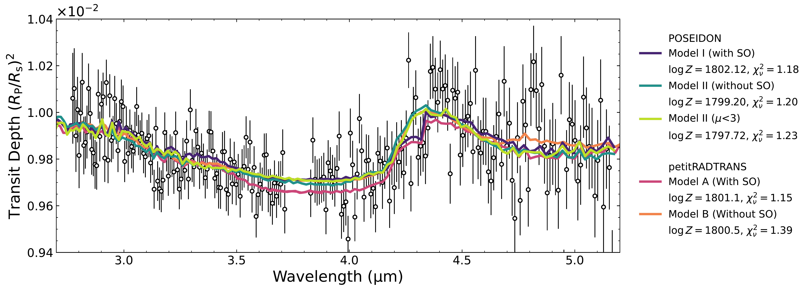
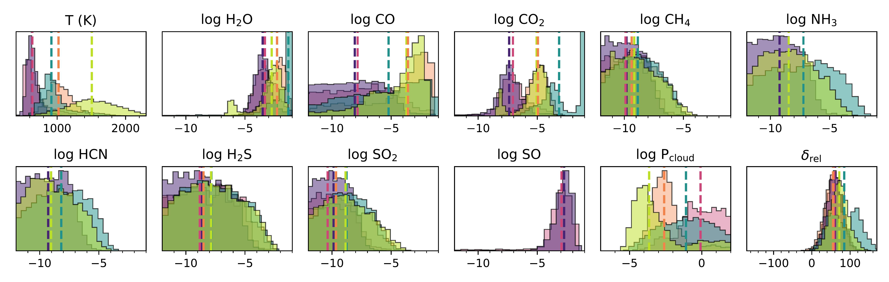
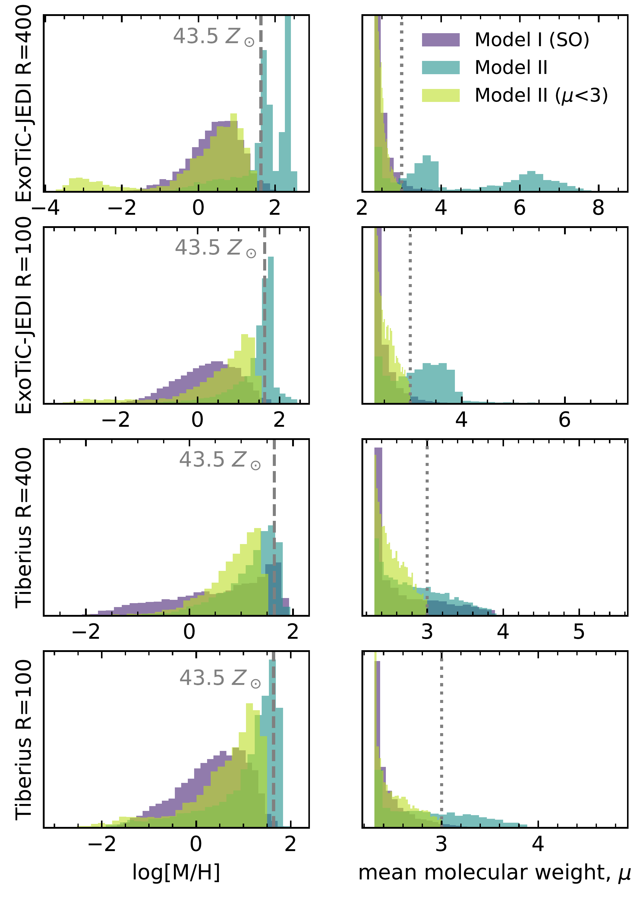
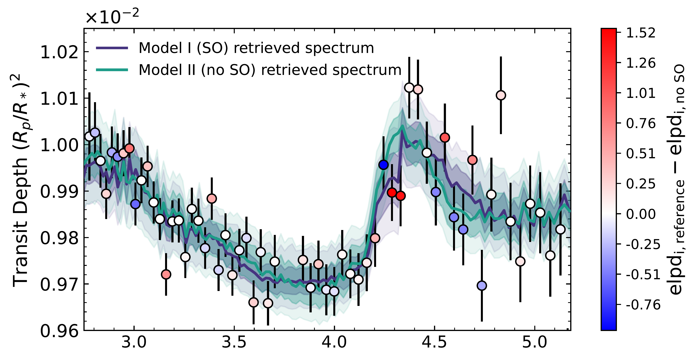
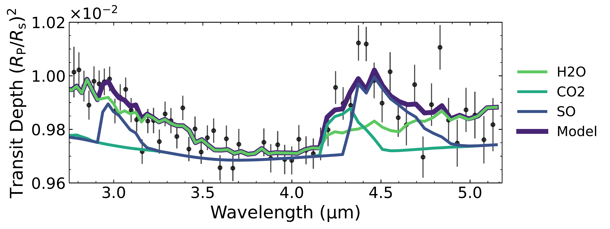
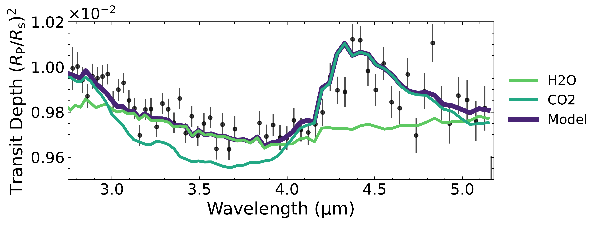

$\newcommand{\ensuremath}{}$
$\newcommand{\xspace}{}$
$\newcommand{\object}[1]{\texttt{#1}}$
$\newcommand{\farcs}{{.}''}$
$\newcommand{\farcm}{{.}'}$
$\newcommand{\arcsec}{''}$
$\newcommand{\arcmin}{'}$
$\newcommand{\ion}[2]{#1#2}$
$\newcommand{\textsc}[1]{\textrm{#1}}$
$\newcommand{\hl}[1]{\textrm{#1}}$
$\newcommand{\footnote}[1]{}$
$\newcommand{\planet}{NGTS-2 b\xspace}$
$\newcommand{\tiberius}[1]{\texttt{Tiberius}\xspace}$
$\newcommand{\jedi}[1]{\texttt{ExoTiC-JEDI}\xspace}$
$\newcommand{\poseidon}[1]{\texttt{POSEIDON}\xspace}$
$\newcommand{\prt}{\texttt{petitRADTRANS}\xspace}$
$\newcommand{\vulcan}{\texttt{VULCAN}\xspace}$
$\newcommand{\red}{\textcolor{red}}$
$\newcommand$
$\newcommand$
$\newcommand{\arraystretch}{1.2}$
$\newcommand{\arraystretch}{1.2}$
$\newcommand{\arraystretch}{1.2}$
$\newcommand{\arraystretch}{1.3}$
$\newcommand{\arraystretch}{1.1}$
$\newcommand{\thebibliography}{\DeclareRobustCommand{\VAN}[3]{##3}\VANthebibliography}$

# BOWIE-ALIGN: Exploring degeneracies in the muted transmission spectrum of the aligned hot Jupiter NGTS-2b with NIRSpec/G395H.

<mark>Appeared on: 2026-03-20</mark> -  _24 pages, 12 figures, accepted for publication in MNRAS_

C. Fairman, et al. -- incl., <mark>E.-M. Ahrer</mark>

**Abstract:** We present the first atmospheric observation and characterisation of the aligned, 1468 K hot Jupiter, NGTS-2b, with one JWST NIRSpec/G395H transit. These observations complete the GO 3838 observing campaign of the BOWIE-ALIGN program, which aims to investigate the link between hot Jupiter atmospheric composition and formation history through the atmospheric analysis of planets orbiting F stars that are aligned and misaligned with the host stellar spin axis. The 2.84--5.18 $\um$ spectrum shows weak absorption features attributed to $\ce{H2O}$ and $\ce{CO2}$ absorption, which our free chemistry retrievals fit with posteriors that converge on high mean molecular weight solutions attained through significant $\ce{H2O}$ mixing ratios. By comparing our results to interior modelling, we show that some of these solutions exceed the $43.5\times$ solar upper limit we obtained from our interior structure models. Such solutions are likely due to cloud-metallicity degeneracies and insufficient wavelength coverage to resolve them. We show that, in the case of our observations, the likelihood distribution of $\ce{H2O}$ abundances is flat and uninformative, such that our retrievals are biased by the prior. Additionally, our statistically favoured atmospheric solution contains absorption from $\ce{SO}$ . The chemical abundances retrieved with this model are likely not astrophysically feasible and we demonstrate that the presence of $\ce{SO}$ is driven by only two data points. Our equilibrium chemistry retrievals hint at a subsolar C/O ratio and supersolar metallicity; however, we find wide posterior distributions that extend to solar values.

**Figure 11. -** Free chemistry retrievals on the $\jedi$$R$ = 400 spectrum for the three models tested with $\poseidon$(Models I--III) and two models tested with $\prt$(Models A and B). Model I and Model A including SO opacity (purple and pink). Model II and Model B excluding SO opacity (blue and orange). Model II excluding SO opacity and limiting the mean molecular weight to $\upmu < 3$(light green). While Model I statistically favoured ($\Delta \log Z$ = 5) over Model II ($\upmu < 3$), we discuss the astrophysical likelihood of the retrieved abundance of SO in Section \ref{sec:SOchem}, and the role of the mean molecular weight in Section \ref{sec:mmw}. We note that due to $\poseidon$  and $\prt$  retrieving offsets for NRS1 and NRS2 respectively, the $\prt$  offset has been inverted to directly compare to the $\poseidon$  retrieved value. (*fig:poseidon_spec_hist*)

**Figure 3. -** Probability density histograms comparing each of our three free chemistry $\poseidon$  models by retrieved metallicity and mean molecular weight across our two resolutions and two reductions. Across both resolutions and reductions we find similar results in each of our models, with the exception of $\jedi$$R$ = 400 which shows a multi-modal solution for Model II in both metallicity and $\upmu$. (*fig:mmw_hist*)

**Figure 8. -** Leave-one-out cross-validation transmission spectral analysis on the $\jedi$$R$ = 400 spectrum of NGTS-2b. Bolder colours represent larger contributions to the comparative spectral models (with and without SO). This shows that the inclusion of SO in the model is driven predominantly by two/three datapoints on the left side of the \ce{CO2} feature at around 4.25 $\upmu$m. The middle figure shows the spectral contributions for each of the main species considered in Model I (including SO) where the position of the 'shoulder' between the \ce{CO2} and SO absorption features meet corresponds to the datapoints driving the fit statistics. The bottom figure shows the spectral contributions for \ce{H2O} and \ce{CO2} for Model II, no other species or cloud opacity show significant contributions to the spectrum. (*fig:loocv*)

