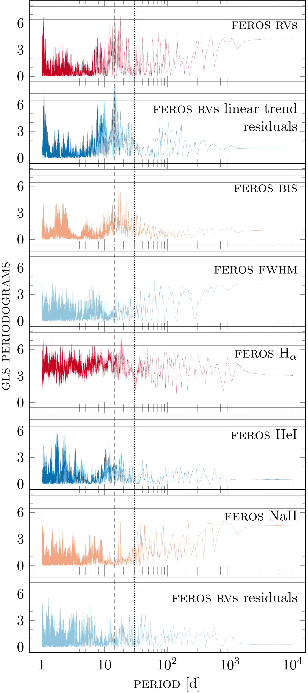
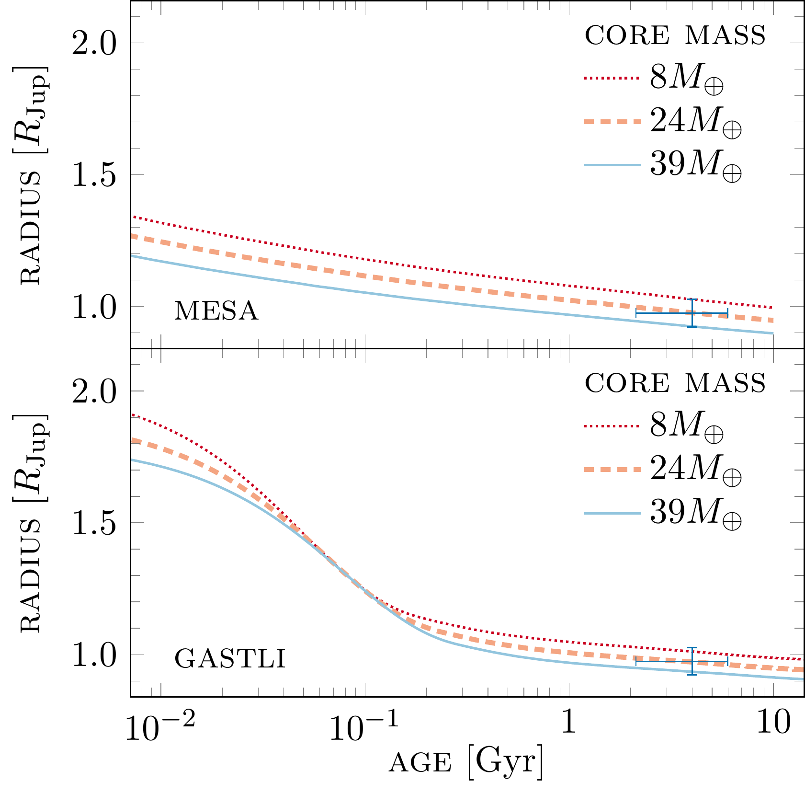
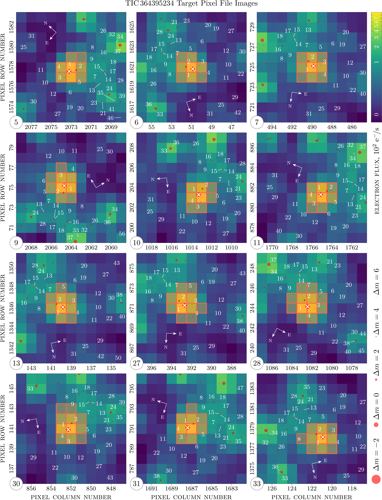

$\newcommand{\ensuremath}{}$
$\newcommand{\xspace}{}$
$\newcommand{\object}[1]{\texttt{#1}}$
$\newcommand{\farcs}{{.}''}$
$\newcommand{\farcm}{{.}'}$
$\newcommand{\arcsec}{''}$
$\newcommand{\arcmin}{'}$
$\newcommand{\ion}[2]{#1#2}$
$\newcommand{\textsc}[1]{\textrm{#1}}$
$\newcommand{\hl}[1]{\textrm{#1}}$
$\newcommand{\footnote}[1]{}$
$\newcommand{\toinum}{\mbox{\textsc{toi}--1232}}$
$\newcommand{\toinumb}{\toinum b}$
$\newcommand{\toinumc}{\toinum c}$
$\newcommand{\toinumbc}{\toinum b \& c}$
$\newcommand{\ticnum}{\textsc{tic} 364395227}$
$\newcommand{\gaianum}{\emph{Gaia} \textsc{dr}2~5289147741358156928}$
$\newcommand{\gaia}{\textit{Gaia}}$
$\newcommand{\ttv}{\textsc{ttv}}$
$\newcommand{\feros}{\textsc{feros}}$
$\newcommand{\tess}{\textsl{\textsc{tess}}}$
$\newcommand{\wine}{\textsc{wine}}$
$\newcommand{\rv}{\textsc{rv}}$
$\newcommand{\mmr}{\textsc{mmr}}$
$\newcommand{\bjd}{\textsc{bjd}}$
$\newcommand{\fwhm}{\textsc{fwhm}}$
$\newcommand{\bis}{\textsc{bis}}$
$\newcommand{\ld}{\textsc{ld}}$
$\newcommand{\symba}{\textsc{s}y\textsc{mba}}$
$\newcommand{\gastli}{\textsc{gastli}}$
$\newcommand{\mesa}{\textsc{mesa}}$
$\newcommand{\tpf}{\textsc{tpf}}$
$\newcommand{\nasa}{\textsc{nasa}}$
$\newcommand{\spoc}{\textsc{spoc}}$
$\newcommand{\sap}{\textsc{sap}}$
$\newcommand{\parsecabbr}{\textsc{parsec}}$
$\newcommand{\ffi}{\textsc{ffi}}$
$\newcommand{\pdc}{\textsc{pdc}}$
$\newcommand{çd}{\textsc{ccd}}$
$\newcommand{\utc}{\textsc{utc}}$
$\newcommand{\tls}{\textsc{tls}}$
$\newcommand{\gls}{\textsc{gls}}$
$\newcommand{\ns}{\textsc{ns}}$
$\newcommand{\mcmc}{\textsc{mcmc}}$
$\newcommand{\lcogt}{\textsc{lcogt}}$
$\newcommand{\sso}{\textsc{sso}}$
$\newcommand{\soar}{\textsc{soar}}$
$\newcommand{\astep}{\textsc{astep}}$
$\newcommand{\bnsf}{\textsc{bnsf}}$
$\newcommand{\vihren}{\textsc{vihren}}$
$\newcommand{\tesseract}{\texttt{tesseract}}$
$\newcommand{\lightkurve}{\texttt{lightkurve}}$
$\newcommand{\derived}{(\textsc{derived})}$
$\newcommand{\thispap}{\textsc{this paper}}$
$\newcommand{\Mjup}{M_{\rm{Jup}}}$
$\newcommand{\incl}{i}$
$\newcommand$
$\newcommand$
$\newcommand$
$\newcommand$
$\newcommand$
$\newcommand$
$\newcommand$
$\newcommand$
$\newcommand$
$\newcommand$
$\newcommand$
$\newcommand$
$\newcommand$
$\newcommand$
$\newcommand$
$\newcommand$
$\newcommand$
$\newcommand$
$\newcommand$
$\newcommand$
$\newcommand$
$\newcommand$
$\newcommand$
$\newcommand$
$\newcommand$
$\newcommand$
$\newcommand$
$\newcommand$
$\newcommand$
$\newcommand$
$\newcommand$
$\newcommand$
$\newcommand$
$\newcommand$
$\newcommand$
$\newcommand{\autoref}{$
$\newcommand{\equationautorefname}{Eq.}$
$\newcommand{\figureautorefname}{Fig.}$
$\newcommand{\sectionautorefname}{Sec.}$
$\newcommand{\subsectionautorefname}{Sec.}$
$\newcommand{\subsubsectionautorefname}{Sec.}$
$    \orgautoref$
$}$
$\newcommand{\thetable}{A\arabic{table}}$
$\newcommand{\thefigure}{A\arabic{figure}}$
$\newcommand{\equationautorefname}{Eq.}$
$\newcommand{\figureautorefname}{Fig.}$
$\newcommand{\sectionautorefname}{Sec.}$
$\newcommand{\subsectionautorefname}{Sec.}$
$\newcommand{\subsubsectionautorefname}{Sec.}$

# A warm massive pair of planets around TOI--1232 revealed with transit timing variations and Doppler spectroscopy$\footnote{Based on observations collected at the European Organization for Astronomical Research in the Southern Hemisphere under MPG programmes 0102.A-9006, 0103.A-9008, 0104.A-9007.}$

<mark>Appeared on: 2026-03-20</mark> -  _33 pages, 17 figures, 8 tables_

D. P. Mihaylov, et al. -- incl., <mark>T. Henning</mark>, <mark>L. Kreidberg</mark>

**Abstract:** $\noindent$ TOI--1232 is a G--dwarf star with a mass of $1.06_{-0.06}^{+0.07} M_\odot$ , a radius of $1.07\pm 0.05 R_\odot$ , and  slightly higher metallicity than solar of Fe/H = $0.18 \pm 0.05$ .The star hosts a transiting warm Jovian-mass planet, TOI--1232 b, with an orbital period of $P_{b} = 14.256_{-0.001}^{+0.001}$ days, identified with data from multiple sectors of the _TESS_ space telescope.The _TESS_ light curve of TOI--1232 is complex, as it is contaminated by a background eclipsing binary with a period of $1.37$ days. The TOI--1232 b was firmly confirmed by ground-based transit follow-up campaigns from Las Cumbres, Hazelwood, Brierfield, and ASTEP observatories.Additionally, the _TESS_ transits of TOI-1232 b exhibit strong transit timing variations (TTVs) with a super-period of $235.5 \pm 0.7$ days and a semi-amplitude of 27 minutes.Radial velocity (RV) follow-up with the FEROS spectrograph confirms the planetary nature of the transiting candidate, while a self-consistent $N$ -body analysis of RVs and TTVs pinpoints the presence of a second outer Saturn-mass companion, TOI--1232 c with a period of $P_{c} = 30.356_{-0.012}^{+0.010}$ days.The TOI--1232 warm-giant system is particularly important due to the evidence of two massive planets that reside near the 2:1 commensurability but are not locked in a mean motion resonance (MMR).Thanks to _TESS_ , we have revealed a handful of these rare systems.Hence, TOI--1232 is an important addition to understanding the formation and dynamical evolution of such compact, massive, warm giant planets.

**Figure 4. -** $\gls$ power spectrum for the $\toinum$ data, based on $\feros$\rv s spectra.
     From top to bottom panels, as labeled, $\rv$ s used in this work, $\rv$ residuals
     of the linear trend model being applied to the $\rv$ s, $\bis$, $\fwhm$,
     $\rm{H}_{\alpha}$, He I,  Na II, and the residuals of our final best fit $\ttv$+$\rv$ self-consistent dynamical model, respectively. The dashed and dotted vertical lines indicate the orbital period of $\toinum$b and $\toinum$c, respectively.
     The horizontal lines in the $\gls$ periodograms show the FAP levels
     of 10\%, 1\%, and 0.1\%. (*MLP_results*)

**Figure 5. -** Age-radius diagram using $\mesa$(*Upper panel*) and $\gastli$(*Lower panel*) models with the position of $\toinum$b shown in black. Over-plotted are three different models with a fixed envelope metallicity (\(Z = 0.023\)), and varying core masses. (*fig:age_radius*)

**Figure 15. -** Target pixel file ($\tpf$) image of $\toinum$ in $\tess$ Sectors 5, 6, 7, 9, 10, 11, 13, 27, 28, 30, 31, and 33. The red dots represent the position of the $\gaia$ sources in the field. $\toinum$ resides in the middle, marked with a white \(\times\). The pixels marked with red borders are the ones used to construct the $\tess$ Simple Aperture Photometry ($\sap$). (*fig:tpf2*)

