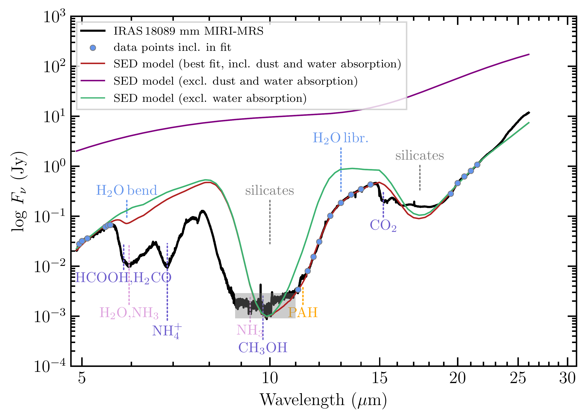
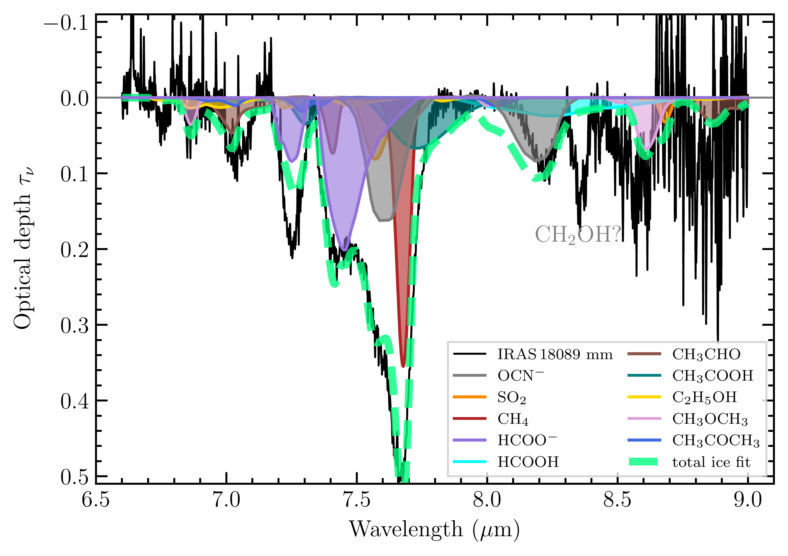
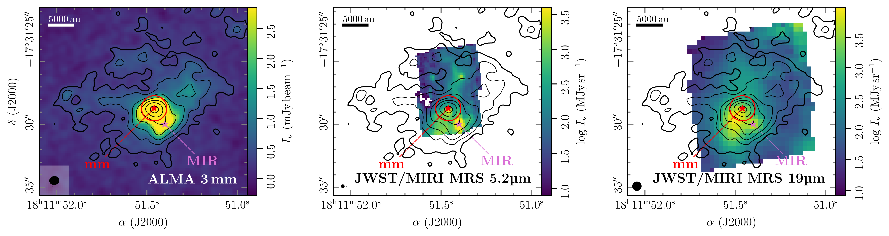

$\newcommand{\ensuremath}{}$
$\newcommand{\xspace}{}$
$\newcommand{\object}[1]{\texttt{#1}}$
$\newcommand{\farcs}{{.}''}$
$\newcommand{\farcm}{{.}'}$
$\newcommand{\arcsec}{''}$
$\newcommand{\arcmin}{'}$
$\newcommand{\ion}[2]{#1#2}$
$\newcommand{\textsc}[1]{\textrm{#1}}$
$\newcommand{\hl}[1]{\textrm{#1}}$
$\newcommand{\footnote}[1]{}$
$\newcommand{\arraystretch}{1.4}$
$\newcommand{\arraystretch}{1.3}$
$\newcommand{\arraystretch}{1.1}$
$\newcommand{\arraystretch}{1.1}$
$\newcommand{\arraystretch}{1.5}$

# JOYS: Linking the molecular ice and gas-phase composition towards the high-mass hot core IRAS 18089$-$1732

<mark>Appeared on: 2026-03-24</mark> -  _14 pages, 7 figures, resubmitted to A&A after second referee report_

<mark>C. Gieser</mark>, et al. -- incl., <mark>H. Beuther</mark>

**Abstract:** The formation and destruction of molecules in the interstellar medium is a complex interplay between gas-phase reactions as well as processes on grain surfaces and within icy mantles. For many decades, the gas-phase composition of the cold material towards star-forming regions could be well characterized using (sub)mm facilities. Prior to the launch of the James Webb Space Telescope (JWST), ice species other than the main constituents (H $_{2}$ O, CO, CO $_{2}$ , NH $_{3}$ , CH $_{4}$ , CH $_{3}$ OH) were challenging to detect due to insufficient sensitivity as well as angular and/or spectral resolution. We determine molecular ice and gas-phase column densities towards the young and embedded high-mass hot core IRAS 18089 $-$ 1732 within a region of 5 000 au. We use spectroscopic data from 5-28 $\upmu$ m obtained with JWST to derive ice column densities of H $_{2}$ O, SO $_{2}$ , OCN $^{-}$ , CH $_{4}$ , HCOO $^{-}$ , HCOOH, CH $_{3}$ CHO, CH $_{3}$ COOH, C $_{2}$ H $_{5}$ OH, CH $_{3}$ OCH $_{3}$ , and CH $_{3}$ COCH $_{3}$ . Gas-phase column densities of a total of 38 molecules, including, O-, N-, S-, and Si-bearing species as well as less abundant isotopologues, are inferred from sensitive molecular line observations taken with the Atacama Large Millimeter/submillimeter Array (ALMA) at 3 mm wavelengths. We find comparable abundances (relative to C $_{2}$ $H_5$ OH or CH $_{3}$ OH) in both phases for C $_{2}$ $H_5$ OH, CH $_{3}$ OH, and CH $_{3}$ OCH $_{3}$ . The abundances of SO $_{2}$ and CH $_{3}$ COCH $_{3}$ are higher in the gas-phase suggesting additional gas-phase formation routes. The abundance of CH $_{3}$ CHO is one order of magnitude higher in the ices compared to the gas-phase. The ice abundances (relative to H $_{2}$ O ice) towards the IRAS 18089 hot core are similar to previously studied Galactic low- and high-mass protostars. There are hints of a decreasing abundance with Galactocentric distance for OCN $^{-}$ , CH $_{3}$ OH, and CH $_{3}$ CHO ice. Not all species show comparable abundances in the ice and gas-phases. However, we find similar trends when species show elevated ice or gas-phase abundances in the high-mass hot core IRAS 18089 compared to low-mass hot cores. To better understand the reaction pathways of molecular species, statistical surveys analyzing both the ice and gas-phase chemical composition of high- and low-mass protostars at different Galactocentric radii are essential.

**Figure 3. -** JWST/MIRI-MRS spectrum of IRAS 18089 mm. The observed MIR spectrum of the mm source is shown in black. The red line is the best-fit SED model taking into account emission by two black bodies ($T_1=410$ K and $T_2=83$ K) and absorption by dust and water ice. The data points that were included in the fit are highlighted by the blue dots. The green line shows the contribution by dust absorption and the purple line highlights the two black body emission components. Silicate features as well as main ice constituents  ([Whittet, et. al 1996](https://ui.adsabs.harvard.edu/abs/1996A&A...315L.357W), [Gibb, et. al 2000](https://ui.adsabs.harvard.edu/abs/2000ApJ...536..347G), [Yang, et. al 2022](https://ui.adsabs.harvard.edu/abs/2022ApJ...941L..13Y), [McClure, et. al 2023](https://ui.adsabs.harvard.edu/abs/2023NatAs...7..431M))  are labeled. The wavelength range with an increased noise (8.8-11.0 $\upmu$m) is grey-shaded. (*fig:spectrumIR*)

**Figure 4. -** Optical depth spectrum of IRAS 18089 mm after local continuum subtraction. In black, the observed optical depth spectrum is presented highlighting the absorption features by minor ice constituents. The total fit considering a mixture of ice species is shown by the thick dashed green line. The solid lines are contributions by each ice species (details on the laboratory data are summarized in Table \ref{tab:ice_references}). (*fig:spectrumICE*)

**Figure 2. -** IRAS18089 continuum images (left: ALMA 3 mm, center: JWST/MIRI-MRS 5$\upmu$m, right: JWST/MIRI-MRS 19$\upmu$m). In all panels the black contours are the ALMA 3 mm continuum with steps from 5, 10, 20, 40, 80, 160, 320$\times\sigma_\mathrm{cont}$. The mm and MIR continuum peak positions are labeled and highlighted in red and pink. The red circle shows the aperture (1$"$ radius) used for spectra extraction towards the mm source. A scale bar in the top left panel marks a spatial scale of 5 000 au. The ellipse in the bottom left corner highlights the angular resolution of each data set. (*fig:continuum*)

