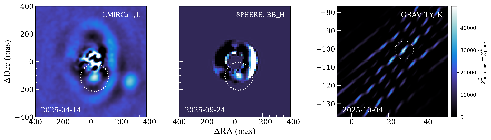
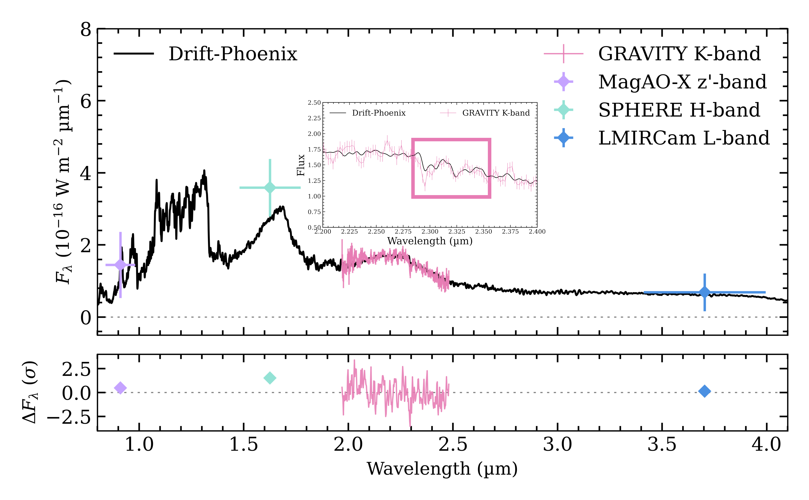
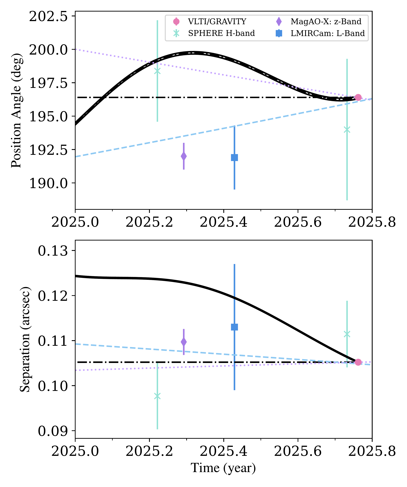

$\newcommand{\ensuremath}{}$
$\newcommand{\xspace}{}$
$\newcommand{\object}[1]{\texttt{#1}}$
$\newcommand{\farcs}{{.}''}$
$\newcommand{\farcm}{{.}'}$
$\newcommand{\arcsec}{''}$
$\newcommand{\arcmin}{'}$
$\newcommand{\ion}[2]{#1#2}$
$\newcommand{\textsc}[1]{\textrm{#1}}$
$\newcommand{\hl}[1]{\textrm{#1}}$
$\newcommand{\footnote}[1]{}$
$\newcommand{\vdag}{(v)^\dagger}$
$\newcommand$
$\newcommand$
$\newcommand{\angstrom}{\textup{Å}}$
$\newcommand{\kms}{km s^{-1}}$
$\newcommand{\ms}{m s^{-1}}$
$\newcommand{\mj}{\mathrm{M_{Jup}}}$
$\newcommand{\rj}{\mathrm{R_{Jup}}}$
$\newcommand{\msol}{\mathrm{M_\odot}}$

# Direct spectroscopic confirmation of the young embedded proto-planet WISPIT 2c

<mark>Appeared on: 2026-03-24</mark> - 

C. Lawlor, et al. -- incl., <mark>P. Garcia</mark>, <mark>L. Kreidberg</mark>

**Abstract:** WISPIT 2 is a nearby young star with a multi-ringed disk which was recently confirmed to host a $\sim$ 4.9 $\mj$ gas giant planet embedded in a large (60 au) gap at a radial separation of 57 au from the host star.We confirm and characterise a second, close-in planet in the WISPIT 2 system using a combination of new VLT/SPHERE $H$ -band dual-polarisation imaging and VLTI/GRAVITY $K$ -band interferometric observations of the WISPIT 2 system.The GRAVITY detection is consistent with a point-like source while its extracted $K$ -band spectrum shows CO band-head absorption at 2.3 $\text{\textmu m}$ and a continuum shape consistent with a young giant planet.From the GRAVITY data we extract a medium resolution $K$ -band spectrum of the companion and fit atmospheric model grids using the \texttt{species} tool with nested sampling to constrain its effective temperature, radius, and luminosity.We infer T $_\mathrm{eff}$ of 1500-2600 K, a radius of 0.91-2.2 $\rj$ , and a luminosity of (-3.47)-(-3.63).Comparison with evolutionary tracks implies a mass range of 8-12 $\mj$ , approximately twice as massive as the previously confirmed WISPIT 2b.The astrometry rules out a background source and marginally detects orbital motion of WISPIT 2c, which needs further follow-up observations for confirmation.WISPIT 2 now becomes an analogue to PDS 70, offering a second laboratory for studying the formation and early evolution of a multi-planet system within its natal disk.

**Figure 5. -** _Left panel:_ Original $L$-band detection of CC1 in [Close, et. al (2025)](https://ui.adsabs.harvard.edu/abs/2025ApJ...990L...9C).
      _Middle panel:_ New $H$-band detection of WISPIT 2c following RDI.
      We show a confined annulus that was used for optimal stellar signal subtraction.
      Note that the bright arch on the right side of the annulus is the forward scattering side of the circumstellar disk.
      _Right panel:_ Detection map of WISPIT 2c planet with VLTI/GRAVITY on the night of 2025-10-04.
      The map shows the periodogram power maps of a point source companion as a function of angular offset from the star, where the companion location corresponds to the strongest peak.
       (*fig:detection_map*)

**Figure 6. -** \texttt{Drift-Phoenix} spectral model overlaid with the $K$-band spectrum obtained with VLTI/GRAVITY, $H$-band VLT/SPHERE, $z'$-band MagAO-X, and $L$-band LBTI/LMIRCam photometry of WISPIT 2c. The modelled spectrum is based on max likelihood fitting of temperature and radius.
      Figure also contains zoomed region of 2.2-2.4$\text{\textmu m}$ to highlight CO absorption band-heads, marked by the pink box. (*spectrum*)

**Figure 1. -** Relative astrometry of WISPIT 2c to the primary star over time.
      We give the separation and position angle (measured from North over east).
      The purple dashed-line indicates plausible orbital motion for a prograde orbit, while the blue dashed-line indicates retrograde motion.
      Both orbits are in the plane of the circumstellar disk.
      The solid "curved" line indicates the expected behaviour for a distant background object.
      While the black dashed-line represents no relative change of motion in relation to the host star. (*fig:pm_plot*)

