

$\newcommand{\ensuremath}{}$
$\newcommand{\xspace}{}$
$\newcommand{\object}[1]{\texttt{#1}}$
$\newcommand{\farcs}{{.}''}$
$\newcommand{\farcm}{{.}'}$
$\newcommand{\arcsec}{''}$
$\newcommand{\arcmin}{'}$
$\newcommand{\ion}[2]{#1#2}$
$\newcommand{\textsc}[1]{\textrm{#1}}$
$\newcommand{\hl}[1]{\textrm{#1}}$
$\newcommand{\footnote}[1]{}$
$\newcommand{\JB}[1]{\textcolor{blue}{[JB: #1]}}$
$\newcommand{\KP}[1]{\textcolor{ForestGreen}{[KP: #1]}}$
$\newcommand{\HN}[1]{\textcolor{Orange}{[HN: #1]}}$
$\newcommand{\MH}[1]{\textcolor{Plum}{[MH: #1]}}$
$\newcommand{\msun}{{\rm M}_\odot}$
$\newcommand{\lsun}{{\rm L}_\odot}$
$\newcommand{\rsun}{{\rm R}_\odot}$
$\newcommand{\rstar}{{\rm R}_\star}$
$\newcommand{\mstar}{{\rm M}_\star}$
$\newcommand{\lstar}{{\rm L}_\star}$
$\newcommand{\prot}{{\rm P}_{rot}}$
$\newcommand{\omegastar}{\Omega_\star}$
$\newcommand{\omegakep}{\Omega_{Kep}}$
$\newcommand{\phirot}{\Phi_{rot}}$
$\newcommand{\rcor}{R_{cor}}$
$\newcommand{\rsub}{R_{sub}}$
$\newcommand{\rmag}{R_{mag}}$
$\newcommand{\rdust}{R_{dust}}$
$\newcommand{\rbrg}{R_{Br\gamma}}$
$\newcommand{\rco}{R_{CO}}$
$\newcommand{\macc}{\dot{M}_{\rm acc}}$
$\newcommand{\lacc}{L_{\rm acc}}$
$\newcommand{\teff}{T_{\rm eff}}$
$\newcommand{\vsini}{v\sin i}$
$\newcommand{\prot}{{\rm P}_{rot}}$
$\newcommand{\vrad}{{\rm V}_{r}}$
$\newcommand{\vmic}{{\rm V}_{mic}}$
$\newcommand{\logg}{\log g}$
$\newcommand{\feh}{[Fe/H]}$
$\newcommand{\parallax}{\varpi}$
$\newcommand{\mh}{[M/H]}$
$\newcommand{\msunyr}{{\rm M}_\odot{\rm yr}^{-1}}$
$\newcommand{\deg}{◦}$
$\newcommand{\arcsec}{"}$
$\newcommand{\mas}{mas}$
$\newcommand{\kms}{km~s^{-1}}$
$\newcommand{\mmag}{mmag}$
$\newcommand{\ha}{{\rm H}\alpha}$
$\newcommand{\hb}{{\rm H}\beta}$
$\newcommand{\hei}{{\rm HeI}}$
$\newcommand{\ewha}{EW({\rm H}\alpha)}$
$\newcommand{\brg}{{\rm Br}\gamma}$
$\newcommand{\pab}{{\rm Pa}\beta}$
$\newcommand{\heiir}{HeI 1083 nm}$
$\newcommand{\caii}{CaII}$
$\newcommand{\lacc}{L_{acc}}$
$\newcommand{\lline}{L_{line}}$

# The GRAVITY young stellar object survey: XV. The star--disk interaction region of the T Tauri star DO Tau$\thanks{ESO VLTI GTO programs with run ID 110.23TT.002 and 112.25T1.001. Partly based on observations obtained at the Canada-France-Hawaii Telescope (CFHT) which is operated by the National Research Council (NRC) of Canada, the Institut National des Sciences de l'Univers of the Centre National de la Recherche Scientifique (CNRS) of France, and the University of Hawaii. The observations at the CFHT were performed with care and respect from the summit of Maunakea.}$ 

<mark>Appeared on: 2026-03-25</mark> - 

G. Collaboration, et al. -- incl., <mark>M. Flock</mark>, <mark>W. Brandner</mark>, <mark>P. Garcia</mark>, <mark>T. Henning</mark>, <mark>L. Kreidberg</mark>

**Abstract:** Protoplanetary disks around young Sun-like stars are the cradles of the vast majority of detected exoplanets. Probing these disks at multiple spatial scales is key to uncovering how planets form. The inner astronomical unit, the star–disk interaction region, is of utmost importance because most detected exoplanets occupy this zone. We aim to spatially and spectrally resolve the inner disk and star-disk interaction region of the M0.3 T Tauri star DO Tau by combining two complementary techniques. We used high-resolution near-infrared spectra from CFHT/SPIRou to constrain the magnetospheric star-disk interaction process and optical long-baseline interferometry with ESO VLTI/GRAVITY to determine the sizes of the K-band continuum and Br $\gamma$ line emitting regions. From the SPIRou spectra, we measured the veiling in the YJHK bands along with the equivalent widths of the HeI $\lambda$ 1083, Pa $\beta$ , and Br $\gamma$ emission lines, from which we estimated the mass accretion rate. We were able to monitor the time variability of these quantities thanks to our long-sequence of observations over about 40 days. We fit the GRAVITY visibilities in the continuum and the differential quantities in the line with geometrical models to obtain the orientation and the size of the inner disk as well as the size and the on-sky displacement of the Br $\gamma$ emitting region. We derived a mass accretion rate of $\sim$ 10 $^{-8}$ -- 10 $^{-7}$  $\msunyr$ , which confirms that this $\sim$ 0.5 $\msun$ star is a strong accretor. The HI and HeI lines exhibit strong variability on a daily timescale, consistent with the burster classification of DO Tau derived from its K2 light curve. We report a periodic modulation of the intensity of the redshifted high-velocity wings ${of the \brg line profile}$ . The modulation occurs at the rotational period of the star (5.128 d), which suggests the existence of corotating magnetospheric funnel flows. We derived an upper limit of 0.35 on the ratio between the magnetospheric truncation radius and the disk corotation radius, indicative of an ordered unstable accretion regime. The size of the $\brg$ line emitting region obtained from GRAVITY is quite small ( $R_{Br\gamma}$ = 0.011 au $\sim$ 1.3 $\rstar$ ), and it is much smaller than the K-band continuum emitting region ( $R_{K}$ = 0.09 au $\sim$ 11 $\rstar$ ). Such a compact $\brg$ emission region suggests that most of the line flux originates from the magnetospheric accretion region and/or from an inner wind close to the magnetosphere-disk interface. The on-sky displacements of the blue and red $\brg$ line velocity channels suggest a rotation pattern of the emitting gas, as they appear to be nearly aligned along the position angle of the disk. The inclination we derived for the inner disk ( $\sim$ 45-55 $^\circ$ ) differs from that of the outer disk inferred from the ALMA continuum ( $\sim$ 30 $^\circ$ ). This points toward a misalignment or warp of the outer disk that may originate from the suspected past encounter with the neighboring HV Tau system. Based on combining high-resolution spectroscopy and long baseline interferometry, we find that the T Tauri star DO Tau appears to be a strong accretor undergoing magnetospheric accretion in an ordered unstable regime, with a $\brg$ line emitting region as compact ( $\sim$ 0.01 au) as the size of its magnetosphere.

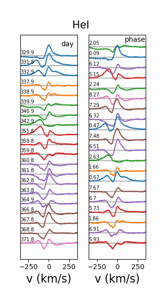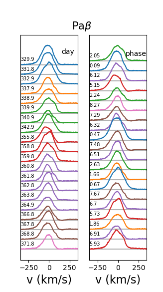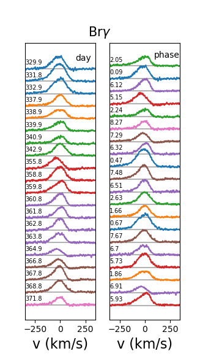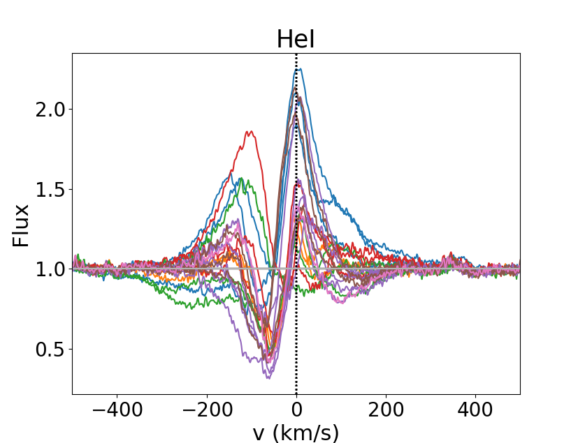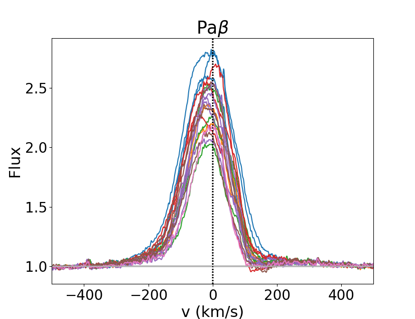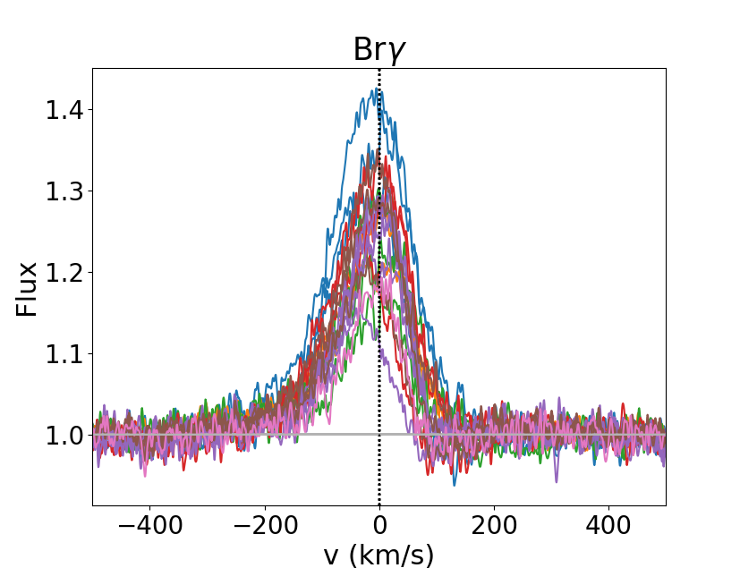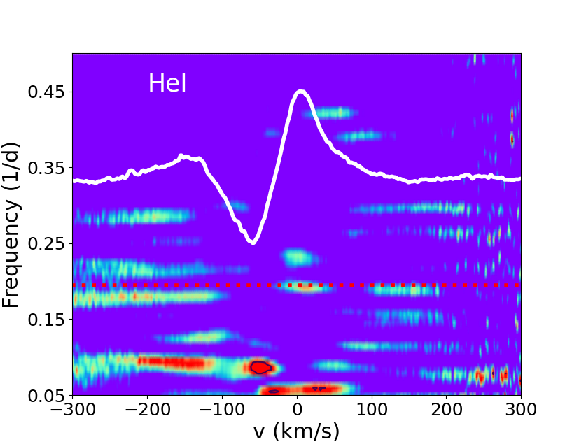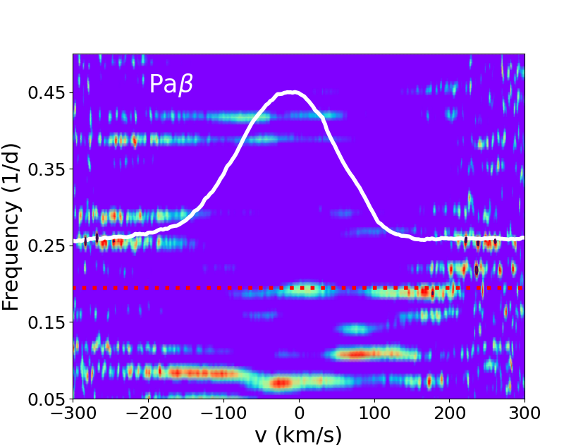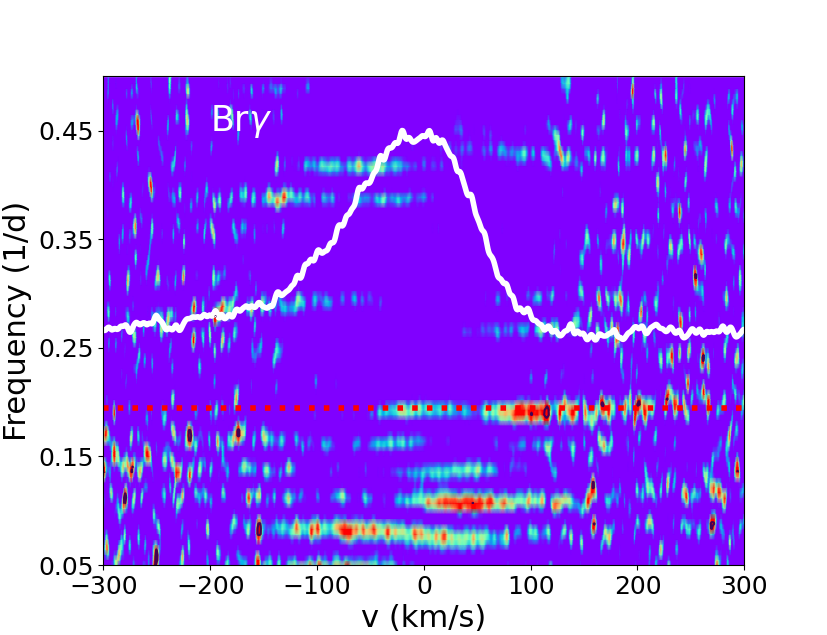

**Figure 6. -** Top: Series of the near-infrared line profiles $\hei$ 1083 nm, $\pab$, and $\brg$ plotted as a function of JD-2,460,000 ({left}) and rotational phase ({right}). The color code corresponds to successive rotational cycles. Middle: Plotted profiles superimposed in a single image to illustrate their variability. The vertical dotted line indicates the stellar rest velocity. Bottom: Two-dimensional periodograms across the line profiles. The color code reflects the periodogram power, ranging from 20 ({blue}) to 60\%({red}) of the maximum power. {The FAP level of 0.1 is shown as black contours.} The horizontal dotted red line drawn at a frequency of 0.195 day$^{-1}$ indicates the star's rotational period (P = 5.128 d). The white curve is the mean line profile. (*fig:lineprof*)

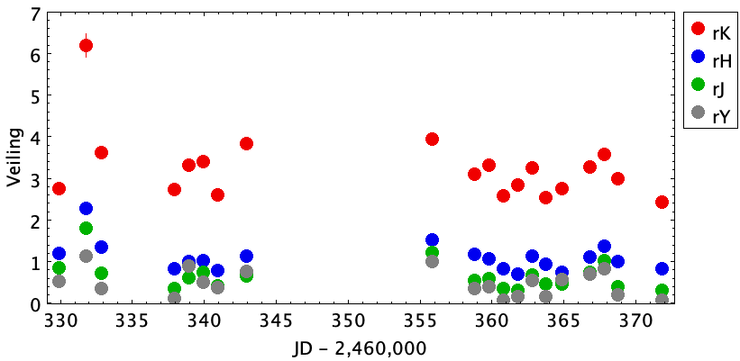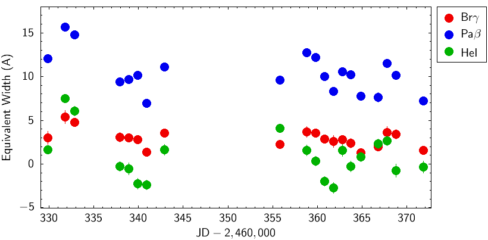

**Figure 1. -** Near-infrared veiling in the YJHK bands (_ top_) and line equivalent widths for the HeI 1083 nm, $\pab$, and $\brg$ line profiles (_ bottom_) as a function of Julian date. The measurement error is usually smaller than the symbol size (see Table \ref{tab:vradveiling}). (*fig:ewveiling*)

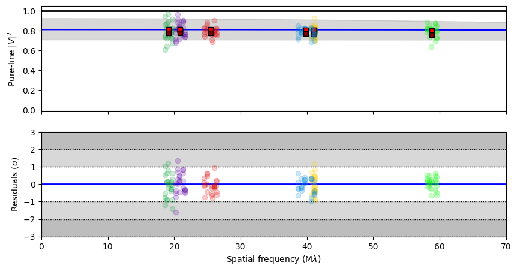

**Figure 4. -** Top: Pure-line visibility squared as a function of the spatial frequency: GRAVITY measurements for the six baselines (colored symbols as in Fig. 4) and best-fit model (continuous blue line), surrounded by its 3$\sigma$ uncertainty (gray shaded area). Bottom: Residuals of best-fit model expressed in units of uncertainties of the data. (*fig:V2curve*)

