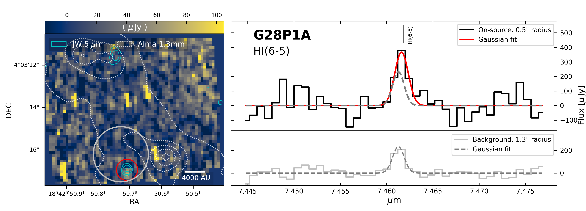
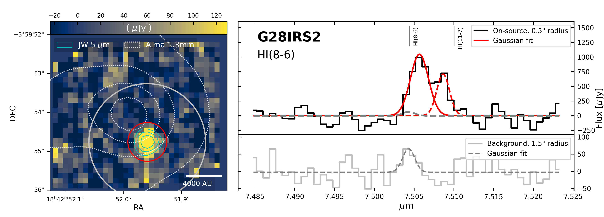
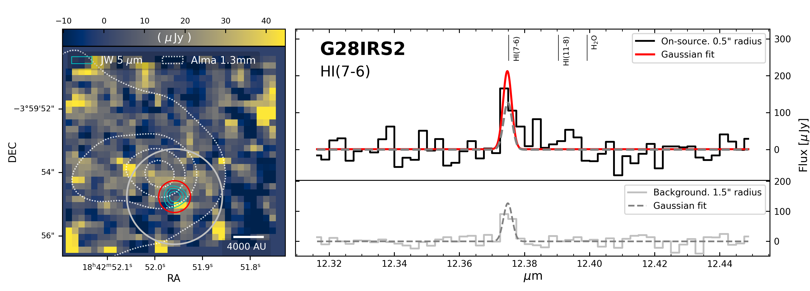
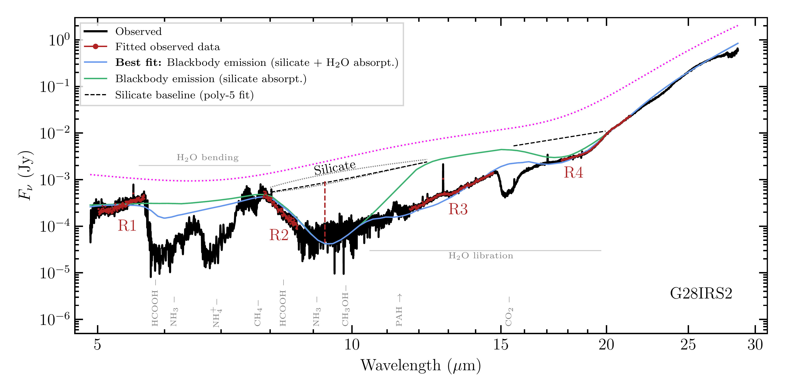
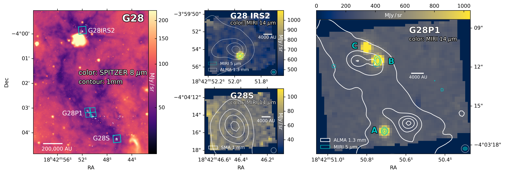

$\newcommand{\ensuremath}{}$
$\newcommand{\xspace}{}$
$\newcommand{\object}[1]{\texttt{#1}}$
$\newcommand{\farcs}{{.}''}$
$\newcommand{\farcm}{{.}'}$
$\newcommand{\arcsec}{''}$
$\newcommand{\arcmin}{'}$
$\newcommand{\ion}[2]{#1#2}$
$\newcommand{\textsc}[1]{\textrm{#1}}$
$\newcommand{\hl}[1]{\textrm{#1}}$
$\newcommand{\footnote}[1]{}$
$\newcommand{\Macc}{\dot{M}_{\mathrm{acc}}\xspace}$
$\newcommand{\Lacc}{L_{\rm acc}\xspace}$
$\newcommand{\Lline}{L_{\rm H \textsc{i}}}$
$\newcommand{\Av}{A_{\rm V}}$
$\newcommand{\Msun}{M_{\odot}\xspace}$
$\newcommand{\Lbol}{L_{\rm bol}}$
$\newcommand{\Maccunit}{M_{\odot}  \rm yr^{-1}\xspace}$
$\newcommand{\mum}{\mum}$
$\newcommand{\hi}{H {\sc i}\xspace}$
$\newcommand{\hii}{H {\sc ii}\xspace}$

# Unlocking accretion rate diagnostics for high-mass protostars using JWST/MIRI  HI lines

<mark>Appeared on: 2026-03-25</mark> -  _21 pages, 14 figures. Accepted for publication in A&A_

S. D. Reyes-Reyes, et al. -- incl., <mark>H. Beuther</mark>, <mark>C. Gieser</mark>

**Abstract:** While many aspects of high-mass star formation have been investigated, the accretion onto the central protostars is one of the most fundamental but less explored physical properties. The James Webb Space Telescope (JWST), through its Mid InfraRed Instrument (MIRI), offers a unique opportunity to explore tracers of accretion at less-extincted wavelengths (5 to 27 $\mu$ m) than those studied so far, where it delivers unparalleled sensitivity and spectral resolution. We probe the capability of MIRI in its MRS/IFU mode to detect and resolve atomic Hydrogen (H ${\sc i}$ ) emission lines in such young and embedded objects, to subsequently estimate accretion luminosities ( $\Lacc$ ) and accretion rates ( $\Macc$ ) for the first time in a sample of (six) high-mass star forming regions at different evolutionary stages. We use the dereddened $\hi$ line luminosities as tracers of accretion by applying line-to-accretion-luminosity relations ( $\Lacc$ -calibrations) from literature. As such $\Lacc$ -calibrations were originally established for low-mass Class II objects, we assess their applicability on our sample prior to estimating accretion rates. Extinction values were estimated from the broad silicate absorption feature at 9.7 $\mu$ m. The infrared continuum reveals, at much higher spatial resolution than before, the location of new IR sources (protostars), toward which we detect a handful of $\hi$ lines. While a few lines are secure detections, many are tentative. The most commonly detected line is the Humphreys $\alpha$ at 12.37 $\mum$ , followed by Humphreys $\beta$ and Pfund $\alpha$ . Assuming that their line fluxes are dominated by accretion, we find that two of the three existing $\Lacc$ -calibrations predict excessively high accretion luminosities that largely exceed their bolometric luminosities ( $L_{\rm bol}$ ), and that the third $\Lacc$ -calibration still overpredicts accretion luminosities for some sources. Considering the given uncertainties, estimated accretion rates are only tentative. This work demonstrates the great potential of JWST/MIRI to probe $\hi$ line emission originated in the innermost regions of high-mass protostellar systems, setting the ground floor for further investigations into accretion in these objects.  While this project had the ambitious goal of robustly quantifying accretion rates, we have shed light on what outstanding methodological challenges remain, where developing new $\Lacc$ - calibrations for intermediate- to high-mass protostars appears as the most critical one.

**Figure 6. -** The three most commonly detected $\hi$ lines across our sample. We show them using two of our regions. Left: line moment 0 maps. The channels used to integrate the emission are those encompassed by the line Gaussian fits in the right panels. Red apertures enclose the map area used to extract the spectra at the protostars shown in right panels (upper insets), while the broader grey aperture (minus the central red aperture) is used to extract the spectra of the local background (right panels, lower insets). Right: Gaussian curves fit the line emission for both protostar (red, upper inset) and backgrounds (grey, lower insets). We reproduce the Gaussian fits of the background in upper insets to allow comparisons with the protostar Gaussian fit. For some of the lines (middle row) a second Gaussian is required for fitting another nearby emission line.
Other lines detected are shown in Figures \ref{Fig:map_spec2}, \ref{Fig:map_spec3} and \ref{Fig:map_spec4}.
 (*Fig:map_spec1*)

**Figure 5. -** Full MIRI spectrum of the G28IRS2 protostar (black). It shows several absorption features, where the broader one at 9.7 $\mu$m is produced by silicate grains. Blackbody components (3 in this case) absorbed by silicates and $H_2$O are fitted to reproduce the overall continuum. The blue curve represents the fit obtained by considering those spectral ranges that are predominantly absorbed by silicates and $H_2$O (in red, also indicated by the R1-R4 ranges). The green curve represents blackbody emission that would only be absorbed by silicates, while the dotted magenta curve shows the modeled blackbody emission unaffected by absorption. The black dashed curve above the main silicate absorption feature at 9.7 $\mum$  is an interpolation of the silicate-absorbed continuum from a five-order polynomial fit. Here, the red vertical line highlights the resulting depth of the feature that determines $\tau_{9.7}$, whose uncertainty is given by other two polynomials (order 1 and 4) fits passing above and below (grey curves). The black dashed line at R4 indicates the location of the secondary silicate absorption feature. (*Fig:silicate_fit_G28IRS2*)

**Figure 3. -** Overview of the three less evolved regions of our sample: G28IRS2, G28P1, and G28S. In this case all of them belong to the same IRDC G28. Left: _Spitzer_(8 $\mu$m) view of the whole IRDC G28. The three target subregions are depicted with millimeter contours (white) from ALMA for G28IRS2  ([Molinari, et. al 2025](https://ui.adsabs.harvard.edu/abs/2025A&A...696A.149M))  and G28P1  ([Zhang, et. al 2015](https://ui.adsabs.harvard.edu/abs/2015ApJ...804..141Z)) , and from SMA for G28S  ([Feng, et. al 2016](https://ui.adsabs.harvard.edu/abs/2016A&A...592A..21F)) , with cyan boxes highlighting the field of view of our MIRI observations, although slightly magnified for better visualization. Middle and right panels: zoom-in to the target subregions. They show the MIRI continuum at 14 $\mu$m, whereas cyan contours trace the continuum at 5 $\mu$m (no IR source was detected toward G28S). The ellipses in the bottom right corners represent beam sizes,  grey for the 14 $\mu$m image, and cyan for the 5 $\mu$m contours. (*Fig:Overview_G28*)

