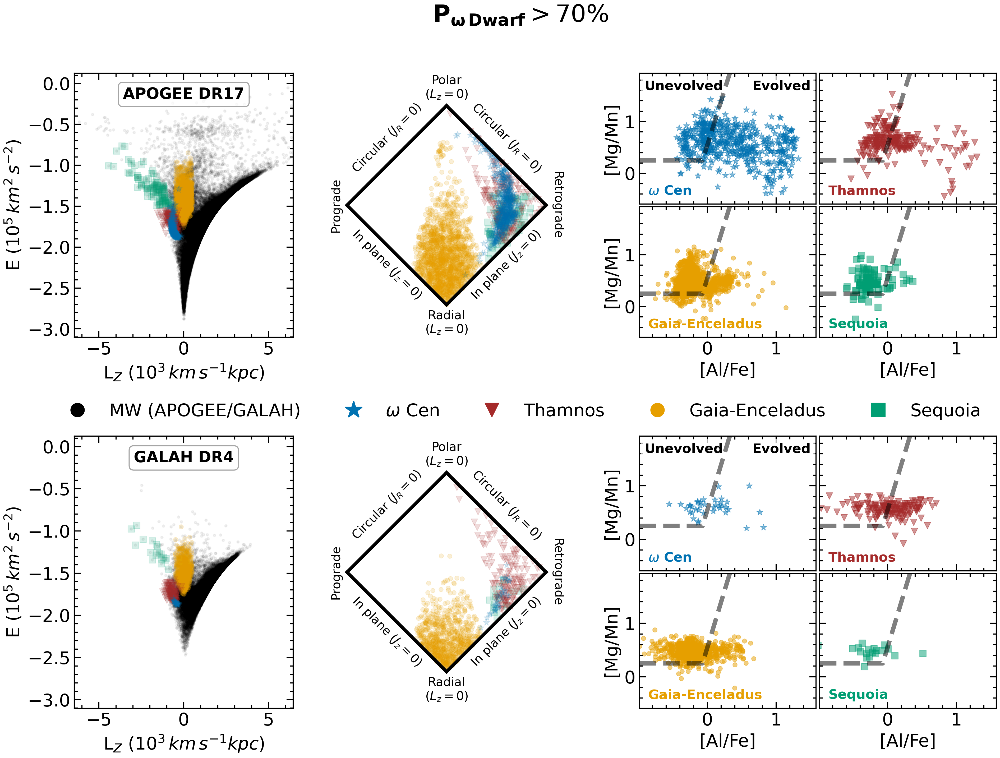
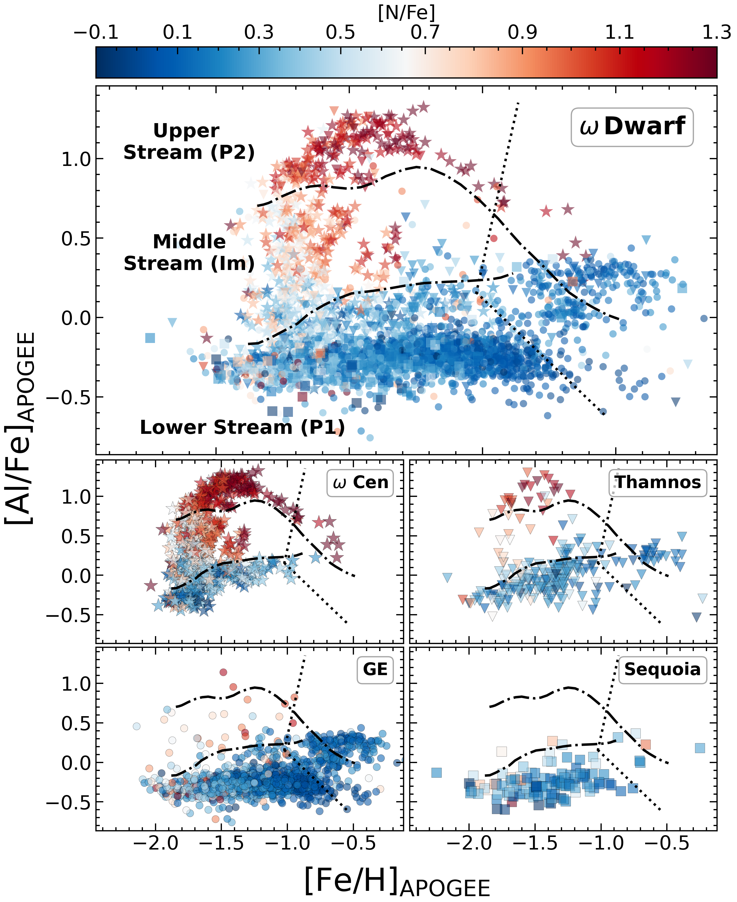
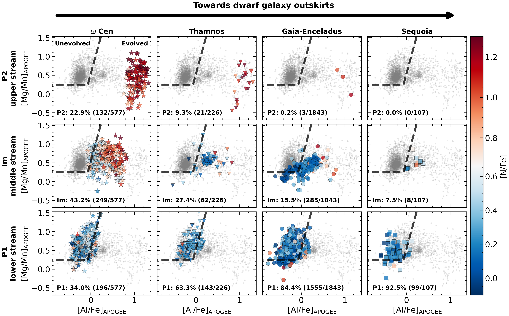

$\newcommand{\ensuremath}{}$
$\newcommand{\xspace}{}$
$\newcommand{\object}[1]{\texttt{#1}}$
$\newcommand{\farcs}{{.}''}$
$\newcommand{\farcm}{{.}'}$
$\newcommand{\arcsec}{''}$
$\newcommand{\arcmin}{'}$
$\newcommand{\ion}[2]{#1#2}$
$\newcommand{\textsc}[1]{\textrm{#1}}$
$\newcommand{\hl}[1]{\textrm{#1}}$
$\newcommand{\footnote}[1]{}$
$\newcommand{\vdag}{(v)^\dagger}$
$\newcommand$
$\newcommand$
$\newcommand{\ocen}{\omega Cen}$
$\newcommand{\odwarf}{\omega Dwarf}$

# oMEGACat. X. Shedding light on the disrupted dwarf galaxy of Omega Centauri

<mark>Appeared on: 2026-03-26</mark> -  _25 pages, 17 figures, 1 table, and 1 appendix. Submitted to ApJ_

S. O. Souza, et al. -- incl., <mark>N. Neumayer</mark>, <mark>C. Clontz</mark>, <mark>G. Guiglion</mark>, <mark>J. Li</mark>

**Abstract:** Omega Centauri ( $\ocen$ ) is the most massive and chemically complex star cluster in the Milky Way and is widely regarded as the surviving nuclear star cluster of an accreted dwarf galaxy. However, its parent host remains uncertain. Here, we investigate a scenario in which Sequoia, Thamnos, and Gaia--Enceladus (GE) are debris from a single disrupted progenitor, the _\odwarf _ , whose nucleus survives today as $\ocen$ . Using APOGEE and GALAH abundances together with _Gaia_ astrometry, we reconstruct the chemical structure across this progenitor adopting orbital energy as a proxy for pre-merger radius. We find that the chemically evolved (younger Al-N-He-rich) population is strongly concentrated toward the inner regions, representing a population formed after/during the merger, while the primordial population represents a dwarf-galaxy-like population, supporting a common dwarf-galaxy origin for its components. The metallicity profile shows an inverted U-shaped gradient similar to those observed in present-day nucleated dwarfs. At the same time, the inner regions ( $\ocen$ +Thamnos) are more $\alpha$ -enhanced than the outskirts, pointing to shorter and more efficient star formation and indicating that the nucleus may have assembled through the merger of inspiraling globular clusters. Neutron-capture abundances reveal a Eu-rich, r-process-dominated outskirts and inner regions enhanced in [ Ba/Eu ] and [ La/Eu ] , requiring delayed enrichment and more complex chemical evolution. Finally, our analysis shows that Sequoia and Thamnos naturally fit an outside-in stripping sequence around $\ocen$ , whereas the connection with GE remains unsure.

**Figure 12. -** $\odwarf$  stars  with $P_{\omega \mathrm{Dwarf}} > 70\%$. The top row shows the APOGEE sample, and the bottom row shows the GALAH sample. The left panels are the orbital energy ($E$) as a function of the vertical component of angular momentum ($L_z$). Black points trace the MW population. Colored symbols identify stars in Sequoia (green squares), Gaia--Enceladus (orange circles), Thamnos (red triangles), and $\omega$ Cen (blue stars). The middle panels present the orbital-action space in a diamond projection. The right panels show the chemical plane [$\mathrm{Mg}/\mathrm{Mn}$] versus [$\mathrm{Al}/\mathrm{Fe}$], with unevolved stars in the left subpanels delimited by the dashed line and evolved stars in the right subpanels.  (*fig:target_selection*)

**Figure 2. -** Stellar populations across $\odwarf$  in the [Al/Fe]--[Fe/H] plane for APOGEE. The upper panel represents the entire sample of $\odwarf$  members, whose symbols and colours follow the same definition as in \autoref{fig:target_selection}. Each $\odwarf$  substructure is individually displayed in the bottom panels. The lines show the limits for the lower (P1) and upper (P2) streams as defined by [Dondoglio, et. al (2026)](https://ui.adsabs.harvard.edu/abs/2026A&A...705A...2D), while the dotted lines show the limits for the unknown population. (*fig:al_fe_apogee*)

**Figure 14. -**  Identification of $\odwarf$  evolved and unevolved populations through the [Mg/Mn]--[Al/Fe] plane for APOGEE. The components of $\odwarf$  are displayed in the columns: $\ocen$  on the left, Thamnos in the middle left, GE in the middle right, and Sequoia on the right. The top row represents the P2 population / upper stream, the middle stream in the central row, and the P1 population / lower stream in the bottom row. The color code indicates [N/Fe] values. The fraction (in percentage and absolute number) of stars in each population is indicated in the bottom left in each panel. Only stars with measured [Al/Fe] and [Mg/Mn] abundances were considered. (*fig:mgmn_apogee*)

